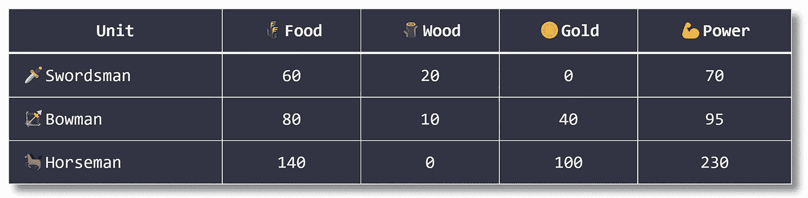
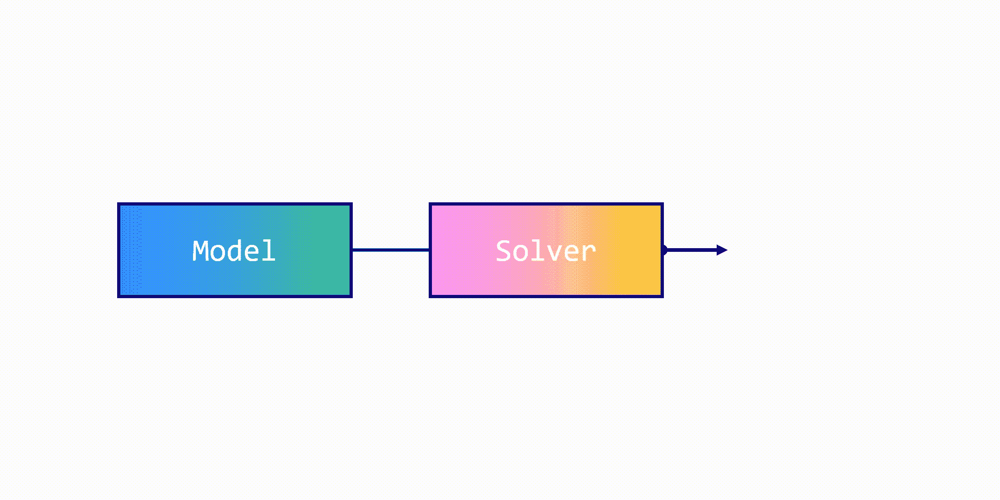
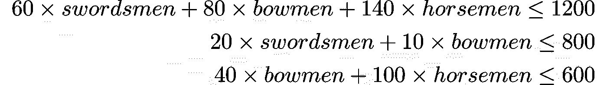
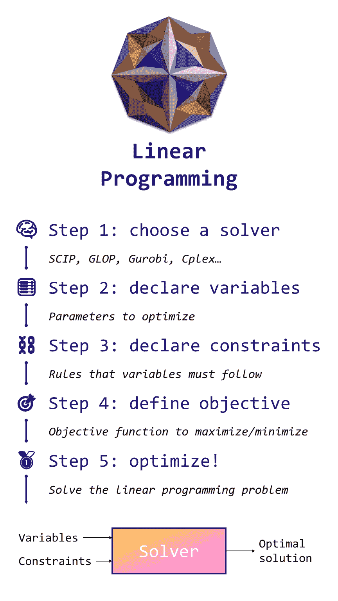

# Python 中的线性编程简介

> 原文：<https://towardsdatascience.com/introduction-to-linear-programming-in-python-9261e7eb44b>

## 使用谷歌或工具进行数学优化的指南


图片由作者提供，表情符号由[open moji](https://openmoji.org/)([CC BY-SA 4.0](https://creativecommons.org/licenses/by-sa/4.0/#))

线性规划是一种技术**优化任何问题**与多个变量和约束。这是一个简单但强大的工具，每个数据科学家都应该掌握。

想象你是一名**军师**正在招募一支**军队**。你有:

*   **三种资源**:🌾**粮食**，🪵 **木材**，🪙 **黄金**
*   **三个单位** : 🗡️ **剑士**，🏹**弓手**，以及🐎**骑兵**。

骑兵比弓箭手强壮，弓箭手又比剑士强壮。下表提供了每个装置的成本和功率:



作者图片

现在我们有 1200 个🌾食物，800 🪵wood，600 🪙gold.考虑到这些资源，我们应该如何最大化我们军队的力量？

我们可以简单地找到具有最佳功率/成本比的单元，尽可能多地采用它们，并对其他两个单元重复该过程。但是这种“猜测和检查”的解决方案可能甚至不是最佳的

现在想象我们有**百万台，资源**:之前的贪婪策略很可能完全错过最优解。可以使用机器学习算法(例如，遗传算法)来解决这个问题，但是我们也不能保证解决方案是最优的。

对我们来说幸运的是，有一种方法可以用最优的方式解决我们的问题:**线性规划**(或者线性优化)，这是[运筹学](https://en.wikipedia.org/wiki/Operations_research)(或者)领域的一部分。在这篇文章中，我们将使用它来寻找最佳数量的剑士、弓箭手和骑兵，以建立可能拥有最高力量的**军队。**

你可以用下面的 [**Google Colab 笔记本**](https://colab.research.google.com/drive/1dbrFJwFv80kgUi13MfPO3KyumG-SVIHG?usp=sharing) 运行本教程的代码。

# 🧠一世:解决者

在 Python 中，有不同的线性编程库，比如多用途的 **SciPy** ，初学者友好的 **PuLP** ，详尽的 **Pyomo** 等等。

今天，我们将使用 [**谷歌或-Tools**](https://developers.google.com/optimization) ，它非常用户友好，带有几个预打包的解算器，并且在 [GitHub](https://github.com/google/or-tools) 上拥有迄今为止最多的明星。

如果安装不成功，请重启内核并重试:它有时会失败。\_(ツ)_/

所有这些库都有一个隐藏的好处:它们充当到**的**接口，使用相同的模型和不同的解算器**。像 [Gurobi](https://www.gurobi.com/) 、 [Cplex](https://www.ibm.com/analytics/cplex-optimizer) 或 [SCIP](https://www.scipopt.org/) 这样的解算器有它们自己的 API，但是它们创建的模型被绑定到一个特定的解算器。**

OR-Tools 允许我们使用一种抽象的(相当 pythonic 化的)方式来建模我们的问题。然后我们可以选择**一个或几个求解器**来找到一个最优解。因此，我们构建的模型是高度可重用的！



作者图片

OR-Tools 自带线性规划求解器，名为 **GLOP** (谷歌线性优化包)。它是由 Google 的运筹学团队创建的开源项目，用 C++编写。

其他解算器也可用，如 **SCIP** ，这是一个优秀的非商业解算器，创建于 2005 年，并更新和维护至今。我们也可以使用流行的商业选项，如 Gurobi 和 Cplex。然而，我们需要将它们安装在 OR-Tools 之上，并获得适当的许可证(这可能相当昂贵)。现在，让我们试试 GLOP。

# 🧮二世。变量

我们使用 GLOP 创建了一个 OR-Tools 解算器的实例。现在，如何使用线性规划？我们首先要定义的是我们要优化的**变量**。

在我们的例子中，我们有三个变量:🗡️swordsmen 的数量，🏹弓手，和🐎军队中的骑兵。OR-Tools 接受三种类型的变量:

*   `NumVar`为**连续的**变量；
*   `IntVar`为**整数**变量；
*   `BoolVar`为**布尔**变量。

我们正在寻找**单位的整数**，所以我们选择`IntVar`。然后，我们需要为这些变量指定下限和上限。我们想要至少 0 个单位，但是我们没有上限。所以我们可以说我们的上限是无穷大(或者任何我们永远达不到的大数字)。它可以写成:


让我们把它翻译成代码。在 OR-Tools 中无穷大被替换为`solver.infinity()`。除此之外，语法**非常简单**:

# ⛓️三世。限制

我们定义了变量，但是**约束**同样重要。

也许与直觉相反，添加更多约束有助于求解器**更快地找到最优解**。为什么会这样呢？把求解器想象成一棵树:约束帮助它修剪树枝，减少搜索空间。

在我们的例子中，我们可以用来生产单位的资源数量有限。换句话说，**我们不能花费比我们拥有的**更多的资源。例如，在🌾招募单位花费的食物不能高于 1200。🪵wood (800)和🪙gold (600)也是如此。

根据我们的表格，单位成本如下:

*   1 **剑客** =🌾60 + 🪵20;
*   1 **鲍曼** =🌾80 + 🪵10 + 🪙40;
*   1 **骑士** =🌾140 + 🪙100.

我们可以为每个资源编写一个约束，如下所示:



在 OR-Tools 中，我们简单地用`solver.Add()`将约束添加到我们的求解器实例中。

# 🎯四。目标

现在我们有了变量和约束，我们想要**定义我们的目标**(或者目标函数)。

在线性编程中，这个函数**必须是线性的**(像约束一样)，所以形式为 *ax + by + cz + d* 。在我们的例子中，目标非常明确:我们希望招募拥有最高权力的军队。该表给出了以下功率值:

*   1 **剑客** =💪70;
*   1 **鲍曼** =💪95;
*   1 **骑士** =💪230.

最大化陆军的力量相当于**最大化各部队力量的总和**。我们的目标函数可以写成:


一般来说，目标函数只有两种:**最大化**或**最小化**。在 OR-Tools 中，我们用`[solver.Maximize()](https://google.github.io/or-tools/python/ortools/linear_solver/pywraplp.html#Solver.Maximize)`或`[solver.Minimize()](https://google.github.io/or-tools/python/ortools/linear_solver/pywraplp.html#Solver.Minimize)`来声明这个目标。

我们完事了。对任何线性优化问题建模有三个步骤:

1.  声明**变量**用下限和上限进行优化；
2.  将**约束**添加到这些变量中；
3.  定义**目标函数**最大化或最小化。

现在很清楚了，我们可以要求求解器为我们找到一个最优解。

# 🥇五、优化！

用`[solver.Solve(](https://google.github.io/or-tools/python/ortools/linear_solver/pywraplp.html#Solver.Solve))`计算最优解。该函数返回一个状态，可用于**检查解决方案是否确实是最优的**。

让我们用最好的陆军配置打印出我们能得到的最高总功率。

```
================= Solution =================
Solved in 87.00 milliseconds in 2 iterations

**Optimal power** = 1800.0 💪power
Army:
 - 🗡️**Swordsmen** = 6.0000000000000036
 - 🏹**Bowmen** = 0.0
 - 🐎**Horsemen** = 5.999999999999999
```

太好了！求解器找到了一个最优解:我军的总兵力为💪1800 带 6 个🗡️swordsmen 和 6 个🐎骑兵(对不起弓箭手！).

让我们解开这个结果:

*   求解器决定采用**的最大数量🐎骑士** (6，因为我们只有🪙600，他们每个人都花了🪙100)；
*   剩下的资源都花在🗡️ **剑士**身上:我们有 1200–6 * 140 = 360🌾食物剩余，这就是为什么求解器选择 6 🗡️swordsmen；
*   我们可以推断出骑兵是最好的单位，弓手是最差的单位，因为他们根本没有被选中。

好吧，但是有一点很奇怪:这些数字不是圆的，尽管我们指定我们想要的是整数。发生了什么事？

不幸的是，回答这个问题需要深入研究线性编程…为了在这个介绍中保持简单，让我们说是因为 GLOP。解算器有我们必须考虑的特征，GLOP 不处理整数。这是构建可重用模型不仅仅是方便的另一个证明。

我们将在[更高级的教程](/integer-programming-vs-linear-programming-in-python-f1be5bb4e60e)中解释为什么 GLOP 会有这种奇怪的行为以及**如何修复它**。

# 结论

通过这个例子，我们看到了任何线性优化问题的**五个主要步骤**:

1.  选择求解器:在我们的例子中，为了方便起见，我们选择了 GLOP。
2.  **声明变量**:要优化的参数是剑士、弓手和骑兵的数量。
3.  **声明约束**:这些单元中的每一个都有成本。总费用不能超过我们有限的资源。
4.  **定义目标:**最大化的标准是这支军队的总实力。也可能是其他东西，比如单位的数量。
5.  **优化** : GLOP 不到一秒钟就找到了这个问题的最优解。



作者图片

这是线性规划的主要好处:算法给我们一个**保证，即找到的解是** **最优**(有一定误差)。这种保证是强有力的，但也是有代价的:模型可能非常复杂，以至于求解者需要数年(或更长时间)才能找到最优解。在这种情况下，我们有两种选择:

*   我们可以在一段时间后**停止求解器**(并可能获得一个次优答案)；
*   我们可以使用类似遗传算法的元启发式算法在短时间内计算出一个优秀的解决方案。

在下一篇文章中，我们将讨论不同类型的优化问题，并将我们的方法推广到一整类优化问题。

我希望你喜欢这个介绍！欢迎分享，传播关于线性优化的知识。别忘了查看我的博客 和 [**在 Twitter**](https://twitter.com/maximelabonne) 上关注我，我会在那里发布这些文章的摘要。干杯！

# 相关文章

[](/integer-programming-vs-linear-programming-in-python-f1be5bb4e60e) [## 第 2 部分:Python 中的整数与线性编程

### 识别和解决任何优化问题的指南

towardsdatascience.com](/integer-programming-vs-linear-programming-in-python-f1be5bb4e60e) [](/constraint-programming-67ac16fa0c81) [## 第 3 部分:Python 中的约束编程

### 在 8，080，104 个候选项中找出一个解决方案的编程范例

towardsdatascience.com](/constraint-programming-67ac16fa0c81)