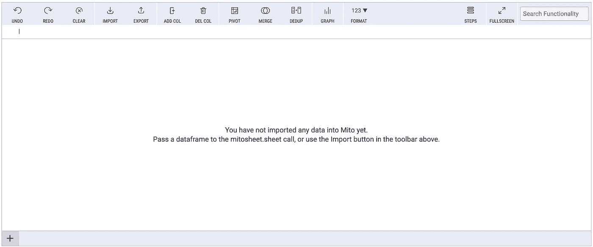
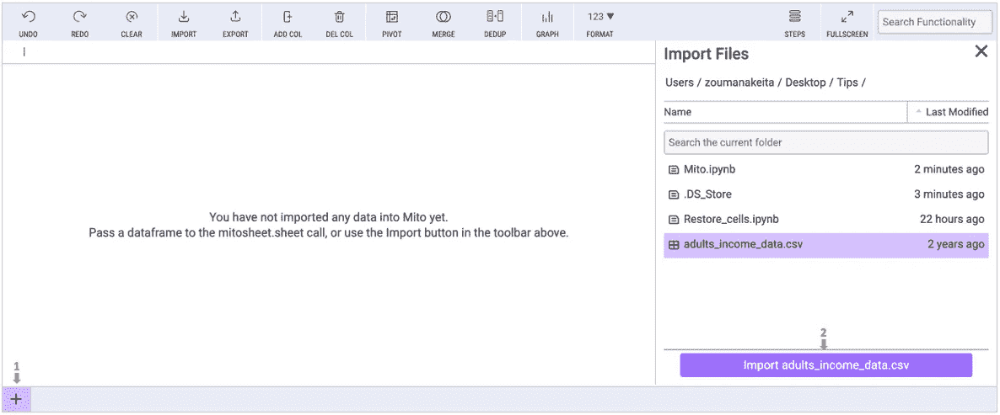
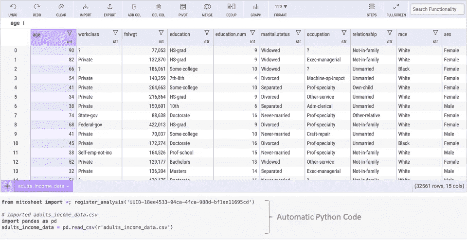
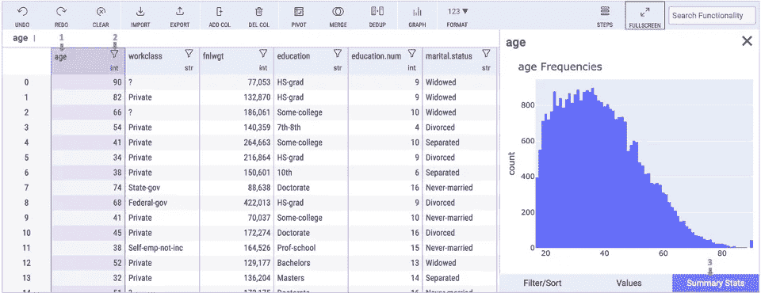
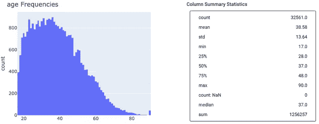
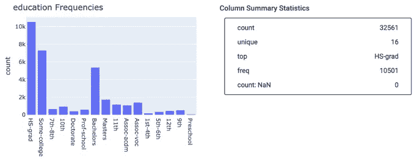
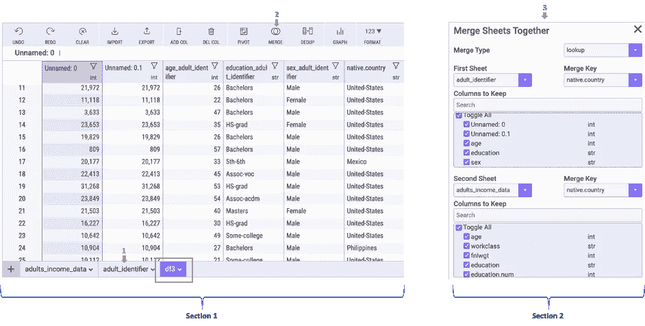
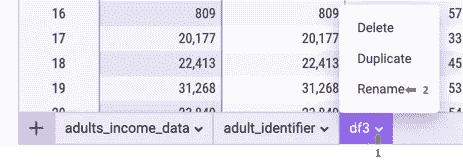

# 米托简介:也能生成 Python 代码的数据科学家电子表格

> 原文：<https://towardsdatascience.com/introduction-to-mito-spreadsheet-for-data-scientists-that-also-generates-python-codes-642b4c2d7dfc>

## 类似于电子表格，但速度快 10 倍


由[卢卡斯·布拉塞克](https://unsplash.com/@goumbik)在 [Unsplash](https://unsplash.com/photos/mcSDtbWXUZU) 上拍摄的照片

# 动机

电子表格已经使用了很多年，并且有不同的原因，包括数据分析。他们的界面为用户提供了一定的舒适感。但是，随着要分析的数据量的增加，电子表格往往会因为速度慢而失去作用，这可能会令人沮丧且耗时。

这里出现了`**Mito**`，一个试图通过结合电子表格的优势和执行速度来弥合这一差距的工具，以改善用户体验。

在这篇文章中，我们将了解什么是`mito`，并带您了解它提供的一些特性。

# 什么是米托？

`mito`是一款开源的数据分析工具，由 [Jacob Diamond-Reivich](https://www.linkedin.com/in/jacob-diamond-reivich-03ab62145/) 开发。它本质上类似于 excel 电子表格，但用于将 python 分析速度提高 10 倍。使用`mito`，您可以在`mito`提供的数据分析接口`mitosheet`中轻松浏览您的数据集。

除了前面的好处之外，自动获取与在界面上执行的编辑相对应的 python 源代码，并在您自己的机器上导出您的最终分析结果，这不是很好吗？这些是`mito!`的一些好处

让我们从需求开始把事情弄清楚，包括从您的终端使用下面的 **pip** 指令安装`mitosheet`包

```
python -m pip install mitoinstaller 
python -m mitoinstaller install
```

或者从你的 [Jupyterlab 笔记本](https://jupyterlab.readthedocs.io/en/stable/getting_started/installation.html)。

```
!pip install mitosheet
```

**注意**:确保重启你的内核，这样所有的修改都会生效。

安装完成后，您应该能够使用以下语法导入库。

```
# Import the library
import mitosheet
```

# 开始

我们将使用 [Kaggle](https://www.kaggle.com/uciml/adult-census-income) 上提供的 ***免许可*** 的[成人收入数据](https://www.kaggle.com/uciml/adult-census-income)集举例说明`mitosheet`的用法。

现在所有的要求都满足了，我们准备骑在巨人的肩膀上了！整个神奇的事情发生在我们可以用这个简单的命令得到的用户界面上

```
# Show the User Interface
mitosheet.sheet()
```

根据前面的说明，我们得到以下界面，用户可以从该界面轻松导入其文件，该文件可以是 CSV 或 Excel 文件。

我们可以注意到所有的标签页都是不言自明的，例如，**撤销**用于撤销一个动作，**重做**，与前一个相反。**清除**删除我们执行的所有操作，**导入**，导入数据集，**导出**导出数据集，等等。



Mitosheet 主界面(图片来自作者)

## 获取数据

我们可以使用左下角的 **+** 符号或顶部的**导入**选项卡来导入数据。



数据导入步骤(图片由作者提供)

在前面的步骤中选择了要导入的数据( **+** sign 和**Import adults _ income _ data . CSV**)后，我们得到了下面的界面，显示了数据，各列名称下的各列类型。例如，**工作类**是一个字符串( **str** )。在同一界面的右下方，我们可以看到行数(32 561)和列数(15)。



数据导入后的默认界面(图片由作者提供)

在每个过程的最后，生成相应的 python 代码和注释，就像上面的数据导入一样(下面的代码相同)。

美图 _ 数据 _ 导入. py

## 开始分析

`Mitosheet`提出与数据分析师日常活动相关的不同分析可能性。其中一些分析包括生成汇总统计数据、合并数据集、列重复数据删除、删除等。你可以在这里找到可能性的详尽列表[。](https://docs.trymito.io/how-to/pivot-tables)

在本节中，我们将主要关注前两种可能性，使用我们在**入门**一节中介绍的数据集来说明每一种可能性。在分析结束时，最终数据集将以不同的名称保存和导出。

**汇总统计**

默认情况下，`Mitosheet`显示列中值的频率直方图，以及 pandas 的`[describe()](https://pandas.pydata.org/pandas-docs/stable/reference/api/pandas.DataFrame.describe.html)`函数的输出，以获得更高级的统计信息。

获取统计数据的一般语法分为三个主要步骤:**选择列>过滤器图标>汇总统计数据。**我们可以对**年龄**列应用相同的方法，如下所示。



获取年龄列统计数据的过程(图片由作者提供)

选择**汇总统计**按钮后，在表格右侧自动生成如下结果。由于在截图上看不到这些信息，我决定在下面显示完整的统计信息:**年龄分布**和相应的汇总统计。对于数据集中的所有连续特征，可以产生类似的结果。



“年龄”列的汇总统计结果(图片由作者提供)

以下结果是我们从教育列得到的，教育列是一个分类列。此外，对于数据集中的所有分类特征，也可以发现类似的结果。



教育专栏的汇总统计结果(图片由作者提供)

**合并数据集**

`mitosheet`的`**MERGE**`模块用于将不同的数据集合并在一起。该功能提供了五种主要使用的合并可能性，如下所示。

*   ***查找合并*** :它包括第一张表上的所有观察值，只匹配第二张表上的行。在第二个工作表中有多个匹配的情况下，只考虑第一个。
*   ***内连接*** :只包含两张表都匹配的行。
*   ***外连接*** :这一个包括两个表中的所有行，不管另一个表中是否有匹配。
*   ***左连接*** :包含第一张工作表中的所有行，只匹配第二张工作表中的行。
*   ***右连接*** :与前一个相反，它包括第二个表中的所有行，并且只匹配第一个表中的行。

例如，我从原始数据集创建了一个名为**成人标识符. csv** 的新数据集(只有**年龄**、**教育**、**性别**和 **native.country** 列和 3000 个随机观察)。使用基于 **native.country** 列的查找合并，将第二个数据集与第一个数据集合并。该过程可使用`mitosheet`执行，如下所示:

***从第一节***

**1。**类似于第一个数据导入第二个数据。

**2** 。选择**合并**选项卡，这将自动创建一个新的数据集( **df3** )作为合并的结果。第二部分也被自动显示，以允许用户实现合并逻辑。

***出自第一节***

本节实现了合并两个数据集的逻辑。它要求用户选择与前面解释的五种可能性之一相对应的合并类型。然后，用户可以选择第一个表、第二个表和两个表中要保留的列。



合并界面(图片由作者提供)

完成合并逻辑后，通过点击右侧的 **X** 符号关闭**合片**部分，自动生成 **df3 的内容。**下面的 Python 代码也是在流程结束时生成的。

mito_merge.py

**重命名最终数据并导出**

当我们完成并满意我们的最终分析时，我们可能想要导出结果以进行进一步的操作。由于 **df3** 不是一个不言自明的名字，我们可以如下所示更改这个名字( **final_adult_income** )。



更改最终数据名称(图片由作者提供)

之后，我们可以将数据导出为 **CSV** 或 **excel** 文件，如下所示。

1.  选择文件并选择顶部的`**EXPORT**`选项卡，这将自动打开右侧的下载部分。
2.  从这里，我们可以选择文件的格式(在本例中为 **CSV** ，然后选择下载 CSV 文件以结束该过程。


CSV 格式最终数据的导出过程(图片由作者提供)

# 结论

恭喜你！🎉 🍾您刚刚学习了如何使用`mitosheet`加快数据分析过程！请随意尝试，让您的数据分析更上一层楼。另外，如果你喜欢读这篇文章，点击**关注按钮**获取文章更新！

欢迎在 [LinkedIn](https://www.linkedin.com/in/zoumana-keita/) 上加我，或者在 [YouTube](https://www.youtube.com/channel/UC9xKdy8cz6ZuJU5FTNtM_pQ) 和 [Twitter](https://twitter.com/zoumana_keita_) 上关注我。讨论人工智能，人工智能，数据科学，自然语言处理的东西总是令人愉快的！

[进一步阅读 mitosheet 文档](https://docs.trymito.io/getting-started/overview-of-the-mitosheet)

再见🏃🏾