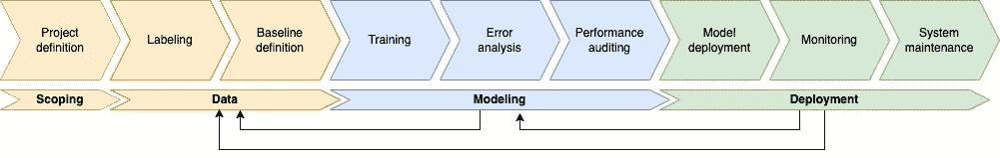
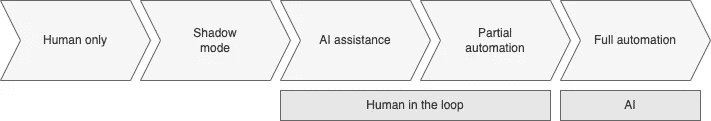

# 生产中的 ML 简介

> 原文：<https://towardsdatascience.com/introduction-to-ml-in-production-834d57c406d>

## 挖掘机器学习周期:范围、数据、建模和部署

照片由[数码 Buggu](https://www.pexels.com/@digitalbuggu/) 在[像素](https://www.pexels.com/photo/colorful-toothed-wheels-171198/)上拍摄并由作者编辑

机器学习操作，被称为 MLOps，是一个新兴的学科，它包括一组在生产中维护和部署机器学习模型的实践，以便它们是有效和可靠的。

这个词是“机器学习”和 DevOps 的持续开发实践的复合，devo PS 也是一套缩短系统开发生命周期和提供高质量软件持续交付的实践。

MLOps 覆盖了整个 ML 生命周期，分为四个部分:范围、数据、建模和部署。

**图一**。ML 项目生命周期。 **Ref** :图片作者。

本文讲解的很多概念都来自 Coursera 课程“[生产中的机器学习简介](https://www.coursera.org/learn/introduction-to-machine-learning-in-production)”，强烈推荐观看。

# 1.辖域

范围界定是我们计划项目并决定*完成什么*和*如何完成*的过程。在此阶段，必须定义准确性或延迟等关键指标，以及资源和时间表。

一般来说，这个阶段涵盖了以下过程:(1)确定一个业务问题，(2)思考潜在的 AI 解决方案，(3)评估潜在解决方案的可行性和价值，(4)确定项目的时间表和预算。

同样，在这一阶段，有必要根据既定的时间表和预算对项目的技术可行性进行初步评估。为此，我们可以将技术和商业团队召集在一起，就定义的条件达成一致。如果团队不确定规格，进行概念验证(POC)来测试可行性可能是个好主意。

# 2.数据

一旦我们定义了项目的范围，下一个阶段就是为项目收集适当的数据，对其进行适当的标记，并设置用于建模阶段的基线。

## 2.1.标记

关于数据，有两种主要类型的问题:

*   小数据(≤10K)与大数据(> 10K)
*   结构化数据与非结构化数据

对于小数据，标签至关重要，而对于大数据，主要挑战在于数据处理，即如何收集、过滤、排序、处理、分析、存储数据，然后以可读格式呈现。此外，虽然人类或数据增强技术可用于标记非结构化数据，但通常难以获得结构化数据集的新数据。在为项目选择团队时，一个好的做法是选择处理过相同类型数据的人。

要获取标签，建议与客户讨论如何在范围界定阶段获取数据标签。理想情况下，客户提供标签。如果不是这样，有趣的是他们也参与了标记过程，因为他们通常拥有领域知识。

如果没有标签，那么就需要决定标签的工作量。例如，如果你计划在训练阶段花 3 天时间，在错误分析阶段花 2 天时间，那么你可能需要花 1-2 天时间来标记数据。否则，与项目的其他部分相比，贴标成本会大幅增加。如果要标注的数据很多，不如先标注一部分数据，训练模型并评估误差，然后再标注，迭代重复这个过程。

最后，一个好的做法是花一些时间手动检查标签:( 1)了解数据和标签，以及(2)确保大多数标签都被正确标记。

## 2.2.基线定义

在这个阶段，建立一个基线总是一个好主意。当基本事实标签已经被外部定义时，人的水平性能(HLP)给出贝叶斯误差/不可约误差的估计。

关于 HLP，低准确度可能表示不明确的标签说明。当几个贴标签机对同一样品贴标签时，可能会观察到这种情况。提高标签一致性不仅会提高 HLP，还会提高模型性能，这是项目的最终目标。

除了从 HLP 获得基线，其他选择是获得文献中提出的类似解决方案的基线，或者获得由旧模型建立的基线。

# 3.建模

第三阶段是建模，这是一个介于训练阶段、错误分析和性能审计之间的迭代过程。

# 3.1.培养

这个阶段包括模型的训练，以获得尽可能高的精度。有两种可能的方法:

1.  *以模型为中心的视图*:专注于为可用数据构建最佳模型。这种方法侧重于保持数据固定，并迭代地改进代码/模型。
2.  *以数据为中心的模型*:它专注于使用工具来提高数据质量。这种方法侧重于保持代码固定，并迭代地改进数据。

一般来说，在实际应用中最好使用第二种方法。换句话说，最好将训练集中在好数据上，而不是大数据上，因为拥有好数据的合理算法往往会胜过拥有不太好数据的伟大算法。

要开始建模，首先要搜索文献，看看什么是可能的，并找到开源实现(如果它们可用的话)。此外，在训练大型数据集之前，尝试对小型训练数据集进行过度拟合是一个很好的做法。最后，实施一个好的跟踪方法(使用的代码、超参数、结果……)来更清楚地了解所进行的实验，以及如何得到最精确的模型。

## 3.2.误差分析

一旦您训练了模型，通过将我们的模型性能与已建立的基线进行比较，确定您是应该用当前的数据投入更多的精力来训练模型，还是应该进入部署阶段。

错误分析会告诉你每个类别是否有改进的空间。通过此分析，您可以确定是否有必要收集更多数据、提高标注的准确性或使用数据扩充来提高未达到基线的类的准确性。

## 3.3.绩效审计

一旦你结束了错误分析，检查准确性，公平性和偏见。错误分析、用户反馈和竞争对手的基准可以为添加新功能提供灵感。

此外，考虑当前的结果，并头脑风暴系统在部署阶段可能出错的方式。此外，建立度量标准来评估部署阶段的性能，以确保模型在生产中的某些数据没有偏差。在这个阶段，尽可能与业务或产品所有者保持一致，以包含尽可能多的领域知识。

# 4.部署

部署阶段是机器学习生命周期的最后一步，将最终产品交付给客户。在这一阶段，两个主要挑战是:

*   概念漂移(目标变量的统计特性随时间变化)和数据漂移(目标变量的统计特性随时间变化)。
*   软件工程问题，如实时与批处理、云与浏览器、计算资源(CPU/GPU/内存)、最大允许延迟或安全性和隐私。

与建模阶段相同，部署也是模型部署、监控和系统维护之间的一个迭代过程。

## 4.1.模型部署

常见的部署案例有:

1.  有新产品/新功能
2.  有一个新系统取代了旧的 ML 系统
3.  有一个系统可以自动完成/帮助完成手工任务

此外，根据部署情况，有不同类型的部署:

*   影子模式(Shadow mode):新数据通过一个新部署的模型运行，而该模型实际上没有向客户返回预测的技术。
*   金丝雀部署(Canary deployment):向用户子集逐步发布应用或服务
*   *蓝绿色部署*:利用两个相同环境的部署策略，一个*蓝色*和一个*绿色*环境采用不同型号。这通常在旧模型已经在生产中运行时使用。

一般来说，最好是(1)有一个简单的方法回滚到旧系统，和(2)部署系统，逐步升级和监控。

最后，当使用任何提到的技术部署模型时，这个模型不一定需要替换人。事实上，有不同程度的自动化，如下图所示。

**图二**。自动化程度。**参考**:图片由作者提供。

## 4.2.监控和系统维护

这需要监控您的 ML 模型的变化，如数据漂移、概念漂移和模型退化，并确保模型保持可接受的性能水平。重要的是，不仅要监控将向客户端显示的输出指标，还要监控输入指标(缺失值的数量、特性的分布等)和软件指标(内存、延迟、吞吐量、服务器负载等)。要构建监控系统，您可以与团队一起集思广益，找出可能会出错的地方，以及一些可以发现问题的统计数据/指标/KPI。

## 4.3.系统维护

从监控系统中，我们可以发现与需要解决的概念漂移或数据漂移相关的新问题。根据这些见解，我们可以使用新数据手动或自动重新训练模型，以提高准确性。实际上，虽然用户数据漂移较慢，但企业对企业(B2B)应用程序往往漂移较快。

# 结论

如今，围绕机器学习项目开始出现两个分化良好的群体。一方面，那些在研究领域工作的人试图给 ML 社区带来新的和创新的模型。另一方面，那些从事实际应用机器学习项目的人主要使用文献中找到的模型，然后将它们投入生产。对于后者，我认为了解完整的机器学习生命周期并至少了解其中一个部分是成为一名成功的专业人士所必需的。

***如果你喜欢这篇文章，请考虑*** [***订阅***](https://javiferfer.medium.com/membership) ***。你将获得我所有的内容+所有其他来自牛逼创作者的文章！***