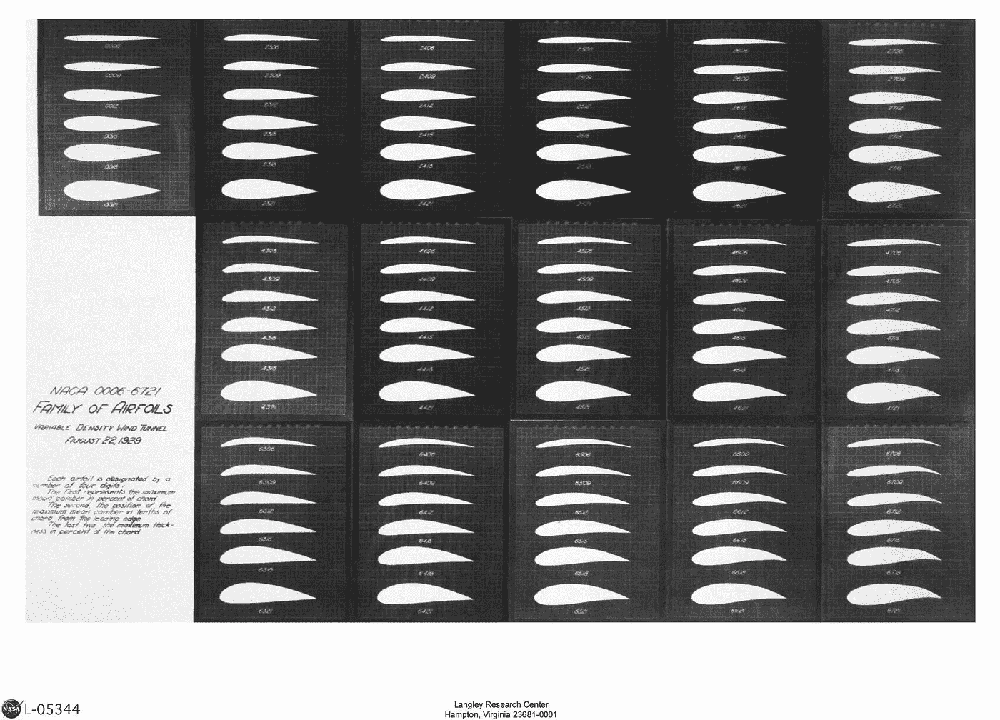
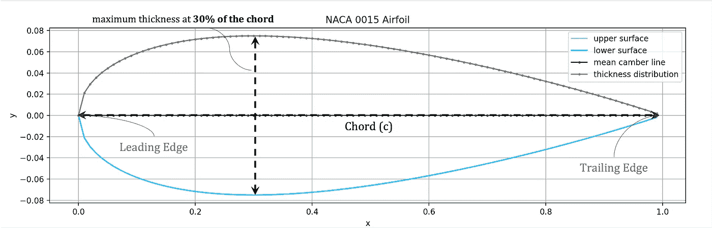
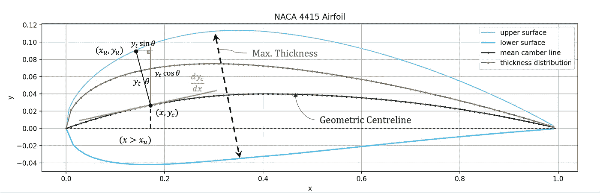
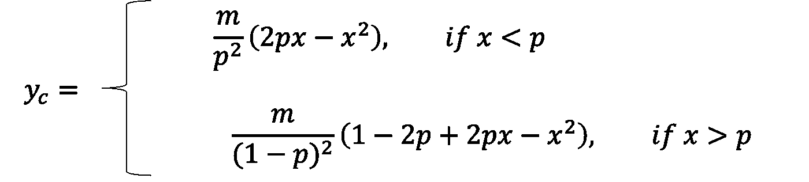
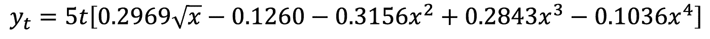
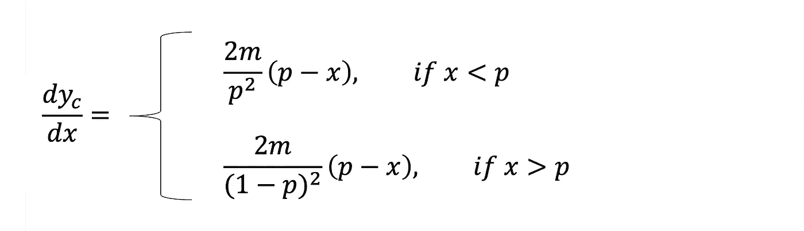
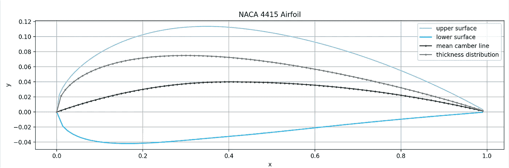
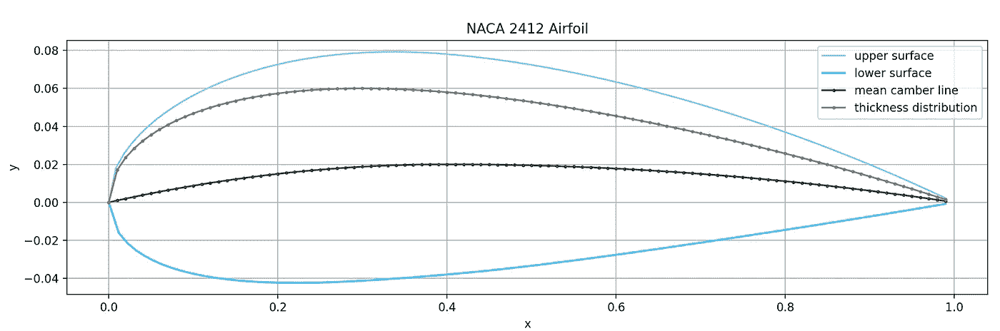
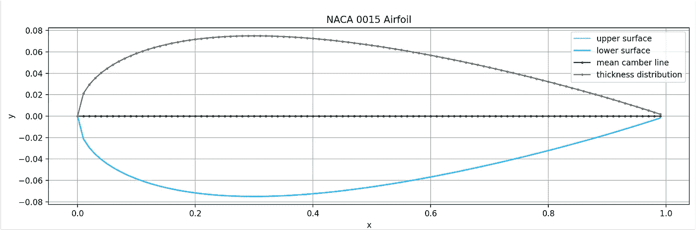

# Python 中 NACA 翼型空气动力学简介

> 原文：<https://towardsdatascience.com/introduction-to-naca-airfoil-aerodynamics-in-python-72a1c3ee46b1>

## 用 Python 理解 NACA 4 系列翼型

## 介绍

这篇文章旨在解释 **NACA 翼型**的基本特性，特别是与*空气动力学入门学生*相关。首先讨论的是*翼型几何*背后的基本理论。然后，这些方程的 **Python** 实现使用 *Matplotlib* 计算用于绘制 NACA **4 系列** 2D 翼型的相关*数字属性*。

[Jerry Zhang](https://unsplash.com/@z734923105?utm_source=medium&utm_medium=referral) 在 [Unsplash](https://unsplash.com?utm_source=medium&utm_medium=referral) 上的照片

**翼型是机翼的横截面。国家航空咨询委员会 (NACA)开发并测试了一系列翼型，称为 NACA 翼型。图 1 显示了一系列这样的样品机翼剖面。**

**四位数**和*五位数*系列是初学空气动力学课程最常学的，但也有*六位数*的型号。本文重点了解四位数系列，比如一个 *NACA 4415* 翼型。

图 1-NACA 翼型系列-来源:[兰利研究中心](https://www.nasa.gov/image-feature/langley/100/naca-airfoils)

## 翼型几何形状

图 2 是一个示例*对称*翼型，其中概述了关键几何参数。

*   **前缘和后缘**:分别为机翼的*最前*和*最后*点
*   **弦** : *连接机翼前缘和后缘的直线*
*   **x** : *前缘从零开始沿弦的水平距离*
*   **y** : *相对于水平 x 轴的垂直高度*

图 2-对称翼型几何形状(图片由作者提供)

图 3 描绘了一个*弧形*翼型。**曲面**本质上类似于*曲率。*

*   **中弧线**:位于上和下表面的中间，与*几何中心线*同义。
*   **厚度(t)** :沿翼型长度的高度分布

图 3——弯曲翼型几何形状(图片由作者提供)

从图中可以明显看出，两个主要变量表达了翼型表面的*几何轮廓*、*弯度和厚度*。

设计的一个关键方面是 **4 系列翼型形状源自描述平均弧线和截面厚度分布的解析方程**。后来的系列，如 6 系列，是使用复杂的理论方法*衍生出来的*。

## 4 系列方程

NACA 4415 是 4 系列家族中的一员。整数 4415 描述了 2D *的轮廓*。

等式 1 对应于**数字 1** ，以弦的百分比给出*最大拱度(m)* 。因此，4415 的最大弯度是弦长的 4%。

等式 1——最大弯度占弦的百分比(图片由作者提供)

**数字 2** 被输入到方程 2 中，方程 2 提供了*到前缘*的最大弯度(p)距离，单位为十分之一弦。因此，4415 翼型的最大弯度点出现在沿弦长的 40%处。

方程 2-D*最大弯度与前缘*的距离，单位为十分之一弦(图片由作者提供)

等式 3 利用了**数字 3** 和*以及*和**4**；他们给出了*翼型的最大厚度(t)* 占弦长的百分比。因此，4415 翼型厚度为弦长的 15%。

等式 3——弦的最大厚度百分比(图片由作者提供)

要点 1 给出了 **Python** 代码，该代码定义了基于 NACA 四位数提取*数值* *翼型特性*的三个函数。

对于*对称翼型，前两位数为零*。即 *0015 → m = 0，p = 0* 。

要点 NACA 翼型数字的参数转换

根据 *x* 坐标是小于还是大于最大外倾角( *p* )的位置，两个等式指定了**平均外倾角线**，如等式 4 所示。

等式 4 —平均拱线(图片由作者提供)

*重要的是要重申，所提出的方程是纯分析性的，是 NACA 通过研究和实验设计的。*

Gist 2 提供了等式 4 的 Python 实现。

要点 2——平均弧线 Y 坐标

*yₜ* 对应*厚度分布*厚度分布**。**中弧线以上(+)和以下(-)的厚度值取决于等式 4。

等式 5——平均拱线周围的厚度分布(图片由作者提供)

**x⁴** **系数**根据后缘是打开还是关闭而变化。即*，-0.1036* 对应封闭曲面，对于有限厚度后缘，用 *-0.1015* 代替-0.1036。

*yₜ* 是使用 Gist 3 在 Python 中计算出来的。

要点 3——计算翼型厚度分布的解析函数

厚度值垂直于中弧线加上***。因此，需要一个角度来指示加法的**偏移**。***

**对中弧线求导得到曲线切线的*斜率。* D *将*方程式 4 相对于 *x* 微分得到方程式 6。**

****

**等式 6——中弧线的导数(图片由作者提供)**

**使用要点 4 中的 Python 代码找到中弧线的**导数。****

**要点 4——中弧线的导数**

**计算该导数的*反正切*给出了从垂直方向偏移厚度的角度 *θ。回头参考图 3，了解 *θ* 的作用。***

****

**等式 7 —厚度偏移角度(图片由作者提供)**

**最后，为了计算**上**和**下**翼型**表面** **坐标**，使用等式 8-11，其中 *θ* 等于 *MCL* 在 *x* 处导数的反正切，使用等式 7 确定。**

**Gist 6 提供了计算翼型上下表面最终(x，y)值的代码。**

****

**方程式 8-11——翼型表面的最终坐标(图片由作者提供)**

**要点 6——翼型表面的最终(x，y)坐标**

## **绘图结果**

**使用( *xᵤ，yᵤ* )和( *xₗ，yₗ* )的结果值绘制*最终翼型*。图 4 描述了使用 **Matplotlib** 绘制的 NACA 4415。**

****

**图 4-NACA 4415 翼型图**

**图 5 显示了另一个弧形 4 系列翼型的样本，NACA **2412** 。直观地比较 4415 和 2412 的几何特性，查看差异，注意 y 轴刻度。**

****

**图 5-NACA 2412 翼型图**

**如上所述，这些解析表达式对**对称翼型**有效。**

**中弧线和厚度分布都与弦完美对齐，从图 6 中的 **0015** 中可以清楚地看到。**

****

**图 6-NACA 0015 对称翼型图**

## **结论**

**每个等式都是通用的，可以用任意四个整数进行参数化，以可视化 4 系列 NACA 家族的任何成员。**

***本文概述了基本的翼型特性，并演示了一种实现几何表达式来绘制机翼的 2D 表面轮廓的方法。***

***感谢阅读。请告诉我你是否对其他与空气动力学相关的文章感兴趣。***

**</5-python-projects-for-engineering-students-8e951b7c131f>  <https://medium.com/@andrewdaviesul/membership>  

## 参考

【1】**空气动力学基础**。第六版。小约翰·安德森空气动力学馆长。国家航空航天博物馆。史密森学会。
【2】**NACA 翼型** — NASA。*最后更新:2017 年 8 月 7 日编辑:Bob Allen*
【3】[NACA 翼型系列](https://web.stanford.edu/~cantwell/AA200_Course_Material/The%20NACA%20airfoil%20series.pdf)(aa 200 _ Course _ Material)——斯坦福【4】[讲解:NACA 四位数翼型【飞机】](https://youtu.be/6pt8Uolfj0M)——工程师乔希**