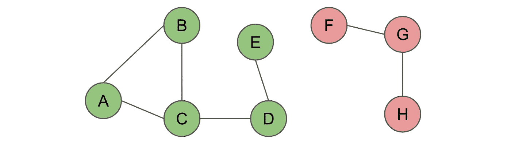
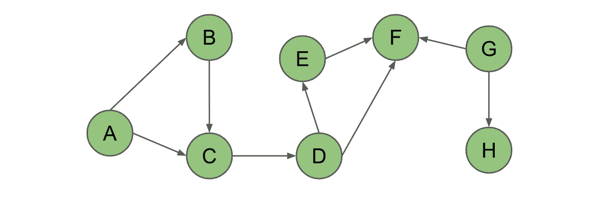
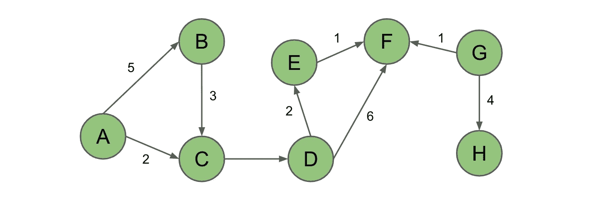
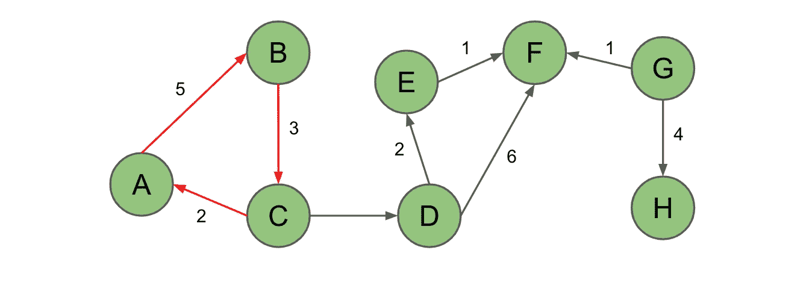
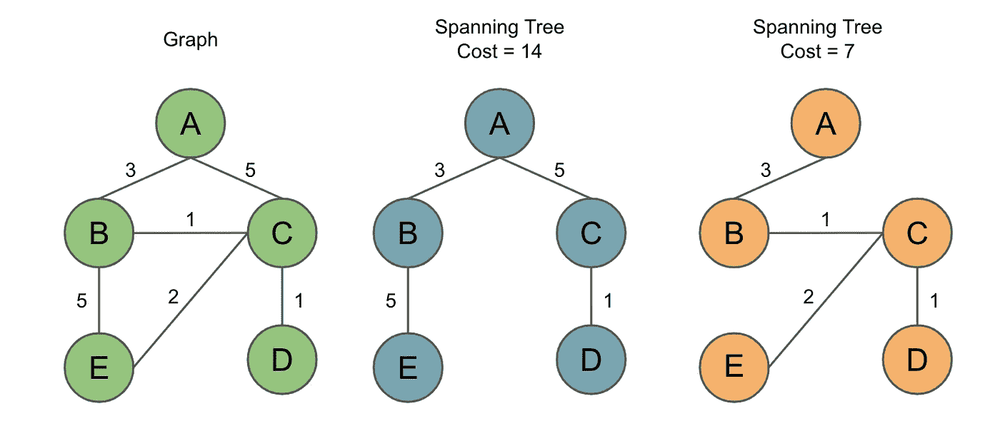
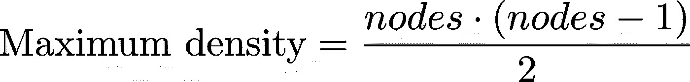
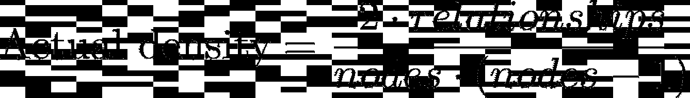

# NoSQL 图形数据库简介

> 原文：<https://towardsdatascience.com/introduction-to-nosql-graph-databases-fb2feac7a36>

## 图形数据库类型、结构和属性概述

香农·波特在 [Unsplash](https://unsplash.com?utm_source=medium&utm_medium=referral) 上的照片

# 介绍

## 什么是 NoSQL 数据库？

NoSQL 代表“不仅仅是 SQL”NoSQL 数据库提供了一种不同于关系表的存储数据的替代方法。

NoSQL 数据库提供了存储结构化、半结构化和非结构化数据的灵活性。当您需要存储大量数据、根据不断变化的需求快速迭代以及向外扩展时，它们非常适合使用。

有多种类型的 NoSQL 数据库。4 最常见的 NoSQL 数据库是:

1.  **键值数据库**:键值存储；类似于 Python 字典。通过使用键或搜索整个数据库进行查询。键值存储倾向于在内存中使用，并在其背后使用后备存储。
2.  **文档数据库**:文档的集合，其中每个文档都是 JSON 或类似 JSON 的格式。每个文档都包含成对的字段和值。主存储位于存储层，我们将其缓存到内存中。
3.  **宽列数据库**:类似于关系数据库表；区别在于后端的存储不同。我们可以将 SQL 放在宽列数据库之上，这使得它非常类似于查询关系数据库。
4.  **图形数据库**:将数据存储为节点(顶点)和关系(边)。顶点通常存储对象信息，而边表示节点之间的关系。我们可以在图形数据库中使用类似 SQL 的查询语言。

这篇文章将重点提供一个关于 *NoSQL 图形数据库*的概述。

## 图形数据库的好处

NoSQL 图具有节点(顶点)和关系(边)，允许我们对各种场景进行建模——从火车路径系统到绘制社交媒体连接，到设备网络，等等。

我们可以给节点分配标签，并根据这些标签对节点进行分类。我们还可以分配键值对形式的属性(权重)。关系也可以有标签和属性，但也可以有方向。方向为关系提供了意义；它们可能是无方向的、单向的或双向的。

随着数据量的增加、快节奏的敏捷迭代以及向外扩展的需求，图数据库在满足这些需求方面发挥着关键作用。

*   即使数据随时间增长，图形数据库的性能也保持不变
*   图形数据库查询输出实时结果
*   他们可以对大数据执行实时更新，同时支持查询。
*   图形数据库提供了快速适应不断变化的需求的灵活性。需求变化的快速迭代需要能够在不危及当前功能的情况下对现有的图结构进行修改。

# 图形类型和结构

了解不同的图形类型和结构很重要，包括形状、特征和密度。

## 图表形状

我们将涉及的主要形状是随机的、小世界的和无尺度的。

**随机**:没有图案的扁平状。所有节点相互连接的概率相同。

*   例如:社会安全号码、出生/死亡、退休

**小世界**:这个形状有高度的局部聚集，导致平均路径长度较短。没有一个节点的距离超过几个关系。一个可以思考的类比是当你听到“嘿，世界真小！”

*   例如:LinkedIn——你遇到的大多数人都是二级或三级关系

**无标度**:多标度的“轴辐式”。这符合幂律分布——一个量的变化导致另一个量相对成比例的变化。

*   示例:一组相互关联的邮政编码组成一个县

## 图表属性

**连接&断开**:连接是两个节点之间的路径，不考虑距离。您在图连接中可能观察到的一个问题是，在大多数图算法中可能不会分析断开的节点。类似地，如果您的图包含一个与主图断开连接的连接节点岛，也会出现问题。

作者照片

**有向&无向**:有向图是指图关系(边)有方向。该方向通过指定源节点和目的节点来进一步定义节点关系。如果一个图形算法需要方向，无向图是不合适的。

作者照片

**加权&未加权**:权重是置于关系上的数值。图中的权重可以是有向的，也可以是无向的。如果图算法需要权重，则不包括未加权的关系。

作者照片

**非循环&循环**:循环图是指图中有从一个节点回到自身的循环或路径。许多常见的图算法需要非循环图；周期会导致这些算法停滞不前，永远重复下去。

作者照片

**树&生成树**:一棵*树*是一个无环图，可以是有向的，也可以是无向的。*生成树*是一种树，其中所有节点都在图中，并且移除关系以移除循环。由于在一个循环中有多个移除关系的选项，所以在一个图中可以有多个生成树。

*最小生成树*是具有最小成本的生成树。如果图是加权的，那么你通过路径权重来计算成本。如果这个图是不加权的，那么你就可以找到到达每个节点的跳数最少的生成树。

作者照片

## 图形密度

边(关系)的数目与图所能包含的最大边数之比称为图密度。如果一个图有很多边，那么这个图被认为是更加*稠密的*。如果一个图没有很多边，它被认为是*稀疏的*。

图的最大密度是指图中的每个节点都与每个节点相连。如果我们知道节点的数量，我们就可以计算出最大密度。图表的最大密度和实际密度可以计算如下:

我们经常看到非常密集的图(即:分析网络流量或社交媒体)。我们在研究图形算法时面临的问题是，在高密度的情况下，我们需要识别和剥离图层。另一方面，当我们在处理高层次的稀疏关系时，我们想看看是否可以根据我们做出的推断来添加关系。

# 摘要

在这篇介绍性文章中，我们了解到 NoSQL 图数据库在处理不断增长的数据量、快节奏的敏捷迭代以及向外扩展的需求方面发挥着关键作用。我们研究了图形和结构的主要类型，以及图形形状、密度和特征，如连通性、方向、权重、循环/非循环和树。为了在工作中实现最佳的结构和算法，理解图的属性非常重要。