# 强化学习介绍:时间差异，SARSA，Q-学习

> 原文：<https://towardsdatascience.com/introduction-to-reinforcement-learning-temporal-difference-sarsa-q-learning-e8f22669c366>

菲利普·格利克曼在 [Unsplash](https://unsplash.com?utm_source=medium&utm_medium=referral) 上的照片

强化学习是机器学习中最复杂的领域之一，因为它的数学复杂性，以及它试图实现的雄心勃勃的任务。

> 简单地说，RL 算法的最终目标是使智能体能够在一个环境中行动，以最大化总回报。

说起来容易做起来难:这一句话隐藏了许多问题，例如:

1.  我如何定义“目标”和“奖励”？
2.  我如何让一个代理“行动”？
3.  我如何对“环境”建模？

这个问题比看起来要困难得多，但迄今为止已经取得了很多进展，最著名的例子是科学突破，如 DeepMind 的 [AlphaGo](https://www.youtube.com/watch?v=x5Q79XCxMVc) 和 [AlphaTensor](https://www.deepmind.com/blog/discovering-novel-algorithms-with-alphatensor) 。

然而，如果你想深入了解一个领域，你必须从基础开始。这篇文章的范围将是给出 RL 的高层次概述，以及介绍代表许多其他更高级算法的基础的三种算法:时间差异、SARSA 和 Q-Learning。

# 强化学习:构建模块

在 RL 中，我们利用一个简单的模型来描述代理如何与空间交互，这就是**马尔可夫决策过程**。

MDPs 代表了一种数学框架，用于对动态部分由代理控制，部分由环境特征引起的情况进行建模。在 MDP 中，代理人不断地与环境互动，环境以影响后续代理人行动的回报作为回应。我们来看看下面这张图:

一个简单的 MDP，作者的形象

在每个时间步 *t* ，代理接收环境的*状态 S* ₜ的表示，这决定了对*动作 A* ₜ.的选择在下一个时间步 *t+1* ，代理收到一个*奖励* Rₜ₊₁，告知它过去的行为有多好，以及一个新的环境表示。

在有限的 MDP 中，州 Sₜ、行动 Aₜ和奖励 Rₜ具有有限数量的元素，Sₜ和 Rₜ具有明确定义的离散概率分布，仅取决于前面的州和行动。这些特点使得问题通常更容易处理。然而，并不是所有的问题都可以用有限的状态、行动或奖励来建模，然而我们将做出的许多假设和结论很容易推广到连续的设置中。

代理和环境之间的持续交互产生了一个轨迹:

> *S₀、A₀、R₀、S₁、A₁、R₁、S₂、A₂、巴西……*

从状态 *S* ₜ转换到 *S* ₜ₊₁的概率因此受到动作 *A* ₜ的选择的影响，但是，给定 *S* ₜ和 *A* ₜ，它有条件地独立于所有先前的状态和动作。因此，我们说 MDP 的状态转移满足**马尔可夫性质**。

代理人的最终目标是在长期内最大化总**回报**，这通常考虑到一个**贴现因子γ** ，计算如下:

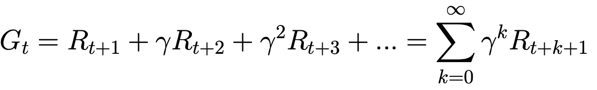

贴现回报，等式来自[1]

折现因子γ决定了代理人有多渴望眼前的回报(γ = 0)或有多长远的眼光并以未来的高回报为目标(γ = 1)。

代理人的行为应该是为了转换到产生高回报的状态。代理的行为由策略 *π(a|s)* 决定，策略是一个输出执行动作 *a* 的概率的函数，假设代理处于状态 *s* 。在给定的策略下，我们可以定义一个**状态-值函数**(和一个**状态-动作值函数**)，它测量代理从 *s* (并执行 *a* )开始并随后跟随 *π* 所获得的期望回报。

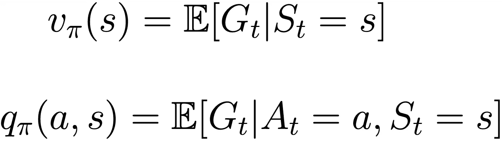

状态值函数和状态-动作值函数，方程来自[1]

RL 算法的目标通常有两个:

1.  **预测**:估计给定策略的价值函数 *π*

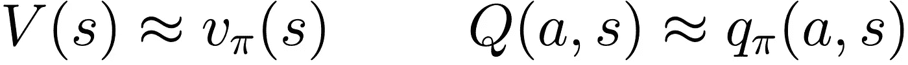

策略的状态值函数和状态-动作值函数的估计值 *π*

2.**控制**:寻找最优策略 *π** ，即长期收益最大化的策略。

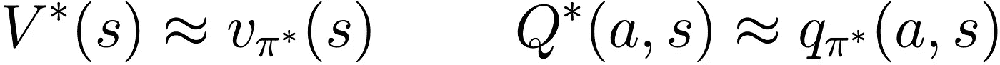

最优策略的状态值函数和状态-动作值函数的估计值 *π*

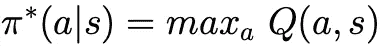

最优贪婪策略，来自[1]的等式，通过选择产生最高 Q 值的动作获得

注意，这两个任务是内在相关的:如果一个代理遵循一个策略 *π* ，我的第一个目标是评估这个策略有多好(**预测**)。一旦我估计了策略的价值函数，我就可以决定如何改变它，以便获得更好的价值函数(**控制**)。

了解环境的**模型**，也就是了解行动和回报的概率分布，在解决这两个任务时会有很大的优势。尽管如此，该模型往往是隐藏的或过于复杂而难以处理，因此算法最好从**经验**(或**集**)中学习，这些经验是状态、动作和奖励的序列，以最终状态结束。例如，玩完整的井字游戏代表一个情节，当其中一个玩家赢了(或者两个玩家都和棋)时就达到了结束状态。

一个简单的井字游戏插曲，图片由作者提供

可用于解决预测和控制任务的算法列表很长，并且它们中的每一个都能够在某些假设下获得最佳结果。在这里，我决定介绍三个支柱算法，它们被证明总体上运行良好，但也代表了许多更复杂算法的基础:

*   时间差异
*   萨尔萨
*   q 学习

# **时间差**

时间差异被认为是强化学习的中心思想，因为它在没有环境模型的情况下从原始经验中学习。它解决了预测问题，即估计 MDP 状态的值函数。

从经验中学习的问题是，人们必须等待一集的结束(从而等待最后的回报)来更新价值函数的估计。TD 克服了这个障碍，只需等待一步就能完成。

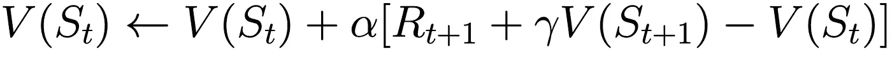

最简单版本的 TD，α的更新规则是更新速率。来自[1]的方程

在每个时间步 *t* 处，状态 *Sₜ* 的价值函数基于立即接收到的奖励 *Rₜ₊₁* 以及新状态 *Sₜ₊₁* 的估计而被立即更新。这是 TD 的最简单版本，称为 TD(0)，其中零表示必须等待一个单独的步骤来执行更新，但这一思想可以扩展到更复杂的算法，如 *n 步 TD* 和 *TD(λ)* 。正如您所注意到的，一个状态的更新规则利用了另一个状态的估计:这种方法被称为 **bootstrapping** 。

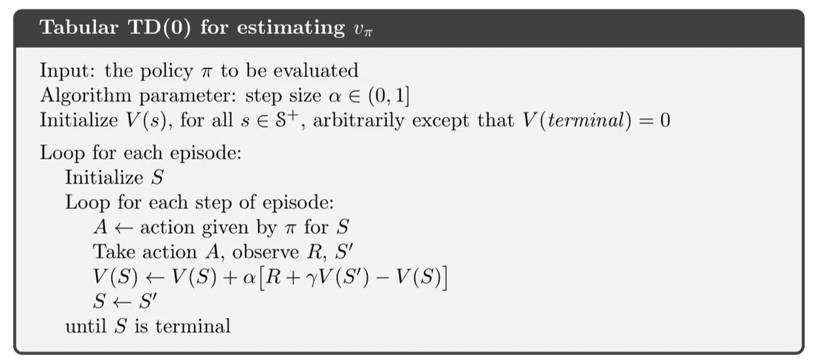

TD(0)的过程，来自[1]

我们提到了使用 TD 的好处，下面是一个总结:

1.  它不需要一个环境模型
2.  它的估计收敛(快速)到真实状态值函数
3.  它执行在线增量更新，即它不需要等待剧集结束来更新价值函数的估计。

# 萨尔萨

我知道你在想什么:这么奇怪的算法名字。事实上，SARSA 的名字来自于从状态 S 到 S’的转换:

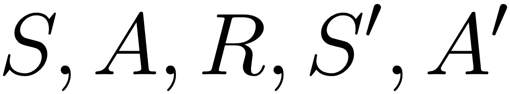

从状态 S 到 S '的轨迹，这就是 SARSA 算法的名称

SARSA 是一种基于策略的 TD 方法，用于解决**控制**问题，这意味着它试图为给定的任务找到最佳策略。为什么是“政策上”？

> 在 **on-policy** 学习中，使用当前策略𝜋(𝑎|𝑠).从所采取的行动中学习最优值函数

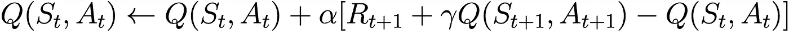

SARSA 的更新规则，等式来自[1]。注意，我们知道估计 Q(s，a)，而不是 V(s)

事实上，SARSA 被定义为“按策略”的原因是我们利用当前策略来更新 *Q(s，a)* 的事实。如果这还不清楚，等着看 Q-Learning 做了什么，并检查区别。

那么，萨莎是如何学习最优策略的呢？我们提到它是一种 TD 方法，这意味着它利用 TD 更新规则来估计值函数。但是它如何改进策略以获得一个更大的值函数呢？

SARSA 通过以ε贪婪的方式改变策略 *π* 来实现这一点:在我们执行的每一步:

*   具有最大 *Q(a，s)* 的动作，概率为 1 - ε
*   另一个随机动作，每个都有被选中的概率ε / *N(a)* ，其中 *N(a)* 是可能动作的数量

参数ε平衡了*利用与探索*的权衡:同时你想要利用你已经知道的，即执行最佳动作，但是你也想要探索其他可能性，即发现可能的更好的动作。

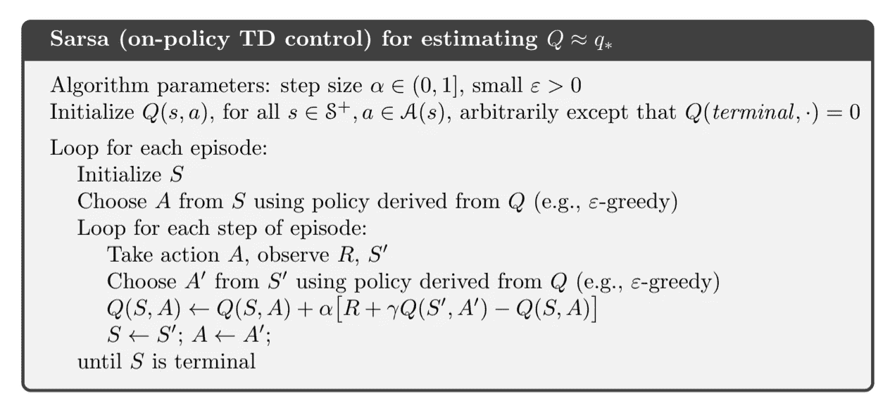

SARSA 程序，来自[1]

一旦过程结束，如果我们广泛地访问每个状态-动作对，我们将有一个**最优ε-贪婪 *Q*(a，s)*** ，这很容易导致最优ε-贪婪策略:

# **Q-学习**

在 fundo，Q-Learning 中的 Dulcis 是一种解决**控制**问题的非策略 TD 方法。

> 在**非策略**学习中，从独立于当前策略𝜋(𝑎|𝑠).采取的行动中学习最优值函数

Q-Learning 其实和 SARSA 很像。唯一(但有意义)的区别在于 *Q(a，s)* 的更新规则，它是:

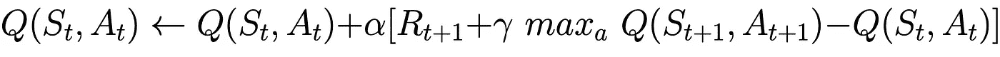

Q 学习的更新规则，等式来自[1]

在这种情况下，q 值没有根据我们遵循的ε-贪婪策略进行更新，但是它是基于我们可以从下一个状态 Sₜ₊₁采取的最佳行动(这与 SARSA 非常不同！).

q-学习程序，来自[1]

同样，只要每个状态-动作值对被访问无限长的时间，Q-学习就收敛到**最优 Q*(a，s)** 和最优策略。

# 那么… SARSA 还是 Q-Learning？

我们看到了解决控制问题的两种算法，然而，它们学习的方式有所不同。在学习过程中，SARSA 由选择的ε-贪婪动作引导，这可能是(并且经常是)次优的。另一方面，在 *Q(s，a)* 的更新中，Q-Learning 总是跟随贪婪动作。

> 这种(大)差异使得 SARSA 学习的策略只是接近最优。

所以不应该一直选择 Q-Learning 吗？技术上来说你可以。但是有些情况下，选择贪婪的操作可能意味着一些风险和代价高昂的错误，您可以通过选择更保守的算法(如 SARSA)来避免或限制这些错误。

# 结论

在这篇文章中，我总结了 RL 的关键概念，从基本元素开始，如状态、行动和奖励的概念，到复杂的方法，以找到达到特定目标的最佳策略。

强化学习是一套复杂的方法，有时很难理解和实现，然而这些方法通常基于这里所展示的概念，因此我建议你在进一步学习之前掌握它们。

我希望这篇文章对你有用！如果是这样的话，你为什么不……
1。拍手声👏
2。跟我来❤️
3。查看我的 [GitHub 页面](https://alessandropaticchio.github.io/)💻
4。在 [LinkedIn](https://www.linkedin.com/in/alessandro-paticchio/) 上加我！🤝(我随时欢迎聊天！！！)

# 信用

[1]“强化学习:导论”，作者安德鲁·巴尔托和理查德·萨顿