# SHAP 值及其在机器学习中的应用

> 原文：<https://towardsdatascience.com/introduction-to-shap-values-and-their-application-in-machine-learning-8003718e6827>

## 了解 SHAP 图书馆是如何运作的

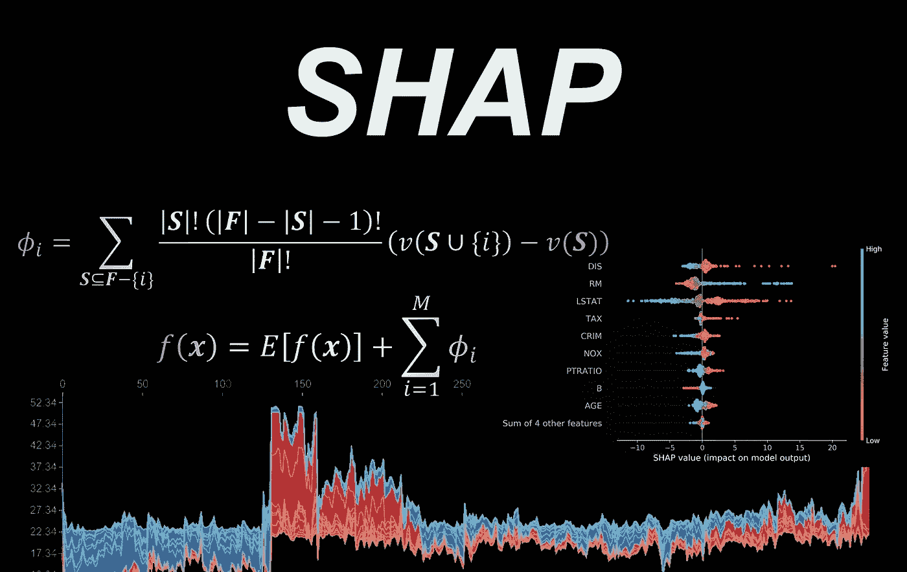

来源:图片由作者提供

SHAP 是一种解释机器学习模型预测的数学方法。它基于博弈论的概念，可以通过计算每个特征对预测的贡献来解释任何机器学习模型的预测。SHAP 可以确定最重要的特征及其对模型预测的影响。SHAP 是一个数学话题，不解释背后的数学原理就无法完全理解。然而，我们试图通过解释数学题目背后的直觉并为每个题目提供一些例子来尽可能地简化数学题目。*读者也可以跳过可选章节或附录中介绍的更难的主题。*我们还将使用 Python 从头开始实现不同的 SHAP 算法，以帮助你完全理解它们是如何工作的。

**Python 中的 SHAP 库**

在本文中，我们将研究可用于计算 SHAP 值的不同方法，每种方法都将从头开始用 Python 实现。然而，这些代码只是用来展示算法是如何工作的，对于现实世界的应用程序来说是没有效率的。Python 中的 [SHAP 库](https://pypi.org/project/shap/)可以用来高效地计算模型的 SHAP 值，在本文中，我们将简要地向您展示如何使用这个库。我们还用它来验证每一节中给出的 Python 脚本的输出(代码已经用`shap 0.40.0`测试过)。

**解释模型的预测**

大多数机器学习模型都是设计来预测目标的。这里预测的准确性非常重要，但是，我们还需要理解为什么一个模型会做出某种预测。所以，我们需要一个工具来*解释一个模型*。解释的意思是，我们希望对模型的预测和模型用来生成该预测的数据实例的组件之间的关系有一个定性的理解。这些组件可以是数据实例的一个特征(如果我们有一个表格数据集)，或者是图像中的一组像素，或者是文本文档中的一个单词。我们想知道这些成分的存在(或不存在)如何影响预测。

机器学习中的一些模型，如线性回归或决策树，是*可解释的*。这里的可解释性指的是人类理解模型用来做出预测的过程的容易程度。例如，如果我们绘制一个决策树分类器，我们可以很容易地理解它是如何做出某种预测的。另一方面，深度学习模型就像一个黑匣子，我们无法轻松理解这些模式如何做出预测。SHAP 是一个*个性化* *模型不可知* *讲解者*。模型不可知的方法假设要解释的模型是一个黑盒，并且不知道模型内部如何工作。因此，模型不可知方法只能访问输入数据和待解释模型的预测。一个个性化的模型不可知的解释者本身就是一个可解释的模型。解释者可以对一个特定的数据实例做出近似相同的预测。现在，我们可以假设这个可解释的模型正在模仿原始模型用来做出单一特定预测的过程。因此，我们说可解释模型可以解释原始模型。总之，SHAP 可以解释任何机器学习模型，而不知道该模型内部如何工作，它可以使用博弈论的概念来实现这一点。所以要理解它，首先，我们需要熟悉 Shapley 值。

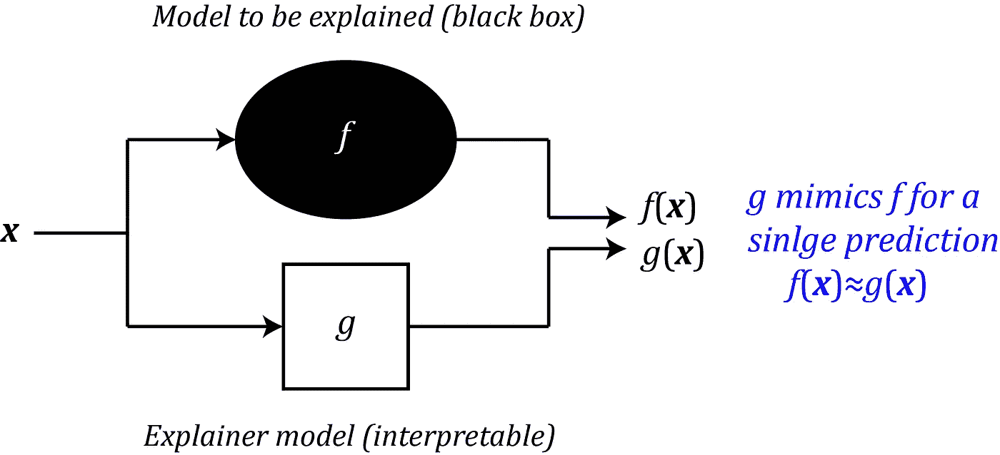

图 1(来源:作者图片)

**沙普利值**

Shapley 值是博弈论中的一个数学概念，由 Lloyd Shapley 于 1951 年提出。他后来因此获得了诺贝尔经济学奖。假设我们有一个合作博弈，有 *M* 个玩家，编号从 1 到 *M* ，设**F表示玩家集合，那么**F= { 1，2，.。。， *M* }。一个联盟， ***S*** ，定义为***f***(***s***⊆***f***)的子集，我们还假设空集∅是一个没有玩家的联盟。例如，如果我们有 3 个玩家，那么可能的联盟是:****

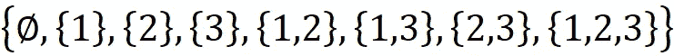

集合 ***F*** 也是联军，我们称之为*大联军*。很容易看出，对于 M 个玩家，我们有 2 个联盟。现在我们定义一个函数 *v* ，它将每个联盟映射到一个实数。 *v* 称为*特征函数*。所以，对于每个联盟 ***S*** ，数量*v*(***S***)是一个实数，称为*联盟*****S***的价值。它被认为是联盟中的参与者在一起行动时可以获得的总收益或集体回报。由于空联盟没有玩家，我们可以假设*

*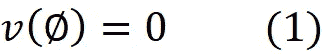*

*现在我们想知道在一个有 M 个参与者的联盟博弈中，每个参与者对总收益的贡献是多少？换句话说，在玩家之间分配总收益最公平的方式是什么？*

*我们可以用一个例子来说明如何解决这个问题。假设我们有一个 5 人游戏，那么 ***F*** = {1，2，...。。。， *5* }。假设我们通过一次一个地将玩家添加到空集来形成大联盟 ***F*** ，那么每次我们添加一个新玩家，我们就形成一个新的 ***F*** 联盟。比如我们先把{1}加到空集，那么当前的玩家集是{1}这是一个 ***F*** 的联盟。然后我们加上{2}并且当前集合是联盟{1，2}并且我们继续直到我们得到 ***F*** ={1，2，3，4，5}。随着每个玩家被添加到当前玩家集合中，他增加了先前联盟的总收益。例如，当当前设置为{1，2}时，总增益 *v* ({1，2})。加上{3}后，总增益变成 *v* ({1，2，3}) *。*现在我们可以假设{3}对当前联盟的贡献是当前联盟(包括{3})和不包括{3}的先前联盟的值之间的差:*

*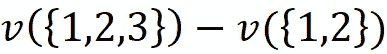*

*添加{3}后，我们可以添加{4}和{5}，它们也会改变总增益。但是不影响{3}的贡献，所以前面的等式还是给出了{3}的贡献(图 2)。但是，这里有一个问题。玩家的添加顺序也很重要。*

*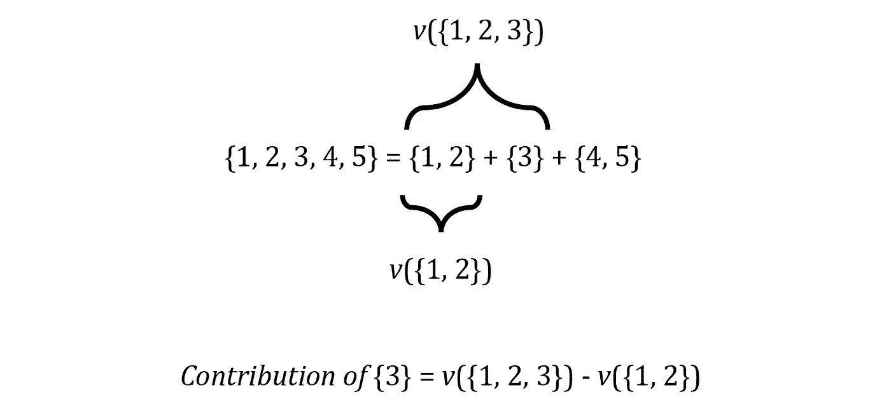*

*图 2(来源:图片由作者提供)*

*假设这些玩家是某公司某部门的员工。公司首先聘用{1}。然后，他们发现自己缺少一套技能，于是雇佣了{2}。雇用{2}后，公司的总收益增加了 10000 美元，这是{2}加到{1}上的贡献。雇用{3}后，{3}的贡献仅为 2000 美元。此外，假设员工{2}和{3}具有相似的技能。现在，员工{3}可以声称，如果他早点被聘用，他将获得相同的缴款{2}。换句话说，{3}的贡献加上{1}也可能是 10000 美元。因此，为了对每个玩家的贡献有一个公平的评价，我们还应该考虑他们加入大联盟的顺序。*

*事实上，要对玩家{ *i* }的贡献有一个公正的评价，我们应该形成 ***F*** 的所有排列，并计算{ *i* }在每个排列中的贡献，然后取这些贡献的平均值。例如， ***F*** ={1，2，3，4，5}的一种可能排列是:*

*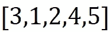*

*而{3}在这个排列中的贡献是:*

*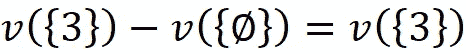*

*另一种排列可以是:*

*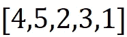*

*而{3}在这个排列中的贡献是:*

**

*值得注意的是，特征函数 *v* 将联合作为其自变量，而不是排列。联合是一个集合，所以其中元素的顺序并不重要，但是排列是元素的有序集合。在类似[3，1，2，4，5]的排列中，3 是第一个玩家，5 是最后一个加入团队的玩家。因此，对于每个排列，元素的顺序可以改变它们对总增益的贡献，然而，总增益或排列的价值仅取决于元素，而不是它们的顺序。所以:*

*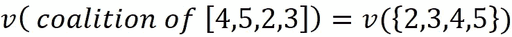*

*所以，对于每一个排列 ***P*** ，我们需要先计算{ *i* }之前加入的玩家联盟的价值。姑且称这个联盟为*。然后我们需要计算{ *i* }加 ***S*** 形成的联盟的价值，我们把这个联盟叫做***S***U {*I*}。现在由 *ϕᵢ* 表示的玩家{ *i* }的贡献是:**

**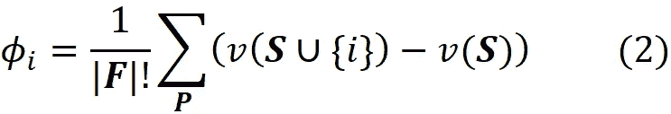**

**大联盟 ***F*** 的排列总数是| ***F*** |！(这里| ***F*** |表示集合 ***F*** )的元素个数，所以我们用贡献的总和除以那个，取{ *i* }(图 3)的贡献的平均值。**

****

**图 3(来源:图片由作者提供)**

**如图 3 所示，一些排列具有相同的贡献，因为它们的联盟 ***S*** 和***S****U*{*I*}是相同的。所以，一个更简单的计算情商的方法。1 是我们只计算贡献的不同值，并将它们乘以它们被重复的次数。要做到这一点，我们需要计算出每个联盟可以形成多少种排列。设***f***-{*I*}为不包括玩家{ *i* }的所有玩家的集合， ***S*** 为***f***-{*I*}(***s****⊆***的联盟之一例如对于 ***F*** ={1，2，3，4，5}和{ *i* }={3}，我们有******

**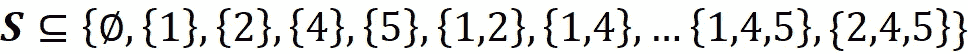**

*****S*** 中的元素个数用| ***S*** |，我们可以有| ***S*** |！这些元素的排列。比如说如果 ***S*** ={1，2}那么| ***S*** |=2 而我们有 2！=2 个排列:[1，2]和[2，1](图 4)。我们也知道从 ***S*** 形成的每一个排列的价值是*v*(***S***)。现在我们在从 ***S*** 形成的每一个排列的末尾加上玩家{ *i* }。所得排列的价值是*v*(***S****U {*I*})因为它们都属于联盟***S****U {*I*}。集合 ***F*** 有|***F***|-|**|*S***|-1 剩余元素不包括***S***U {*I*}可以加在 ***S* 后面的元素所以，有(|***F***|-|***S***|-1)！将它们添加到***S***U {*I*}的方法。******

**例如，在前面的示例中， ***F*** 的其余元素是{4}和{5}。所以我们有(|***F***|-|***S***|-1)！= (5–2–1)!=使用这些剩余元素组成大联盟的 2 种方式。这样一来，我们就有了 ***S*** ！(|**F|-|**S|-1)！形成一个 ***F*** 的排列的方法，其中{ *i* }在一个 ***S*** 的排列之后，其余的玩家在{ *i* }之后(图 4)。******

****

**图 4(来源:图片由作者提供)**

**{ *i* }对每个排列的总增益的贡献为:**

**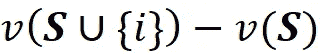**

**并且{ *i* }对所有这些排列的总增益的总贡献是**

**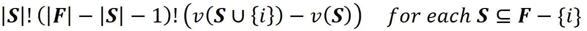**

**到目前为止，我们已经涵盖了 ***F*** 中一个可能的联盟 ***S*** 的排列，并计算了{ *i* }对其总收益的总贡献。现在我们可以对其他联盟***F***-{*I*}重复同样的过程，得到{ *i* }在 ***F*** 所有排列中的贡献总和:**

**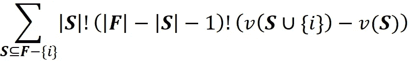**

**最后，我们知道我们有| ***F*** |！排列为 ***F*** 。所以{ *i* }对 ***F*** 所有排列的总增益的平均贡献可以通过将前一项除以| ***F*** |！**

**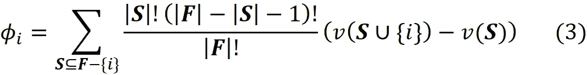**

**这里 *ϕᵢ* 称为元素{ *i* }的 *Shapley 值*，它是{ *i* }在 ***F*** 所有排列中的平均贡献。这是玩家{ *i* }对 ***F*** 中所有玩家总收益的数学公平份额。正如我们之前所展示的，每个联军*，都能制造*！(|***F***|-|***S*|-1)！排列。由于排列总数是| ***F*** |！，我们可以写:******

**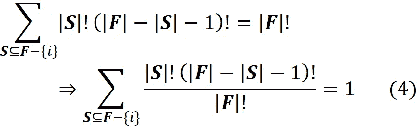**

**Shapley 值应该具有以下属性:**

**1- *效率*:所有玩家的贡献总和应该给出总收益:**

**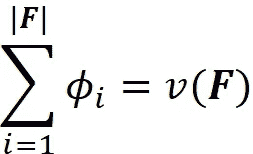**

**1- *对称*:如果 *i* 和 *j* 是这样的*v*(***s***∩{*I*})=*v*(***s***∩{*j*这意味着，如果两个玩家在每个可能的联盟中增加相同的收益，那么他们应该有相同的贡献。**

**2- *哑元*:如果 *i* 是这样的:对于每一个不包含 *i* 的联盟 *S* ，那么 *ϕᵢ* = 0。这意味着，如果一个玩家没有给任何可能的联盟增加任何收益，那么它的贡献为零。**

**3- *可加性*:假设 *u* 和 *v* 是一个游戏的两个不同的特征函数。设其中玩家 *i* 的贡献分别为 *ϕᵢ* ( *u* )和 *ϕᵢ* ( *v* )(此处 *ϕᵢ* ( *u* 指 *ϕᵢ* 是 *u* 的函数)。然后我们有*ϕᵢ*(*u*+*v*)=*ϕᵢ*(*u*)+*ϕᵢ*(*v*)。让我们通过一个例子来阐明这个性质。假设一个员工团队从事两个不同的项目，他们对每个项目的总回报和贡献是不同的。那么如果我们把这些项目组合起来，一个员工在组合项目中的贡献就是他对每个项目贡献的总和。**

**我们可以很容易地证明方程 3 中的 Shapley 值满足这些性质。**

**证明( ***可选*** ):**

*   **如果对于每一个联盟 ***S*** ，我们有*v*(***S***)=*v*(***S***∩{*I*})那么我们得到:**

**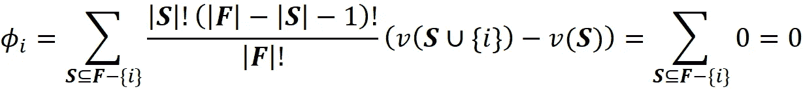**

**所以，他们有虚拟财产。它们也满足效率特性。从等式 2 我们知道:**

**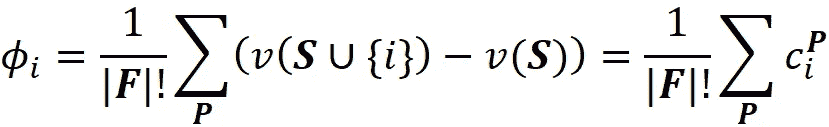**

**其中*c****ᵖ****ᵢ*表示{ *i* }对排列 ***P*** 总增益的贡献。现在假设这个排列的元素是:**

**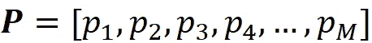**

**于是我们有了|***F***| =*M*。我们可以计算出*c****ᵖ****ᵢ*各个元素的值:**

**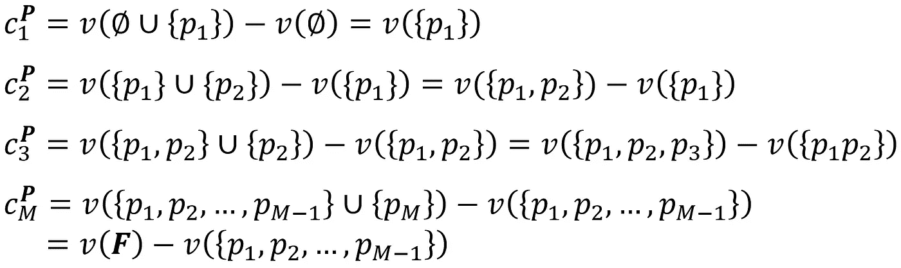**

**现在如果我们把所有玩家的*c****ᵖ****ᵢ*的值相加，那么每个*c****ᵖ****ᵢ*中的第一项就取消了 *c* ***ᵖ*****

**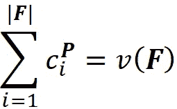**

**因此，对于每个排列，所有参与者的贡献总和给出了大联盟的总收益。我们知道我们有| ***F*** |！排列。因此，使用等式 2，我们可以写出:**

**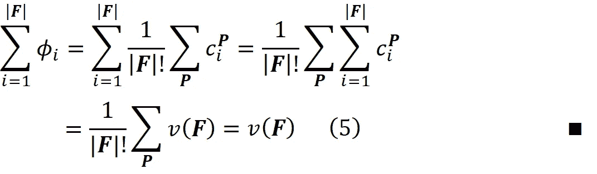**

****机器学习中的 Shapley 值****

**但是我们如何将玩家的 Shapley 值与机器学习模型的特征联系起来呢？假设我们有一个数据集，有 *N* 行和 *M* 个特性，如图 5 所示。**

**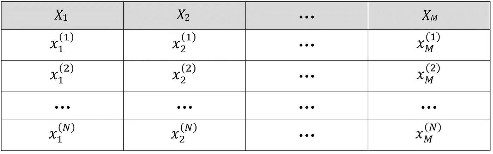**

**图 5(来源:图片由作者提供)**

**这里 *Xᵢ* 是数据集的第 *i* 个特征， *xᵢ* ⁽ *ʲ* ⁾是第 *j* 个例子中第 *i* 个特征的值， *y* ⁽ *ʲ* ⁾是第 *j* 行的目标。这些特征的值可以形成一个*特征向量*，它由一个具有 *M* 个元素的行向量表示:**

**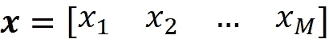**

**这里我们有 *X* ₁= *x* ₁、 *X* ₂= *x* ₂、… *X_M* = *x_M* (线性代数中向量通常被认为是列向量，但在本文中，我们假设它们是行向量)。特征向量也可以是数据集的第 *j* 行。在这种情况下，我们可以写:**

**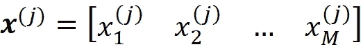**

**也可以是数据集中不存在的测试数据点(本文中粗体小写字母(像 ***x*** )指的是向量。粗体大写字母(如 ***A*** )指矩阵，小写字母(如 *x* ₁)指标量值)。数据集的特征用大写字母表示，如( *X* ₁).一对(***x***⁽*ʲ*⁾， *y* ⁽ *ʲ* ⁾)被称为这个数据集的训练例子。现在我们可以使用一个模型来学习这个数据集:**

**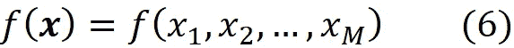**

**该函数采用特征向量 ***x*** ，这意味着它应用于 ***x*** 的所有元素。例如，对于线性模型，我们有:**

**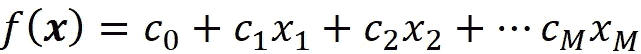**

**所以，对于 ***x*** 的每个值，模型预测为*f*(***x***)。如前所述，这个特征向量 ***x*** 可以是训练数据集的实例之一，也可以是训练数据集中不存在的测试数据实例。例如，使用此线性模型，我们可以预测其中一个训练示例的目标:**

**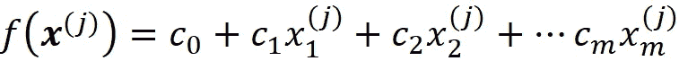**

**所以，*f(****x***⁽*ʲ*⁾*)*为数据集第*j*-行的模型预测，与*f(****x***⁽*ʲ*⁾*)*和*y*⁽*ʲ*之差****

*我们可以假设一个机器学习模型是一个联盟博弈， *M* 特征就是这个博弈中的 *M* 玩家。但是这个游戏的特色功能应该是什么呢？我们第一个猜测可以是*f*(***x***)本身。但请记住，一个特征函数应该满足等式 1，这意味着当我们没有球员时，总增益为零。我们没有特色(玩家)怎么评价*f*(***x***)？当一个特性不是游戏的一部分时，这意味着它的当前值是未知的，我们希望在不知道该特性的值的情况下预测模型的目标。当我们在游戏中没有特性时，意味着没有一个特性的当前值是已知的。在这种情况下，我们只能使用训练集进行预测。在这里，我们可以将训练样本的一个样本(或全部样本)的*f*(***x***⁽*ʲ*⁾)的平均值作为我们的最佳估计。所以，当我们没有特征时，我们的预测是:*

*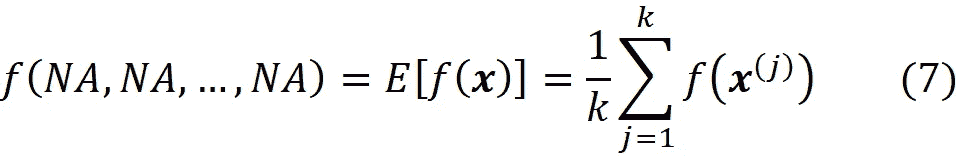*

*其中 *NA* 表示不可用的特性(所以 *f* 的参数在这里都不可用)。我们还从训练数据集( *k* ≤ *N* )中采样了 *k* 个数据实例(特征向量)。现在我们将大联盟的特征函数定义为:*

*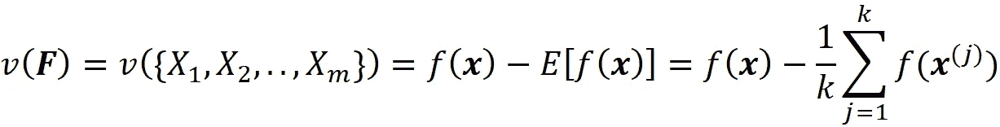*

*如果我们没有特征，那么使用等式 7 我们得到:*

*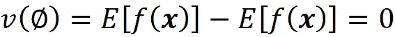*

*这个特征函数现在满足等式 1，可以给出大联盟***f***= {*x*₁*，X* ₂ *，…，X_M* }。但是我们还需要***F***-{*I*}的任何一个联盟的价值，才能够使用等式 3。我们如何将函数 *f* 应用于其原始参数的子集？我们可以用两种方法来做这件事。首先，我们可以仅在原始特征的子集上重新训练相同的模型(具有相同的超参数)。例如，如果联盟 ***S*** 包含了特性:*

**

*然后我们需要这些特征的 *f* 的临界值，称为*f****【ₛ***(***xₛ***):*

*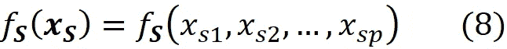*

*这里 ***x* ₛ** 是一个向量，只包含*中出现的特性的值(请注意，一个联合是由特性组成的，但是一个函数取这些特性的值)。我们既可以对联盟中存在的特征 ***S*** 重新训练同类型的模型，得到*f***ₛ**(***x*ₛ**)，也可以使用原始函数 *f* 计算 *f* **ₛ** 。当一个特征在 ***S*** 中不存在时，那么就意味着我们不知道它的当前值，可以用 *NA* 代替(不可用)。**

**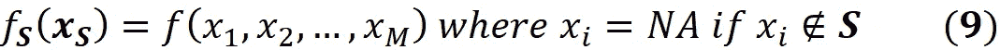**

**比如说如果 ***F*** ={X₁ *，X* ₂ *，X* ₃ *，X* ₄ *，X* ₅}，以及联军***s***= {*x*₁*，X* ₂ *，X* ₅}，那么我们所以:**

**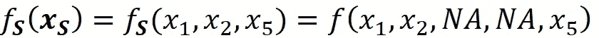**

**这里我们假设用 *f* 表示的模型可以处理 *NA* 值。因此，这个联盟的价值是:**

**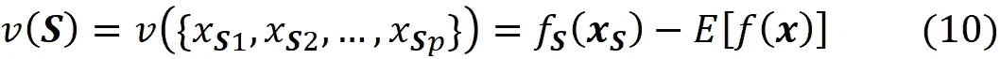**

**其中*f****ₛ***(***x*ₛ**)*是通过对联合*中存在的特征重新训练模型或者从等式 9 中获得的。例如对于***f***= {*x*₁*，X* ₂ *，X* ₃ *，X* ₄ *，x*₅}**和*s***= {*x*₁*，X* ₂****

**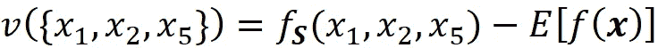**

**现在我们可以简单地使用等式 3 和等式 10 来计算特征 *Xᵢ* 的 Shapley 值:**

**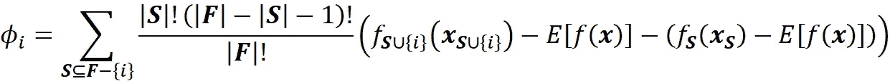**

**请注意，在这个等式中，我们应该将*ϕ*t124】ₓt126】ᵢ写成与等式 3 一致。然而，为了简单起见，我们使用ϕᵢ。所以，在这个等式中， *i* 表示第 *i* 个特征( *Xᵢ* )。通过简化前面的等式，我们得到:**

**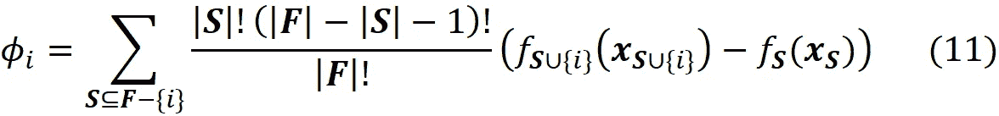**

**其中*f*ₛ(***x*ₛ**)*为联盟中出现的特征*f*s*，*f _***s**∩{*I*}(***x _ s*如果我们使用 Shapley 值的效率属性(等式 5)，我们可以写出:********

*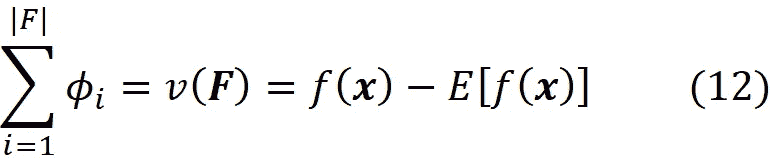*

*这意味着所有特征的 Shapely 值的总和给出了具有当前特征值的模型的预测和所有训练示例的模型的平均预测之间的差异。*

***模型解释的数学描述***

*在讨论 SHAP 值之前，我们需要一个像 SHAP 这样的解释者模型的数学描述。设 *f* 为待解释的原始模型，定义为:*

*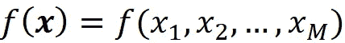*

*因此，模型采用特征向量 ***x*** 和*f*(***x***)作为该特征向量的模型预测。该特征向量可以是训练数据集的实例之一(***x***⁽*ʲ*⁾)或者是训练数据集中不存在的测试特征向量。现在我们创建一组*简化输入特征*来显示特征向量中的特征是否存在:*

**

*向量***x***’称为简化特征向量。每个 *x'ᵢ* 都是一个二元变量，显示其对应的特征 *Xᵢ* 是否在特征向量中被观察到( *x'ᵢ* =1)或者是未知的( *x'ᵢ* = 0)。例如，如果你的特征向量是*

**

*然后*

*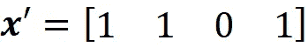*

*我们可以假设有一个映射函数将 ***x*** 映射到 ***x*** :*

*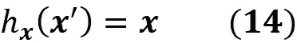*

*所以，它取简化的特征向量***x***’并返回特征向量 ***x*** :*

*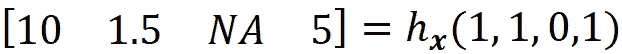*

*解释器是一个可解释的模型 *g* ，它采用了 *M* 个二元变量:*

*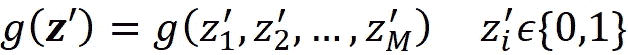*

*其中 *M* 是等式 13 中简化输入特征的数量。行向量***z***’表示 ***x*** 的可用值的联合。所以 ***x*** 的零元素在 ***z*** 中总是零，而 ***x*** 的 1 元素在 ***z*** 中可以是 1 也可以是 0。我们把***z***a*联军向量*。例如，如果特性的值为:*

*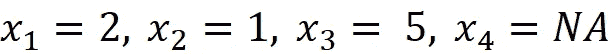*

*那么特征向量是:*

*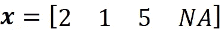*

*简化的特征是:*

*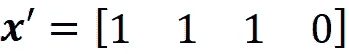*

*现在一个值为 ***z*** 比如*

*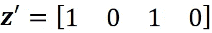*

*简单的代表联盟***s***= {*x*₁， *X* ₃}既然只有这两个特征在 ***z*** 中有对应的 1。我们还可以断定， ***x*** '代表大联盟***f***= {*x*₁， *X* ₂， *X* ₃}，所以 ***x*** '也可以认为是联盟向量。如前所述，对于单个特征向量，我们希望解释器模型的预测接近原始模型的预测。假设我们从一个联盟向量***z****’*开始，这个向量非常接近大联盟***x***’。 *g* 对于这个联盟的预测，简单来说就是*g*(***z***’)。但是怎么才能用***z***’得到 *f* 的预测呢？问题是 *f* 取的是特征向量，而不是联合向量。所以我们需要映射函数 *h* ***x*** 来为 ***z*** 找到对应的特征值。这里*h****ₓ***(***z***’)返回***z***’中出现的特性的对应值，其他特性的值将为 *NA* 。例如，如果我们有*

**

*然后*

**

**f* 对 ***z*** 中出现的特征的预测为:*

**

*我们还将 *f* ***ₓ*** 定义为 ***z*** 中出现的特征的 *f* 的临界值。所以我们可以写:*

**

*请注意，在等式 8 中， *f* ***ₛ*** 表示联合 ***S*** 中存在的特征的 *f* 的边缘值。不过，这里我们关注的是***z***’而不是联盟，*f**表示 *f* 对于***z***’中出现的特性的边际值。在这个例子中，我们用 ***z*** 代表联军***s***= {*x*₁， *x* ₃}.所以我们也可以写:**

****

**我们希望 *f* 的预测值(即*f*(***z***)与 *g* (即*g*(***z***’)非常接近，以确保 *g* 模仿*f*的相同过程总而言之，我们想要**

****

**能够声称 *g* 能够解释 *f* 。**

**我们可以根据 *g* 对解释方法进行分类。*附加特征归因方法*有一个解释器模型，它是二元变量的线性函数:**

****

**其中 *ci* 是一些常数。正如我们后来看到的，SHAP 属于这一类方法。所以我们想用***z***’来表示方程 11。设 ***x*** 为特征向量，***x***’为其简化特征向量。我们可以证明，Shapley 值可以表示为:**

****

**其中 *ϕᵢ* ( *f* ， ***x*** )强调的是沙普利值是 *f* 和 ***x*** 的函数。这里我们考虑***x***’的所有可能的联盟向量(对应于 ***x*** 的所有联盟)。对于每个联合向量***z***’，我们计算特征 *i* 的贡献。| ***z*** '|是 ***z*** '(对应大联盟的大小)中非零项的个数，|***x****'*|是 ***x*** '(大联盟的大小)。***z***' \*I*表示对应的联盟不包含特征{ *i* }。所以，***z***' \*I*表示将 ***z*** '的第 *i* 个元素设置为 0(***z***'*ᵢ*= 0)得到的联合向量。例如，如果 3 代表第三个特征 *x* ₃，那么我们可以写成:**

****

**很容易证明等式 11 和等式 18 是等价的。**

**证明( ***可选*** ):首先注意，等式 11 中的| ***F*** |等于等式 18 中的|***x****'*|因为它们都是指特征总数， *M* 。记住等式 11 中的每个联盟 ***S*** 不包括特征 *i* 自***s****⊆****f***-{*I*}。我们很容易看到，方程 11 中的每个联盟 ***S*** 在方程 18 中都有对应的值***z***' \*I*。例如，如果我们有:**

****

**然后我们得到:**

****

**而***z***' \*I*为****S****的对应值为【1 1 0 1】。****

******

***通过替换等式 11 中的这些值，该值的对应项 ***S*** 为:***

****

**在等式 18 中，这个值**’*的对应项是:***

****

**现在，根据等式 15，我们得出结论，等式 19 和等式 20 给出了相同的结果。一般来说，对于等式 11 中的每个联盟 ***S*** ，我们都有一个***z***' \*I*即来代表它。因此， ***z*** 也代表***S***∩{*I*}， 并且我们可以将*f*t30】ₛ(***x*ₛ**)和*f _****s***∩{*I*}(***x _ s***∩{*I*})替换为 *f* **另外，| ***S*** |和| ***F*** |分别等于| ***z*** '|-1 和| ***x*** '|。因此，等式 11 中的每一项(对于不包括 *i* 的联合 ***S*** )在等式 18 中具有相应的项，其中联合向量***z***’包括 *I* ，并且这两项给出相同的值:****

****

**但这只包括等式 18 中包含{ *i* }的**z。在等式 18 中，我们还可以有不包括{ *i* }的 ***z*** 。对于一个不包括{*’的联合向量，我们可以写成*f****ₓ***(***z***’)=*f****ₓ********

****

**它没有给方程 18 增加任何东西。因此，我们得出结论，等式 11 和等式 18 是等价的，并给出相同的结果。∎**

**需要注意的是，在等式 18 中，空联盟的联盟向量(***z***' =[0 0…0])不包括在求和中。对于这个联合向量，我们有:**

****

**这是没有定义的。即使能计算出来，这个联盟也不会增加任何东西**

****

**还请注意，在介绍 SHAP 方法的原始论文中，等式 18 的写法不正确(参见[1]中的等式 8)。等式 11 是经典的 Shapley 值等式，在这个等式中，我们只关注可用的特性。等式 18 引入了缺失的概念。这里的大联盟向量 ***x*** '可以有一些缺失值，其中 ***x*** ' *ᵢ* =1。等式 18 具有一些有趣的性质，描述如下:**

****属性 1(局部精度)****

**设*g*(***x***’)为解释模型，定义为**

****

**其中*ϕ*₀=*e*[*f*(***x***)】、 *ϕᵢ* 为 *f* 的沙普利值。假设我们有一个特征向量 ***x*** ，它的简化特征向量是 ***x*** '，那么我们有***x***=*h****【ₓ***(***x***')。然后基于这个性质，预测的 *g 为****x****'*匹配原模型的预测 *f* 为***x*** 。所以，我们可以写:**

****

**证明( ***可选*** ):假设|***f***| =*m*(特征数)，并且所有特征都可用( *x* ' *ᵢ* =1 对所有 *i* )我们可以用等式 12 来写:**

****

**其中*ϕ*₀=*e*[*f*(***x***)】。∎**

**如前所述，等式 11 仅考虑可用特征。因为等式 12 是从该等式导出的，所以它仅包括可用特征的 Shapley 值。例如，如果最后一个特征不可用，那么从等式 12 我们得到**

****

**然而，这个结果仍然与等式 22 一致，因为对于最后一个特征，我们有 *x* '_ *M* =0。**

****属性 2(缺失)****

**缺失要素的 Shapley 值应该为零。**

****

**证明( ***可选*** ):这不是方程 11 中经典 Shapley 值的必要条件。因为它不包括缺失的功能。然而，如果我们使用公式 18 计算 Shapley 值，那么我们可以证明它满足这一特性。考虑从 ***x*** 导出的所有联盟向量***z***’。如果 *x* ' *ᵢ* =0，那么 *z* ' *ᵢ* =0。所以，对于这些联合向量我们得到***z***' \*I*=***z***'，我们可以写出:**

****

****属性 3(一致性)****

**一致性意味着改变原始模型来增加一个特征对模型的影响将永远不会减少它的 Shapley 值。从数学上讲，如果我们有一个单一的特征向量 ***x*** ，以及两个模型 *f* 和*f*’(两个模型 *f* 和*f*’都是 ***x*** 的函数)，那么**

****

**对于所有输入***z***’，则**

****

**请记住，在等式 18 中**

****

**与特征 *Xᵢ* 对预测的贡献成比例。因此，如果将模型从 *f* 改为*f’*，并且得到特征 *Xᵢ* 对预测 ***x*** 增加的更高贡献(或保持不变)，那么 *Xᵢ* 的 Shapley 值永远不会减小。**

**证明( ***可选*** ):还是那句话，很容易说明等式 18 满足这个性质。因为我们对于两个模型具有相同的特征向量 ***x*** ，所以我们将具有相同的***x***’。现在对于各联军的矢量**【我们有****

******

***所以，通过为所有的*增加这些术语，我们得到:****

******

***现在我们已经熟悉了 Shapley 值及其属性，我们可以看到它们如何解释机器学习模型。假设我们有一个模型 *f* ，一个特征向量 ***x*** 。我们将模型 *g* 定义为:***

****

**其中*ϕ*₀=*e*[*f*(***x***)】,*ϕᵢ*为 *f* 的 Shapley 值， ***x*** 为**x**的简化特征向量(所以 ***x*** = *模型 *g* 是线性的，所以是可解释的。另外基于性质 1，*g*(***x***')=*f*(***x***)，因此 *g* 可以完美地模拟 *f* 进行单次预测*f*(***x***)，并且可以作为*的解释器模型可以看出，对于附加特征归属方法，上面定义的模型 *g* 是遵循等式 17 并且满足性质 1、2 和 3 的唯一可能的解释器模型。总之，Shapley 值可以提供线性模型的系数，该系数可以用作任何机器学习模型的完美解释器。****

**从沙普利值到 SHAP 值**

Shapley 值具有坚实的理论基础和有趣的性质，然而，在实践中，计算它们并不容易。为了计算它们，我们需要计算等式 18 中的*f****ₓ***(***z***’)或等式 11 中的*f***ₛ**(***x*ₛ**)。记住这一点


所以，计算*f****ₓ***(***z***’)或*f***ₛ**(***x*ₛ**)意味着我们需要计算*f*(***x***)带有一些 ***z* 中没有的缺失特征问题是大多数模型不能处理缺失值。比如在线性模型中，我们需要 *xᵢ* 的所有值来计算*f*(***x***)。所以，我们需要一种方法来处理*f*(***x***)中缺失的值。如前所述，对于每个联盟 ***S*** ， ***x*** 的缺失元素是 ***S*** 中不存在的特征值。为了计算*f*t60】ₛ**(**t63】xₛ**，我们假设:


这里*e*[*f*(***x***)|***x*ₛ**]是*f*(***x***)的期望值，以*中出现的特性为条件。同样，我们可以写:*

**

*使用等式 23 或等式 24 中的条件期望计算的 Shapley 值被称为 *SHAP* (SHapley 加法解释))*值*。因此，为了从等式 11 获得 SHAP 值，我们可以写为:*

**

*为了从等式 18 计算 SHAP 值，我们可以写出:*

**

*SHAP 是一种附加特征归因方法，其中我们有一个线性解释器模型。在本文中，我们讨论两种方法来计算方程 23 或方程 24 中的条件期望。第一个在本节中讨论，第二个适用于树结构数据的将在后面讨论。*

*设**表示联军 ***S*** 的补充。所以，**表示*中不存在的部分原始特征。现在我们可以用全概率定律来写:******

******

***其中 *f* ( ***x_S̅*** ， ***x* ₛ** )表示 *f* 的部分参数属于 ***x* ₛ** ，其余参数属于 ***x_S̅*** 。当然， ***x* ₛ** 或者 ***x_S̅*** 的参数不一定是连续排列的。*p*(***x_s̅***|***x*ₛ**)是 ***x_S̅*** 给定 ***xₛ*** 的条件概率。所以，要计算*f***ₛ**(***x*ₛ**)的值，我们需要条件概率*p*(***x_s̅***|***x*ₛ**)。不幸的是，我们大部分时间都不知道这个分布。因此在 SHAP，我们假设这些特征是相互独立的，所以:***

****

**将该等式代入等式 27，我们得到:**

****

**因为我们有离散的数据点，我们可以用一个和来近似这个积分。我们从训练数据集( *k* ≤ *N* )中抽取 *k* 个数据实例(特征向量)，并将它们分别称为***x***⁽*ʲ*⁾.每个数据实例中的特征或者属于 ***S*** 或者属于 ***S̅*** :**

****

**然后，对于每个数据实例，我们将出现在*中的特征值替换为它们在 ***x* ₛ** 中的对应值，并对该数据实例进行预测:***

****

**现在，前面的积分可以用这些预测的平均值来近似:**

****

**图 6 显示了计算该积分的示例。同样，我们可以写:**

****

**其中*是在 ***z*** 中具有非零索引的特征集合。图 6 显示了这种方法的一个例子。这里我们有一个模型 *f* ( *x* ₁、 *x* ₂、 *x* ₃、 *x* ₄、 *x* ₅)其中***x*ₛ**= {*x*₁、 *x* ₃、 *x* 所以***x_s̅***= {*x*₂、 *x* ₅}和特征 *X* ₂和 *X* ₅是 ***x*** 中的*娜*。特征向量 x 的形式为***x***=【*x*₁*纳*x₃*x*₄*纳*。为了计算*f*(***x***)，我们需要缺失特征的值，因此我们从训练数据集的样本中借用它们的值。对于该样本的第 *i* 个数据实例，我们将特征向量***x***(*x*₂， *X* ₅)的缺失值替换为该实例中的对应值( *x* ₂^( *i* )， *x* ₅^( *i* ***x*ₛ**)=*f*(*x*₁，*x*₂*^*(*I*)， *x* ₃， *x* ₄，*x*₅*^*( 因此，对于每个数据实例，我们现在都有一个预测。最后我们取这些预测的平均值，报为我们对*f*(***x***)的估计。现在，我们可以使用公式 29 和公式 30 给出的近似值来计算公式 25 或公式 26 中的 SHAP 值。***

****

**图 6(来源:图片由作者提供)**

**请注意，等式 30 也与等式 7 一致。当 ***z*** 的所有元素都为零时， ***S*** 成为空集，所以我们只对训练集的 *k* 数据实例取模型预测的平均值。**

****线性 SHAP****

**假设我们的预测模型 *f* 是线性回归模型:**

****

**其中 *x* ₀=1，特征 *Xᵢ* 、 *i* = 1、…、 *M* 相互独立。现在我们可以证明 SHAP 值由以下等式给出:**

****

**其中 *k* 是我们用来计算 SHAP 值的训练数据集样本中的数据实例数量。你可以参考附录中的证明。我们也可以直观地驱动这个方程。在线性模型中，特征 *Xᵢ* 对*f*(**t20】xt22)的贡献简单来说就是 *cᵢxᵢ* 。所以我们可以写:****

****

**然而，等式 22 增加了对 Shapley 值的约束:**

****

**所以我们减去**

****

**从方程 31 中的 *cᵢxᵢ* 来满足方程 22。如果我们将等式 31 中的 Shapley 值相加，我们会看到结果与等式 22 一致:**

****

****用 Python 计算 SHAP 值****

****线性 SHAP****

**作为我们的第一个例子，我们使用 Python 来计算虚拟数据集的线性 SHAP 值(等式 31)。我们首先定义数据集。我们只有两个填充了一些随机数的特征，目标被定义为这些特征的线性组合。这些特征是独立的。**

```
**# Listing 1# Defining the dataset
X = pd.DataFrame({'a': [2, 4, 8, 0, 3, 6, 9],
  'b': [1, 5, 0, 7, 1, -2, 5]})
y = 5*X['a'] + 2*X['b'] + 3**
```

**然后，我们对该数据集使用线性回归模型，并计算该模型的系数，这些系数与用于定义目标的系数相同。**

```
**# Listing 2# Defining a linear model
linear_model = LinearRegression()
linear_model.fit(X, y)print("Model coefficients:")
for i in range(X.shape[1]):
   print(X.columns[i], "=", linear_model.coef_[i].round(4))**
```

**`Output:`**

```
**Model coefficients:
a = 5.0
b = 2.0**
```

**最后，我们使用等式 31 来计算该数据集第一个示例的 SHAP 值:**

```
**# Listing 3shap_values = ((X[:1] — X.mean()) * linear_model.coef_)
shap_values_table = shap_values.T
shap_values_table.columns = ['SHAP_value']
shap_values_table**
```

****

**所以，我们有:**

****

**其中 1 和 2 分别指特征 *a* 和 *b* 。**

****使用 SHAP 库的线性 SHAP****

**我们还可以使用 SHAP 库来计算清单 2 中定义的线性模型的 SHAP 值:**

```
**import shap
explainer = shap.LinearExplainer(linear_model, X)
shap_values = explainer.shap_values(X[:1])
shap_values**
```

**`Output:`**

```
**array([[-12.85714286,  -2.85714286]])**
```

**SHAP 图书馆中的类`LinearExplainer()`采用训练模型和训练数据集。这个类中的方法`shap_values()`获取要解释的行的数组，并返回它们的 SHAP 值。请注意，这里我们得到了与清单 3 相同的结果。**

****精确的 SHAP 值****

**在下一个示例中，我们计算具有特征相关性的线性模型的 SHAP 值。所以，我们不能用等式 31。相反，我们使用等式 11，并使用所有可能的联合来计算 SHAP 值。这里我们使用`scikit-learn`图书馆中的波士顿数据集:**

```
**# Listing 4d = load_boston()
df = pd.DataFrame(d['data'], columns=d['feature_names'])
y = pd.Series(d['target'])
X = df[['LSTAT', 'AGE', 'RAD', 'NOX']]
X100 = X[100:200]linear_model2 = LinearRegression()
linear_model2.fit(X, y)**
```

**波士顿数据集有 13 个特征，但我们只选择其中的 4 个(`LSTAT`、`AGE`、`RAD`、`NOX`)。我们还对该数据集的 100 行进行采样，以估计等式 29 中的*f***ₛ**(***x*ₛ**)(因此 *k* =100)。我们将这些行存储在`X100`中。然后我们用这个数据集来训练一个线性模型。现在我们需要定义一些函数来计算 Python 中的 SAHP 值:**

**函数`coalition_worth()`用于计算联盟的价值。它需要一个模型、一个训练数据集的样本(`X_train`)、一个数据实例(`x`)和一组联盟(`coalition`)。这里，在等式 11 中，coalition 代表 ***S*** 。这个函数用联合集中给定的值替换`X_train`的列，然后它使用模型来预测所有这些行的目标。最后，取所有这些预测的平均值，并将其作为*f*t35】ₛ(***x*ₛ**)的估计值返回。**

**函数`coalitions()`返回一个数据实例的所有联合的集合，不包括特征`col`。所以，它计算等式 11 中***F***-{*I*}的所有联盟，其中 col 表示特征 *i* 。**

**函数`coalition_contribution()`计算等式 11 中每个联盟的贡献(等式 11 中求和的每一项)。这里我们用了这样一个事实:**

****

**因此`scipy`中的函数`comb()`被用于计算二项式系数:**

****

**最后，函数`calculate_exact_shap_values()`获取待解释的特征向量(`X_explain`)并计算其中每个特征向量的 SHAP 值。它将每个联盟的贡献相加，以计算特征向量中每个特征的 SHAP 值。现在，我们可以使用该函数，通过数据集行的样本来计算 Boston 数据集第一行的 SHAP 值(`X100`):**

```
**# Listing 6calculate_exact_shap_values(linear_model2, X100, X.iloc[0])**
```

**`Output:`**

```
**(22.998930866827823,
 [[7.809214247585507,
   -0.7308440229196315,
   0.1290501127229501,
   0.23758951510828266]])**
```

****使用 SHAP 库计算 SHAP 值****

**`shap`库中的类`Explainer()`接受模型预测函数(不仅仅是模型)和训练数据集，方法`shap_values()`返回 SHAP 值。如果我们不传递特定算法的名称，它会根据给定的模型和训练数据集，尝试找到计算 SHAP 值的最佳算法。这里我们将它用于清单 4 中定义的同一个模型。**

```
**explainer = shap.Explainer(linear_model2, X100)
shap_values = explainer.shap_values(X.iloc[0:1])
shap_values### Output:
array([[ 7.80921425, -0.73084402,  0.12905011,  0.23758952]])**
```

```
**explainer.expected_value### Output:
22.998930866827834**
```

**这里，数组 shap_values 给出了 *ϕ* ₁到 *ϕ_M* 的值。 *ϕ* ₀的值存储在 Explainer 的 expected_value 字段中。这里我们得到了与清单 6 中的`calculate_shap_values()`几乎相同的 SHAP 值。请务必注意，Explainer 类会自动对 100 行训练数据进行采样(如果行数大于 100)，并使用这些数据来计算 SHAP 值。因此，如果我们使用超过 100 行的训练数据集，`Explainer`的输出将不再匹配`calculate_exact_shap_values()`的输出:**

```
**explainer = shap.Explainer(linear_model2, X[:150])
shap_values = explainer.shap_values(X.iloc[0:1])
shap_values### Output:
array([[ 8.88370884e+00, -2.97655621e-01,  1.17561972e-01,
        -1.48202335e-03]])**
```

```
**calculate_exact_shap_values(linear_model2, X[:150], X.iloc[0])### Output:
(22.521908424669917,
 [[7.993180897252836,
   -0.11946396867250808,
   0.11973195423751992,
   -0.07141658816282939]])**
```

****内核 SHAP****

**要使用公式 11 或公式 18 计算模型的 SHAP 值，我们需要计算所有可能的联合。如前所述，对于 *M* 特征，可能联盟的总数是 2*。当然，在等式 25 中我们计算了***F***-{*I*}的所有联盟。所以，我们需要计算每个 SHAP 值的实际联盟数是 2 *ᴹ* ⁻，对于 *M* 特征的时间复杂度是***

**

*对于每个联盟，我们需要估计*f*t30】ₛ(***x*ₛ**)和*f _***t39】s**∩{*I*}(***x _ s***∩{*I*})*使用所以该算法的时间复杂度为*o*(*km*2*ᴹ*)。**

**基于这一结果，当 *M* 增加时，可能联盟的数量呈指数增加，并且当我们具有多个特征时，使用这些方程来寻找 SHAP 值在计算上变得难以处理。核 SHAP 是一种近似方法，可以用来克服这个问题。这种方法首先是由 Lundberg 和 Lee [1]提出的。**

****石灰****

**为了理解内核 SHAP，我们应该首先熟悉另一种称为 LIME(本地可解释模型不可知解释)的模型不可知解释方法。LIME 是在 SHAP 之前开发的，它的目标是为一个分类器确定一个可解释的模型，这个模型在本地是忠实的。假设您有一个模型 *f* ( ***x*** )，并且您想要为其找到最佳可解释模型 *g* ( ***z'*** )(记住 *g* 是联合向量 ***z*** ')。设 ***x*** 为待解释的特征向量， ***x*** 为其联盟向量。**

**现在我们需要在 **x** 附近找到一些随机联盟向量。例如，我们可以选择 ***x*** 的一些非零分量，以 0.5 的概率将它们从 1 变为 0，以产生联盟向量***z***’。结果，我们在***x***’附近得到了一些联合向量。我们一般称这些联合向量中的每一个为***Z***’，我们称所有这些向量的集合为 ***Z*** 。我们可以假设 ***x*** '和 ***z*** '是一个*M*-维空间中的一些点(图 7)。我们可以使用映射函数 *h* ***ₓ*** 找到特征空间中每个***z***’对应的向量(图 7):**

****

**我们需要对***x***’和每个***z***’之间的距离有一个量化的度量。于是，我们将函数π*(***z***’)定义为***x***’与***【z***’之间距离的度量。这个函数将联合向量***z***’映射到一个非负实数({0，1} *ᴹ* → R≥ 0)。π*(***z***’)应该增加为***z***‘越来越接近***x***’。****

****

**图 7(来源:作者图片)**

**现在假设我们有一组可解释的讲解者模型 ***G*** ，我们想为*f(****x****)*其中(*G*∈***G***)找到最准确的讲解者模型 *g* 。根据等式 16，我们需要:**

****

**因此，我们可以定义一个损失函数 *L* ( *f，g，*π*)*，它与*f*(***z***)和*g*(***z****’*)之间的距离成正比我们希望*g*(***z****’*)非常接近*f*(***z***)当***z***’非常接近***x***’。但是 ***Z*** 中的一些点可能与***×的***’不是很接近，所以我们需要为它们增加一个惩罚项。由于π*是***【x***’和***【z***’之间距离的度量，我们可以将其作为参数添加到损失函数中。例如，我们可以将损失函数定义为:*****

****

**通过将π**添加到损失函数中，我们为*中远离*的点添加更高的惩罚，并且更近的点对于最小化变得更重要。因此，损失函数决定了解释函数 *g* 在非常靠近 ***x*** 的点 ***z*** 【处】近似 *f* 的程度。现在我们需要在***【G***(我们想要尝试的所有可解释函数的集合)中找到函数 *g* ，最小化这个损失函数。******

**我们也喜欢更简单和更易解释的函数，所以我们让*ω(g)*作为解释函数 *g* 的复杂性(相对于可解释性)的度量。比如对于线性模型，*ω(g)*可以定义为非零权值的个数，或者对于决策树，可以定义为树的深度。因此*ω(G*)随着 *g* 变得更简单从而更容易理解而减小，我们应该在 ***G*** 中寻找一个函数 *g* 来最小化下面的目标函数:**

****

**这相当于解决这个最小化问题:**

****

**现在我们可以用下面的定理来定义核 SHAP 方法:**

****定理 1** 。假设我们有一个具有 *M* 个特征的特征向量 ***x*** 和一个以 ***x*** 为输入的模型 *f* 。设 *g* 为线性模型，定义如下:**

****

**其中 *z* ' *ᵢ* 是**z**的第 *i* 个元素，是 ***x*** 的联合向量；*ϕ*₀=*e*[*f*(***x***)](模型对训练数据集的一个样本的实例的平均预测)和 *ϕᵢ* (对于 *i* > 0)是 *f* 和***的 Shapley 值当 *M* 趋于无穷大时，方程 32 的解(函数 *g* )接近方程 33 给出的函数，如果 *L* 、*ω*、π **、 *ₓ*** 定义为:*****

****

**其中| ***z*** '|是 ***z*** '中非零项的个数。**

**这个定理的证明在附录中给出。有趣的是，在介绍 SHAP [2]的原始论文中，这个定理没有被正确证明(更多细节请参考附录)。让我们看看如何在实践中使用这种方法。我们假设我们有一个具有 *M* 特征的特征向量 ***x*** 。我们计算简化的特征向量***x***’。这里我们为了简单起见假设 ***x*** 中没有 *NA* s(在定理 1 中， ***x*** 可以有 *NA* 值)，那么 ***x*** 的所有元素都是 1。然后我们计算***x***’(它们也被称为***x***’)的所有可能的联合向量。***x***’的每个联合向量称为***z’****ᵢ*，是一个有 *M* 个元素的向量，其中每个元素可以是 0 也可以是 1。我们有 2 个 *ᴹ* 联盟向量，我们将所有这些联盟向量放入 2 个 *ᴹ× M* 矩阵 ***X*** :**

****

**这个矩阵叫做*联盟矩阵*。对于每个联盟向量***【z’****ᵢ*，我们可以计算出模型预测*f****ₓ****(****z****【'ᵢ】*。我们将列向量 ***y*** 定义为:**

****

**其中***【ϕ】*₀=*e*[*f*(***x***)](训练数据集样本中数据实例的预测值的平均值)。****

****最后，我们将 2 *ᴹ×* 2 *ᴹ* 对角矩阵 ***W*** 定义为:****

********

****在哪里****

********

****例如，假设特征向量为:****

********

****然后我们有:****

********

****并且联合矩阵将具有 2 =8 行:****

********

****我们有:****

****************

****根据等式 32 和等式 34，我们知道需要解决这个最小化问题，以获得 Shapley 值的估计值:****

********

****我们将对最优函数 *g* 的搜索限制为具有以下形式的线性函数:****

********

****列向量 ***c*** 定义为:****

********

****现在可以证明(详情见附录):****

********

****因此，最小化问题等价于****

********

*****g* 只是 *cᵢ* 的一个函数，所以我们不去找最小化目标函数的函数 *g* ，而是去找最小化它的向量 ***c*** 的值。函数π***ₓ***(***z***’*ᵢ*)也被称为*沙普利核权重*。基于(等式 40)，π***ₓ***(***z****'ᵢ*)的每个值就像一个重量为(*g*(***z****'ᵢ*)-*f****ₓ***(***z【z】 这也是联盟矢量***z****'ᵢ*的一个砝码，可见联盟是多么的重要。*******

***如附录所示，这个最小化问题的解决方案是:***

******

***根据定理 1，我们知道这个解是 Shapley 值的近似值:***

******

***由于*ϕ*₀=*e*[*f*(***x***)]，我们有所有的沙普利值。等式 41 中的 ***R*** 项并不依赖于一个具体的数据实例来解释，所以如果要解释多个数据实例，只需要计算一次 ***R*** 。然后，对于每个数据实例，计算新的值 ***y*** 并乘以 ***R*** 以获得 SHAP 值。***

***需要注意的是 ***X*** 中联盟向量的顺序并不重要。例如，在等式 39 中，联合向量[0 0 0]是第一行***×第一行*** ，然而，它可以是最后一行，等式 41 仍然有效(如果你看附录中定理 1 的证明，我们不对联合向量的顺序作任何假设***z***'*ᵢ*作为矩阵***×的行*它只需要拥有所有 2 个ᴹ联盟向量。*****

*****Python 中的内核 SHAP*****

***即使特征向量 ***x*** 具有一些不可用的特征，定理 1 也是有效的，但是在实践中，我们假设 ***x*** 的所有特征都可用来实现 SHAP。所以， ***x*** 的所有元素都是一，并且|***x***' | =*M*。现在让我们看看如何用 Python 实现内核 SHAP。为此，我们首先需要一个 Python 函数来计算π***ₓ***(***z****'ᵢ*)。***

***函数`pi_x()`获取一个联合向量***z****'ᵢ*(作为一个列表)，并基于等式 38 返回π***【ₓ***(***z****'ᵢ*)的值。函数`generate_colaition_vectors()`获取特征的数量(`num_features`，并为它们生成所有可能的联合向量。***

***例如:***

```
***generate_coalition_vectors(num_features)***
```

***`Output`***

```
***[[0.0, 0.0, 0.0],
 [1.0, 0.0, 0.0],
 [0.0, 1.0, 0.0],
 [0.0, 0.0, 1.0],
 [1.0, 1.0, 0.0],
 [1.0, 0.0, 1.0],
 [0.0, 1.0, 1.0],
 [1.0, 1.0, 1.0]]***
```

***现在我们需要一个函数来生成等式 37 中矩阵 ***W*** 的对角元素。这里我们有一个问题。通过看方程 38 我们看到如果|***z****'ᵢ*| = 0(当***z****'ᵢ*都为零)和|***z****'ᵢ*| =*m*(当的所有元素请记住，我们希望最小化以下目标函数(等式 40):***

******

***让我们假设第一个***z****’*₁是所有元素都为零的联盟:***

******

***让最后的联盟是所有元素是一个联盟:***

******

***我们知道，当我们没有可用的特征时，模型预测是训练数据集的样本中的实例的预测的平均值(等式 7)。所以，我们有:***

******

***我们还知道，当所有功能都可用时:***

******

***所以，对于最后一个联盟，我们有:***

******

***现在在方程 42 中，π*(***z***【'₁】是这一项的权重:****

********

****由于π***ₓ***(***z***'₁)是无穷大，我们需要这个项为零，这意味着我们应该有:****

********

****这是基于 Shapley 值的线性模型的属性(等式 22)。π*(***z***’_ 2*)的无穷大值意味着我们应该有:******

**********

*****我们还知道，随着 *M* 趋于无穷大，最小化目标函数的 *cⱼ* 的值越来越接近于 *f* 和***x*** 的 Shapley 值。因此，上面的等式只是显示了基于 Shapley 值的线性模型的属性(等式 22)。现在我们来画π***ₓ***(***z****'ᵢ*)为一个特例，其中 *M* =13。为此，我们可以使用清单 9:*****

```
**# Listing 9pi_values = [1e7]
for i in range(1, 14):
    try:
        pi_values.append(pi_x(13, i))
    except:
        pi_values.append(1e7)
plt.plot(pi_values, marker=’o’)
plt.xlabel(“$|\mathregular{z}’_i|$”, fontsize=14, weight=”bold”, 
   style=”italic”,)
plt.ylabel(“$\pi_\mathregular{x}(\mathregular{z}’_i)$”, fontsize=14, 
   weight=”bold”, style=”italic”,)
plt.ylim([0, 0.1])
plt.show()**
```

****结果如图 8 所示。我们对π*(***z***'₁)和π***ₓ***(***z***' _ 2*ᴹ*)都用了一个大常数(`1e7`而不是无穷大，以便能够把它们画出来。*****

********

****图 8(来源:图片由作者提供)****

****剧情是对称的，随着|***z****'ᵢ*|越来越接近 0 或者 *M* 、π***ₓ***(***z****'ᵢ*)增加。π的每一个值*(***z****'ᵢ*)就像是一个重量对于联军向量 ***z*** *'ᵢ.*如前所述，我们用等式 30 来估算*f**(*’)。对于 ***z*** '₁我们知道*******

********

****而对于*’_ 2*我们知道******

**********

*****这两个联合向量是最重要的，因为我们可以为它们精确计算出*f****ₓ***(***z***’*ᵢ*)的值。因此它们有无限的重量。但是对于其他联盟(***z****'ᵢ*)我们只能估计*f****ₓ***(***z***'*ᵢ*)。当联军***z****'ᵢ*越来越接近 ***z*** '₁或者***z***' _ 2*ᴹ*、π ***ₓ*** 赋予它高得多的权重。*****

****函数`generate_pi_values()`生成 ***W*** 的对角元素。对于每个联盟矢量***z****'ᵢ*，这个函数使用`pi_x()`计算π***ₓ***(***z****'ᵢ*)。我们不能用`pi_x()`来表示 ***z*** '₁和***z***' _ 2*m*，因为它以被零除异常结束。相反，我们把π***ₓ***(***z****'ᵢ*)换成大常数`1e7`用于其中的联盟|***z****| = 0 和|***z****'ᵢ*| =*****

*****然后我们需要一个 Python 函数为每个联盟向量计算*f****ₓ***(***z***'*ᵢ*)。为此，我们可以使用等式 30。假设我们要说明的特征向量是 ***x*** 。我们把 ***x*** 中的所有特征都聚集到一个集合中，这个集合叫做*’*【ᵢ】*xₛ。然后，对于训练数据集样本中的每个数据实例，我们将出现在*中的特征值替换为它们在 ***x* ₛ** 中的对应值，并对该数据实例进行预测:*******

********

****我们将训练集的所有实例的这些预测的平均值作为对*f****ₓ***(***z***’*ᵢ*)的近似:****

********

****Python 函数`f_x_z_prime()`使用这种方法为每个联盟向量计算*f****ₓ***(***z***'*ᵢ*):****

****函数`kernel_shap()`采用模型预测器、训练数据集、其权重数组和将由核 SHAP ( `X_explain`)解释的特征向量。它生成联合向量，*E*[*f*(***x***)]，以及矩阵的对角元素***【W***。然后调用函数`calculate_shap_values()`计算`X_explain`中每个特征向量的 SHAP 值。对于要解释的每个特征向量，该函数使用等式 41 计算 SHAP 值。形成矩阵 ***X*** 和 ***W*** 和列向量 ***y*** 。然后用等式 41 计算出 *ϕ* ₁到 *ϕ_M* 。它返回一个元组，其中第一个元素是 *ϕ* ₀，第二个元素是`X_explain`中每个特征向量的 SHAP 值( *ϕ* ₁到 *ϕ_M* )的数组。****

****现在让我们在一个数据集上尝试`kernel_shap()`。我们再次使用波士顿数据集，并且我们包括所有特征(13 个特征)。然后我们在那上面训练一个随机森林回归器。****

```
**# Listing 13d = load_boston()
df = pd.DataFrame(d['data'], columns=d['feature_names'])
X = df[['AGE', 'RAD', 'TAX', 'DIS', 'RM', 'LSTAT', 'B', 'INDUS', 
   'CHAS']]
y = pd.Series(d['target'])rf_model = RandomForestRegressor(max_depth=6, random_state=0, n_estimators=10).fit(X, y)**
```

****现在我们可以在这个数据集上尝试`kernel_shap()`。我们使用`X`数据集的前 420 行作为训练数据集，然后尝试解释第 470 行。在这个例子中，训练数据集的所有元素(`X_train`)具有相同的权重。****

```
**# Listing 14X_train = X.iloc[:100].copy()
data_to_explain = X.iloc[470:471].copy()
weights = np.ones(len(X_train)) / len(X_train)
shap_values = kernel_shap(rf_model.predict, X_train.values, weights, 
   data_to_explain)
shap_values**
```

****`Output:`****

```
**(22.74244968353333,
 array([[ 4.05579739e-02, -4.91062082e-02, -4.69741706e-01,
          9.28299842e-02, -8.88366342e-01, -2.86693055e+00,
          2.19117329e-01, -3.57934578e-02,  7.10305024e-09]]))**
```

****输出是一个元组。这个元组的第一个元素给出了 *ϕ* ₀ (22.742)，第二个元素是一个数组，分别给出了 *ϕ* ₁到 *ϕ* ₁₃的值。****

****需要注意的是，训练数据集中的样本数量对内核 SHAP 的运行时间有很大的影响。为了计算等式 36 中的 ***y*** ，我们需要计算*I*= 2…2*ᴹ*的*f****ₓ***(***z***'*【ᵢ*)并计算*f****ₓ***(**因此，大型训练集可能会降低计算速度，为此，我们仅使用训练集的一小部分样本。我们可以从训练数据集中随机抽取 k 个数据实例，或者使用聚类算法从训练数据集中抽取样本。例如，我们可以使用 *k* -means 在训练数据集中查找 *k* 个聚类。每个聚类的权重与其中数据点的数量成比例。对于每个聚类，我们计算其均值和权重，并用一组加权均值来总结训练数据集。******

******核 SHAP 方程的替代形式******

****我们还可以使用一个技巧从目标函数中移除 ***z*** '1 和***z***' _ 2*ᴹ*。记住，目标函数中对应于 ***z*** '₁和***z***’_ 2*ᴹ*的项与等式 22 中描述的 Shapley 值的性质相关:****

********

****我们可以去掉目标函数中对应于 ***z*** '₁和***z***' _ 2*ᴹ*的项，并加入上述方程作为单独的约束。因此，等式 40 中的目标函数变为:****

********

****考虑等式 35 中定义的联盟矩阵 ***X*** 并且让 ***z*** '₁和***z***' _ 2*ᴹ*分别是全零和全一联盟。设 ***X*** *ₜ* 为 a (2 *ᴹ* -2) *×M* 矩阵，该矩阵是通过从联合矩阵*z***z***' _ 2*ᴹ*x*****

********

****并设 ***X*** *ᵣ* 为一个(2*ᴹ*-2)*×*(*m*-1)矩阵定义为:****

********

****这里的 **、i* 是指 ***X*** *ₜ* 的第 *i* 列。于是 ***X*** *ᵣ* 由第 *M* -1 列减去最后一列 ***X*** *ₜ* 而成。我们还将列向量 ***c*** *ᵣ* 定义为:****

********

****并将列向量 ***y*** *ᵣ* 与 2 个 *ᴹ* -2 元素定义为:****

********

****其中 ***x*** 是应该说明的特征向量。最后，我们将(2*ᴹ*-2)*×*(2*ᴹ*-2)对角矩阵 ***W*** *ᵣ* 定义为:****

********

****请注意 ***W*** *ᵣ* 现在已经没有无限对角元素了。可以看出(细节在附录中给出),等式 45 中的目标函数可以写成:****

********

****所以，我们需要解决这个最小化问题:****

********

****而使这个目标函数最小化的 ***c*** *ᵣ* 的值是:****

********

****因此，基于定理 1，我们有:****

********

****我们知道这一点****

********

****一旦我们有了 *ϕ* ₁到 *ϕ_M* -1，我们就可以使用等式 22 计算 *ϕ_M* :****

********

****所以，用这种方法我们可以计算所有的 SHAP 值而不用处理 ***W*** 的无限元素。类似于等式 41，术语 ***R*** *ᵣ* 并不依赖于一个具体的数据实例来解释，所以如果要解释多个数据实例，只需要计算一次即可。为了使用等式 47 实现内核 SHAP，我们需要更改一些 Python 函数。清单 15 中的函数`generate_coalition_vectors2()`类似于清单 8 中定义的函数，但是它不生成全 0 和全 1 联盟。所以它只生成矩阵的行 ***X*** *ₜ.*****

****函数`generate_pi_values2()`类似于清单 10 中定义的函数`generate_pi_values()`，但是它没有异常处理，因为我们没有π***【ₓ***(***z****'ᵢ*)的无穷大值。此函数返回矩阵对角线矩阵 ***W*** *ᵣ* 的对角线元素列表。****

****函数`kernel_shap2()`通过调用函数`calculate_shap_values2()`计算 SHAP 值。它使用等式 47 计算出 *ϕ* ₁到 *ϕ_M* -1，然后使用它们计算出 *ϕ_M* 。****

****我们可以在清单 13 中定义的之前的模型和数据集上尝试`kernel_shap2()`。****

```
**# Listing 18shap_values = kernel_shap2(rf_model.predict, X_train, weights, 
   data_to_explain)
shap_values**
```

****`Output:`****

```
**(22.74244968353333,
 array([[ 4.05579906e-02, -4.91062100e-02, -4.69741717e-01,
          9.28299916e-02, -8.88366357e-01, -2.86693056e+00,
          2.19117328e-01, -3.57934593e-02,  4.44089210e-16]]))**
```

****正如您看到的，返回的 SHAP 值几乎与清单 14 中的`kernel_shap()`相同。****

******内核 SHAP 与采样******

****当一个模型有如此多的特征时，计算等式 41 或等式 47 的右边仍然是计算上昂贵的。在这种情况下，我们可以使用联合向量的样本*’*’ᵢ*来形成联合矩阵***×t40】。联盟矩阵 ***X*** 有 2 *ᴹ* 行，每一行都是一个联盟向量***z***’*ᵢ.*沙普利内核权重，π**t54】ₓ***t56】(**t58】z**t61】'ᵢ，给出了联军向量的权重***z****'ᵢ*。然而，大多数联合向量具有非常小的 Shapley 核，这意味着它们对 Shapley 值没有贡献那么多。因此，我们可以忽略这些联合向量，并在没有它们的情况下近似 Shapely 值。*******

***如果我们假设 Shapley 核权重给出了联合向量的概率分布，我们可以从不包括*'₁和***z***' _ 2*ᴹ*的原始 2 个 *ᴹ-2* 联合向量中采样(替换)D 联合向量的子集。我们将这些向量放在 *D×M* 联合矩阵***X _****p*中:****

********

****其中 ***z*** '₁...***z***’*ᴅ*为采样的联合向量。现在，我们可以使用等式 47，通过这个新的联合矩阵来计算 Shapley 值。我们构成 *D×* ( *M* -1)矩阵 ***X*** *ᴅ* 为:****

********

****列向量 ***c*** *ᴅ* 定义为:****

********

****并且我们用 *D* 元素将列向量**yt36】t37】ᴅ定义为:******

********

****最后，我们将 *D×D* 对角矩阵 ***W*** *ᴅ* 定义为:****

********

****所有 Shapley 核权重为 1 的原因是我们已经使用它们的 Shapley 核权重对联合向量进行了采样。因此，采样的联盟现在在新的联盟矩阵中被同等地加权。现在，我们可以使用等式 47，通过采样的联合向量来计算 Shapley 值:****

********

****现在，我们可以使用公式 47 的修改版本，利用采样的联合向量来计算 Shapley 值。要用 Python 实现这个方法，我们只需要修改清单 17 中定义的函数:****

****在`kernel_shap3()`中，我们使用`Numpy`中的函数`choice()`来使用它们的归一化 Shaply 核权重对联合向量进行采样。这里，我们对原始联合向量的一半进行采样(但它可以是不同的数字)。采样的联合向量将被传递到`calculate_shap_values3()`以计算 SHAP 值。这次我们不需要π***ₓ***(***z****'ᵢ*)的值，因为它们都等于 1。****

******SHAP 图书馆里的内核 SHAP******

****类`kernelExplainer()`可用于使用核 SHAP 方法计算 SHAP 值。我们使用清单 13 中定义的相同数据集和模型。该类获取模型和训练数据集，其方法`shap_values()`将 *ϕ* ₁返回到 *ϕ_M* 。 *ϕ* ₀的值存储在字段`expected_value`中。****

```
**explainer = shap.KernelExplainer(rf_model.predict, X_train)
k_shap_values = explainer.shap_values(data_to_explain)
phi0 = explainer.expected_value
k_shap_values### Output:
array([[ 0.04055799, -0.04910621, -0.46974172,  0.09282999, -0.88836636, -2.86693056,  0.21911733, -0.03579346,  0\. ]])**
```

```
**phi0### Output:
22.742449683533327**
```

****如您所见，输出几乎等于清单 14 中的`kernel_shap()`或清单 18 中的`kernel_shap2()`。与类`Explainer`不同，`KernelExplainer`不会自动从训练数据集中采样，而是使用传递给它的整个训练数据集。我们既可以像上面的例子那样手动采样数据集，也可以使用方法`shap.sample()`和`shap.kmeans()`来完成。例如，我们可以使用`shap.sample()`随机抽取 100 行训练数据集:****

```
**explainer = shap.KernelExplainer(rf_model.predict, shap.sample(X, 
   100))**
```

****或者我们可以使用`shap.kmeans()`来总结训练数据集:****

```
**explainer = shap.KernelExplainer(rf_model.predict, shap.kmeans(X, 
   100))**
```

****这里使用 *k* -means 算法在训练数据集中寻找 100 个聚类，每个聚类的权重与其中的数据点数成正比。结果是 100 个聚类及其相应权重的平均值。现在，这个加权数据集被用作原始数据集的样本来计算 SHAP 值。下面的代码展示了如何在 Python 中实现 *k* -means 采样。我们首先使用`scikit-learn`库中的类`KMeans`将`X`分成 100 个集群。然后根据每个集群上的数据点数量创建`weights`数组。最后，聚类的中心和`weights`数组被传递给`kernel_shap2()`以生成 SHAP 值。****

```
**kmeans = KMeans(n_clusters=100, random_state=10).fit(X)cluster_size = np.bincount(kmeans.labels_)
weights = cluster_size / np.sum(cluster_size)
X_train_kmeans = kmeans.cluster_centers_
shap_values = kernel_shap2(rf_model.predict, X_train_kmeans, 
   weights, data_to_explain)**
```

******基于树的模型的 SHAP 值******

****请记住，我们使用了这个等式:****

********

****计算 SHAP 值(参考等式 23)。为了计算上述等式中的条件期望，我们使用等式 29 中给出的近似值:****

********

****我们在本节看到，对于基于树的模型(树和树的系综)，有一个更好的方法来计算*e*[*f*(***x***)|***x*ₛ**。****

****正如我们之前提到的，SHAP 是一个模型不可知的解释者，所以要解释的模型是一个黑盒，我们不知道它的类型。但是，在线性 SHAP 或树 SHAP 这样的方法中，我们应该知道模型的类型，所以这些方法不是真正的模型不可知的。然而，这不是一个重要的限制，因为在现实世界的应用中，我们通常知道要解释的模型的类型。****

****让我们首先在波士顿数据集上尝试一个基于树的模型。****

```
**# Listing 20d = load_boston()
df = pd.DataFrame(d['data'], columns=d['feature_names'])
y = pd.Series(d['target'])
X = df[['AGE', 'RAD', 'TAX', 'DIS']]

tree_model = DecisionTreeRegressor(max_depth=3)
tree_model.fit(X, y)fig = plt.figure(figsize=(20, 10))
plot_tree(tree_model, feature_names=X.columns, fontsize =16)
plt.show()**
```

****在这里，我们使用决策树回归器(来自`scikit-learn`库)来为具有 4 个特征(`AGE`、`RAD`、`TAX`和`DIS`)的波士顿数据集的子集建模。我们拟合模型并绘制出结果树，如图 9 所示。****

********

****图 9(来源:图片由作者提供)****

****该树中的每个内部节点都标有数据集的特征，并代表对该特征的测试。该节点的每个分支代表测试的结果。每个叶节点的值给出了通过从树根到叶的路径中的所有测试的特征向量的树模型的预测。例如，我们可以使用这个模型来预测清单 20 中第一行`X`的目标值:****

```
**X.iloc[0]### Output:
AGE     65.20
RAD      1.00
TAX    296.00
DIS      4.09**
```

```
**tree_model.predict(X.iloc[0:1])### Output:
array([23.02767857])**
```

****对于这一行，我们有`TAX <=416.5`、`TAX <= 267.5`和`RID <= 7.5`，所以从树根开始，我们在一个值为 23.028 的叶子中结束(图 10)。该值是第一行`X`的模型预测。****

********

****图 10(来源:图片由作者提供)****

****现在让我们看看如果我们在特征向量中有一个 *NA* 值会发生什么。假设我们在`X`的第一行没有`DIS`的值。所以特征向量是:****

********

****基于这些值，我们可以从根节点到内部节点进行测试`RAD<=7.5`(图 11)，但是我们不能更进一步，因为我们没有`RAD`的值。然而，通过观察左边和右边的叶子，我们知道在这个模型中，对于这个特征向量，我们只有两个可能的预测。如果`RAD<=7.5`，那么预测是 23.028。否则预测 30.358。我们还知道在每片叶子中有多少训练数据集的数据样本。这里，248 个样本中有 224 个落在左叶，其余 24 个落在右叶(图 11)。落在每个节点中的样本数被称为该节点的*覆盖，因此具有测试`RAD<=7.5`的节点的覆盖是 248。基于这些结果，我们可以说，得到左节点值的概率是 224/248，得到右节点值的概率是 24/248。因此，该特征向量的模型预测值为:*****

****************

****图 11(来源:图片由作者提供)****

****这是左边和右边叶子的值的平均值。如果查看图 11，您会注意到测试`RAD <=7.5`的节点的值是同一个数字(23.737)。这里，`scikit-learn`计算并显示树的所有内部节点的平均值。让我们看另一个例子。这里的特征向量是:****

********

****在根节点，我们不知道`TAX`的值，所以我们取左右分支的加权平均值。在右边的分支中，我们没有在任何内部节点上测试的特性值，所以我们取所有叶子值的加权平均值:****

********

****得到这个值的概率是 166/506。在根的左分支中，我们没有`TAX`的值，所以我们取测试`TAX<=254.5`和`RAD<=7.5`的节点值的加权平均值。对于测试`TAX<=254.5`的节点，我们取两个叶子的加权平均值。我们知道 RAD 的值，所以对于测试`RAD<=7.5`的节点，值为 23.028，概率为 248/506。最后，这个特征向量的模型预测是(图 12):****

****************

****图 12(来源:作者图片)****

****既然我们知道了如何在基于树的模型中处理 *NA* 特性，我们可以使用算法 1 中的递归算法来计算*f*ₛ(**t13】xₛ)=*e**f*(***x***)|***x***ₛ].******

********

****函数`EXPVALUE()`取待解释的特征向量(`*x*`)、联盟`*S*` (包含可用特征)和树模型，计算*f***ₛ**(***x*ₛ**)≈*e**f*(***x***)|***x*在树形模型中，每个节点都有一个索引，根的索引为 1。`*v*`是节点值的向量。`*vⱼ.type*`表示节点是内部节点还是叶节点。向量`*a*`和`*b*`表示每个内部节点的左和右节点索引。向量`*t*`包含每个内部节点的阈值，并且`*d*`是用于在内部节点中分裂的特征的索引向量。向量`*r*`包含每个节点的覆盖。`*x*.*feature*(*dⱼ*)`给出索引为`*dⱼ*`的`*x*`中特征的名称。图 13 显示了样本节点的这些向量的值。******

********

****图 13(来源:作者图片)****

****函数`G()`获取节点和累加器的索引。对于一个内部节点，如果它的特征不是`S`的成员(这意味着我们没有那个特征的值)，该函数递归计算左右分支的值，并返回它们的加权平均值。****

****如果节点的特征在`S`中，则通过将该特征的值与阈值进行比较来选择左或右分支，并且递归地计算分支的值。最后，对于叶节点，其值乘以叶的覆盖并返回。清单 21 给出了该算法的 Python 实现。****

****我们可以在图 11 和图 12 所示的联盟上测试这个函数:****

```
**expvalue(tree_model, x=X[:1].T.squeeze(), S=['TAX', 'AGE', 'DIS'])### Output:
23.73709677419353**
```

```
**expvalue(tree_model, x=X[:1].T.squeeze(), S=['RAD'])### Output:
22.18510728402032**
```

****如果我们为`S`尝试一个空列表会发生什么？****

```
**expvalue(tree_model, x=X[:1].T.squeeze(), S=[])### Output:
22.532806324110666**
```

****这是树中所有叶子的加权平均值。实际上，`scikit-learn`已经将其计算为根节点的值(请看图 9)。这等于训练数据集中所有数据实例的预测平均值。这是因为，对于每个数据实例，模型预测只是其中一片叶子的值，我们知道整个训练数据集的每个值的权重。根据等式 7，当我们没有可用的特征时，模型预测是训练数据集的样本中的实例的预测的平均值，并且这里我们使用整个训练数据集而不是样本。从属性 1 我们还知道*ϕ*₀=*e*[*f*(***x***)】。所以带着一个空的联盟跑`expvalue()`返回 *ϕ* ₀.此外，`scikit-learn`计算的根节点的值也等于 *ϕ* ₀.****

****现在我们可以用这个函数来计算决策树回归量的 SHAP 值。我们可以使用清单 5 中的相同代码，只是做了一些小的修改。在函数`coalition_contribution()`中，我们使用`expvalue()`来计算每个联盟的模型预测，在`calculate_exact_tree_shap_values()`中，我们使用根节点的值作为 *ϕ* ₀.****

****我们现在可以测试这个函数来解释一行`X`:****

```
**# Listing 23calculate_exact_tree_shap_values(tree_model, X.iloc[470])**
```

****`Output:`****

```
**(22.532806324110698,
 [[0.17363555010556078,
   1.6225955204216118,
   -6.753886031609969,
   1.1484597480832428]])**
```

****算法 1 中定义的函数`EXPVALUE()`是计算*f*t27】ₛ(***x*ₛ**)的好得多的选择。现在我们有:****

********

****这使得我们可以为在某个数据集上训练的基于树的模型获得*f*t35】ₛ(***x*ₛ**)的精确值，并且答案比在****

********

****请记住，我们使用这种近似来计算使用精确和内核 SHAP 方法的 SHAP 值。****

****算法 1 的时间复杂度与树中的叶子数量成比例。这是因为最坏的情况是当我们有一个不包含树的内部节点的任何特征的联盟时。在这种情况下，算法需要计算所有叶子值的加权平均值。所以`EXVALUE()`的时间共谋是 *O* ( *L* )其中 *L* 是离开的数字。我们有 *M* 个特性，对于每个特性，我们必须评估 2 个 *ᴹ-1* 联盟(不包括那个特性)。因此，找到所有特征的 SHAP 值的时间复杂度为*o*(*lm*2*ᴹ*⁻)=*o*(*lm*2*ᴹ*)****

****最后，对于一个集合模型，我们可以在一个集合中使用 *T* 树，这导致计算所有 *M* 特征的 SHAP 值的时间复杂度为*o*(*tlm*2*ᴹ*)。结果，对于大值的 *M* ，使用算法 1 计算基于树的模型的 SHAP 值在计算上是昂贵的。****

******树 SHAP 算法******

****伦德伯格等人。al [3]提出了一种有效的算法，可以降低寻找基于树的模型的 SAHP 值的时间复杂度。可惜[3]中给出的算法错别字太多，没有解释清楚。因此，在这一节中，我将介绍这个算法的一个修正版本，并尝试解释它是如何工作的。算法 2 给出了[3]中原始算法的修正版本(修正用红色标记)。****

********

****算法 2****

****清单 24 给出了该算法的 Python 实现(因为在 Python 中数组和数据帧是零索引的，所以需要做一些修改)。****

****我们可以用清单 23 中使用的同一行测试`tree_shap()`函数:****

```
**# Listing 25
tree_shap(tree_model, X.iloc[470])**
```

****`Output:`****

```
**(22.532806324110698,
 array([ 0.17363555,  1.62259552, -6.75388603,  1.14845975]))**
```

****这里我们得到了与清单 23 相同的 SHAP 值。****

****树 SHAP 算法是如何工作的？(*可选* )****

****为了理解这个算法，我们首先需要理解它背后的数学[4]。这里我们使用算法 1 的相同符号，但是我们还需要引入一些额外的符号(图 14)。假设我们有一棵树有 *L* 片叶子，这些叶子的值是 v₁… *v_L* 。路径 *Pₖ* 被定义为从根开始到叶子结束的内部节点的集合，叶子的值为 *vₖ* (我们只包括内部节点，所以叶子本身不包括在路径中)。因此，我们在这个树中有 *L* 条路径( *P* ₁… *P_L* )。****

****设 *j* 为路径 *Pₖ* 中的第 *j* 个内部节点(因此对于每条路径 *Pₖ* ， *j* 对于根节点为 0*，对于路径中的下一个节点加 1)， 并设***d****ₖ*= {*dⱼ*|*j*ϵ*pₖ*}为路径 *Pₖ* 中内部节点用于拆分的唯一特征的索引集合(这里我们假设特征向量 ***x*** 中的每个特征都有一个索引)。 另外， *tₖⱼ* 表示路径 *Pₖ* 中内部节点 *j* 的阈值。因此{*tₖⱼ*|*j*ϵ*pₖ*}是路径 *Pₖ* 中内部节点的阈值的集合。我们假设 *Tₖⱼ* = (-∞， *tₖⱼ* )如果节点 *j* 连接到其在路径 *Pₖ* 中的左子节点，并且 *Tₖⱼ* = ( *tₖⱼ* ，∞)如果节点 *j* 连接到其在路径 *Pₖ* 中的右子节点。最后，沿着路径 *Pₖ* 的覆盖率由集合{*rₖⱼ*|*j*ϵ*pₖ*}表示，其中*rₖⱼ*=*r _*(*k*， *j* +1)/ *rₖⱼ******

********

****图 14(来源:作者图片)****

****现在可以看出，值 *ϕᵢ* 可以使用以下公式计算:****

********

****𝟙{.在哪里} 是指标函数，所以****

********

****这个方程的证明在[4]中给出。****

****等式 48 中的第一个和是在节点包含特征 *i* 的所有路径上。如前所述， ***D*** *ₖ* 是路径 *Pₖ* 中所有独特特征的集合。这个等式中的第三个和是在不包含特征 *i* 的***d****ₖ*与 *m* 元素的所有联盟之上。因此，对于每个特征 *i* ，我们需要找到包含该特征的路径，并计算每个路径对该特征的 SHAP 值的贡献。基于等式 48，SHAP 值是所有这些贡献的总和:****

********

****现在让我们看看树 SHAP 算法是如何工作的。算法 2 递归查找树中的所有路径。在每条路径的末端，它计算该路径对所有特征的贡献，并将它们添加到变量 *ϕᵢ* (因此算法 2 中的每个 *ϕᵢ* 是特征 *i* 的形状值的累加器)。当算法覆盖所有路径时， *ϕᵢ* 等于特征 *i* 的 SHAP 值。算法 2 中的变量`*m*`(相当于清单 24 中的数据帧`*m*`)是一个包含 4 个字段的表:`*d*`、`*z*`、`*o*`和`*w*`。这些字段保存了我们在每条路径中计算其对特征 *i* 的 SHAP 值的贡献所需的信息。当算法沿着一条路径行进时，`*m*`包含了到目前为止在该路径中发现的所有独特特征的索引。这些索引存储在`*m*`的字段`*d*`中。在函数`RECURSE()`中，如果我们找到一片叶子，那么我们使用这个循环:****

********

****这里`*w* = *sum*(UNWIND(*m*, *i*).*w*)`等于:****

********

****表中的`*mᵢ.o*`给出了`*m*`的值:****

********

****而`*mᵢ.z*` 给出了:****

********

****所以计算`*w*(*mᵢ.o-mᵢ.z*)*.vⱼ*`相当于计算:****

********

****在等式 48 中。因此，For 循环会计算路径对该路径中存在的要素的 SHAP 值的影响。`For`循环从 2 开始，因为我们从那个索引开始填充`*m*`。函数`RECURSE(*j*, *m*, *pz* , *po*, *pᵢ*)`有五个参数。`*j*`是树中当前节点的索引(我们用 0 初始化，0 是根节点的索引)。用于沿路径分割前一个节点的特征索引存储在`*pᵢ*`中。用于分割当前节点的特征是`*vⱼ*`。基于这个特性的值，应该选择左边或右边的子节点。所选节点的索引称为热索引(`*h*`)，另一个子节点的索引将是冷索引(`c`):****

********

****由于我们只需要路径中的唯一特征集，算法检查`*vⱼ*`是否已经存储在`*m*`中？如果是重复特征，将使用`UNWIND()`删除。函数`RECURSE()`在热索引和冷索引结束时调用自身:****

****************

****如果`*dⱼ*`是一个重复特征，则在`*m*`(字段`mₖ*.z*`)中找到它的覆盖比例，并存储在`*iz*`中。否则，我们有`*iz*` =1。然后将当前节点的覆盖率(或者是`*r*ₕ/*rⱼ*`或者是`*r*𝒸/*rⱼ*`)乘以`*i*𝓏`并作为`*p*𝓏`传递给`RECURSE()`。于是，`*p*𝓏` 累积起来****

********

****沿着小路。保持对…的追踪****

********

****对于热索引，我们将`*m*ₖ*.o*`(如果`*dⱼ*`是重复特征)或 1 作为`*p*ₒ`传递给`RECURSE()`，对于冷索引，我们将 0 作为`*p*ₒ`传递。调用函数`EXTEND()`来存储沿路径找到的每个特征的信息。它分别存储了`*mᵢ.d*`、*、*、*、*、*、`*mᵢ.o*`、*、*中的`*pᵢ*`、*、、`*p*ₒ`。它还计算****

******

***并将其存储在`*mᵢ.w*`中。***

***但是这些值是如何沿着路径产生的呢？函数`EXTEND()`负责生成以下值***

******

***对于 *h* =0，1，…，|***d****ₖ*|。在叶节点处，`*m*`中的字段`*w*`包含等式 50 的值，用于 *h* =0，1，…，|**|*d****ₖ*|。请注意，等式 48 中第三个和超过了***s***⊆***d****ₖ*\ {*I*}，|***s***| =*h*。因此，为了计算路径对 SHAP 值的贡献，首先我们需要从等式 50 中移除特征{ *i* }。这就是为什么我们首先调用`UNWIND(*m*, *i*).*w*)`，然后将`*SUM*()`应用于结果。如前所述`*sum*(UNWIND(*m*, *i*).*w*)`等于方程式 49。还请注意，`EXTEND()`和`UNWIND()`在更改和返回之前都会复制一份`*m*`。复制的`*m*`将用于当前节点，而原始的`*m*`对于前一个节点保持不变。因此，当我们沿着树行进时，`*m*`仅包含沿着当前路径的独特特征的集合。***

***算法 2 将算法 1 的时间复杂度从指数降低到低阶多项式。函数`EXTEND()`和`UNWIND()`中的循环都以`*m*`的长度为界。因为`*m*`沿着一条路径跟踪独特的特征，所以它受到树的最大深度 *D、*的限制。因此，`UNWIND()`和`EXTEND()`的时间复杂度为 *O* ( *D* )。函数`RECURSE()`中的循环也受到`*m*`长度的限制。然而，对于一个叶子，函数`UNWIND()`在那个循环中被调用，所以`RECURSE()`的时间复杂度是 *O* ( *D* ),因为`UNWIND()`嵌套在由 *D* 限定的循环中。函数`RECURSE()`要找到树的所有路径，路径数等于叶子数。所以假设 *L* 是任意一棵树的最大叶子数，那么`RECURSE()`对于整棵树的时间复杂度将是 *O* ( *LD* )。最后，对于一个 *T* 树的系综，时间复杂度变为 *O* ( *TLD* )。***

*****用于树形整体的树形 SHAP*****

***我们可以很容易地使用`tree_shap()`函数来计算树集合模型的 SHAP 值。假设我们有一组 T42 树。我们可以分别计算每棵树的 SHAP 值，我们将第 *j* 棵树 *ϕᵢ* ⁽ *ʲ* ⁾.中的特征 *i* 的 SHAP 值因为所有这些树都同样重要，所以整个集合的特征 *i* 的 SHAP 值就是集合内所有树的 *i* 的 SHAP 值的平均值:***

******

***清单 26 中的函数`tree_shap_ensemble()`可以用来计算一个树集合模型的 SHAP 值。***

***该函数使用树 SHAP 算法来计算集合中每棵树的 SHAP 值，然后取这些值的平均值。我们现在可以在一个随机森林模型上测试这个函数:***

```
*# Listing 27d = load_boston()
df = pd.DataFrame(d['data'], columns=d['feature_names'])
y = pd.Series(d['target'])
X = df[['AGE', 'RAD', 'TAX', 'DIS']]

rf_model2 = RandomForestRegressor(random_state=0, n_estimators=4).fit(X, y)*
```

```
*tree_shap_ensemble(rf_model2, X.iloc[470])### Output:
(22.340563241106732,
 array([-0.60018849,  1.36914776, -6.2207912 ,  2.33626868]))*
```

*****SHAP 图书馆里的树 SHAP*****

***SHAP 库中的类`TreeExplainer`可用于使用树 SHAP 方法为树和树集合计算 SHAP 值。这里我们使用这个类来计算清单 20 中定义的数据集和模型的 SHAP 值。***

```
*explainer = shap.TreeExplainer(tree_model)
shap_values = explainer.shap_values(X.iloc[470])
shap_values### Output:
array([ 0.17363555,  1.62259552, -6.75388603,  1.14845975])*
```

```
*explainer.expected_value### Output:
array([22.53280632])*
```

***如您所见，SHAP 值几乎与清单 23 中的 c `alculate_shap_values()`和清单 25 中的`tree_shap()`返回的 SHAP 值相同。这个类也可以用于清单 27 中定义的随机森林，其输出几乎与该清单的输出相同。***

```
*explainer = shap.TreeExplainer(rf_model2)
shap_values = explainer.shap_values(X.iloc[470])
shap_values### Output:
array([-0.60018849,  1.36914776, -6.2207912 ,  2.33626868])*
```

```
*explainer.expected_value### Output:
array([22.34056324])*
```

*****SHAP 地块*****

***Shap 库有一些很好的工具来可视化 SHAP 值。瀑布图可以显示各个特征向量的 SHAP 值。作为一个例子，我们在波士顿数据集上训练一个 XGBoost 模型，并显示一个`X`实例的*瀑布图*:***

```
*d = load_boston()
df = pd.DataFrame(d['data'], columns=d['feature_names'])
X = df
y = pd.Series(d['target'])xgb_model = xgboost.XGBRegressor(random_state=1).fit(X, y)explainer = shap.Explainer(xgb_model, X)
explanation_object = explainer(X)
shap_values = explainer.shap_values(X)# visualize the first prediction's explanation
shap.plots.waterfall(explanation_object[0])*
```

******

***图 15(来源:作者图片)***

***请记住，根据等式 22，我们有:***

******

***瀑布图可以让我们看到这个等式。瀑布图的底部从*E*[*f*(***x***)]= 22.343 开始，图中的每个箭头表示每个特征对预测的正(红色)或负(蓝色)贡献。每个箭头的长度等于其对应要素的绝对 SHAP 值。SHAP 值写在箭头上，相应特征的值也写在纵轴上(例如在上面的图中，特征`LSTAT`的值是 4.98，其 SHAP 值是 4.64)。如果 SHAP 值为正，箭头为红色并向右。对于负的 SHAP 值，它是蓝色的并向左移动。顺着这些箭头，我们最终得出模型预测的值*f*(***x***)= 21.019。要素按其 SHAP 值的绝对值排序，因此具有最大绝对 SHAP 值的要素位于顶部。请注意，我们需要将解释器对象直接传递给`waterfall()`，而不是由`Explainer`的`shap_values()`方法返回的 SHAP 值。***

***我们也可以使用*力图*来可视化 SHAP 值:***

```
*shap.initjs()
shap.plots.force(explanation_object[0])*
```

******

***图 16(来源:作者图片)***

***力图类似于瀑布图，但是箭头是水平堆叠的。红色箭头和箭头根据它们的长度排序，因此红色箭头从左到右变长，蓝色箭头从右到左变长。每个要素的值(不是其 SHAP 值)写在其对应的箭头后面。最长的红蓝箭头相交于*f*(***x***)= 21.019。*E*[*f*(***x***)]= 22.343 的值也显示在标为基值的图中。***

***我们还可以使用条形图来显示 SHAP 值。我们可以使用接受解释对象的函数`shap.plots.bar()`。条形图没有显示箭头、*f*(***x***)和*E*[*f*(***x***)]的值以及特性的值。每个条形的长度等于其对应要素的绝对 SHAP 值。对于正/负 SHAP 值，该条被涂成红/蓝色，并且 SHAP 值被写在每个条的旁边。要素按其 SHAP 值的绝对值排序。***

```
*shap.plots.bar(explanation_object[0])*
```

******

***图 17(来源:作者图片)***

***我们还可以强制条形图仅显示绝对 SHAP 值:***

```
*shap.plots.bar(explanation_object[0].abs)*
```

******

***图 18(来源:作者图片)***

***蜂群图*有助于总结大量实例的 SHAP 分析。首先，我们只在一个实例中使用它。函数`shap.plots.beeswarm()`接受一个`Explanation`对象。请注意，函数[有一个 bug](https://stackoverflow.com/questions/68257249/why-are-shap-values-changing-every-time-i-call-shap-plots-beeswarm) ，当你调用它时，它会改变它所取的`Explanation`对象的 SHAP 值，所以你应该总是传递一个`Explanation`对象的深层副本给它。****

```
*import copy 
shap.plots.beeswarm(copy.deepcopy(explanation_object[0:1]))*
```

******

***图 19(来源:作者图片)***

***该图类似于条形图，但是，我们用点来表示每个 SHAP 值，而不是条形。每个点的 *x* 位置给出了相应特征的 SHAP 值。因为我们只有一个实例，所以所有的点都有相同的颜色。现在我们尝试两种情况。现在，对于每个特性，我们有两个点，每个点代表一个实例。***

```
*shap.plots.beeswarm(copy.deepcopy(explanation_object[0:2]))*
```

******

***图 20(来源:作者图片)***

***这些点根据相应要素的值进行着色。对于每个特性，具有较高值的实例是红色的，另一个是蓝色的。但是，当我们有多个实例时，这些特性是如何排序的呢？基于所有实例的绝对 SHAP 值的平均值对特征进行排序。现在，我们可以在更多的实例上进行尝试:***

```
*shap.plots.beeswarm(copy.deepcopy(explanation_object))*
```

******

***图 21(来源:图片由作者提供)***

***在这个图中，最大 SHAP 值属于特征`DIS`，但是`LSTAT`具有所有实例的最高平均值。我们可以改变这一点，并根据其最大绝对 SHAP 值对要素进行排序。***

```
*shap.plots.beeswarm(copy.deepcopy(explanation_object),    
   order=explanation_object.abs.max(0))*
```

******

***图 22(来源:作者图片)***

***现在`DIS`坐在上面。我们也可以在条形图中使用多个实例。在这种情况下，它将计算所有实例的绝对 SHAP 值的平均值，并基于此对要素进行排序。绝对 SHAP 值的平均值也显示在条形旁边。***

```
*shap.plots.bar(explanation_object)*
```

******

***图 23(来源:作者图片)***

***最后，我们可以显示多个实例的力图。以下是 3 个实例的示例:***

```
*shap.force_plot(explainer.expected_value, shap_values[0:3,:], 
   X.iloc[0:3,:], plot_cmap="DrDb")*
```

******

***图 24(来源:作者图片)***

***该图由 3 个单独的力图(如公式 14 中的图)组合而成，它们旋转 90 度并水平堆叠(参见图 16)。下面是另一个有更多实例的例子:***

```
*shap.force_plot(explainer.expected_value, shap_values, X, 
    plot_cmap="DrDb")*
```

******

***图 25(来源:作者图片)***

***我们可以选择单个力图的堆叠方式。例如，在图 25 中，各个图根据相似性进行堆叠。如果我们假设每个实例的 SHAP 值形成了一个 *M* 维空间中的一个点，那么相似度由这些点之间的欧几里德距离决定，更相似(距离更小)的点(或实例)被堆叠在一起。还有一些其他选项来堆叠实例。例如，我们可以根据每个实例的 *f* ( ***x*** )的值对它们进行排序。这如图 26 所示。这里，实例的*f*(***x***)的值从左到右递减。***

******

***图 26(来源:作者图片)***

***解释机器学习模型是一个重要的话题。解释的意思是，我们希望对模型的单个预测和用于生成该预测的特征之间的关系有一个定性的理解。我们可以用一个简单的、可解释的模型解释器来解释一个复杂的模型，并确定它的特性重要性。SHAP 是一个个性化的模型不可知的解释者，它是基于一个名为 Shapley 值的博弈论概念开发的。SHAP 值提供了线性模型的系数，该模型原则上可以解释任何机器学习模型。***

***SHAP 值具有一些理想的理论属性，但是，在实践中，计算精确的 SHAP 值在计算上是昂贵的，所以我们使用一些方法，如核 SHAP 来近似 SHAP 值。在本文中，我们首先解释了 Shapley 值的数学概念，以及它们如何用于解释机器学习模型。我们还讨论了 SHAP 值和可以用来估计它们的不同算法。所有这些算法都是在 Pythom 中从头开始实现的。最后，我们讨论了 Python 中的 SHAP 库及其提供的可视化 SHAP 值的绘图工具。***

***我希望你喜欢阅读这篇文章。如果您有任何问题或建议，请告诉我。本文中的所有代码清单都可以从 GitHub 下载，网址是:[https://github.com/reza-bagheri/SHAP](https://github.com/reza-bagheri/SHAP)***

*****参考文献*****

***1-Scott M Lundberg 和 Su-In Lee。解释模型预测的统一方法。《第 31 届神经信息处理系统国际会议论文集》，第 4768–4777 页，2017 年。***

***2-斯科特·M·伦德伯格和苏英·李。解释模型预测的统一方法。《第 31 届神经信息处理系统国际会议论文集》(2017)，补充材料([https://papers . nips . cc/paper/2017/file/8 a20 a 8621978632d 76 c 43 DFD 28 b 67767-supplemental . zip](https://papers.nips.cc/paper/2017/file/8a20a8621978632d76c43dfd28b67767-Supplemental.zip))。***

***3-Scott M Lundberg、Gabriel G Erion 和 Su-In Lee。树集成的一致个性化特征属性。 [arXiv 预印本 arXiv:1802.03888](https://arxiv.org/abs/1802.03888) ，2018。***

***4-吉磊杨。快速树型:加速树的 SHAP 值计算。 [arXiv 预印本 arXiv:2109.09847](https://arxiv.org/abs/2109.09847) ，2021。***

*****附录*****

*****线性 SHAP 方程的证明*****

***假设我们的预测模型 *f* 是一个线性回归模型:***

******

***其中 *x* ₀=1，特征 *Xᵢ* 、 *i* = 1、…、 *M* 相互独立。使用等式 28，我们可以写出:***

******

***假设集合*中有 *k* 特征。因为所有这些功能都是独立的，所以我们有:****

********

****通过替换上一个等式，我们得到:****

********

****由于所有的概率都是归一化的，我们可以写出:****

********

****此外，我们还有:****

********

****所以，我们有:****

********

****现在要计算*f _****s***∩{*I*}(*x _****s***∩{*I*})从*f***ₛ**(*x***ₛ**，我们需要取特征 *i*****

********

****将该等式代入等式 11 并使用等式 4，我们得到:****

********

****请注意，在等式 51 中，我们只能依靠训练数据集的样本来计算平均值，因此我们有:****

********

****这里 *E* [ *xᵢ* ]是 *xᵢ* 在训练数据集样本的所有实例( *k* 实例)上的平均值，我们有:****

********

******核 SHAP 定理的证明(定理 1)******

****我们假设我们有一个特征向量 ***x*** 和 *M* 个特征。我们首先在没有缺失特征的情况下证明这一点，因此我们有:****

********

****然后我们计算 ***x*** 的所有摄动。***x***’的每一个扰动都是一个有 *M* 个元素的联合向量，每个元素可以是 0 也可以是 1。所以我们有两个ᴹ微扰。我们把每一个摄动称为***【z’****【ᵢ】*(这是一个行向量)。我们将所有这些扰动(或联合向量)放入 2 个ᴹ× M 个联合矩阵中:****

********

****对于每个联盟向量***z’****ᵢ*，我们可以计算出模型预测*f****ₓ****(****z****【ᵢ】*。我们将列向量 ***y*** 定义为:****

********

****其中*c*₀*t101】是常数。在介绍 SHAP [1]的原文中，*c*₀*t105】不包含在**y***t109】中，这是不正确的。我们假设*****

******

***而我们将 2 *ᴹ×* 2 *ᴹ* 对角矩阵**t115】wt117】定义为:*****

******

***现在假设***

************

***我们需要证明当 M 趋于无穷大时***

******

***是***

******

***其中 *ϕᵢ* 为等式 18 中定义的 *f* 和****x***的 Shapley 值。将等式 57 和等式 58 代入等式 59，我们得到:****

********

****因此，要最小化的目标函数是:****

********

****我们可以把联合向量***【z’****【ᵢ】*代入方程 60 得到:****

********

****我们将对最优函数 *g* 的搜索限制为具有以下形式的线性函数:****

********

****这里的₀是等式 54 中使用的相同常数。对于每个联盟向量 ***z*** *ᵢ* ，这个等式写成:****

********

****其中[***z****'ᵢ**ⱼ*是联合向量***z***'*ᵢ*的第 *j* 个元素。将该等式代入等式 61，我们得到:****

********

****这里我们用了这样一个事实:等式 53 中[***z****'ᵢ**ⱼ*是矩阵 ***X*** 的 *ij* 元素，等式 54 中 *yᵢ* 是向量 ***y*** 的第 *i* 元素。现在我们将列向量 ***c*** 定义为:****

********

****所以，我们可以用矩阵乘法的定义来写:****

********

****请注意， ***Xc*** 是一个列向量，【***xc****ᵢ*是它的 *i* -th 元素。我们还知道*π****ₓ***(***z****'ᵢ*)*是矩阵 ***W*** 的第*I*-个对角元素(方程式 56)。所以，我们可以再次用矩阵乘法的定义来写:*****

********

****因此，我们得出结论:****

********

****这里我们利用了 *g* 只是 *cᵢ* 的一个函数这一事实，所以我们不是去找最小化目标函数的函数 *g* ，而是去找最小化它的向量 ***c*** 的值。实际上，这个目标函数类似于加权线性回归模型的损失函数。现在我们可以最小化这个目标函数:****

********

****所以，使目标函数最小化的 ***c*** 的值为:****

********

****现在我们需要简化这个等式。首先我们简化一下***x****ᵀ****w***:****

********

****所以，我们有:****

********

****从等式 64 我们可以得出，第 *i* 行的***x****ᵀ****w***为:****

********

*******X*** 的第 *j* 列为:****

********

****现在根据矩阵乘法的定义，***x****ᵀ****wx***的 *ij* 元素等于**x****w***和 *j* 的第*行的点积******

********

****现在我们来看看*π****ₓ***(***z***'ᵢ*):*******

******

***如你所见，它是 *M* 和***z***'(|***z***' |)中非零条目数的函数。所以，对于同一个 ***x*** :***

******

***另外，我们知道|***z****|的最大值是 *M* 。在等式 66 中，如果 *i* = *j* ，那么我们有:****

********

****由于***z****'ᵢ*是二元向量，【***z****'ₖ**ᵢ*不是零就是一。所以，我们只需要包括[***z****'ₖ**ᵢ*= 1 的术语。现在在这个等式中，我们可以对所有的被加数进行分组，其中|***z****'ᵢ*|是某个数比如说 *m* 。对于每组*π****ₓ***(***z****'ᵢ*)是相同的(只有 *m* 的功能):****

********

****需要注意的是，对于 *m* =0(当***z****'ᵢ*的所有元素都是 0)和 *m* = *M* (当***z****'ᵢ*的所有元素都是 1)的情况下，*但是，不影响这个证明。对于 *m* 的每个值，我们统计|***z****'ᵢ*| = m 和[***z****'ₖ*】*ᵢ*= 1 的项数，我们将此计数表示为:*****

******

***所有这些术语都有相同的*π****ₓ***(***z****'ᵢ*)。因此，等式 67 可以写成:***

******

***类似的，如果*I*≦*j*，我们有:***

******

***现在我们需要计算***

******

***我们知道联盟矢量 ***z*** *'ₖ* 有 *M* 元素。我们希望第 *i* 个元素为 1。而***z****中 1 的总数应该是 *m* 。所以除了第 *i* -th 元素，我们需要**的 *m* -1 个元素为 1，其余为 0。所以，这就像从 *M* -1 个元素中选择 *m* -1 个元素。所以:******

********

****同样，我们有:****

********

****将这些等式与等式 68、等式 69 和等式 70 相结合，我们得到:****

********

****基于这个结果，***x****ᵀ****wx***的所有对角元素等于 *E* 1，所有非对角元素等于 *E* 2。所以，我们可以把***x****ᵀ****wx***写成:****

********

****其中 ***I*** 为 *M* × *M* 单位矩阵， ***J*** 为一个 *M* × *M* 的矩阵，其中每个元素都等于 1。现在我们需要计算这个等式中的 a 和 b。对于***x****ᵀ****wx***的非对角元素我们有:****

********

****对于对角线元素:****

********

****因此，我们有一个由两个方程组成的系统，通过求解它们，我们得到:****

********

****对于 *m* = *M* ，等式右边的最后两项相互抵消(尽管它们都趋向于无穷大):****

********

****我们现在可以简化这个等式:****

********

****将该等式代入等式 71，我们得到:****

********

****现在我们要计算(***x****ᵀ****wx***)⁻。我们可以证明:****

********

****为了证明我们应该记住，对于任何矩阵 ***一*** :****

********

****现在我们有:****

********

****对于任何 *M* × *M* 矩阵像 ***J*** 我们可以很容易地表明:****

********

****将这个等式代入上一个等式，我们得到:****

********

****所以随着 *M* 趋于无穷大，这个等式的右边就变成了 ***I*** 。同样，我们可以证明:****

********

****在介绍 SHAP [2]的原始论文中，***x****ᵀ****wx***推导不当，然而(***x****ᵀ****wx***))⁻仍然正确！****

****现在我们需要计算(***x****ᵀ****wx***)⁻***x****ᵀ****w***)。从等式 65 我们知道*j*-第列的**x****w***是*π****ₓ***(***z*******z*的 *ij* 元素(***x****ᵀ****wx***)⁻***x****ᵀ****w***是我*的内积* -th 从等式 73 中，我们知道********

********

****其中下标 *i* ，*表示矩阵的第 *i* 行。最后我们可以从方程 63 计算出矢量 ***c*** 。向量 ***c*** 的第 *j* 个元素是矩阵第 *j* 行(***x****ᵀ****wx***)⁻***x*******

********

****我们先考虑一个联盟向量***z****'ᵢ*对于其中的***z****'ᵢ**ⱼ*= 0。对于这样一个矢量，我们可以使用等式 55 和等式 74，并写出:****

********

****然后我们考虑一个联合向量***z****'ᵢ*₊*它等于 ***z*** *'ᵢ* ，其中 *j* -th 元素设置为 1。所以，我们可以写:*****

********

****我们还假设:****

********

****现在我们可以用等式 74 和等式 77 来写:****

********

****结合等式 76 和等式 78，我们得到:****

********

****最后，我们可以用等式 75 来写:****

********

****与其求和超过**'ᵢ*for which[***z****'ᵢ**ⱼ*= 0，我们可以求和超过***z****'ᵢ*₊*。*在这种情况下，使用等式 77，我们得到:*****

********

****记住对于***z****'ᵢ*₊*第 *j* 个元素设置为 1。但是，我们也可以添加任何 **z** ' *ᵢ* 其中[***z****'ᵢ**ⱼ*= 0。那是因为对于这样一个联军向量，*f****ₓ***(***z****'ᵢ*₊)-*f****ₓ***(***z****'ᵢ*)*****

********

****如果我们将该等式与等式 18 进行比较，我们得出结论:****

********

****于是，向量 ***c*** 给出了 *f* 和 ***x*** 的 Shapley 值，使等式 61 中的目标函数最小化的函数具有如下形式:****

********

****一般可以写成:****

********

****如你所见，最小化并不能决定₀.的值(这就像最小化一个函数，比如*y*=*x*+*c*，其中无论 *c* 的值是多少，最小点都在 *x* =0)。为了确定 *c* ₀，我们将所有特征设置为 *NA* ，然后 *z* ' *ᵢ* =0 对于 *i* =1.. *M* 。因此，我们有:****

********

****我们还知道，在这种情况下，模型预测是训练数据集样本中实例预测的平均值(等式 22)。所以:****

********

****因此，当 M 趋于无穷大时，我们有:****

********

****其中*ϕ*₀=*e*[*f*(***x***)】和 *ϕᵢ* (对于 *i* =1.. *M* 给出 *f* 和 ***x*** 的沙普利值。为了这个证明，我们最初假设|***x***' | =*M*，所以 ***x*** '没有任何零元素， ***x*** 没有缺失特征。如果我们在***x***'(|***x***' |<*m*)中有一些零元素，我们只包括 ***x*** '的元素，它们是 1 ( *x* ' *ᵢ* =1)，同样的证明也适用于它们。对于***x***’(对应于 ***x*** 中缺失的特征)的零元素，我们假设 *ϕᵢ* =0，这与等式 18 一致。****

******核 SHAP 解的简化方程******

****考虑等式 35 中定义的联盟矩阵 ***X*** ，设 ***z*** '₁和***z***' _ 2*ᴹ*分别为全零和全一联盟。我们首先通过从联合矩阵***×x***中消除*'₁和***z***’_ 2*ᴹ*来创建一个名为**×t83】*的新矩阵:********

********

****如果我们在等式 40 的目标函数中消除对应于 ***z*** '₁和***z***' _ 2*ᴹ*的项，我们得到:****

********

****现在我们可以使用等式 43 得到:****

********

****请注意[***z***'*ᵢ*]_*m*是矩阵***x****ₜ*的第*m*-列。现在我们可以将(2*ᴹ*-2】*×*(*m*-1)矩阵***x****ᵣ*定义为:****

********

****这里[***x****ₜ*_ *，I 是 ***X*** *t* 的第*I*-列。所以 ***X*** *ᵣ* 是从第 *M* -1 列减去最后一列 ***X*** *ₜ* 而成。现在你可以很容易地表明，**的 *ij* 元素是:******

********

****我们还将列向量 ***c*** *ᵣ* 定义为:****

********

****并将列向量 ***y*** *ᵣ* 与 2 个 *ᴹ* -2 元素定义为:****

********

****所以，**【ᵣ*的第*I*-t 列为:*****

********

****现在使用矩阵乘法的定义，我们有:****

********

****最后，我们将(2*ᴹ*-2)*×*(2*ᴹ*-2)对角矩阵 ***W*** *ᵣ* 定义为:****

********

****现在，如果我们遵循用于简化等式 62 的相同程序，我们会得到:****

********

****所以，我们需要解决这个最小化问题:****

********

****与方程 63 相似，使目标函数最小化的 c**的值为:******

**********