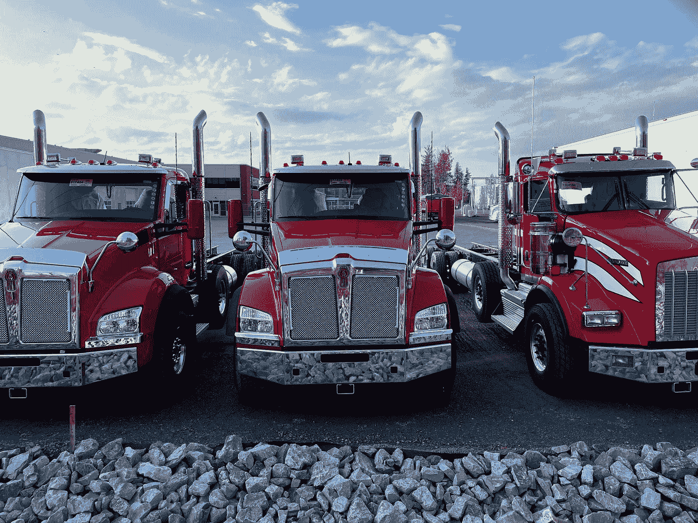
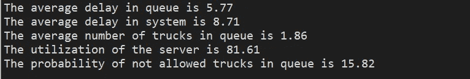
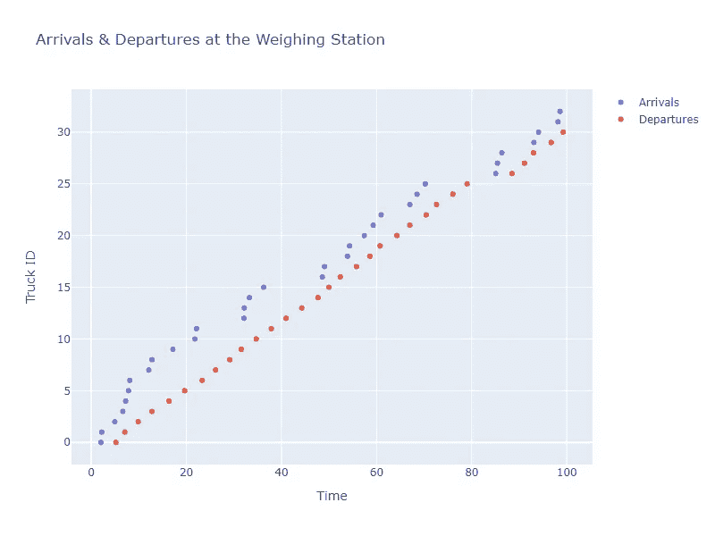

# SimPy 仿真简介

> 原文：<https://towardsdatascience.com/introduction-to-simulation-with-simpy-322606d4ba0c>

## 第二部分:排队系统的性能测量



由[杰里米·贝赞格](https://unsplash.com/@unarchive?utm_source=medium&utm_medium=referral)在 [Unsplash](https://unsplash.com?utm_source=medium&utm_medium=referral) 上拍摄的照片

[在之前的文章](/introduction-to-simulation-with-simpy-b04c2ddf1900)中，我们提供了关于**离散事件模拟(DES)** 的基本概念和原理的概述。我们描述了什么是模拟，什么是模型，什么是 DES，什么是 SimPy。我们介绍了一些在模拟研究中使用的概率和统计的基本概念，以及如何为系统模拟生成概率结果。

在本文中，我们将展示如何使用 SimPy 框架**来模拟一个排队系统**。为此，我们将描述一些与排队系统相关的基本概念，这些概念是通常用来衡量此类系统性能的量。

# **排队系统**

离散事件模拟技术最常见的应用是排队系统。他们还将等待排队系统命名为 T17。

许多产品和服务行业都有一个排队系统，在这个系统中，实体(**顾客、客户**，产品)到达一个站点(服务设施)，在**队列或队列**中等待(或不等待),直到他们获得由**服务器**提供的某种服务，并在结束时离开系统。例如:银行、加油站、卡车称重设施、港口、机场、医疗中心、急诊室、工厂、计算机系统、网络、修理厂和工作人员等。

排队系统(等候线系统)由三部分组成:1)到达过程；2)排队或等候过程；3)服务设施。

1)**到达流程**是客户到达并请求服务的过程。在现实世界的设施或过程中，到达通常随机发生，并由**概率分布函数**描述。到达过程最重要的特征是到达之间的**时间**(两次连续到达之间的时间)。

许多真实世界的系统近似为泊松分布，以描述固定时间段内的到达次数。但是在离散事件模拟技术的**实际应用**中，使用了以下规则:如果单位时间内的到达次数为泊松，则到达之间的时间遵循连续的**指数分布**。

与到达过程相关的另一个重要因素是潜在客户的**人口。当它的数量大到到达率不随相继顾客的到达而变化时，假定它是**无穷大**。相反，如果这一比率取决于已经到达并接受服务的人数，则应将其视为**有限人口**。**

2)排队过程的特征在于排队行为、排队规则和等待区域。

**排队行为**指顾客在等待服务时可以采取的行动。最常见的三种是: **balk** (队伍太长时离开)；**骑师**(从一条线移到一条更短的线)；**食言**(如果队伍移动缓慢，则离开)。

**队列规则**与空服务器选择下一个客户机的方式有关。最常见的有:FIFO(先进先出)；后进先出法；优先(通常在急诊室)；车间调度中最短加工时间优先；网络调度程序中的循环调度。

排队过程的另一个特征与每个队列中可以等待的顾客数量有关。在某些情况下，这个数字相当大，并不意味着任何实际问题，并且等待区域被认为是无限的。相比之下，当有可能由于等候区空间不足而拒绝几个顾客进入队列时，队列的长度应被认为是**有限的**。

3)服务设施的特征在于服务机制和服务费率。

**服务机制**显示了不同的配置:单个服务器(柜员、ATM、急诊室的入院服务、CPU、传送带)；多个服务器，相同或不同(银行柜员、超市收银员)；顺序服务器(垃圾处理系统中的起重机和焚烧炉、制造配置、急诊室)。

**服务费率**可以是确定性的，也可以是概率性的。如前所述，现实世界的设施有一些由概率分布描述的随机成分。模拟研究中最常用的是表示服务器处理时间的正态分布或表示排队系统中服务时间分布的指数分布(这种假设很少是可信的)。

**总服务成本**由等待成本和服务成本组成。许多模拟研究中的概念想法是**到**T6 确定最小化总服务成本的配置。

根据 [Kendall 符号对排队模型进行描述和分类。](https://en.wikipedia.org/wiki/Kendall%27s_notation)我们会在下面的文章中描述。

# **排队系统的性能测量**

某些数量衡量等待系统的性能。三个最常见的是:1)排队的平均延迟；2)平均排队顾客数；3)服务器忙于服务客户的时间比例。

1) **平均排队延迟**衡量“普通顾客”在接受服务前应该等待的时间。

2) **时间平均排队顾客数**显示“平均顾客”到达系统时应该看到的排队长度。

3)服务器忙于服务客户的时间比例称为**服务器利用率**。它测量服务器繁忙时间的百分比。低值意味着服务能力过剩，因此成本效率低。非常高的值意味着**瓶颈的可能性，**因此存在客户流失的可能性。

# 用 SimPy 模拟单服务台排队系统

我们将使用 SimPy 来模拟位于高速公路边的称重站的卡车到达和服务。

该系统的负责人在安装之前，希望确保至少在很长一段时间内，不会有卡车停在路边等待称重。停在公路边的卡车会引起司机的抱怨，并可能引发交通事故。

为此，他们决定聘请一名数据科学家对提议的系统进行模拟研究。

他发现卡车会按照平均 3 分钟的指数分布随机到达。称重站的制造商保证称重过程由平均值为 3 分钟、标准偏差为 0.5 的**正态分布**表示。**三辆以上的卡车停在公路边上**是一种危险状况。

获得所需性能指标的代码如下:

首先，他导入了 SimPy，Pandas 作为 *pd，* Numpy 作为 *np* ，以及 *scipy.stats* 模块，该模块包含了再现遵循指数分布和正态分布的随机数序列的方法(*norm*&*expon*)。

```
import simpyimport pandas as pd
import numpy  as npfrom scipy.stats import norm
from scipy.stats import expon
```

接下来，包括一个初始化模块，在该模块中，称重站中存在的秤的数量、队列中可容纳的最大卡车数量、两种分布的参数、模拟结束的时间以及将用于存储中间结果的列表的值被初始化。

```
# initialization moduleNUMBER_TRUCK_SCALES = 1
NOT_ALLOWED_NUMBER  = 4TRUCK_ARRIVAL_MEAN  = 3TRUCK_SERVICE_MEAN  = 3.0
TRUCK_SERVICE_STD   = 0.5SIM_TIME  = 100arrivals, departures = [],[]
in_queue, in_system  = [],[]
tme_in_queue, len_in_queue = [],[]
```

模拟算法的核心代码如下。

首先，我们需要创建一个环境实例。Environment()) 在这里我们可以定义*资源*和*进程*对象。然后，我们用资源( *scales_lines = simpy)定义称重站。Resource(env，capacity = NUMBER _ TRUCK _ SCALES)*我们选择一个随机种子来生成卡车到达间隔时间和秤服务时间序列。

卡车是我们的活动部件。它们用两个*流程对象建模:1)env . Process(truck _ arrival(env，scales _ lines))；* 2) *环境过程(wheighing(env，number_scales，next_truck_id，time_of_arrival))* 。最后，我们运行模拟一段预定的时间(*env . run(until = SIM _ TIME)*)。Yield 语句被编码以建立离散事件调度。

```
def truck_arrival(env, number_scales): # IDs for trucks
    next_truck_id = 0 while True:
       ## exponential distribution for arrivals
       next_truck = expon.rvs(scale = TRUCK_ARRIVAL_MEAN, size = 1) # Wait for the truck
       yield env.timeout(next_truck)
       time_of_arrival = env.now
       arrivals.append(time_of_arrival)
       next_truck_id += 1
       print('%3d arrives at %.2f' % (next_truck_id, env.now))

       env.process(wheighing(env, number_scales, 
                   next_truck_id,time_of_arrival))#..................................................................def wheighing(env, number_scales, truck_number, time_of_arrival): with scales_lines.request() as req: print('%3d enters the queue at %.2f' % 
               (truck_number, env.now)) queue_in = env.now
        length   = len(scales_lines.queue)
        tme_in_queue.append(queue_in)
        len_in_queue.append(length) yield req
        print('%3d leaves the queue at %.2f' % 
                (truck_number, env.now)) queue_out = env.now
        length    = len(scales_lines.queue)
        tme_in_queue.append(queue_out)
        len_in_queue.append(length) # normal distribution for the weighing process
        r_normal = norm.rvs(loc =TRUCK_SERVICE_MEAN,
                            scale =TRUCK_SERVICE_STD,size=1) yield env.timeout(r_normal)
        print('%3d permanece %.2f' % (truck_number,r_normal)) time_of_departure = env.now
        departures.append(time_of_departure) time_in_system = time_of_departure - time_of_arrival
        in_system.append(time_in_system) time_in_queue = queue_out - queue_in
        in_queue.append(time_in_queue)#.................................................................## set up the environment
env = simpy.Environment()## defining resources
scales_lines = simpy.Resource(env, capacity = NUMBER_TRUCK_SCALES)## selecting a random seed for the probability distributions
RANDOM_SEEDS = [1234, 5678, 9012, 3456, 7890]
np.random.seed(seed= RANDOM_SEEDS[1])## defining the truck arrival process
env.process(truck_arrival(env, scales_lines))## run the simultion
env.run(until = SIM_TIME)
```

接下来，描述用于计算队列长度的时间加权平均值、服务器利用率和不允许等待的卡车在队列中的时间百分比的例程:

```
def avg_line(df_length): ## finds the time average number of customers in the waiting line ## use the next row to figure out how long the queue was   df_length['delta_time'] = df_length['time'].shift(-1) 
                            - df_length['time'] ## drop the last row because it would have an infinite delta time   df_length = df_length[0:-1] avg =np.average(df_length['len'],weights=df_length['delta_time']) return avg#.................................................................def server_utilization(df_length): ## finds the server utilization   sum_server_free = df_length[df_length['len']==0]  ['delta_time'].sum() ## the process begins with the server empty
   first_event =  df_length['time'].iloc[0]
   sum_server_free = sum_server_free + first_event utilization = round((1 - sum_server_free / SIM_TIME) * 100, 2) return utilization#..................................................................def not_allowed_perc(df_length): ## finds the percentage of time of trucks on queue
      not allowed to be waiting sum_not_allowed = df_length[df_length['len']>=  NOT_ALLOWED_NUMBER]['delta_time'].sum() not_allowed = round((sum_not_allowed / SIM_TIME) * 100, 2) return not_allowed
```

将列表转换为数据帧，计算绩效指标并打印:

```
df1 = pd.DataFrame(tme_in_queue, columns = ['time'])
df2 = pd.DataFrame(len_in_queue, columns = ['len'])
df_length = pd.concat([df1, df2], axis = 1)avg_length  = avg_line(df_length)utilization = server_utilization(df_length)not_allowed = not_allowed_perc(df_length)df3 = pd.DataFrame(arrivals,   columns = ['arrivals'])
df4 = pd.DataFrame(departures, columns = ['departures'])
df_chart = pd.concat([df3, df4], axis = 1)avg_delay_inqueue = np.mean(in_queue)avg_delay_insyst  = np.mean(in_system)print('  ')
print('The average delay in queue is %.2f'  % (avg_delay_inqueue))
print('The average delay in system is %.2f' % (avg_delay_insyst))
print('The average number of trucks in queue is %.2f' %  (avg_length))
print('The utilization of the server is %.2f' % (utilization))
print('The probability of not allowed trucks in queue is %.2f' % (not_allowed))
```

最后，一个图表显示了称重站的到达和离开，另一个图表显示了队列中卡车数量的变化:

```
import plotly.graph_objects as gofig1 = go.Figure()fig1.add_trace(go.Scatter(x = df_chart['arrivals'],
                          mode = 'markers',name = 'Arrivals'))fig1.add_trace(go.Scatter(x = df_chart['departures'], 
                          mode = 'markers',name = 'Departures'))fig1.update_layout(title = 'Arrivals & Departures 
           at the Weighing Station',
           xaxis_title = 'Time' , yaxis_title = 'Truck ID',
           width = 800, height = 600)
fig1.show()fig2 = go.Figure(go.Waterfall(x = df_length['time'],
                              y = df_length['len'],
                              measure = ['absolute']* 100,
                              connector = {"line":{"color":"red"}}))fig2.update_layout(title = 'Number of Trucks in Queue',
          xaxis_title = 'Time' , yaxis_title = 'Number of Trucks',
          width = 800, height = 600)
fig2.show()
```

# **分析**

一辆卡车平均要等 5.77 分钟才能得到服务。称重系统的平均延迟为 8.71 分钟。平均来说，大约有 2 辆卡车在排队。服务器的利用率很高，空闲时间很少，没有瓶颈。



作者用 Plotly 制作的图表。

尽管上述所有性能指标都在可接受的范围内，但在系统运行时间的 15.82%中，有危险数量的卡车停在公路边。


作者用 Plotly 制作的图表。

在下一篇文章中，我们将看到提出了哪些替代方案来解决这个问题。使用模拟技术的最大优点是评估所提出的系统，就像它实际存在一样。

别忘了订阅我的电子邮件来接收下面的文章。