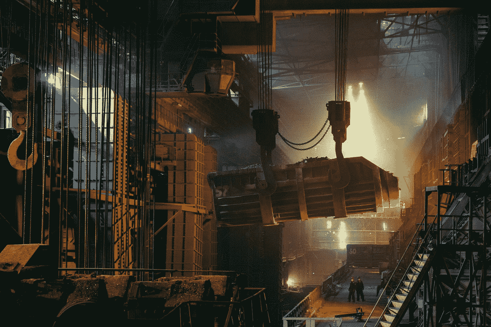
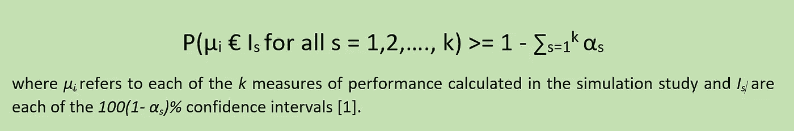
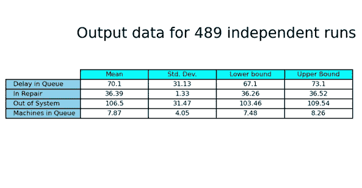

# SimPy 仿真简介

> 原文：<https://towardsdatascience.com/introduction-to-simulation-with-simpy-5656bb4aafbe>

## **第 6 部分:多项绩效指标**



安特·罗泽茨基在 [Unsplash](https://unsplash.com?utm_source=medium&utm_medium=referral) 上的照片

如副标题所示，这是与使用 **SimPy** 的**模拟技术**应用相关的系列中的第**篇，SimPy** 是基于 Python 的基于流程、面向对象、离散事件模拟框架。

之前的文章都发表在**走向数据科学**以下是对应链接:[第一篇](/introduction-to-simulation-with-simpy-b04c2ddf1900)；[第二条](/introduction-to-simulation-with-simpy-322606d4ba0c)；[第三条](/introduction-to-simulation-with-simpy-8d744c82dc80)；[第四条](/introduction-to-simulation-with-simpy-8e7187c6eb82)；[第五条。](/introduction-to-simulation-with-simpy-e27cd7b1ff47)

在第 4 篇文章中，我们指出模拟研究是基于计算机的统计抽样实验[1]。我们建立现实世界问题的数学或逻辑模型，并对其进行实验，直到获得足够的知识来解决预定义的决策问题。

通常，现实世界的系统在数据中表现出很大的随机性。因此，统计和概率对仿真分析至关重要。

在第 4 篇文章中，我们使用了一个名为**固定样本量程序**的统计程序来进行**终止模拟**的输出数据分析。我们计算了**置信区间** ( **CIs** )，因为**绩效指标**的样本均值总是有一些误差。这种方法的缺点是我们不能确定这些置信区间的大小。

因此，在第 5 篇文章中，我们使用了一个**顺序程序**，使我们能够获得一个具有预定义水平**绝对或相对精度**的置信区间。这个程序的缺点与**覆盖概率**(区间包含真均值的实际概率)有关。分析员必须始终意识到使用顺序程序时**在覆盖范围内严重损失的可能性**。

在本文中，我们将开发一个同时分析几个性能指标**的程序。**

# **多项绩效指标**

第 4 条和第 5 条中描述的程序分别说明了达到几个置信度**的置信区间所需的运行次数**。但是通常的做法是在执行模拟研究时计算多个性能度量。因此，我们需要一个过程来同时为****的多个绩效指标达到指定的置信水平。****

****这种情况在统计文献中被称为**多重比较问题**。用 **Bonferroni 不等式描述:******

********

****Bonferroni 不等式用于多重统计推断，以设定总体置信水平的上限。所有同时包含其相应性能指标的配置项必须满足 Bonferroni 不等式的概率。****

****使用**少量测量值**进行模拟研究的惯例如下:****

********

****这是一个非常保守的程序，但它不需要概率分布假设，并且**允许单独定义每个性能测量的置信水平。******

****例如，有了三个性能指标和总体 90%的置信区间，我们可以在三个 96.667%的置信区间(0.0333+0.0333+0.0333 = 0.1 =*α*)或一个 95%和两个 97.5%的置信区间(0.05+0.025+0.025 = 0.1 =*α*)之间进行选择****

****让我们用 SimPy 来说明这个过程。****

# ******用 SimPy** 模拟机器的故障和维修****

****我们用 SimPy 对一家工厂的机器故障进行编码，并由三名维修人员进行相应的维修。****

****正在研究的系统是一个**排队系统**，其中机器是随机发生故障的**客户**，由三个修理工(**服务器**)随机花费时间修理**。**每台机器平均每 10 分钟故障一次，机器故障间隔时间呈指数级。服务时间(以分钟为单位)不遵循已知的概率分布，由下表表示:****

********

****下面的 Python 代码允许我们应用一个顺序过程来获得三个性能指标的总体置信度为 90%的**。******

******我们导入了熊猫库作为 *pd，* Numpy 作为 *np* ， *RandomState* 模块，模拟框架 *SimPy。*我们需要 *scipy.stats* 模块，它包含了再现服从均匀和指数分布的随机数序列的方法。最后，我们导入 matplotlib 作为最终输出的 *plt* 。******

```
****import pandas as pd
import numpy  as np
from numpy.random import RandomStateimport simpyfrom scipy import stats
from scipy.stats import expon
from scipy.stats import uniformimport matplotlib.pyplot as pltyour_path = # type your particular path****
```

******在初始化模块中，我们指出了与机器故障间隔时间和维修人员数量相关的指数分布的参数。我们设置一个数据帧( *df_service* )用于函数*修复*以及从均匀分布获得的随机变量，以确定修复时间值。第 3 条[中使用了类似的逻辑。](/introduction-to-simulation-with-simpy-8d744c82dc80)******

```
****# initialization moduleMACHINE_FAILURE_MEAN  = 10
NUMBER_REPAIR_PERSONS = 3## times in repairing
list_of_minutes = [15,  30,  40,  50]# discrete probabilities for times in repairing
prob1, prob2, prob3, prob4 = 0.1, 0.3, 0.4, 0.2prob1 = round(prob1, 4)
prob2 = round(prob1 + prob2,4)
prob3 = round(prob2 + prob3,4)
prob4 = round(prob3 + prob4,4)
list_of_probs = [prob1, prob2, prob3, prob4]df1 = pd.DataFrame(list_of_minutes, columns = ['minutes'])
df2 = pd.DataFrame(list_of_probs,   columns = ['range'])df_service = pd.concat([df1, df2], axis = 1)****
```

******下面两个生成器函数( *def machine_failure(env，number_repair)*&*def repair(env，number _ repair，failure_number，time_of_failure)* 背后的逻辑也在第 3 条中进行了描述。******

```
****def machine_failure(env, number_repair): # counter of failures
   failure_number = 0 while True:
       ## exponential distribution for failures
       next_failure = expon.rvs(scale = MACHINE_FAILURE_MEAN, 
                                size = 1) # Wait for the failure
       yield env.timeout(next_failure)
       time_of_failure = env.now
       failures.append(time_of_failure)
       failure_number += 1
       print('failure %3d occurs at %.2f' % 
            (failure_number, env.now)) env.process(repairing(env, number_repair, 
                   failure_number, time_of_failure))#...................................................................
def repairing(env, number_repair, failure_number, time_of_failure): with repair_persons.request() as req:
         print('%3d enters the queue at %.2f' % 
               (failure_number, env.now))
         queue_in = env.now
         length   = len(repair_persons.queue)
         tme_in_queue.append(queue_in)
         len_in_queue.append(length) yield req
         print('%3d leaves the queue at %.2f' % 
               (failure_number, env.now))

         queue_out = env.now
         length    = len(repair_persons.queue)
         tme_in_queue.append(queue_out)
         len_in_queue.append(length)

         # uniform distribution for the repairing process
         r_v = uniform.rvs(size=1)
         print(r_v) for i,row in df_service.iterrows():
             probab = df_service.loc[i, 'range']
             if r_v < probab:
                time_service = df_service.loc[i, 'minutes']
                break yield env.timeout(time_service)
         print('%3d stays at service %.2f' %     
               (failure_number,time_service))         time_repaired = env.now
         repaired.append(time_repaired) time_out_system = time_repaired - time_of_failure
         out_system.append(time_out_system)         time_in_queue = queue_out - queue_in
         in_queue.append(time_in_queue) time_in_service = time_service
         in_service.append(time_in_service)
#..................................................................****
```

******接下来，我们编写了两个函数(*def avg _ line(df _ length)*&*def calc _ measures()*)，用于计算队列中故障机器的平均数量、队列中的平均延迟、机器被修复的平均时间以及机器离开系统的平均时间。******

```
****def avg_line(df_length): # finds the time weighted average of the queue length
   # use the next row to figure out how long the queue was at that length df_length['delta_time'] = df_length['time'].shift(-1) 
                           - df_length['time'] # drop the last row because it would have an infinite time span
   df_length = df_length[0:-1]
   avg = np.average(df_length['len'],
                    weights = df_length['delta_time']) return avg
#..................................................................def calc_measures(): df3 = pd.DataFrame(tme_in_queue, columns = ['time'])
    df4 = pd.DataFrame(len_in_queue, columns = ['len'])
    global df_length
    df_length = pd.concat([df3, df4], axis = 1) avg_length = avg_line(df_length)
    avg_delay  = np.mean(in_queue)
    avg_in_service = np.mean(in_service)
    avg_out_system = np.mean(out_system) print('Number of Run: %1d' %(run+1))
    print('The average delay in queue is %.2f'  % (avg_delay))
    print('The average number of machines in queue is %.2f' % (avg_length))
    print('The average time machines were being repaired is %.2f' % (avg_in_service))
    print('The average time machines out of system is %.2f' % (avg_out_system))# list and dataframe for final output listoflists = []
    listoflists.append(round(avg_delay,2))
    listoflists.append(avg_in_service)
    listoflists.append(avg_out_system)
    listoflists.append(avg_length)
    df.loc[len(df)] = listoflists****
```

******函数 *calc_ICs()* 允许我们使用[文章 5](/introduction-to-simulation-with-simpy-e27cd7b1ff47) 中描述的公式计算置信区间。我们使用了自由度为*k1*的 T33**的四个不同分位数** **，每个分位数对应一个特定的置信水平。当每个选择的性能测量的置信区间** ( *hwic* )的**半宽度小于先前定义的绝对精度时，我们将布尔变量( *l_end* )设置为真。********

```
**def calc_ICs(): ## confidence intervals
  ## define 3 global variables
  global df_output, hwic, l_end mean = round(df.mean(),2)
  sigma= round(df.std(ddof=1),2)
  dof  = len(df)-1 for i in range(4):
      t_crit = np.abs(stats.t.ppf((1-confidence[i])/2,dof))
      print(round(t_crit,3)) inf, sup = (mean - sigma*t_crit/np.sqrt(len(df)), 
              mean + sigma*t_crit/np.sqrt(len(df))) inf = round(inf,2)
  sup = round(sup,2) df_output = pd.concat([mean, sigma, inf, sup], axis=1)
  print(df_output) hwic= (sup - inf)/2
  if (hwic[0]<=abs_err[0]) and (hwic[1]<=abs_err[1]) 
      and (hwic[3]<=abs_err[3]):
      l_end = True print('')
  print(round(hwic,2),abs_err, l_end )**
```

****函数 *print_output()* 打印输出数据表，显示每个绩效指标的样本均值、标准偏差以及 CIs 的**下限和上限**。****

```
**def print_output(): col_labels = ["Mean", "Std. Dev.", "Lower bound", "Upper Bound"] row_labels = ["Delay in Queue","In Repair",
                 "Out of System","Machines in Queue"] fig, ax = plt.subplots(1,1)
   ax.axis('tight')
   ax.axis('off')   output_table = ax.table(cellText = df_output.values,
                  colLabels = col_labels, rowLabels = row_labels,
                  rowColours =["skyblue"]*5, colColours =["cyan"]*4,
                  cellLoc='center', loc="center")
   ax.set_title("Output data for %i independent runs" %(run+1),  
                 fontsize=18, y= 0.8 , pad = 4) output_table.auto_set_font_size(False)
   output_table.set_fontsize(8)
   plt.savefig(your_path +'output_perf_measures.png',
               bbox_inches='tight', dpi=150) plt.show()**
```

****最后，我们基于三个 96.667%的 IC(0.0333+0.0333+0.0333 = 0.1)，以及队列中平均延迟为 3.0、机器被修理的平均时间为 2.0 以及队列中故障机器的平均数量为 2.0 的绝对精度( *abs_err* ，为模拟算法的中央核心编写了 90%的总体置信水平( *α* )。在 10 次初始运行后计算第一批 ICs(如果运行> = 10: )，即*。我们使用 2345 作为随机数序列的种子值。规定每次运行时间长度的预定义事件( *SIM_TIME* )是 30 天* 24 小时/天。*****

```
**#...................................................................confidence = [0.96667, 0.96667, 0.9, 0.96667]
abs_err    = [3.00, 2.00, 3.00, 2.00]
l_end = Falsemax_numb_of_runs = 1000
numb_of_runs = max_numb_of_runsseed_value = 2345
prbnumgen  = RandomState(seed_value)SIM_TIME = 30 * 24
stop_arrivals = 720           ## for the verification stepglobal df
column_labels = ["Delay in Queue","In Repair",
                 "Out of System","Machines in Queue"]
df = pd.DataFrame(columns=column_labels)for run in range(numb_of_runs): failures, repaired    = [],[]
    in_queue, in_service  = [],[]
    out_system = []
    tme_in_queue, len_in_queue = [],[] #Set up the simulation environment
    env = simpy.Environment() repair_persons=simpy.Resource(env,
                 capacity = NUMBER_REPAIR_PERSONS) env.process(machine_failure(env, repair_persons))
    env.run(until = SIM_TIME)
    calc_measures() if run >= 10:
        calc_ICs() if l_end == True:
       print_output()
       break**
```

# ******分析******

****在第 4 篇文章中，我们描述了为一个特定的性能测量建立一个置信区间的固定样本量程序。在第 5 篇文章中，我们描述了一个为特定的性能度量建立置信区间的连续过程。在本文中，我们将前面的想法扩展到同时分析多个性能指标。****

****表 1 总结了输出数据:在 489 次独立运行后，我们可以以大约 90%的置信度声称，队列中的平均延迟包含在 96.667%置信区间[67.1，73.1]分钟内，平均修复时间包含在 96.667%置信区间[36.26，36.52]分钟内，队列中故障机器的平均数量同时包含在 96.667%置信区间[7.48，8.26]内。我们还计算了机器离开系统的平均时间(90%的置信度)。从概念上讲，这个值必须大约是平均排队延迟加上平均修复时间之和。****

********

****表 1，作者用 Matplotlib 做的。****

****表 2 恢复了一个 95%和两个 97.5% IC 的相同输出数据(0.05+0.025+0.025 = 0.1 =*α*)和相同的绝对误差。表格之间性能测量的微小差异完全是由于**模拟输出的随机性。******

********

****作者用 Matplotlib 做的表 2。****

****如前所述，良好的概率和统计知识对于每个离散事件模拟研究都是至关重要的。****

****[1]: Law，A.M. & Kelton，W.D. (2000)模拟建模与分析。波士顿麦格劳希尔公司。****