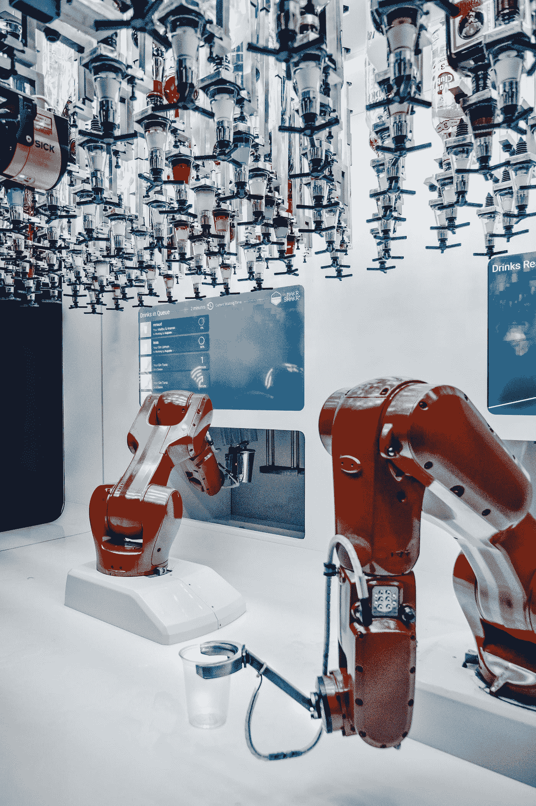
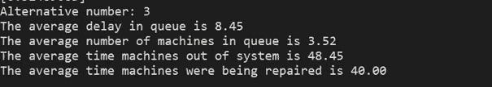
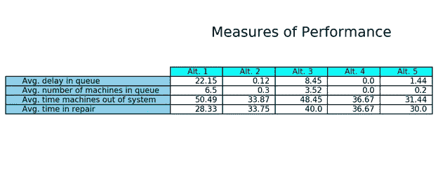
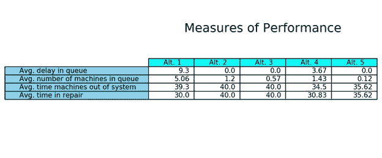

# SimPy 仿真简介

> 原文：<https://towardsdatascience.com/introduction-to-simulation-with-simpy-8d744c82dc80>

## **第三部分:排队系统方案的比较**



由[大卫·莱维克](https://unsplash.com/@davidleveque?utm_source=medium&utm_medium=referral)在 [Unsplash](https://unsplash.com?utm_source=medium&utm_medium=referral) 上拍摄的照片

本文是与使用 **SimPy 框架的模拟技术应用相关的系列文章的第三篇。**

在[的第一篇文章](https://medium.com/towards-data-science/introduction-to-simulation-with-simpy-b04c2ddf1900)中，提供了关于离散事件模拟的基本概念和原理的概述。我们定义了模型、模拟技术、什么是**离散事件模拟(DES)** 以及 SimPy 库的特征。我们描述了一些在模拟研究中使用的常见概率分布，以及我们如何生成模拟这种分布的数字序列。

在第二篇[文章](https://medium.com/towards-data-science/introduction-to-simulation-with-simpy-322606d4ba0c)中，我们描述了**排队系统**(等待队列系统)的基本原理以及最常用于评估它们的性能指标。最后，我们用 SimPy 模拟了一个单服务台排队系统。

在本文中，我们将描述用于分类排队模型的肯德尔符号。此外，我们将模拟另一个等待系统，强调模拟技术的一个巨大优势:**快速、经济地评估所研究系统的各种备选方案的能力。**

# **排队模型的肯德尔符号**

英国数学家和统计学家大卫·乔治·肯德尔在 1953 年提出了一种对排队模型进行分类的符号。他用三个字母写成 ***A/S/c*** ，其中 **A** 描述到达过程中的到达间隔时间， **S** 表示服务时间分布， **c** 表示服务人数。A 和 S 最常见的可以取的值是 ***M，D*** 或***G***:**M**隐含一个指数(马尔可夫)分布； **D** 暗示确定性(非概率性)分布； **G** 暗示非指数概率分布。当然， **c** 是整数。

后来又增加了三个字母，这样现在的记法就有了下面的形式: ***A/S/c/K/N/D*** ，其中 **K** 是等候区的容量， **N** 是潜在顾客的人口数， **D** 是排队纪律。如果 K 被省略，等待区域被认为是无限的。如果省略 N，则假设调用人口为无穷大。如果省略 D，则假定队列规则为 **FIFO** (先进先出)。

让我们看一些例子。

**M/M/1** :到达间隔时间呈指数分布，服务时间也呈指数分布，一个服务员，无限等待区，无限呼叫人口，先进先出原则。

**M/D/2/10/100/LIFO** :到达间隔时间服从指数分布，服务时间服从确定性分布，两台相同的服务器，有限的排队长度(只有 10 个顾客可以等待)，有限的顾客数量(最多 100 个顾客可以到达系统)，排队规则为 **LIFO** (后进先出)。

**G/G/4///优先级**:到达间隔时间非指数概率分布，服务时间非指数概率分布，4 个服务器，无限等待区，无限客户群，按照一个优先级条件服务部分客户。

# 利用 SimPy 做管理决策

我们将使用 SimPy 来模拟工厂中机器的故障及其相应的修复。管理层应该做出关于维修人员数量的决定，这将减少机器停止工作的时间，而不是雇佣额外的维修人员。

一名数据科学家受雇对当前的运行条件进行模拟研究，修理工的数量不断增加，为每一个备选方案指明某些性能指标，以量化其成本。

她清楚地解释说,**正在研究的系统是一个等待系统**,其中**机器是随机发生故障的客户**,由**服务器** ( **修理工**)修理，他们花费**随机的时间来修理它们。她发现每台机器平均每 10 分钟就出一次故障，机器故障间隔时间是指数级的。她还发现服务时间(以分钟为单位)并不遵循已知的概率分布，而是由下表表示:**


表 1:机器维修时间及其相应的概率。图片作者。

根据肯德尔符号，它是一个 M/G/c 排队系统。

她编写了以下 Python 代码来获得所需的性能指标。

首先，她导入了 Pandas 库作为 *pd，* Numpy 作为 *np* ，以及名为 *SimPy 的面向对象、基于流程的离散事件模拟框架。*她还导入了 *scipy.stats* 模块，该模块包含了再现服从均匀和指数分布的随机数序列的方法。最后，她导入 matplotlib 作为 *plt* 和 seaborn 作为 *sns* 用于制图。

```
import pandas as pd
import numpy  as np
import simpyfrom scipy.stats import uniform
from scipy.stats import exponimport matplotlib
import matplotlib.pyplot as plt
import matplotlib.animation as animationimport seaborn as sns
```

修理时间( *time_service* )随机变量必须是离散的，并按如下方式产生:一个列表( *list_of_minutes* )表示修理中不同的平均时间；四个变量( *prob1，prob2* ，…)表示它们相应的离散概率(表 1)。她对这些变量求和并四舍五入，以获得四个连续子区间([0，0.1]；[0.1, 0.4];[0.4, 0.8];[0.8, 1.0]).每个子区间的最终值被传递给一个列表( *list_of_probs* )，两个列表都被转换为数据帧。然后两个数据帧在 *df_service* 中连接，另一个数据帧与从均匀分布获得的随机变量一起用于函数*修复*以确定修复时间值。

包括一个初始化模块，其中她指示用于模拟机器故障间隔时间的指数分布的参数值。她还初始化了模拟结束的时间，以及将用于存储中间结果的变量和列表。她还包括了计算修复时间随机变量的程序。

```
# Initialization moduleMACHINE_FAILURE_MEAN  = 10## Times in repairing
list_of_minutes = [15,30,40,50]# discrete probabilities for times in repairing
prob1, prob2, prob3, prob4 = 0.1, 0.3, 0.4, 0.2prob1 = round(prob1, 4)
prob2 = round(prob1 + prob2,4)
prob3 = round(prob2 + prob3,4)
prob4 = round(prob3 + prob4,4)
list_of_probs = [prob1, prob2, prob3, prob4]df1 = pd.DataFrame(list_of_minutes, columns = ['minutes'])
df2 = pd.DataFrame(list_of_probs,   columns = ['range'])
df_service = pd.concat([df1, df2], axis = 1)SIM_TIME = 100max_length, number_rows = 0, 0
avg_length, avg_delay = [],[]
avg_out_system, avg_in_service = [],[]
```

[记住](https://medium.com/towards-data-science/introduction-to-simulation-with-simpy-b04c2ddf1900)SimPy 为数据分析师提供主动组件:**流程**生成实体，如故障机器，以及被动组件:**资源**如维修人员。

分析师编写了一个生成器函数( *machine_failure* )来模拟机器的随机故障，该函数调用另一个函数( *repairing* ),其中机器想要使用有限能力的资源(修理工)。 *yield env.timeout()* 是一种离散事件，在经过一定的模拟时间后触发。方法 *request()* 生成一个事件，该事件在资源再次变得可用时被触发( *yield req* )。

```
def machine_failure(env, number_repair): # counter of failures
   failure_number = 0 while True:
      ## exponential distribution for failures
      next_failure = expon.rvs(scale = MACHINE_FAILURE_MEAN , 
                               size = 1) # Wait for the failure
      yield env.timeout(next_failure)
      time_of_failure = env.now
      failures.append(time_of_failure)
      failure_number += 1
      print('failure %3d occurs at %.2f' % 
             (failure_number, env.now)) env.process(repairing(env, number_repair, 
                  failure_number, time_of_failure))#...................................................................def repairing(env, number_repair, failure_number, time_of_failure):
    with repair_persons.request() as req:
         print('%3d enters the queue at %.2f' % 
                (failure_number, env.now)) 

         queue_in = env.now
         length   = len(repair_persons.queue)
         tme_in_queue.append(queue_in)
         len_in_queue.append(length) yield req
         print('%3d leaves the queue at %.2f' % 
                (failure_number, env.now))         queue_out = env.now
         length    = len(repair_persons.queue)
         tme_in_queue.append(queue_out)
         len_in_queue.append(length) # random variate with uniform distribution
         r_v = uniform.rvs(size=1)
         print(r_v) # setting the repair time
         for i,row in df_service.iterrows():
              probab = df_service.loc[i, 'range']
              if r_v < probab:
                  time_service = df_service.loc[i, 'minutes']
                   break yield env.timeout(time_service)%
         print('%3d stays at service %.2f' %
                (failure_number,time_service)) time_repaired = env.now
         repaired.append(time_repaired) time_out_system = time_repaired - time_of_failure
         out_system.append(time_out_system) time_in_queue = queue_out - queue_in
         in_queue.append(time_in_queue) time_in_service = time_service
         in_service.append(time_in_service)
```

接下来，她编写了用于计算队列中的平均延迟、队列中机器的平均数量、机器离开系统的平均时间以及机器被修复的平均时间的函数。

每个备选方案都包括一个动画，显示等待维修的机器数量的变化。动画是使用 matplotlib 和 T2 seaborn 库开发的。

```
#...................................................................def avg_line(df_length):
    ## finds the time weighted average of the queue length # use the next row to figure out how long the queue 
      was at that length df_length['delta_time'] = df_length['time'].shift(-1) -    df_length['time'] # drop the last row because it would have an infinite time span
   df_length = df_length[0:-1] avg =np.average(df_length['len'],weights=df_length['delta_time']) return avg#...................................................................def calc_averages(): df3 = pd.DataFrame(tme_in_queue, columns = ['time'])
    df4 = pd.DataFrame(len_in_queue, columns = ['len'])
    df_length = pd.concat([df3, df4], axis = 1) # calculate the y lim for the number of machines in queue chart 
    max_length  = df4['len'].max(axis = 0) # calculate the number of frames in the animation
    number_rows = len(df4) avg_length.insert(altern, avg_line(df_length))     
    avg_delay.insert(altern,  np.mean(in_queue)) avg_out_system.insert(altern, np.mean(out_system))
    avg_in_service.insert(altern, np.mean(in_service)) print('Alternative number: %1d' %(altern+1))
    print('The average delay in queue is %.2f'  % 
           (avg_delay[altern])) print('The average number of machines in queue is %.2f' % 
           (avg_length[altern])) print('The average time machines out of system is %.2f' % 
            (avg_out_system[altern])) print('The average time machines were being repaired is %.2f'
            %(avg_in_service[altern])) #.............................................................
    Writer = animation.FFMpegWriter(fps=2,
                    metadata=dict(artist='Me'), bitrate=1800) fig = plt.figure(figsize=(10,6))
    ax  = fig.gca()
    plt.xlim(0, 100)
    plt.ylim(0, max_length + 1)
    ax.yaxis.get_major_locator().set_params(integer=True)
    plt.title(' Number of Machines in Queue for Alternative %i'  
                %NUMBER_REPAIR_PERSONS,fontsize=20) def animate(i):
        data = df_length.iloc[:int(i+1)] #select data range
        p = sns.scatterplot(x = data["time"], y = data["len"],
                            marker = '*', s = 100, color="r")
        p.set(xlabel='Time', ylabel='Number of Machines') 
        p.tick_params(labelsize=17)
        plt.setp(p.lines,linewidth=4) ani = matplotlib.animation.FuncAnimation(fig, animate, 
                     frames= number_rows,interval = 50, repeat=True) altern_chart = 'machines_in_queue_alt %i.mp4' 
                   %NUMBER_REPAIR_PERSONS ani.save(your_path + altern_chart,  writer = Writer)  
    plt.show()
```

模拟算法的中央核心包括一个*环境()*的实例，因为**所有 SimPy 进程都生活在一个环境中。**

首先，她选择了一个种子值( *1234* )，因此随机数生成器可以启动序列来生成模拟均匀分布和指数分布的数字流。她决定**评估五个备选方案** (Alt1: 1 修理工；Alt2: 2 名修理工；Alt3: 3 名修理工；Alt4: 4 名修理工；Alt 5: 5 修理工)。该代码为每个备选方案计算 4 个性能指标，并绘制相应的动画。

```
RANDOM_SEEDS = [1234, 5678, 9012, 3456, 7890]
np.random.seed(seed= RANDOM_SEEDS[1])for altern in range(5):
    failures, repaired    = [],[]
    in_queue, in_service  = [],[]
    out_system = []
    tme_in_queue, len_in_queue = [],[] env = simpy.Environment()    NUMBER_REPAIR_PERSONS = altern + 1 repair_persons = simpy.Resource(env, 
                           capacity = NUMBER_REPAIR_PERSONS) env.process(machine_failure(env, repair_persons))
     env.run(until = SIM_TIME) calc_averages()
```

最后，一个表格恢复了性能的措施，以量化其相应的成本。

```
##..................................................................def print_averages(): round_avg_delay  = [round(num, 2) for num in avg_delay]
    round_avg_length = [round(num, 2) for num in avg_length]
    round_avg_out_system = [round(num, 2) for num in avg_out_system]  
    round_avg_in_service = [round(num, 2) for num in avg_in_service] listoflists = []
    listoflists.append(round_avg_delay)
    listoflists.append(round_avg_length)
    listoflists.append(round_avg_out_system)
    listoflists.append(round_avg_in_service) fig, ax = plt.subplots(1,1)
   column_labels = [" Alt. 1", " Alt. 2", " Alt. 3", 
                    " Alt. 4", " Alt. 5"]
   row_labels = ["Avg. delay in queue", 
                 "Avg. number of machines in queue",
                 "Avg. time machines out of system", 
                 "Avg. time in repair"] df=pd.DataFrame(listoflists, columns=column_labels)  

   ax.axis('tight')
   ax.axis('off')
   ax.table(cellText = df.values, 
              colLabels=df.columns, rowLabels=row_labels,
              rowColours =["skyblue"]*4, 
              colColours =["cyan"]*5, loc="center")
   ax.set_title("Measures of Performance", fontsize=18, 
                 y= 0.8 , pad = 4) plt.savefig(your_path +'perf_measures.png',
               bbox_inches='tight', dpi=150) plt.show()
```

# **分析**

下面的屏幕截图显示了第三个备选项(3 个修理工)的种子值为 1234 的一次模拟运行后的绩效评估值:



图片作者。

下图显示了同一替代方案中等待维修的机器数量的变化:


作者用 Matplotlib 制作的图

最后，表 2 恢复了每个备选方案的性能指标:



表 2:种子值为 1234 的性能测量。图片作者。

看来，管理层应该选择雇佣两名修理工(备选方案 2)作为最佳解决方案。

**但是这个模拟研究有两个严重的缺点:**

1)选择 100 作为最终模拟时间完全是任意的。然而，模拟运行的长度根据要研究的系统类型和要量化的性能测量而变化。

2)获得的结果很大程度上依赖于模拟运行中使用的随机数序列。如果我们更改种子值并使用 RANDOM_SEEDS 列表的第二个元素(5678)，我们将获得以下汇总表:



表 3:种子值为 5678 的性能测量。图片作者。

我们只改变了种子值，一些性能指标的估计值发生了显著的变化。其原因是它们是随机变量的特殊实现，可能具有**较大的方差**。

我们将在下面的文章中指出解决这些严重缺陷的方法。