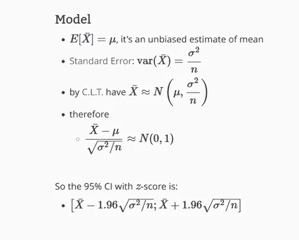
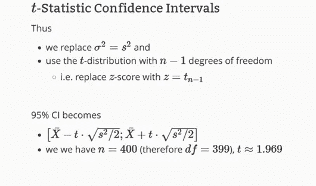
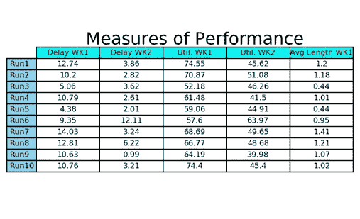
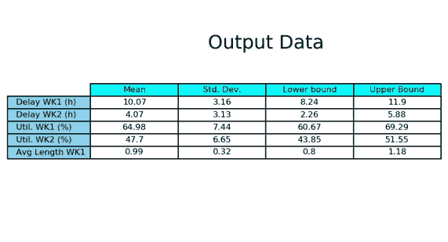

# SimPy 仿真简介

> 原文：<https://towardsdatascience.com/introduction-to-simulation-with-simpy-8e7187c6eb82>

## **第 4 部分:终止模拟的输出数据分析**


由[乔纳斯·莫格纳](https://unsplash.com/@jonasmorgner?utm_source=medium&utm_medium=referral)在 [Unsplash](https://unsplash.com?utm_source=medium&utm_medium=referral) 上拍摄的照片

本文是与使用 SimPy 的**离散事件模拟(DES)** 技术应用相关的系列文章的第四篇。

[第 1 篇:](https://medium.com/towards-data-science/introduction-to-simulation-with-simpy-b04c2ddf1900)我们介绍了 DES 的一些基本概念，描述了一些在仿真应用中经常用到的概率分布函数。

[第 2 篇](https://medium.com/towards-data-science/introduction-to-simulation-with-simpy-322606d4ba0c):我们描述了表征**排队系统**(等待线系统)的组件及其最常见的**性能度量。**

[第 3 条:](https://medium.com/towards-data-science/introduction-to-simulation-with-simpy-8d744c82dc80)我们描述了用于分类排队模型的 **Kendall 符号**，并使用 SimPy 来模拟工厂运营中机器的随机故障，以帮助管理层决定减少机器停工时间的修理工数量。

在上一篇文章中，我们指出了用 Simpy 进行的许多模拟研究中的两个常见错误:1)任意选择最终模拟时间；2)进行单次模拟运行，并使用输出作为最终结果。

在本文中，我们将开始分析模拟研究的输出数据，以指出避免犯这些概念性错误的方法。

# **模拟类型**

关于**输出数据分析**，我们区分两种类型的模拟:1)终止模拟；2)非终止模拟。

一个**终止模拟**是一个有预定义事件的模拟，该事件规定了每次运行的长度。该终端事件可能是与时间相关的**；例如:一家零售商店，营业时间为上午 9 点至下午 5 点。我们希望通过运行模拟研究来评估一些绩效指标，因为终止模拟的最终事件是 8 小时的模拟时间已经过去，商店是空的[1]。终端事件也可以是与系统被清空或清空的预定义状态相关的**；**例如:一家制造商收到一份订单，要求生产 500 件特定设计的产品。他决定模拟几种制造配置，以选择一种能保证他以最低成本满足最后期限的配置。在这种情况下，终端事件是已经制造了 500 件[1]。**

在开始模拟运行之前，必须完全定义终端事件，其发生时间可以是随机变量。系统的初始条件也必须事先明确定义，因为它们通常会影响运行结束时计算的性能指标。

另一方面，**非终止模拟**是一种没有指定运行长度的预定义事件的模拟。从概念上讲，模拟理论上可以无限期地进行下去；在实践中，分析师确定运行模型的合适时间长度。无终止模拟的一个经典例子是一家制造公司，它有 24/7 的活动和相当可预测的需求。我们希望估计一些稳态性能指标，以便更好地理解这种复杂系统的动态特性。

将模拟研究分类为终点或非终点**的决定不仅取决于系统的性质，还取决于研究的目标**。如果目标是确定被研究系统的**短期动态行为**，我们将开发一个终止模拟。另一方面，如果目标是确定其**稳态行为**，我们将开发一个非终止模拟。

在模拟运行的早期阶段，性能指标在稳定之前会有明显的波动。这段时间称为**瞬态**，终端模拟的输出数据可能包括瞬态的大量值。这就是为什么**在终止模拟中非常仔细地选择初始条件是至关重要的**。在非终止模拟(非常长的运行)中，瞬态的影响被稀释，并且通常在计算性能度量时被消除。

# **终止模拟的输出数据分析**

模拟是基于计算机的统计抽样实验[1]。因此，我们需要统计技术来分析模拟实验。

我们借助**中心极限定理** ( **C.L.T.** )来处理样本数据。它指出样本均值的分布将接近正态分布，均值等于总体均值，方差等于 *S2/n，*其中 *S2* 是总体方差， *n* 是数据中的观察次数。

然后我们转到**置信区间(CI)。**我们需要计算模拟输出数据的置信区间，因为样本均值总会有一些误差。基于中心极限定理，置信区间表示这种误差的大小。



图 1，资料来源:[http://mlwiki.org/index.php/Confidence_Intervals_for_Means](http://mlwiki.org/index.php/Confidence_Intervals_for_Means)

要使用前面的公式，我们至少需要 30 次观察。t 分布(图 2)用于较小的样本量。



图 2，来源:[http://mlwiki.org/index.php/Confidence_Intervals_for_Means](http://mlwiki.org/index.php/Confidence_Intervals_for_Means)

因此，如果我们想模拟一个被归类为终结系统的系统，我们必须:

a)定义终端事件；

b)确定初始条件；

c)进行 *n* 独立复制(**运行**)。每次运行的独立性通过**在每次运行中使用不同的随机数流**来实现。每次复制必须以相同的初始条件开始；

d)计算每个性能测量的点估计和置信区间。

让我们和 SimPy 一起做。

# **用 SimPy 进行模拟**

一个小作坊专门生产艺术品。到货量呈泊松分布，平均每 10 小时有 1 个工作。该车间有两个工作站，每台机器配备一名操作员，所有工作都需要在这两种机器上进行处理。假设每个工作站的加工时间分别以 7 和 5 为均值呈指数分布。这家商店按照先进先出的原则安排工作。

公司的所有者计划进行某些改进以增加公司的产量。作为第一步，他们决定对当前系统进行模拟研究，获得一些性能度量，然后将它们与提议的改进进行比较。

获取当前系统性能度量的代码如下:

首先，我们导入 Pandas 作为 *pd，* Numpy 作为 *np* ，Simpy 和 *scipy* 用于统计计算和生成具有指数分布的浮动随机数。最后，我们导入 matplotlib 作为 *plt* 用于制图。

```
import pandas as pd
import numpy  as np
from numpy.random import RandomStateimport simpyfrom scipy import stats
from scipy.stats import exponimport matplotlib
import matplotlib.pyplot as plt
```

包括一个初始化模块，其中我们指出了工件到达率、表征加工时间的指数分布的参数以及工作站的数量。我们创建了一个数据框架，用于存储中间结果。

```
JOBS_ARRIVAL_RATE  = 1/10WORK_STATION1_MEAN = 7
WORK_STATION2_MEAN = 5NUMBER_WORK_STATION1 = 1
NUMBER_WORK_STATION2 = 1column_labels = ["Delay WK1","Delay WK2",
                 "Util. WK1","Util. WK2", "Avg Length WK1"]
df = pd.DataFrame(columns=column_labels)
```

我们编写了两个 [**生成器函数**](https://docs.python.org/3/reference/expressions.html#yieldexpr)(*generate _ jobs*&*process _ jobs)*来模拟作业的到达和处理:

```
def generate_jobs(env, arrival_stream, arrival_rate, 
                  inital_delay = 0,
                  stoptime = simpy.core.Infinity, 
                  prng = RandomState(0)): number_of_job = 0
    yield env.timeout(inital_delay)     #Yield the initial delay while (env.now <stoptime):
        inter_arrival_time = prng.exponential(1.0 / arrival_rate)
        los_station1 = prng.exponential(WORK_STATION1_MEAN)
        los_station2 = prng.exponential(WORK_STATION2_MEAN) number_of_job += 1
        jobpr = process_jobs(env, 
                            'Job number:{}'.format(number_of_job), 
                             number_of_job,los_st1 = los_station1,
                             los_st2 = los_station2) env.process(jobpr)
        yield env.timeout(inter_arrival_time)#.........................................................def process_jobs(env, number_of_job, job_number, los_st1, los_st2): # First Work Station
    print("{} is scheduled for workstation 1 at hour   {:.4f}".format(number_of_job, env.now)) workstation1_schedule_list.append(job_number)
    time_workstation1_schedule_list.append(env.now)
    jobwk1_request_time = env.now
    jobwk1_request = work_station1.request()
    workstation1_length_list.append(len(work_station1.queue))
    workstation1_timeth_list.append(env.now) yield jobwk1_request print("{} enters to workstation 1 at hour  {:.4f}".format(job_number, env.now)) workstation1_operation_list.append(job_number)
    time_workstation1_operation_list.append(env.now)
    workstation1_length_list.append(len(work_station1.queue))
    workstation1_timeth_list.append(env.now) if (env.now > jobwk1_request_time):
        print("{} has to wait {:.4f}hours".format(job_number, env.now - jobwk1_request_time)) yield env.timeout(los_st1)
    work_station1.release(jobwk1_request)
    workstation1_release_list.append(job_number)
    time_workstation1_release_list.append(env.now) # Second Work Station
    print("{} is scheduled for workstation 2 at hour {:.4f}".format(job_number, env.now)) workstation2_schedule_list.append(job_number)
    time_workstation2_schedule_list.append(env.now)
    jobwk2_request_time = env.now
    jobwk2_request = work_station2.request() yield jobwk2_request print("{} enters to workstation 2 at hour  {:.4f}".format(job_number, env.now)) workstation2_operation_list.append(job_number)
    time_workstation2_operation_list.append(env.now) if (env.now > jobwk2_request_time): 
        print("{} has to wait {:.4f} hours".format(job_number, env.now-jobwk2_request_time)) yield env.timeout(los_st2)
    work_station2.release(jobwk2_request)
    workstation2_release_list.append(job_number)
    time_workstation2_release_list.append(env.now)
```

接下来，描述用于计算队列中的平均延迟、服务器的利用率和工作站 1 的时间加权长度的函数( *calc_measures()* )。我们将每次运行的结果附加到函数代码最后一行的数据帧中。

```
def calc_measures(): # Construct dataframes prior to calculations
    df_wk1_schdl['Job Number']   = workstation1_schedule_list
    df_wk1_schdl['Job Time Sc1'] = time_workstation1_schedule_list
    df_wk2_schdl['Job Number']   = workstation2_schedule_list
    df_wk2_schdl['Job Time Sc2'] = time_workstation2_schedule_list 
    df_wk1_opert['Job Number']   = workstation1_operation_list
    df_wk1_opert['Job Time Op1'] = time_workstation1_operation_list
    df_wk2_opert['Job Number']   = workstation2_operation_list
    df_wk2_opert['Job Time Op2'] = time_workstation2_operation_list
    df_wk1_reles['Job Number']   = workstation1_release_list
    df_wk1_reles['Job Time Rl1'] = time_workstation1_release_list
    df_wk2_reles['Job Number']   = workstation2_release_list
    df_wk2_reles['Job Time Rl2'] = time_workstation2_release_list    df_merge = pd.merge(df_wk1_schdl, df_wk1_opert, 
                        on='Job Number', how='left')
    df_merge = pd.merge(df_merge, df_wk1_reles, 
                        on='Job Number', how='left')
    df_merge = pd.merge(df_merge, df_wk2_schdl,
                        on='Job Number', how='left')
    df_merge = pd.merge(df_merge, df_wk2_opert, 
                        on='Job Number', how='left')
    df_merge = pd.merge(df_merge, df_wk2_reles, 
                        on='Job Number', how='left')#.......................................
    # Computing measures of performance
    # Average Delay in Queues df_merge['Delay Wk1'] = df_merge['Job Time Op1'] - df_merge['Job Time Sc1']
    df_merge['Delay Wk2'] = df_merge['Job Time Op2'] - df_merge['Job Time Sc2'] mean_delay_wk1 = df_merge['Delay Wk1'].mean()
    mean_delay_wk2 = df_merge['Delay Wk2'].mean()
    print('  ')
    print('Measures of Performance for Run: %1d' %(run))
    print('The average delay in queue for workstation 1 is %.2f hours' % (mean_delay_wk1))
    print('The average delay in queue for workstation 2 is %.2f hours' % (mean_delay_wk2))#..........................................
    # Utilization of the Servers
    for i in range(0, len(df_merge)-1):
         workstation1_utilization_list.append(df_merge['Job Time Op1'][i+1] - df_merge['Job Time Rl1'][i])
         workstation2_utilization_list.append(df_merge['Job Time Op2'][i+1] - df_merge['Job Time Rl2'][i]) wk1_sum_idle = sum(workstation1_utilization_list)
    wk2_sum_idle = sum(workstation2_utilization_list) utilization_wk1 = round((1 - wk1_sum_idle / stop_arrivals) * 100, 2)
    utilization_wk2 = round((1 - wk2_sum_idle / stop_arrivals) * 100, 2) print('The utlization of the workstation 1 is %.2f%%'  % (utilization_wk1))
    print('The utlization of the workstation 2 is %.2f%%'  % (utilization_wk2))#...............................................
    # Time weighted average of the queue length     df_l1 = pd.DataFrame(workstation1_length_list, columns = ['len'])
    df_t1 = pd.DataFrame(workstation1_timeth_list, columns = ['time'])
    df_qlength1 = pd.concat([df_l1, df_t1], axis = 1) # use the next row to figure out how long the queue 
      was at that length
    df_qlength1['delta_time'] = df_qlength1['time'].shift(-1) - df_qlength1['time'] # drop the last row because it would have an infinite time span
    df_qlength1 = df_qlength1[0:-1] len_avg_wk1 = np.average(df_qlength1['len'], 
                             weights = df_qlength1['delta_time']) print('The time weighted length of the workstation 1 is %.2f'  % (len_avg_wk1))#.....................................................
    # list and dataframe for final output listoflists = []
    listoflists.append(round(mean_delay_wk1,2))
    listoflists.append(round(mean_delay_wk2,2))
    listoflists.append(utilization_wk1)
    listoflists.append(utilization_wk2)
    listoflists.append(round(len_avg_wk1,2)) df.loc[len(df)] = listoflists
```

我们构建了两个表:1)表示每个独立运行的性能测量的表；2)显示每个绩效测量的样本均值、样本标准偏差以及置信区间的**下限和上限**的汇总表:

```
def print_output():
    # measures of performance for 10 independent runs
    row_labels = ['Run' + str(i+1) for i in range(10)]

    fig, ax = plt.subplots(1,1)
    ax.axis('tight')
    ax.axis('off') runs_table = ax.table(cellText = df.values,
                          colLabels = df.columns, 
                          rowLabels = row_labels,
                          rowColours =["skyblue"]*numb_of_runs,
                          colColours =["cyan"]*5,
                          cellLoc ='center', loc ="center") ax.set_title("Measures of Performance", 
                 fontsize=18, y= 0.8 , pad = 4) runs_table.auto_set_font_size(False)
    runs_table.set_fontsize(8)
    plt.savefig(your_path +'twoWKs_perf_measures.png',
                bbox_inches='tight', dpi=150) plt.show()
#.....................................................
    ## confidence intervals
    mean = round(df.mean(),2)  
    sigma= round(df.std(ddof=1),2)
    dof = len(df) -1 
    confidence = 0.90         ## Level of confidence t_crit = np.abs(stats.t.ppf((1-confidence)/2,dof))
    inf, sup = (mean-sigma*t_crit/np.sqrt(len(df)),
                mean+sigma*t_crit/np.sqrt(len(df)))
    inf = round(inf,2)
    sup = round(sup,2) df_output = pd.concat([mean, sigma, inf, sup], axis=1) row_labels = ["Delay WK1","Delay WK2","Util. WK1",
                  "Util. WK2", "Avg Length WK1"]
    col_labels = ["Mean", "Std. Dev.", "Lower bound", "Upper Bound"] fig, ax = plt.subplots(1,1)
    ax.axis('tight')
    ax.axis('off') output_table = ax.table(cellText = df_output.values,
                            colLabels = col_labels, 
                            rowLabels = row_labels,
                            rowColours =["skyblue"]*5, 
                            colColours =["cyan"]*4,
                            cellLoc ='center', loc ="center") ax.set_title("Output Data", fontsize=18, y= 0.8 , pad = 4) output_table.auto_set_font_size(False)
    output_table.set_fontsize(8)
    plt.savefig(your_path +'twoWKs_output_perf_measures.png',
                bbox_inches='tight', dpi=150)
    plt.show()
```

SimPy 算法的核心是:

```
numb_of_runs = 10
seed_value = 2345
prbnumgen  = RandomState(seed_value)hours_run_sim = 30 * 24
stop_arrivals = 400            ## for the verification stepfor run in range(10): workstation1_schedule_list, workstation2_schedule_list = [],[]
    workstation1_operation_list,workstation2_operation_list= [],[]
    workstation1_release_list,  workstation2_release_list  = [],[] time_workstation1_schedule_list, time_workstation2_schedule_list  = [],[]    
   time_workstation1_operation_list,time_workstation2_operation_list = [],[]
    time_workstation1_release_list,  time_workstation2_release_list   = [],[] workstation1_length_list, workstation1_utilization_list = [],[]
    workstation1_timeth_list, workstation2_utilization_list = [],[] mean_delay_wk1,  mean_delay_wk2  = [],[]
    utilization_wk1, utilization_wk2 = [],[]
    len_avg_wk1,     len_avg_wk2     = [],[] listoflists = [] df_wk1_schdl = pd.DataFrame(columns = ['Job Number', 'Job Time Sc1'])
    df_wk2_schdl = pd.DataFrame(columns = ['Job Number', 'Job Time Sc2'])
    df_wk1_opert = pd.DataFrame(columns = ['Job Number', 'Job Time Op1'])
    df_wk2_opert = pd.DataFrame(columns = ['Job Number', 'Job Time Op2'])
    df_wk1_reles = pd.DataFrame(columns = ['Job Number', 'Job Time Rl1'])
    df_wk2_reles = pd.DataFrame(columns = ['Job Number', 'Job Time Rl2']) #Set up the simulation environment
    env = simpy.Environment() work_station1 = simpy.Resource(env, NUMBER_WORK_STATION1)
    work_station2 = simpy.Resource(env, NUMBER_WORK_STATION2) env.process(generate_jobs(env, "Type1", JOBS_ARRIVAL_RATE,0,
                              stop_arrivals, prbnumgen)) 
    env.run(until = hours_run_sim) calc_measures()print_output()
```

# **分析**

公司所有者对系统的短期行为感兴趣。商店有一个**月可预测需求**，所以他们决定用 30*24 = **720 小时的模拟时间作为终端事件。**

对于初始条件，模型开始时两个工作站都处于空闲状态，但有一个任务准备开始( *inital_delay = 0)* 。

该研究涉及指数到达间隔时间和指数工作站操作时间 *(inter_arrival_time，los_station1，los_station2* )。

一旦确定了到达和服务的概率分布并建立了初始条件，就必须执行数据验证过程来检查模型编码是否正确。模拟研究中的这一重要步骤称为**模型验证**。为此，我们执行较短的测试运行(*stop _ arrives = 400*)，使用大量 *Print* 指令来跟踪系统中的作业流程。通过修改输入参数中的一些值并检查输出是否相应地变化，也可以方便地进行测试。模型验证步骤的目标是在继续生产运行之前检测编程错误。

在模型验证步骤之后，我们必须继续进行**模型验证**步骤。这个问题将在后续文章中描述。

我们进行了 10 次独立的重复试验。如前所述，每次运行的独立性通过在每次运行中使用不同的随机数流来实现。**我们将循环** 的*外的种子值设置在算法的中央核心，以实现跨运行的统计独立性。*

生产运行将值 720 (30*24)设置为变量*hours _ run _ sim&stop _ arrives。*

表 1 显示了两个工作站的平均排队延迟值、它们忙碌的时间百分比以及工作站 1 前面的平均时间长度。显然，可以看出**模拟输出**的随机性质以及计算每个性能测量的置信区间的需要。



表 1，由作者用 Matplotlib 制作

表 2 显示了每个性能度量的样本均值、样本标准差以及置信区间的下限和上限。我们可以以大约 90%的置信度宣称，工作站 1 中的延迟包含在区间[8.24，11.9]小时内，工作站 2 中的延迟包含在区间[2.26，5.88]小时内。此外，我们声称(具有大约 90%的置信度)工作站 1 在 60.67%到 69.29%的操作时间内是忙碌的，工作站 2 在 43.85%到 51.55%的操作时间内是忙碌的。最后，工作站 1 前面的队列长度总是围绕值 1 振荡。



表 2，由作者用 Matplotlib 制作

前面描述的计算表 2 所示置信区间的程序称为**固定样本量程序**。该程序包括预先确定要进行的重复次数。它有一个严重的缺点:我们无法控制置信区间的宽度。业主认为延迟 WK1，Util。WK1 和 Util。WK2 **IC 宽度**过大。他们更希望规模小一些，这样可以更准确地评估提议的变更的影响。

在下一篇文章中，我们将描述一个程序，以确定获得具有预定义精度水平的置信区间所需的重复次数。我们还将指出基于特定的性能度量来比较两个系统的过程。

[1]: Law，A.M .和 Kelton，W.D. (2000)模拟建模与分析。波士顿麦格劳希尔公司。