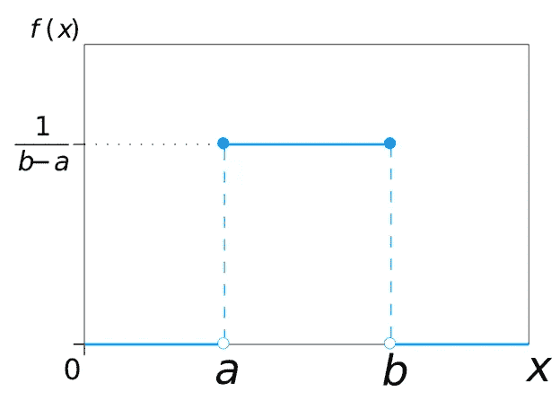
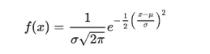
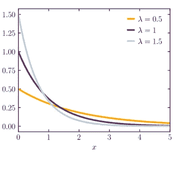
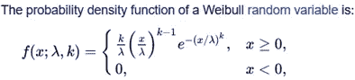
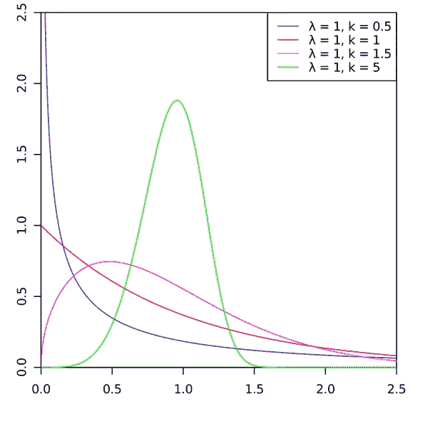

# SimPy 仿真简介

> 原文：<https://towardsdatascience.com/introduction-to-simulation-with-simpy-b04c2ddf1900>

## **第一部分:基础知识**


由[彼得·赫尔曼](https://unsplash.com/@tama66?utm_source=medium&utm_medium=referral)在 [Unsplash](https://unsplash.com?utm_source=medium&utm_medium=referral) 上拍摄的照片

# **什么是模拟？**

模拟是一种广泛使用的解决复杂决策问题的技术。概念上的想法是使用计算机**来模仿**各种类型的真实世界系统的操作。为此，建立并试验被研究系统的数学和/或逻辑**模型**，直到获得足够的知识来解决先前建立的决策问题。

如果该数学模型相对简单，则使用成熟的数学方法(概率论、线性规划、排队论、预测方法)来获得**精确解析解**是可行的。然而，现实世界的设施或过程正变得越来越复杂和精密，使得不可能获得这样的分析解决方案。因此，理解此类系统运行的最佳解决方案是使用被称为模拟的技术。

总而言之，模拟是一种技术，它包括建立被研究系统的数学模型，并**对其进行数值评估**，收集数据**以估计**解决决策问题所需的信息。

# **什么是模型？**

模型是真实系统的简化但有效的表示，目的是代替它进行研究。

模型有几种分类；我们对以下内容特别感兴趣:

1.-描述性与规定性模型:前者描述关系并提供系统性能的输出数据；后者决定所研究系统的最优策略。

2.-确定性与概率性模型:在前者中，假设所有数据都是确定已知的，它们不包含**随机成分；**在后者中，至少有一些随机成分由**概率分布描述。它们也被称为随机模型。**

3.-静态与动态模型:静态模型是在特定时间真实系统的表示；一个动态模型会随着时间而发展。

4.-连续模型与离散模型:在前者中，变量随时间不断变化；在后者中，变量只在分开的时间点改变。

# **什么是离散事件模拟？**

**仿真模型是描述性的，**但它们可以是确定性的或概率性的，静态的或动态的，连续的或离散的。

**离散事件模拟是指对系统随时间演变的建模，其中其变量在不同的时间点发生变化。**由于分析中的系统通常具有某些随机成分，当我们提到离散事件模拟模型时，我们谈论的是**描述性、动态、离散和随机模型。**

缩写 **DES** 用于指代离散事件模拟方法。**事件**被定义为可能改变系统状态的瞬时事件。DES 中的一个基本组件是将模拟时间从一个值推进到下一个值的机制。通常，使用所谓的**下一事件时间提前量**。

与排队、库存、制造和材料处理现实世界系统相关的决策问题是 DES 模拟的应用领域。

# **什么是 SimPy？**

SimPy 是一个基于纯 Python 的**面向对象的**、**基于流程的、**、**离散事件仿真**框架[1]。

让我们描述一下构成前面定义的术语。

根据维基百科:“**面向对象编程** ( **OOP** )是一种基于[对象](https://en.wikipedia.org/wiki/Object_(computer_science))概念的[编程范式](https://en.wikipedia.org/wiki/Programming_paradigm)，它可以包含[数据](https://en.wikipedia.org/wiki/Data)和代码:[字段](https://en.wikipedia.org/wiki/Field_(computer_science))形式的数据(通常称为[属性](https://en.wikipedia.org/wiki/Attribute_(computing))或*属性*)，以及过程形式的代码(通常称为[T37)Python 支持与命令式、过程式编程相结合的 OOP。”[2]](https://en.wikipedia.org/wiki/Method_(computer_science))

仿真建模中有**三种不同的方法**:1)**事件调度**方法；2) **活动扫描**进场；3) **流程交互**方式。在事件调度方法中，未来事件的时间被明确地编码在仿真模型中，并且根据下一事件时间推进机制来调度。活动扫描方法包括检查模拟模型中存在的所有活动，以便确定在下一个模拟时钟推进时可以开始或完成哪一个活动。最后，流程交互方法描述了单个实体在整个系统中的流动，代码模拟了这些实体在它们的路线中的“体验”。 **SimPy 使用流程交互方法。**

之前描述了离散事件模拟。

**SimPy** 为数据分析师提供以下组件，用于开发模拟模型:

*   活动组件:**流程**生成实体，如客户、消息、计算机或排队系统的病人、材料处理系统的车辆、机器、制造的维修工作以及库存系统的供应和需求流程；
*   被动组件:**资源**如服务器、柜台、急诊室、维修人员和用于有限容量拥塞点的隧道。另外两种类型的无源组件，电平和存储，将在下面的文章中描述；
*   **监控变量**用于采集数据进行输出数据分析和绘图。

# 模拟中的概率与统计

由于现实世界的系统表现出高度的随机性，在模拟研究中应用概率和统计的概念变得至关重要。从这个意义上说，识别表征输入数据的概率分布函数**非常重要。在评估模拟模型提供的结果时，统计技术的应用同样重要。**

在第一篇文章中，我们将描述一些在模拟研究中常用的概率分布函数。用于输出数据分析的统计技术将在后面的文章中描述。

第一分类对应于连续或离散的概率分布函数。**连续 PD** 由它们的[密度函数【f(x)】](https://en.wikipedia.org/wiki/Probability_density_function)定义；**离散 PD** 由[概率质量函数](https://en.wikipedia.org/wiki/Probability_mass_function)定义。质量和密度函数都取决于一个或多个**参数**。

参数有三种基本类型:(1)形状；(2)规模；(3)位置。

1.-**形状**参数定义了分布的基本形式。

2.-**标度**参数的值扩大或缩小沿 x 轴的分布。

3.-**位置**参数指定 x 轴上相对于零的相应分布的位置。

不一定，每个概率分布必须具有所有三个参数。有些甚至有一个以上的形状参数值。

让我们描述一下离散事件模拟中最常见的概率分布。

**均匀分布**:表示一个随机变量的连续分布，其最小值( *a* )和最大值( *b* )之间的结果为**等概率**。它为最小值和最大值之间的所有值分配相等的概率。


[https://en .维基百科. org/wiki/Continuous _ uniform _ distribution](https://en.wikipedia.org/wiki/Continuous_uniform_distribution)



[https://commons . wikimedia . org/wiki/File:Uniform _ Distribution _ PDF _ SVG . SVG](https://commons.wikimedia.org/wiki/File:Uniform_Distribution_PDF_SVG.svg)

此分布没有形状参数(常数或平坦)。比例参数是差值( *b-a* )，因为增加( *b-a* )会扩大分布，而减少间隔长度会缩小分布。位置参数是 *a* ，因为它控制沿 x 轴分布的位置。

在模拟研究中，当随机变量的特征不是很清楚时，使用均匀分布。当然，在选择 *a* 和 *b* 的值时，还是要尽量严谨。

**正态分布**:这是一个由**钟形曲线**表示的连续分布。它是*最流行的*概率分布，特点是对称，均值等于中值，大部分密度接近均值。

正态分布的概率密度函数为:



[https://en.wikipedia.org/wiki/Normal_distribution](https://en.wikipedia.org/wiki/Normal_distribution)

其中是均值，σ是方差。


[https://Commons . Wikimedia . org/wiki/File:Normal _ Distribution _ pdf . SVG](https://commons.wikimedia.org/wiki/File:Normal_Distribution_PDF.svg)inductive load，公共领域，通过 Wikimedia Commons

该分布有一个位置参数(平均值)和一个比例参数(方差σ)。

在模拟研究中，正态分布用于表示服务器中的处理时间、机器项目规格中的错误，或几个**自然现象**(几个自然发生变量的变化近似正态分布)。

**指数分布**。这是一个连续分布，其特点是**无记忆属性**:当前时间对未来结果没有影响，下一个事件发生前的时间也遵循相同的分布。


[https://en.wikipedia.org/wiki/Exponential_distribution](https://en.wikipedia.org/wiki/Exponential_distribution)

λ是比例参数，分布没有位置或形状参数。分布的均值为 1/λ，方差为(1/λ)**2。



[https://Commons . Wikimedia . org/wiki/File:Exponential _ probability _ density . SVG](https://commons.wikimedia.org/wiki/File:Exponential_probability_density.svg)new ystats，CC BY-SA 4.0<https://creativecommons.org/licenses/by-sa/4.0>，转自维基共享

它是一个右偏分布，有界于零，只有一个比例参数和一个长的右尾。

在模拟研究中，指数分布被广泛用于表示许多现实世界排队系统中的顾客到达间隔时间。它还用于表示各种设施或行业中的机器、计算机和电子设备的故障间隔时间。习惯上用它来表示排队系统中服务时间的分布，尽管这种假设很少是可信的。

**泊松分布**。它是一种离散分布，广泛用于以某种预定的度量单位(时间或空间)对事件或发生次数进行建模。它的基本假设是:发生是独立的；他们的数量没有限制；事件以恒定的速率发生。在泊松过程中，无论我们考虑的暴露单位有多小，事件都有发生的概率。

因为它是离散分布，所以由它的概率质量函数定义:


【https://en.wikipedia.org/wiki/Poisson_distribution 号

其中λ >=0，出现次数(形状参数)，是平均值，也是方差。


【https://commons.wikimedia.org/w/index.php?curid=3817954】T4By inductive load——自制，Mathematica，Inkscape，公共领域，

在模拟研究中，泊松分布用于模拟排队系统中顾客的到达时间，或者库存系统中每个顾客所需的产品数量。

**威布尔分布**:这是一种连续分布，根据其参数值的不同，可以采取多种不同的形式。



[https://en.wikipedia.org/wiki/Weibull_distribution](https://en.wikipedia.org/wiki/Weibull_distribution)

其中 k > 0 是形状参数，λ > 0 是比例参数。



[https://commons.wikimedia.org/w/index.php?curid=9671814](https://commons.wikimedia.org/w/index.php?curid=9671814)由卡利莫——自己的作品，继菲利普·利奇之后。，CC BY-SA 3.0，

威布尔分布的巨大效用在于，根据其参数取值，它可以近似为指数分布(k = 1)，非常接近正态分布(k = 3.25)，或瑞利分布(k = 2，λ = √2 σ)。

我们在模拟研究中使用威布尔分布来模拟故障分析、疲劳试验和完成一项确定任务的时间。在这种分布中，发生的概率具有记忆性(随时间变化)。

# **为模拟研究生成概率结果**

为了开发我们的离散事件模拟研究，我们首先需要**识别**表征输入数据的概率分布函数。然后，我们需要生成模拟这种分布的数字序列。

从概率分布函数生成的结果被称为**随机变量。**我们说的是**随机数**。在 DES 中，我们将随机数定义为均匀分布在 0 和 1 之间的数。我们需要一种能够生成这样的数列的算法；幸运的是，每一种技术编程语言都有能够提供这种流的算法。

0 和 1 之间均匀分布的数字序列被称为**伪随机数**，因为它们是通过确定性过程生成的。库中包含的算法经过多次统计测试，直到序列尽可能接近真正的随机流。

在 Python 中，有两组随机变量生成函数:(1)来自 Python 标准库中的**随机模块**；(2)来自 **scipy.stats 模块**的随机变量发生器。两者都是基于[**Mersenne Twister**](https://en.wikipedia.org/wiki/Mersenne_Twister)算法，这是松本诚和西村拓治在 1997 年开发的伪数字生成器。这是一款经过充分测试的生成器，基于梅森素数 219937–1，可在 219937–1 的周期内产生 53 位精度浮点。

在模拟研究中，通常**需要再现随机数序列，**尤其是在试图比较同一系统对不同备选方案的响应时。随机数生成器需要一个数字来启动序列(**a**种子值)。默认情况下，它使用当前系统时间。但是，如果需要再现流，每次需要重新开始序列时，都必须编写类似于 *random.seed(1234)* 的代码。因为 Scipy 也使用 Numpy 随机生成器，所以使用 Numpy 种子函数是可行的: *np.random.seed(1234)。*

scipy.stats 模块包括 80 多个连续随机变量和至少 10 个离散随机变量。**产生随机变量的方法是 *rvs* 。**分布的参数(位置、形状、比例)是标准化的形式。阅读相应的文档很重要，因为如前所述，根据发行版的不同，参数的数量可能会有所不同。

要生成 100 个在 1 和 6 之间均匀分布的浮点随机数:

```
from scipy.stats import uniformr_uniform = uniform.rvs(loc = 1, scale = 5, size = 100)
```

要生成 100 个在 1 和 9 之间均匀分布的整数随机数:

```
from scipy.stats import randintr_unif_di = randint.rvs(1,10, loc = 0, size = 100)
```

要生成 100 个正态分布的浮动随机数，其中 0 均值和方差等于 3:

```
from scipy.stats import normr_normal = norm.rvs(loc = 0, scale = 3, size = 100)
```

要生成 100 个指数分布的浮点随机数，平均值等于 1/标度:

```
from scipy.stats import exponr_expon = expon.rvs(scale = 3, size = 100)
```

要生成 100 个具有泊松分布的整数随机数，其形状参数对应于平均值和方差:

```
from scipy.stats import poissonr_poisson = poisson.rvs(0.6, size = 100)
```

生成 100 个形状参数为 c > 0 的威布尔分布的浮点随机数(维基百科图表中的 k)。

```
from scipy.stats import weibull_minr_weibull = weibull_min.rvs(c, size=1000)
```

**总结**:这是致力于介绍 **SimPy、**一个用于模拟研究的 Python 框架系列的第一篇文章。本文的概念是在进入编码阶段之前提供基本概念和原则的概述。

# 参考

[1]:【https://simpy.readthedocs.io/en/latest/ 

【2】:[https://en.wikipedia.org/wiki/Object-oriented_programming](https://en.wikipedia.org/wiki/Object-oriented_programming)

如果你发现了这篇感兴趣的文章，请[阅读我之前的](https://medium.com/@dar.wtz)(https://medium . com/@ Dar . wtz):

**别忘了订阅我的邮箱来接收以下文章。**