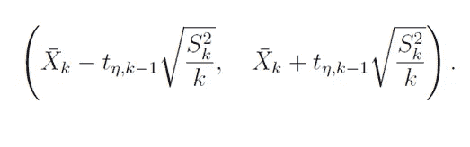
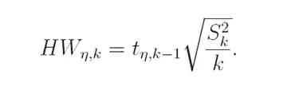
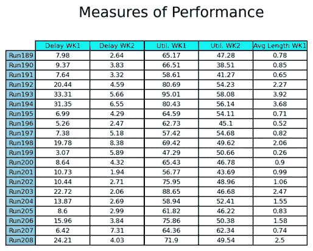
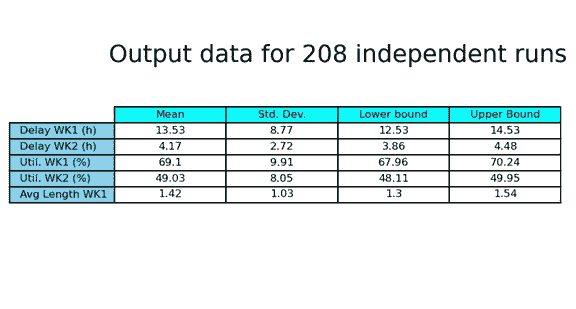

# SimPy 仿真简介

> 原文：<https://towardsdatascience.com/introduction-to-simulation-with-simpy-e27cd7b1ff47>

## **第 5 部分:模拟实验的顺序抽样程序**


照片由[克莱顿·卡迪纳利](https://unsplash.com/@clayton_cardinalli?utm_source=medium&utm_medium=referral)在 [Unsplash](https://unsplash.com?utm_source=medium&utm_medium=referral) 上拍摄

本文是一系列文章中的第五篇，介绍使用 **SimPy** 框架的**离散事件模拟**技术的概念和方法。

在[第 4 篇](/introduction-to-simulation-with-simpy-8e7187c6eb82)中，我们根据指定每次运行长度的预定义事件的发生来区分终止和非终止模拟。此外，在同一篇文章中，我们开始分析模拟研究的输出数据。

模拟技术通常用于评估物理上不存在的系统的性能，或者当希望知道存在的系统中的变化的影响但不需要在现实中执行它们时。

为此，建立被研究系统的数学和/或逻辑**模型**并**进行实验**，直到对系统行为有足够的了解来解决之前建立的业务问题。

这些实验被设计为**统计实验**。通常总结模拟实验输出数据的方式是用[置信区间( **CIs** )](https://en.wikipedia.org/wiki/Confidence_interval) 。在[第 4 篇](/introduction-to-simulation-with-simpy-8e7187c6eb82)中，我们开发了用于终止模拟的输出数据分析，使用名为**固定样本量程序**的程序计算置信区间。这种方法避免了输出数据的一些统计问题，但是分析员不能控制置信区间的宽度。

另一方面，有一个名为**顺序采样**的程序，它允许分析师**获得一个具有预定精度水平的置信区间。**

在第五篇文章中，我们将使用与第四篇文章相同的示例来开发顺序过程，比较结果并指出两个过程的优缺点。

# **绝对精度与相对精度**

在许多模拟研究中，常见的操作模式包括对模型进行编码，并进行任意长度的**单次模拟运行**。从该运行中获得的性能度量被视为所研究模型的相应真实估计。

这一过程是不正确的，因为我们使用从特定概率分布中得出的随机样本(特定的种子值)来浏览我们的模拟模型。我们获得了我们的绩效评估，但是**它们可能有很大的差异**。

因此，为了减少与单次运行相关的方差，相同的模型被运行多次，并且连续的结果被平均以获得点估计量，***【Xk】***。然后，根据图 1 所示的公式构建该点周围的**置信区间**。



图 1:置信区间。

其中 *k* 为运行次数， *tη，k1*为自由度为*k1*的 t 分布的 *(1 + η)/2* 分位数， *S* ₖ 为样本方差。

性能指标估计的**精度**习惯上是指置信区间的半宽度。它由图 2 所示的等式描述:



图 2:置信区间的半宽度。

***Xk*** 的精度可能是**绝对或相对**。

如果对 X 的估计是这样的*│****Xk****——│=图*， ***Xk*** 有一个**绝对误差*图*(绝对精度)。**

如果对 X 的估计是这样的:Xk*│****Xk****——│/││=γ*， ***Xk*** 有一个γ的**相对误差**(相对精度)。

其中为总体均值【1】。

在[第 4 篇](/introduction-to-simulation-with-simpy-8e7187c6eb82)中，我们指出固定样本程序有一个严重的缺点，因为分析员无法控制 IC 的宽度；所以他无法控制估算的精度。因此，如果模拟运行产生的置信区间的半宽度必须强制满足分析师的精度要求，我们必须使用**顺序程序**。

# **顺序程序**

该程序假设 X1，X2，…..Xk 是来自模拟的一系列 *k* 独立且同分布( **IID** )的样本(性能测量)。该程序的目的是获得*T5 的估计值和置信水平为 100(1 — *η* )的置信区间，绝对精度为*。**

*绝对精度的程序如下:*

*1.为置信度选择一个值 *η* (习惯上为 90%或 95%)。*

*2.选择一个值*和*作为特定性能测量和特定研究的精度要求。*

*3.进行 k₀模拟的初始复制，并设置 k = k₀.*

*4.根据图 2 所示的公式计算点估计值和置信区间的半宽度。*

*5.如果 HWn，k > *，*用 k+1 替换 k，再运行一次模拟，然后返回步骤 4。*

*6.当 HWn，k <=*时，*停止，使用 ***Xk*** 作为点估计量，根据图 1 计算最终置信区间。*

*需要注意的是，对于相对精度和实际相对误差 *γ* ，我们必须在步骤 5 和 6 中计算“调整后的”相对误差[1]:*

***HWn，k < = *γ'* ，其中 *γ'= γ/(1+ γ)*** [1]。*

# ***用 SimPy 进行模拟***

*在[第 4 篇](/introduction-to-simulation-with-simpy-8e7187c6eb82)中，我们用 SimPy 模拟了一个专门生产艺术品的工作车间。工件到达车间的速度服从泊松分布，平均速度为每 10 小时 1 个工件。该车间有两个工作站，每台机器一名操作员，所有工作都需要在这两种类型的机器上进行处理。假设每个工作站的加工时间分别为 7 和 5 的指数分布。这家商店按照先进先出(FIFO)的原则安排工作。*

*在第 4 篇文章中，我们使用固定样本程序计算了一些性能指标的置信区间。在本文中，我们将使用上述顺序程序计算**一个具有绝对精度的特定性能指标**。*

*代码如下:*

*首先我们导入了以下库:Pandas、Numpy、SimPy、SciPy 和 Matplotlib。*

```
*import pandas as pd
import numpy  as np
from numpy.random import RandomStateimport simpy
from scipy import stats
import matplotlib.pyplot as plt*
```

*包括一个初始化模块来指示任务到达率、表征处理时间的指数分布的参数以及工作站的数量。数据帧 *df* 将用于存储中间结果。*

```
*# initialization module
# Unit of time = hoursJOBS_ARRIVAL_RATE  = 1/10WORK_STATION1_MEAN = 7
WORK_STATION2_MEAN = 5NUMBER_WORK_STATION1 = 1
NUMBER_WORK_STATION2 = 1column_labels = ["Delay WK1","Delay WK2","Util. WK1",
                 "Util. WK2", "Avg Length WK1"]df = pd.DataFrame(columns=column_labels)*
```

*作业的到达和处理用两个[生成器函数](https://docs.python.org/3/reference/expressions.html#yieldexpr) : 1) *generate_jobs 建模；* 2) *流程 _ 岗位。*我们在打印语句中放了一些##字符，因为我们只将它们用于[验证目的](https://en.wikipedia.org/wiki/Verification_and_validation_of_computer_simulation_models)。*

```
*def generate_jobs(env, arrival_stream, arrival_rate, 
                  inital_delay = 0,
                  stoptime = simpy.core.Infinity, 
                  prng = RandomState(0)): number_of_job = 0
    yield env.timeout(inital_delay)     #Yield the initial delay while (env.now <stoptime):
        inter_arrival_time = prng.exponential(1.0 / arrival_rate)
        los_station1 = prng.exponential(WORK_STATION1_MEAN)
        los_station2 = prng.exponential(WORK_STATION2_MEAN) number_of_job += 1
        jobpr = process_jobs(env, 
           'Job number: {}'.format(number_of_job), number_of_job,
            los_st1 = los_station1, los_st2 = los_station2) env.process(jobpr)
        yield env.timeout(inter_arrival_time)#.................................................................
def process_jobs(env, number_of_job, job_number, los_st1, los_st2): # First Workstation
    ##print("{} is scheduled for workstation 1 
            at hour {:.4f}".format(number_of_job, env.now)) workstation1_schedule_list.append(job_number)
    time_workstation1_schedule_list.append(env.now) jobwk1_request = work_station1.request()
    workstation1_length_list.append(len(work_station1.queue))
    workstation1_timeth_list.append(env.now) yield jobwk1_request
    ##print("{} enters to workstation 1 
            at hour  {:.4f}".format(job_number, env.now)) workstation1_operation_list.append(job_number)
    time_workstation1_operation_list.append(env.now)
    workstation1_length_list.append(len(work_station1.queue))
    workstation1_timeth_list.append(env.now) ##if (env.now > jobwk1_request_time):
        ##print("{} has to wait {:.4f} hours".format(job_number, 
                env.now - jobwk1_request_time)) yield env.timeout(los_st1)
    work_station1.release(jobwk1_request)
    workstation1_release_list.append(job_number)
    time_workstation1_release_list.append(env.now)# Second Workstation
    ##print("{} is scheduled for workstation 2 at hour 
            {:.4f}".format(job_number, env.now)) workstation2_schedule_list.append(job_number)
    time_workstation2_schedule_list.append(env.now) jobwk2_request = work_station2.request()
    yield jobwk2_request ##print("{} enters to workstation 2 at hour  
            {:.4f}".format(job_number, env.now)) workstation2_operation_list.append(job_number)
    time_workstation2_operation_list.append(env.now) ##if (env.now > jobwk2_request_time):
      ##print("{} has to wait {:.4f} hours".format(job_number, 
              env.now-jobwk2_request_time)) yield env.timeout(los_st2)
    work_station2.release(jobwk2_request)
    workstation2_release_list.append(job_number)
    time_workstation2_release_list.append(env.now)*
```

*函数 *calc_measures()* 允许我们计算性能的模型度量:*

```
*def calc_measures(): # Construct dataframes prior to calculations df_wk1_schdl['Job Number']   = workstation1_schedule_list
   df_wk1_schdl['Job Time Sc1'] = time_workstation1_schedule_list
   df_wk2_schdl['Job Number']   = workstation2_schedule_list
   df_wk2_schdl['Job Time Sc2'] = time_workstation2_schedule_list df_wk1_opert['Job Number']   = workstation1_operation_list
   df_wk1_opert['Job Time Op1'] = time_workstation1_operation_list 
   df_wk2_opert['Job Number']   = workstation2_operation_list
   df_wk2_opert['Job Time Op2'] = time_workstation2_operation_list df_wk1_reles['Job Number']   = workstation1_release_list
   df_wk1_reles['Job Time Rl1'] = time_workstation1_release_list
   df_wk2_reles['Job Number']   = workstation2_release_list
   df_wk2_reles['Job Time Rl2'] = time_workstation2_release_list df_merge = pd.merge(df_wk1_schdl, df_wk1_opert, on='Job Number', how='left')
   df_merge = pd.merge(df_merge,     df_wk1_reles, on='Job Number', how='left')
   df_merge = pd.merge(df_merge,     df_wk2_schdl, on='Job Number', how='left')
   df_merge = pd.merge(df_merge,     df_wk2_opert, on='Job Number', how='left')
   df_merge = pd.merge(df_merge,     df_wk2_reles, on='Job Number', how='left')#.......................................
# Computing measures of performance
# Average Delay in Queues df_merge['Delay Wk1'] = df_merge['Job Time Op1'] - df_merge['Job Time Sc1']
   df_merge['Delay Wk2'] = df_merge['Job Time Op2'] - df_merge['Job Time Sc2']
    mean_delay_wk1 = df_merge['Delay Wk1'].mean()
    mean_delay_wk2 = df_merge['Delay Wk2'].mean() print('  ')
    print('Measures of Performance for Run: %1d' %(run+1) )
    print(' ')
    print('The average delay in queue for workstation 1 is %.2f hours'  % (mean_delay_wk1)) print('The average delay in queue for workstation 2 is %.2f hours'  % (mean_delay_wk2))#............................................
# Utilization of the Servers
    for i in range(0, len(df_merge)-1): workstation1_utilization_list.append(df_merge['Job Time Op1'][i+1] - df_merge['Job Time Rl1'][i])
         workstation2_utilization_list.append(df_merge['Job Time Op2'][i+1] - df_merge['Job Time Rl2'][i]) wk2_sum_idle = np.nansum(workstation2_utilization_list)
    utilization_wk1 = round((1 - wk1_sum_idle / stop_arrivals) * 100, 2)
    utilization_wk2 = round((1 - wk2_sum_idle / stop_arrivals) * 100, 2) print(' ')
    print('The utilization of the workstation 1 is %.2f%%'  % (utilization_wk1))
    print('The utilization of the workstation 2 is %.2f%%'  % (utilization_wk2))
#...............................................
# Time weighted average of the queue length df_l1 = pd.DataFrame(workstation1_length_list, 
                         columns = ['len'])
    df_t1 = pd.DataFrame(workstation1_timeth_list,
                         columns = ['time'])
    df_qlength1 = pd.concat([df_l1, df_t1], axis = 1)# use the next row to figure out how long the queue was at that length
    df_qlength1['delta_time'] = df_qlength1['time'].shift(-1) - df_qlength1['time']# drop the last row because it would have an infinite time span
    df_qlength1 = df_qlength1[0:-1]
    len_avg_wk1 = np.average(df_qlength1['len'],
                             weights = df_qlength1['delta_time']) print(' ')
    print('The time weighted length of the workstation 1 is %.2f'  % (len_avg_wk1))
#.....................................................
# list and dataframe for final output listoflists = []
    listoflists.append(round(mean_delay_wk1,2))
    listoflists.append(round(mean_delay_wk2,2))
    listoflists.append(utilization_wk1)
    listoflists.append(utilization_wk2)
    listoflists.append(round(len_avg_wk1,2)) df.loc[len(df)] = listoflists*
```

*接下来，描述用于计算置信区间的函数( *calc_ICs()* )。当所选性能测量的置信区间的半宽度小于先前定义的绝对精度时，我们将布尔变量( *l_end* )设置为 *True* 。*

```
*def calc_ICs(): ## confidence intervals
    ## define 3 global variables
    global df_output, hwic, l_end mean = round(df.mean(),2)
    sigma= round(df.std(ddof=1),2)
    dof  = len(df) -1 t_crit = np.abs(stats.t.ppf((1-confidence)/2,dof))
    inf, sup = (mean-sigma*t_crit/np.sqrt(len(df)),    
                mean+sigma*t_crit/np.sqrt(len(df))) inf = round(inf,2)
    sup = round(sup,2)
    hwic= (sup-inf)/2 if hwic[0] <= abs_err_delay_wk1:
        l_end = True print('')
    print(round(hwic[0],2),abs_err_delay_wk1, l_end )  
    df_output = pd.concat([mean, sigma, inf, sup], axis=1)
    print(df_output)*
```

*我们编写了函数 *print_output()* 来显示最近 20 次独立运行的性能度量，并打印输出数据表，显示每个性能度量的样本均值、样本标准差以及 CIs 的**下限和上限**。*

```
*def print_output():     # Table showing measures of performance 
      for the last 20 independent runs df_last_20 = df.tail(20)
     row_labels = ['Run' + str(i+1) for i in range(run+1-20, run+1)] fig, ax = plt.subplots(1,1)
     ax.axis('tight')
     ax.axis('off') runs_table = ax.table(cellText = df_last_20.values,
                  colLabels = df.columns, rowLabels = row_labels,   
                  rowColours =["skyblue"]*(20),
                  colColours =["cyan"]*5,
                  cellLoc='center', loc="center") ax.set_title("Measures of Performance", 
                   fontsize=18, y= 1.2 , pad = 4) runs_table.auto_set_font_size(False)
     runs_table.set_fontsize(8)
     plt.savefig(your_path +'twoWKs_perf_measures.png',
                 bbox_inches='tight', dpi=150)
     plt.show()
#..................................................... ## Output Data Table
    col_labels = ["Mean", "Std. Dev.", "Lower bound", "Upper Bound"] row_labels = ["Delay WK1 (h)","Delay WK2 (h)",
                  "Util. WK1 (%)","Util. WK2 (%)","Avg Length WK1"] fig, ax = plt.subplots(1,1)
    ax.axis('tight')
    ax.axis('off') output_table = ax.table(cellText = df_output.values,
                   colLabels = col_labels, rowLabels = row_labels,
                   rowColours =["skyblue"]*5,
                   colColours =["cyan"]*4,
                   cellLoc='center', loc="center") ax.set_title("Output data for %i independent runs" %(run+1),
                 fontsize=18,y= 0.8, pad = 4) output_table.auto_set_font_size(False)
    output_table.set_fontsize(8)
    plt.savefig(your_path +'twoWKs_output_perf_measures.png',
                bbox_inches='tight', dpi=150)
    plt.show()*
```

*置信度为 90%、绝对精度为 1.0、*k**= 10(*if run>= 10:*)的仿真算法的核心是:**

```
**confidence = 0.90
abs_err_delay_wk1 = 1.00
l_end = Falseinit_numb_of_runs = 500
numb_of_runs = init_numb_of_runsseed_value = 2345
prbnumgen  = RandomState(seed_value)
hours_run_sim = 30 * 24
stop_arrivals = 720           ## for the verification stepfor run in range(numb_of_runs): workstation1_schedule_list, workstation2_schedule_list = [],[]
   workstation1_operation_list,workstation2_operation_list= [],[]
   workstation1_release_list,  workstation2_release_list  = [],[] time_workstation1_schedule_list, time_workstation2_schedule_list  = [],[]
   time_workstation1_operation_list,time_workstation2_operation_list = [],[]
   time_workstation1_release_list,  time_workstation2_release_list   = [],[] workstation1_length_list, workstation1_utilization_list = [],[]
   workstation1_timeth_list, workstation2_utilization_list = [],[] mean_delay_wk1,  mean_delay_wk2  = [],[]
   utilization_wk1, utilization_wk2 = [],[]
   len_avg_wk1,     len_avg_wk2     = [],[]
   listoflists = [] df_wk1_schdl = pd.DataFrame(columns = ['Job Number', 'Job Time Sc1'])
   df_wk2_schdl = pd.DataFrame(columns = ['Job Number', 'Job Time Sc2'])
   df_wk1_opert = pd.DataFrame(columns = ['Job Number', 'Job Time Op1'])
   df_wk2_opert = pd.DataFrame(columns = ['Job Number', 'Job Time Op2'])
   df_wk1_reles = pd.DataFrame(columns = ['Job Number', 'Job Time Rl1'])
   df_wk2_reles = pd.DataFrame(columns = ['Job Number', 'Job Time Rl2']) # Set up the simulation environment
   env = simpy.Environment() work_station1 = simpy.Resource(env, NUMBER_WORK_STATION1)
   work_station2 = simpy.Resource(env, NUMBER_WORK_STATION2) env.process(generate_jobs(env, "Type1", JOBS_ARRIVAL_RATE, 0, 
               stop_arrivals, prbnumgen)) env.run(until = hours_run_sim)
   calc_measures() if run >= 10:
      calc_ICs() if l_end == True:
         print_output() 
         break**
```

# ****分析****

**在第 4 篇文章中，我们使用固定样本量的方法计算了一些性能指标的置信区间。我们在每次运行中使用不同的随机数流进行了 **10 次独立复制**。表 1 显示了工作站 1 中的延迟、工作站 2 中的延迟、工作站 1 & 2 忙碌的时间百分比以及队列 1 的时间加权平均长度的平均值、标准偏差以及 CIs 的下限和上限。分析师认为一些置信区间太大，对商业目的没有意义。**

****

**表 1，作者用 Matplotlib 做的。**

**由于分析师无法控制 CIs 的精度，他决定使用前面代码中指示的顺序程序。他为工作站 1 的延迟设定了 90%的置信度和 1.0 的**绝对精度。他选择 30*24 = 720 小时的模拟时间作为终止模拟的终止事件，两个工作站都空闲作为初始条件。for 循环**外的种子值*2345*2345**(*for run in range(number _ of _ runs):*)用于完成跨运行的统计独立性。****

**表 2 显示了研究中最后 20 次独立运行的性能测量值。我们需要 208 次运行来获得期望的绝对精度。表 2 中显示的估计值的较大方差清楚地表明**模拟输出数据**的随机性质以及计算每个性能测量的 ci 的需要。**

****

**表 2，作者用 Matplotlib 做的。**

**表 3 总结了模拟研究的输出数据。它显示了 208 次独立运行后我们的性能测量的平均值、标准偏差和置信区间的下限和上限。**我们以大约 90%的把握宣称，1 号工作站的延迟包含在区间【12.53，14.53】小时**内。工作站 1 中延迟的置信区间宽度等于 2，因此 IC 的半宽度满足分析师的精度要求。对于该性能测量，从固定样本程序获得的值可以观察到非常重要的差异。**

****

**表 3，作者用 Matplotlib 做的。**

**置信区间被定义为包含具有指定概率的真值的区域。我们必须为我们想要构建的每个配置项定义置信度。还有一个与 CIs 相关的重要量:**覆盖概率**。置信水平是程序的 ***名义覆盖概率*** 。*覆盖概率*是区间包含真均值的实际概率。如果在推导置信区间中使用的所有假设都满足，则标称覆盖概率将等于覆盖概率。但是，如果不满足某些假设，实际覆盖概率可能小于或大于名义覆盖概率[2]。**

**尽管顺序程序显著减小了 IC 的半宽度，但在覆盖方面并不总是表现良好。覆盖范围可能会有所不同，因为在模拟实验期间不满足 CI 的假设，或者输出数据的分布与程序假设的分布不同。此外，**覆盖率对选择**非常敏感。在任何情况下，**我们必须意识到使用顺序程序可能会导致严重的承保范围损失。****

**在下面的文章中，我们将继续分析模拟研究中存在的这些和其他重要的统计问题。**

**[1]: Law，A.M. & Kelton，W.D. (2000)模拟建模与分析。波士顿麦格劳希尔公司。**

**[2]:[https://en.wikipedia.org/wiki/Coverage_probability](https://en.wikipedia.org/wiki/Coverage_probability)**