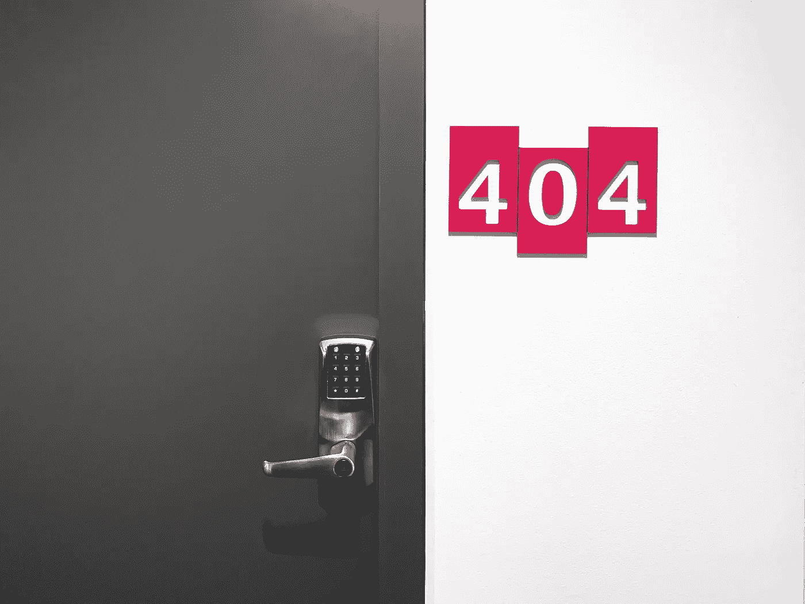
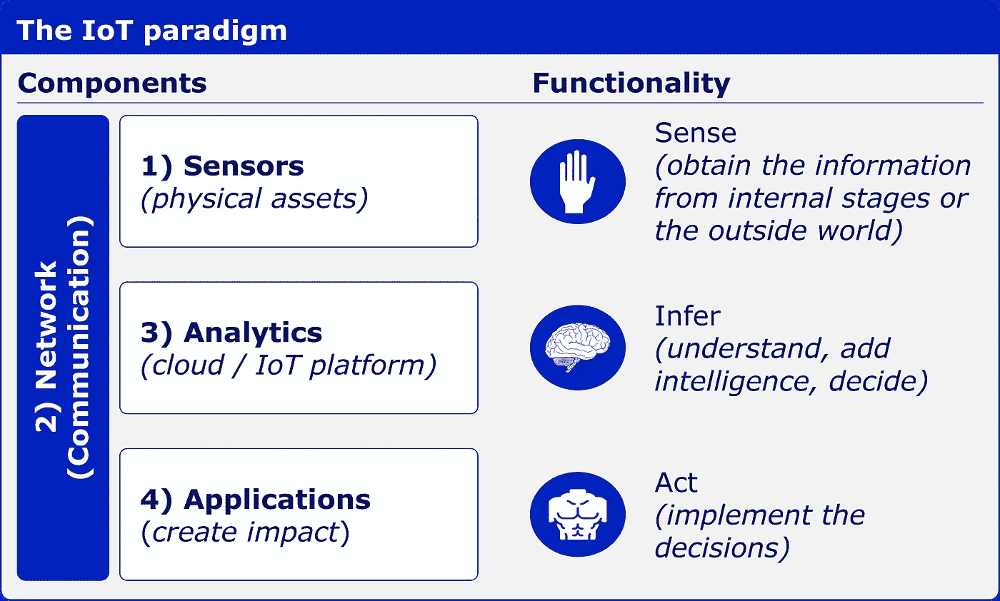

# 面向数据科学家的物联网简介:示例和挑战

> 原文：<https://towardsdatascience.com/introduction-to-the-internet-of-things-for-data-scientists-examples-and-challenges-d1053735d232>

## 【2022 年最大趋势

## *了解它是什么以及与传统数据科学的区别*

照片由[rom son preech wit](https://unsplash.com/@woodies11)在 [Unsplash](https://unsplash.com/photos/Vy2cHqm0mCs) 拍摄

物联网(IoT)终于起飞了。

[2022 年，全球将有 144 亿台](https://iot-analytics.com/number-connected-iot-devices)联网物联网设备。与前一年相比，增长了 18%。

2022 年物联网市场规模为[4783.6 亿美元](https://www.fortunebusinessinsights.com/press-release/internet-of-things-iot-market-9155)，而企业物联网市场份额约为[的三分之一](https://iot-analytics.com/iot-market-size/)。

[预计 2025 年将产生 80 zettabytes](https://www.statista.com/statistics/1017863/worldwide-iot-connected-devices-data-size/) 的物联网数据。

有人需要分析这些数据。

## **什么是物联网？**

1999 年，麻省理工学院(MIT)在射频 IDs 的背景下首次使用了“物联网”一词。物联网的定义标准是物理和数字体现*、*，即通过使用和连接信息来增强“事物”的能力。

物联网没有考虑人类同步生成和消费数据。此外，纯网络环境中的传感器不被视为物联网系统。

从技术上讲， [*物联网是通过互联网接入的*](https://www.bbvaopenmind.com/en/technology/digital-world/internet-of-things-iot-the-third-wave/) *物理对象的网络。这些对象包含与内部状态或外部环境交互的嵌入式技术。换句话说，当事物能够感知和交流时，它会改变决策的方式和地点以及决策人。”*

这意味着物联网解决方案由四个组件组成:传感器、网络(通信)、分析(云)和应用。

*图片改编自 Isabelle Flückiger 和 Matteo Carbone 的报告《从风险转移到风险防范——物联网如何重塑保险业的商业模式》*

这四个组成部分允许利用信息做出比传统的不相连的物理世界更智能的行动。这种“互联事物”的增强是通过三种不同的应用程序实现的:

**监控**，也就是说，它为做出决策和管理物理世界中的情况提供洞察力

*   通过智能手机传感器评估身体活动
*   在智能手机上显示智能门铃中的视频
*   发动机上的传感器发出的需要维护的早期警告
*   超市冰箱温度的记录

**远程控制，**即 it**需要一些执行器(电子、机械、液压、气动或声音执行器)，这些执行器在物理世界中实现由人作出的远程决策**

*   苹果“查找我的”应用程序中的“播放声音”
*   在高风险情况下，连接洗衣机和滚筒式干衣机的安全远程禁用功能
*   建筑物暖通空调或安全系统的远程控制

**自动化，**即不需要人工干预，由简单或更高级的算法做出决定

*   智能关闭阀
*   制造工厂中的装配机器人
*   基于摄像头的访问管理
*   仓库中的自主库存管理机器人

## **有哪些应用实例？**

物联网应用覆盖全球经济的所有领域，物联网在企业和消费者业务中的使用正在走向成熟。

因此，让我们看几个例子，展示物联网驱动的见解的广泛应用。

**智能家居** 你可能听说过一个智能恒温器，用于监控远程温度和供暖，或者一个智能运动传感器，可以检测盗窃行为，并区分主要居民、他们的宠物和窃贼。

但是应用程序可以变得更加复杂。

智能门环结合运动传感器。基于综合数据的洞察，系统对居民的安全性做出结论。例如，假设门打开了特定的一段时间，并且组合了运动或不运动数据。在这种情况下，如果住户可能没有关门就离开了公寓，应用程序可以得出结论。当居民是最终可能患有痴呆症的老年人时，会向该人及其联系人或应急小组发送警报。

这类应用需要实时、高度准确的结果，且假阳性率低。

**医疗保健** 可穿戴设备可以带来个性化的健康建议，从身体运动、睡眠和基于识别模式的营养建议开始。

工业环境中的可穿戴设备包含衣服、手套或鞋子中的传感器，并通过警报和预防创建更安全的工作场所。这些传感器每秒钟收集几个生理和环境数据。

数据洞察通过两种方式提供给员工。

首先，它们直接传递给处于危险情况下的员工，需要通过升级触觉、听觉和视觉警报进行立即干预，以实时防止危险行为。

其次，它确定了领先的指标风险因素，如弯曲、扭曲和倾斜运动数据。在新的轮班之前，工人得到他们个人的健康风险行为模式，以及在伤害发生之前如何纠正风险行为的建议。雇主直接获得财务数据，例如，当工人正确提升时节省的成本，即使他们需要更多的时间，但防止了公司的后续成本。这种系统平均减少了 45%的伤害。

此类系统处理实时、动态数据，必须在数小时内提供实时警报和建议的行动。此外，需要解决数据隐私问题。

**车辆** 汽车中先进的远程信息处理系统包括一个边缘带人工智能的摄像头、全球定位系统和一个加速度计来检测冲击，即它可以检测各种强度的冲击。

这些设备提供两种类型的辅助。首先，它集成了实时风险缓解警报，并通过后视镜附近的语音和显示器警告驾驶员危险情况。这种系统的复杂性很高，因为它需要平衡防止危险情况和分散驾驶员的注意力。因此，根据自己的驾驶风格和环境背景，警报仅限于非常危险的情况，例如交通堵塞或降雪。

第二，在硬电击的情况下，警报以及在某些情况下，电击发生前 10 秒和电击发生后 5 秒的 15 秒视频被传送到专门的呼叫中心。根据这些信息，他们决定采取进一步的行动，比如报警或叫救护车。有了 GPS 数据，位置就知道了。这在夜间或非市区驾驶以及汽车偏离道路时尤其有用。可以节省宝贵的救援时间。

这种系统结合了实时数据、边缘计算、几秒钟内的精确动作建议、流数据、地理空间数据、时态数据和数据隐私的许多挑战。

**工业制造** 数字孪生是物理对象或过程的数字复制品。在工业制造过程中，每个过程阶段都由传感器和摄像机监控。所有数据都被传输到数字孪生机，并不断与目标值进行核对。分析偏差，并将反馈发送回机器，并基于边缘的机器学习算法进行调整和优化。

这种系统是数据驱动制造的高级艺术，集成了实时、动态、时态、大容量和稀疏数据，并结合了云计算和边缘计算。

还有更多物联网应用，如智能城市、能源部门、农业或交通。

## **物联网的数据科学需要什么？**

虽然物联网世界中有许多令人兴奋的数据科学应用，但与传统的数据科学应用相比，它也面临着一些额外的挑战。这些示例表明，物联网数据科学家必须精通以下主题。

**实时数据** 数据从标记、结构化、聚合到分析都必须实时进行。结果必须实时可用。你需要不同的数据管理方法和技术来管理实时数据。

**数据到洞察再到行动(反馈到系统)** 光有来自数据的洞察是不够的。物联网系统需要对机器的给定动作进行反馈。洞察力必须能够被机器和/或人解释和理解，并立即明确地转化为行动。必须相应地设计流程，以便直接根据这些见解采取行动。

**洞察和行动必须在数小时、数分钟和数秒内可用** 自动化在每个数据科学流程阶段都至关重要。反馈和行动必须及时且持续地传输回物联网设备或在物联网设备中生成。没有时间进行人工干预。大多数情况下，这些动作是机器对机器交互的一部分。

**数据是动态的** 数据是实时收集和分析的。这意味着数据会实时动态变化。算法必须反映自动调整。这些模型必须整合从实时数据中进行的持续学习。

**数据是时态的** 所有数据都是时间相关的。模型和算法必须考虑到这一点。因此，通常时间序列分析和信号处理的方法是综合的。

**数据量** 很少有数据科学领域需要处理如此大量的数据。物联网设备产生的数据比社交媒体多。整个数据科学流程，从收集、预处理、算法分析，到生成见解和建议，都必须能够实时处理海量数据。

**稀疏数据** 即使数据量巨大，但大部分数据都是噪音。感兴趣的信号很少，通常很弱，如在事故发生前几周预测生产机器故障的异常，或与预期生产质量的微小偏差。找到这些见解并将其转化为准确的行动需要独特的方法来分析稀疏数据。

**地理空间数据** 不用说，地理空间数据的数量本身就是一个挑战。它链接了位置信息(三维)、时间信息和对象的属性。它有不同的校准标准，理解高维原始数据需要大量的高等数学知识。

**边缘计算
边缘计算需要在设备上直接做出决策，例如向驾驶员或工人发出警报。这需要其他方法，这些方法可以利用有限的处理能力和知识来有效地在边缘和云计算之间进行划分。**

**需要高精度(安全性和成本敏感性)** 洞察必须高度准确，并且假阳性和假阴性都应该很低。实时反馈给人和机器。错误的反馈会使工人面临危险，或导致机器或流程故障。

**物联网设备敏锐度** 每个传感器和设备都有自己的属性，例如数据的准确性和质量、传输技术(Wi-Fi、射频、蓝牙等。).由于技术的改进，三个月后制造的设备已经具有比三个月前制造的相同类型稍有不同的特性。获得准确的见解需要深入了解特定物联网设备的属性。

**数据管理** 物联网数据的数据管理存在各种挑战。从海量数据到不同传感器和设备的异构性、云和边缘之间的高效管理、所有数据科学阶段的即时处理，再到向设备提供反馈。数据管理系统必须服务于这一切。

**缩放** 更换或添加传感器会改变数据格式、精度、类型和容量。在开发这样的物联网生态系统之前，必须考虑和设计这些扩展方面。

**网络安全** 信息物理物联网系统需要针对网络攻击的适当保护。没有人希望整个生产工厂停工，或者在暗网上发布敏感的健康数据。这必须从一开始就整合，并且需要与网络安全专家密切合作。

**数据隐私** 许多国家都知道数据隐私法，尤其是健康数据。即使没有法律存在，保护客户数据不被滥用的内在利益仍然存在。导致声誉受损和客户流失会损害企业的盈利能力，导致诉讼和罚款。

**行为经济学** 对工人和人类的反馈和建议行动需要进行沟通、组织和激励，以改变行为，例如预防健康问题。许多研究表明，反馈只有在根据行为经济学原理构建时才会被接受和执行。

这些挑战显示了物联网数据科学的复杂性。所需的知识远远超出了通常的数据科学课程。

## **将点点滴滴连接起来**

在物联网应用中担任数据科学家是数据科学的最高艺术。当你正在寻找你的下一个挑战，并希望提高你的数据科学技能时，我建议考虑进入物联网数据科学领域。

具有特定物联网分析技能的数据科学家需求量很大。在 LinkedIn 上，可以在美国和欧洲找到大约 8，500 个空缺职位。它提供了使用尖端方法和技术的机会。

让我们开始这激动人心的旅程。

# 你喜欢我的故事吗？

通过 [***加入我的电子邮件列表***](https://isabelleflueckiger.medium.com/subscribe) ***，*** 每次我发布新的故事，你都会收到通知，通过成为媒介会员，你将拥有 [***访问数千篇鼓舞人心的文章***](https://isabelleflueckiger.medium.com/membership) 。

**阅读下一篇:** [*从 24 小时黑客马拉松学到的防止 ML 项目失败的 5 点经验*](/5-learnings-from-a-24-hour-hackathon-to-prevent-ml-project-failures-f659ea998a42?sk=a8eaef9d0ffc7ceefde17bbe4ad229b1)[*机器学习在医疗保健中应用的 10 个激动人心的例子*](/10-exciting-examples-of-machine-learning-applications-in-healthcare-1c4de7b744e6?sk=67b81c2d8fb0363018b5a625eafe5d8f)[*作为数据科学初学者应该避免的 10 个错误*](/10-mistakes-you-should-avoid-as-a-data-science-beginner-ec1b14ea1bcd?sk=0c072e794c974da18ee84a77bb8a1218)