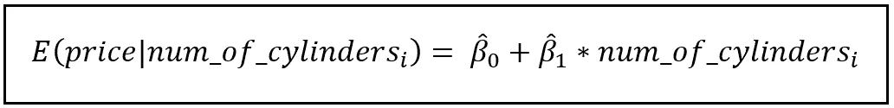
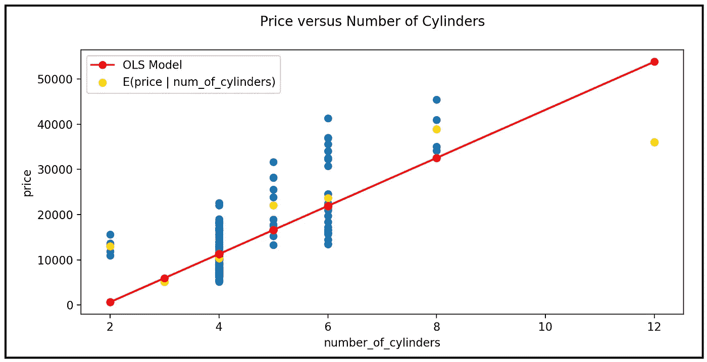
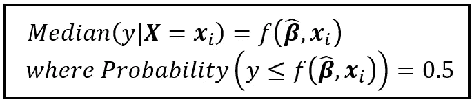
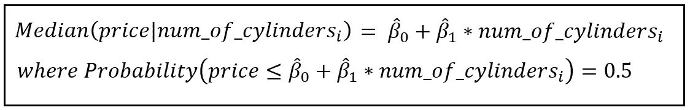
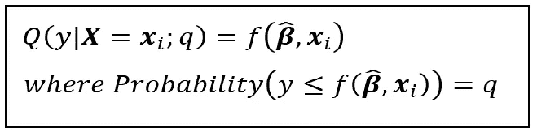
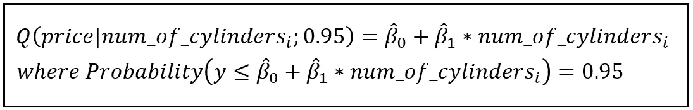
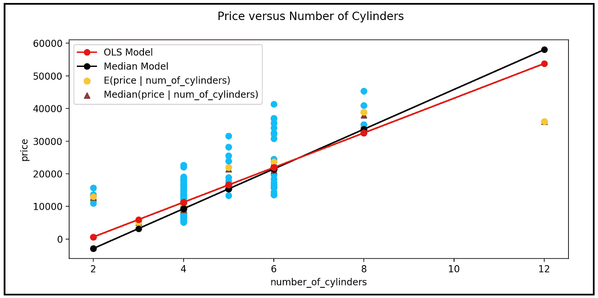
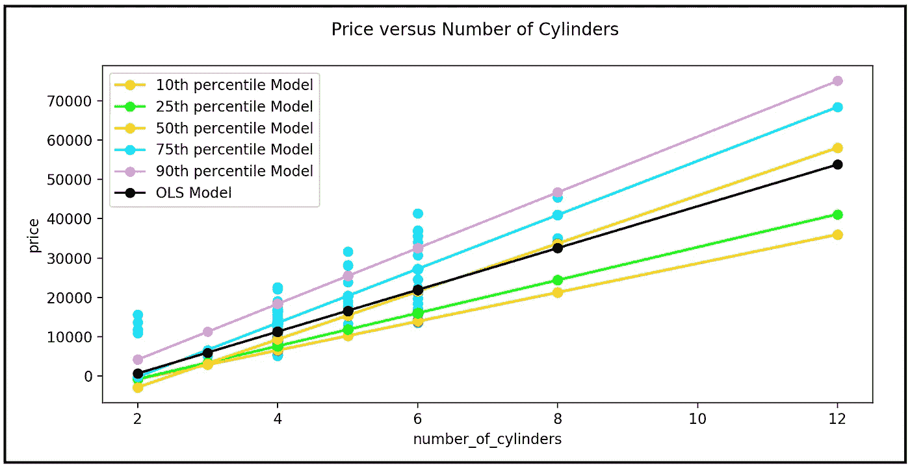
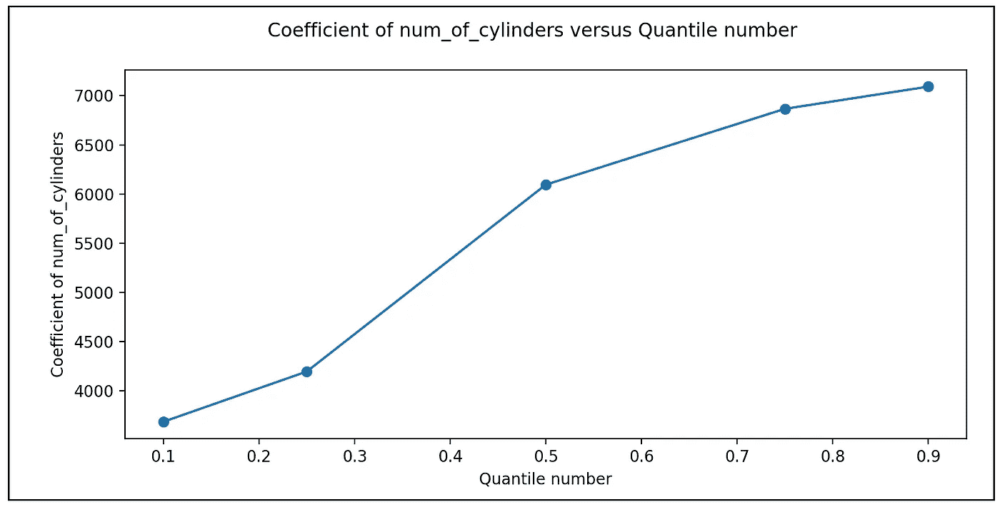

# 分位数回归模型简介

> 原文：<https://towardsdatascience.com/introduction-to-the-quantile-regression-model-648a0532f534>


图片来自 [Pixabay](https://pixabay.com/vectors/pie-chart-diagram-statistics-parts-149727/) ( [Pixabay 许可](https://pixabay.com/service/license/))

## 我们将看看如何预测中位数和其他分位数点

在回归模型中，人们通常对估计响应变量的条件均值感兴趣。例如，考虑以下汽车价格与气缸数量的关系图:


价格与气缸数量。金色圆点代表条件均值: *E(价格|汽缸数量)*(图片由作者提供)(数据集: [UCI ML 汽车](https://archive-beta.ics.uci.edu/ml/datasets/automobile)用在 [CC BY 4.0](https://creativecommons.org/licenses/by/4.0/legalcode) )

金点代表观察到的基于圆柱体数量的平均价格。

如果我们想使用回归模型来估计这个条件平均价格，我们可以使用以下线性模型来完成这项工作:



估计汽车价格的线性模型(图片由作者提供)

如果我们将上述线性模型与数据拟合，并绘制其估计值，我们会得到以下图表:



经过训练的 OLS 模型的趋势线绘制在原始数据之上。红点是估计的条件平均价格，而金点是观察到的条件平均价格(图片由作者提供)

对于其他类型的数据，可以采用更复杂的模型，如[泊松](/generalized-poisson-regression-for-real-world-datasets-d1ff32607d79)或[考克斯比例风险](/the-stratified-cox-proportional-hazards-regression-model-fa1fa5de2bb1)模型。在所有情况下，我们都要求模型估计条件平均值。

**但是在一些数据集中，平均值并不是数据的好样本**。

以下是三个数据集示例，对于这些数据集，平均值可能不是合适的估计统计值:

*   数据严重向左或向右倾斜。在保险索赔或医疗保健费用数据中经常出现这种情况，其中大多数索赔金额较小，但数据中有一条价值不断增加的索赔长尾。
*   数据是多模态的，即它有一个以上的高频率出现值。例如，如果数据有两个大致相同的峰(双峰数据集)，均值模型将估计两个峰之间的谷内点，该点不能很好地代表数据。
*   数据包含有影响的异常值。依赖于最小化残差平方和的普通最小二乘回归模型等回归模型对异常值的存在高度敏感。在这种情况下，除了*而不是*使用平均值作为要估计的量之外，最小化残差绝对值的和可能是有益的。

在所有这些情况下，平均值不足以代表数据的性质。估计**条件中位数**可能更好。

在最一般的术语中，我们的“寻找中值”回归模型将由以下等式指定:



一个回归模型，为某个值 **X** 估计 y 的条件中位数(图片由作者提供)

上式中， ***X*** 为回归矩阵，***X****_ I*为矩阵的第*行*行。***β****_ cap*是*拟合*回归系数和 *f(.)*是**_ cap***和***x****_ I*的一些函数，用于估计约束条件下的概率估计值*f(***_ cap，****x*******

****例如，用于估计汽车中间价格的模型，其中*f(****β****_ cap、****x****_ I)*具有**线性形式**将是:****

********

****估算汽车中位价格的模型(图片由作者提供)****

****我们甚至可以更进一步。在数据集中，中位数是 0.5 分位数(或第 50 百分位)点，这意味着 50%的数据点小于中位数的值。类似地，还可以定义其他分位数点。0.1 分位数点(第 10 个百分点)是这样的值，即只有 10%的数据集小于该值。类似地，0.25 分位数点的值大于数据集的 25%，依此类推。****

****我们可能希望建立一个回归模型来估计任何或所有这些分位数点(或相应的百分位值)。****

****这种模型的一般方程如下:****

********

****q 分位数回归模型的一般方程(图片由作者提供)****

****上式中， *Q(。)*是 q 分位数(或第(q*100)个百分点)的估计分位数点。如前所述，*f(****β****_ cap，****x****_ I)*是产生期望的 q 分位数点的估计值的函数，该函数受到 *y* 的任何观测值小于或等于估计值*f(****β****的概率的约束 *q* 范围从 0 到 1，包括 0 和 1。*****

***例如，用于估计汽车的第 95 百分位价格的模型，其中*f(****β****_ cap、****x****_ I)*具有**线性形式**将是:***

******

***给定气缸数量，估算第 95 百分位汽车价格的模型(图片由作者提供)***

# ***分位数回归模型的用途是什么？***

***当数据在数据集的每个分位数中以不同的方式分布时，拟合不同的回归模型以满足每个分位数的独特建模需求，而不是尝试拟合预测条件均值的一刀切模型，可能会更有利。在这种情况下，所有这些分位数模型的系数将互不相同。***

***相反的情况是，数据在每个分位数中分布相同。具体地，估计条件均值的模型的误差项对于每个***×****_ I*具有相同的分布。例如，所有***x****_ I*的误差呈正态分布，并且所有分布的均值和方差都相同。换句话说，**误差是同分位数** c。可以看出，在这种情况下，当不同的分位数回归模型拟合同分位数数据集时，所有模型的相应系数集将在统计上完全相同，并且*各种分位数模型仅在回归截距的值上彼此不同。事实上，这种行为可以构成异方差测试的基础。****

***建立分位数模型的另一个原因是，我们实际上对估计一个特定的分位数感兴趣，比如说，社会经济原因。例如，我们可能想要估计具有相同人口统计学特征的考生的第 95 百分位 SAT 分数。***

***在下一节中，我们将浏览一个简短的教程，学习如何使用 Python 构建分位数模型。***

# ***如何使用 Python 和 statsmodels 构建分位数回归模型***

***我们将使用以下车辆数据集来说明构建分位数回归模型的过程，该数据集包含取自 1985 年版的沃德汽车年鉴的 200 多辆汽车的规格。每行包含一组 26 个关于单个车辆的规格:***

******

***汽车数据集(来源:<https://archive-beta.ics.uci.edu/ml/datasets/automobile>[CC BY 4.0](https://creativecommons.org/licenses/by/4.0/legalcode)下加州大学欧文分校***

***这些数据的子集可以从这里 下载 [**。**](https://gist.github.com/sachinsdate/402daa205e93a389d0f7023439588774)***

***让我们将数据集加载到熊猫数据框架中，并绘制数据集。***

```
***import** pandas **as** pd
**import** statsmodels.api **as** sm
**import** statsmodels.formula.api **as** smf
**from** patsy **import** dmatrices
**import** numpy **as** np
**from** matplotlib **import** pyplot **as** plt***#Import the 7-variable subset of the automobiles dataset into a DataFrame***df = pd.**read_csv**(**'automobiles_dataset_subset_uciml.csv'**, **header**=0)***#Plot price versus num_of_cylinders*** fig = plt.**figure**()fig.**suptitle**(**'Price versus Number of Cylinders'**)plt.**xlabel**(**'number_of_cylinders'**)
plt.**ylabel**(**'price'**)plt.**scatter**(**x**=df[**'num_of_cylinders'**], **y**=df[**'price'**])*
```

***让我们也画出条件均值 *E(价格|气缸数量):****

```
*num_of_cylinders = np.**array**(df.**groupby**('num_of_cylinders')['num_of_cylinders'].**mean**())conditional_means = np.**array**(df.**groupby**('num_of_cylinders')['price'].**mean**())

plt.scatter(**x**=num_of_cylinders, **y**=conditional_means, **color**='gold', **marker**='o')

plt.**show**()*
```

***我们得到了下图。金点代表有条件的意思:***

******

***价格与气缸数量。金点代表条件均值: *E(价格|缸数)*(图片由作者提供)***

***接下来，让我们用 [Patsy](https://patsy.readthedocs.io/en/latest/quickstart.html) 语法定义回归模型的方程。截距假定为:***

```
*reg_exp = **'price ~ num_of_cylinders'***
```

***我们将使用这个表达式来雕刻出 ***y*** 和 ***X*** 矩阵:***

```
*y_train, X_train = **dmatrices**(reg_exp, df, **return_type**='dataframe')*
```

***我们将首先建立并训练一个普通的最小二乘(OLS)回归模型，该模型为给定的*气缸数量*值估计条件平均*价格*，并在散点图上绘制回归线:***

```
****#Build and train an OLS regression model***
olsr_model = sm.**OLS**(**endog**=y_train, **exog**=X_train)
olsr_model_results = olsr_model.**fit**()
**print**(olsr_model_results.**summary**())

***#Plot the OLS regression line on the scatter plot of Price versus num_of_cylinders*** fig = plt.**figure**()
fig.**suptitle**('Price versus Number of Cylinders')
plt.**xlabel**('number_of_cylinders')
plt.**ylabel**(**'**price**'**)
plt.**scatter**(**x**=df['num_of_cylinders'], **y**=df['price'])***#Get the estimated conditional means from the trained OLS model*** y_pred_ols = olsr_model_results.**predict**(X_train)***#Plot the estimated conditional means*** ols, = plt.**plot**(X_train['num_of_cylinders'], y_pred_ols,
    **color**=**'**red**'**, **marker**=**'**o**'**, **linestyle**=**'**solid**'**, **label**=**'**OLS Model**'**)***#Also plot the observed conditional means i.e. E(price | num_of_cylinders)*** conditional_mean_pts = plt.**scatter**(**x**=num_of_cylinders, **y**=conditional_means, **c**=**'**gold**'**, **marker**=**'**o**'**, **label**='E(price | num_of_cylinders)')

plt.**legend**(**handles**=[ols, conditional_mean_pts])plt.**show**()*
```

***我们看到下图:***

******

***经过训练的 OLS 模型的趋势线绘制在原始数据之上。红点是估计的条件平均价格，而金点是观察到的条件平均价格(图片由作者提供)***

***现在让我们开始处理中位数和其他分位数点。***

***我们将首先训练一个模型，该模型将估计条件中值，即*中值(price|num_of_cylinders)* 。***

***让我们创建一个分位数回归模型的实例，如下所示:***

```
*median_model = smf.**quantreg**(**formula**=reg_exp, **data**=df)*
```

***接下来，我们将训练模型。我们将告诉 statsmodels 我们希望符合条件中位数，即 0.5 分位数点:***

```
*median_model_results = median_model.**fit**(**q**=0.5)*
```

***现在，让我们在原始*价格*对*气缸数量*数据的背景下，绘制该模型的估计条件中值点。为了进行比较，我们还将绘制我们之前构建的 OLS 模型的估计条件均值，并且我们还将绘制条件均值和条件中值的观察值以进行比较。***

***下面这段 Python 代码完成了所有这些工作:***

```
*fig = plt.figure()fig.suptitle(**'Price versus Number of Cylinders'**)plt.xlabel(**'number_of_cylinders'**)
plt.ylabel(**'price'**)***#Show the scatter plot of price versus num_of_cylinders*** plt.**scatter**(**x**=df[**'num_of_cylinders'**], **y**=df[**'price'**], **c**=**'deepskyblue'**)***#Get the estimated conditional medians from the median model*** y_pred_median = median_model_results.**predict**(X_train)***#Plot the estimated conditional medians*** median, = plt.plot(X_train[**'num_of_cylinders'**], y_pred_median,
    color=**'black'**, marker=**'o'**, linestyle=**'solid'**,  label=**'Median Model'**)***#For comparison, also plot the estimated conditional means from the OLS model we built earlier*** ols, = plt.plot(X_train[**'num_of_cylinders'**], y_pred_ols,
    color=**'red'**, marker=**'o'**, linestyle=**'solid'**,  label=**'OLS Model'**)***#Calculate the observed conditional medians*** conditional_medians = np.array(df.**groupby**(**'num_of_cylinders'**)[**'price'**].median())***#Plot the observed conditional medians*** conditional_median_pts = plt.scatter(x=num_of_cylinders, y=conditional_medians, c=**'sienna'**, marker=**'^'**, label=**'Median(price | num_of_cylinders)'**)***#For comparison, plot the observed conditional means*** conditional_mean_pts = plt.scatter(x=num_of_cylinders, y=conditional_means, c=**'gold'**, marker=**'o'**, label=**'E(price | num_of_cylinders)'**)***#Set up the legend and show the plot*** plt.legend(handles=[ols, median, conditional_mean_pts, conditional_median_pts])

plt.show()*
```

***我们看到下面的情节:***

******

***来自 OLS 模型的预测条件均值(红色)和来自分位数模型的条件中位数(黑色)，叠加在原始数据上的观察条件均值(金色圆点)和观察条件中位数(黑色三角形)(图片由作者提供)***

***我们从图中注意到的一点是，条件中位数和条件均值点的观察值几乎相互重叠，这意味着价格数据在均值附近或多或少是平衡的。OLS 和中位数回归模型的趋势线证明了这一点，它们彼此非常接近，尤其是朝着数据的中心部分。***

***让我们也为其他几个分位数点绘制回归线，比如，[0.1，0.25，0.5，0.75，0.9]。***

```
*fig = plt.**figure**()fig.**suptitle**('Price versus Number of Cylinders')plt.**xlabel**('number_of_cylinders')
plt.**ylabel**('price')plt.**scatter**(**x**=df[**'**num_of_cylinders**'**], **y**=df[**'**price**'**])coeff = []
colors = [**'orange'**, **'lime'**, **'yellow'**, **'cyan'**, **'violet'**]
i=0
handles = []
quantiles = [0.1, 0.25, 0.5, 0.75, 0.9]**for** q **in** quantiles:
 ***#Build the model***quantile_model = smf.**quantreg**(**formula**=reg_exp, **data**=df) ***#Fit the model***quantile_model_results = quantile_model.**fit**(**q**=q) **print**(quantile_model_results.**summary**()) coeff.**append**(quantile_model_results.**params**[**'**num_of_cylinders**'**]) ***#Get the estimated values from the quantile model***y_pred_quantile = quantile_model_results.**predict**(X_train) ***#Plot the estimated values***quantile, = plt.**plot**(X_train[**'**num_of_cylinders**'**], y_pred_quantile, **color**=colors[i], **marker**=**'**o**'**, **linestyle**=**'**solid**'**,  **label**=str(int(q*100))+'th percentile Model') i = i+1
    handles.**append**(quantile)

***#Also plot the estimated values from the OLS model for comparison*** ols, = plt.plot(X_train[**'num_of_cylinders'**], y_pred_ols,
    color=**'black'**, marker=**'o'**, linestyle=**'solid'**, label=**'OLS Model'**)

handles.**append**(ols)
plt.**legend**(**handles**=handles)plt.show()*
```

***下面是这个情节的样子:***

******

***各种分位数模型的预测图叠加在原始数据上(天蓝色)。OLS 模型的预测(黑色)供参考(图片由作者提供)***

***如果来自 OLS 模型的误差是同分布的，换句话说，如果误差是同分布的，所有分位数模型的趋势线将仅在截距上不同，即它们将彼此平行。这显然不是我们在这种情况下看到的，让我们相信 OLS 模型的误差是异方差的。***

****气缸数*的估计系数相对于分位数的曲线得出以下曲线，该曲线仅加强了上述结论:***

******

***各种分位数模型的估计气缸数系数与分位数的关系图(图片由作者提供)***

***我们注意到的另一件事是，*气缸数*对汽车*价格*的[部分效应](/understanding-partial-effects-main-effects-and-interaction-effects-in-a-regression-model-54e8a127c62d)(即*气缸数*的系数)随着分位数的增加而增加，表明较高的分位数价格比较低的分位数价格对气缸数的变化更敏感。例如，与第 80 百分位价格相比，第 90 百分位车辆价格随着气缸数量的每一单位变化而变化更多。***

***下面是本文中使用的完整源代码:***

# ***参考文献、引文和版权***

## ***数据集***

*****汽车数据集**由 4.0 来源于 [CC 下的](https://creativecommons.org/licenses/by/4.0/legalcode) [UCI ML 数据集库](https://archive-beta.ics.uci.edu/ml/datasets/automobile)。***

## ***形象***

***本文中所有图片的版权归 [CC-BY-NC-SA](https://creativecommons.org/licenses/by-nc-sa/4.0/) 所有，除非图片下面提到了不同的来源和版权。***

****如果你喜欢这篇文章，请关注我的*[***Sachin Date***](https://timeseriesreasoning.medium.com)*获取关于回归、时间序列分析和预测主题的提示、操作方法和编程建议。****