# Word2Vec 简介(跳过程序)

> 原文：<https://towardsdatascience.com/introduction-to-word2vec-skip-gram-cb3e9533bcf1>

## NLP 基础

## Python 中的单词嵌入简介

当处理文本数据时，我们需要将文本转换成数字。用数字数据表示文本有不同的方式。单词包(又名 BOW)是一种用数字表示文本的流行而简单的方法。然而，单词包中没有单词相似性的概念，因为每个单词都是独立表示的。因此，像*、【太棒了】、*、【太棒了】、*这样的单词的嵌入彼此之间的相似性，就像它们与单词*、【书】、*的嵌入一样。*

单词嵌入是用数字表示文本的另一种好方法。使用这种方法，每个单词都由一个嵌入的密集向量(即一个数字数组)来表示。该方法保留了单词之间的关系，并且能够捕获单词相似性。出现在相似上下文中的单词在向量空间中具有更近的向量。因此，单词*‘伟大’*很可能比*‘书’*有更多与*‘牛逼’*相似的嵌入。


由 [Sebastian Svenson](https://unsplash.com/@sebastiansvenson?utm_source=medium&utm_medium=referral) 在 [Unsplash](https://unsplash.com?utm_source=medium&utm_medium=referral) 上拍摄的照片

在本文中，我们将对单词嵌入进行概述，尤其是一种称为 Word2Vec 的嵌入算法，并深入了解该算法如何在 Python 中的一个玩具示例上运行。

# 📜Word2Vec (Skipgram)概述

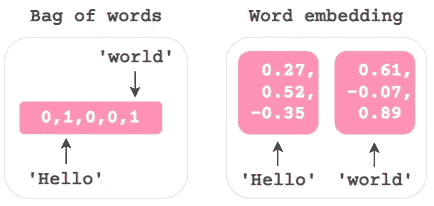

图片作者|预处理一个示例文档的对比:“Hello world！”有两种方法。假设单词包方法的词汇量为 5，单词嵌入的嵌入量为 3。

当使用单词包方法时，我们通过 *n* 将文本转换成一个 *m* 的文档术语矩阵，其中 *m* 是文档/文本记录的数量，而 *n* 是所有文档中唯一单词的数量。这通常会产生一个很大的稀疏矩阵。如果你想详细了解这种方法，请查看本教程。

在单词嵌入中，每个单词由一个向量表示，通常大小为 [100 到 300](https://datascience.stackexchange.com/a/51549) 。Word2Vec 是一种创建嵌入的流行方法。Word2Vec 背后的基本直觉是这样的:*我们可以通过观察一个单词的上下文/邻居*来获得关于它的有用信息。在 Word2Vec 中，我们可以使用两种架构或学习算法来获得单词的矢量表示(只是另一个用于嵌入的单词):C *连续单词包*(又名 *CBOW)* 和 S *kip-gram* 。
◼️ **CBOW:** 预测*焦点词*给定周边*上下文词*t17】◼️**跳跃式:**预测*上下文词*给定*焦点词*(本文的重点)

在现阶段，这可能没有太大意义。我们将很快看到一个例子，这将变得更加清楚。

当使用 Skip-gram 算法训练嵌入时，我们在高层次上经历以下三个步骤:
◼️ **获取文本:**我们从未标记的文本语料库开始——所以这是一个无监督的学习问题。
◼️ **变换数据:**然后，我们对数据进行预处理，并将预处理后的数据重新排列成作为特征的焦点词和作为虚拟监督学习问题的目标的上下文词。所以，它变成了一个多分类问题，其中 P(上下文词|焦点词)。下面是一个在单个文档中可能出现的情况的示例:

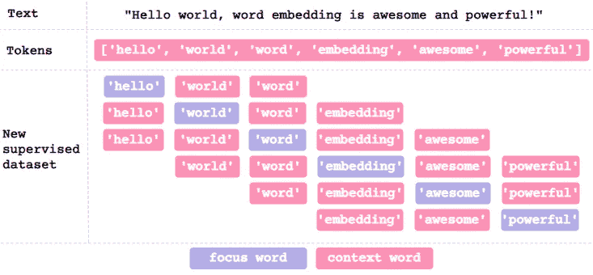

作者图片|我们首先将文本预处理成标记。然后，对于作为焦点单词的每个标记，我们找到窗口大小为 2 的上下文单词。这意味着我们将焦点单词前后的两个标记视为上下文单词。我们可以看到，在这样一个小的示例文本中，并不是所有的标记前后都有 2 个标记。在这些情况下，我们使用可用的令牌。在这个例子中，我们不严格地、可互换地使用术语单词和令牌。

同一个特性有多个目标可能会让人难以想象。以下是考虑如何准备数据的另一种方式:

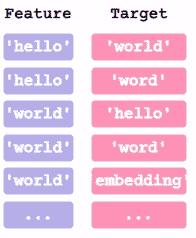

作者图片

本质上，我们准备特征和目标对。
◼️ **建立一个简单的神经网络:**然后，我们使用新构建的数据集为监督学习问题训练一个具有单个隐藏层的简单神经网络。我们训练神经网络的主要原因是从隐藏层获得训练的权重，该隐藏层成为单词嵌入。出现在相似上下文中的单词的嵌入倾向于彼此相似。

概述完之后，是时候用 Python 实现它来巩固我们所学的内容了。

# 🔨Python 中的 Word2Vec

由于这篇文章的重点是开发算法如何工作的更好的直觉，我们将专注于自己构建它，而不是使用预先训练的 Word2Vec 嵌入来加深我们的理解。

> *🔗*免责声明:在开发这篇文章的代码时，我大量使用了以下资源库:
> ◼️ [单词嵌入创建](https://github.com/Eligijus112/word-embedding-creation)作者[埃利吉尤斯 112](https://github.com/Eligijus112) (他的媒体页面:[埃利吉尤斯布约卡斯](https://eligijus-bujokas.medium.com/))
> ◼️[word 2 vec _ numpy](https://github.com/DerekChia/word2vec_numpy)作者 [DerekChia](https://github.com/DerekChia)
> 
> 我要感谢这些了不起的作者让他们的有用的工作为他人所用。如果您想加深对 word2vec 的理解，他们的存储库是很好的额外学习资源。

## 🔨带 Gensim 的 Word2vec

经过他的允许，我们将使用来自 [Eligijus112](https://github.com/Eligijus112) 知识库的[这个样本玩具数据集](https://github.com/Eligijus112/word-embedding-creation/blob/master/input/sample.csv)。让我们导入库和数据集。

```
import numpy as np
import pandas as pd
from nltk.tokenize.regexp import RegexpTokenizer
from nltk.corpus import stopwords
from gensim.models import Word2Vec, KeyedVectors
from scipy.spatial.distance import cosineimport tensorflow as tf
from tensorflow.keras import Sequential
from tensorflow.keras.layers import Input, Denseimport matplotlib.pyplot as plt
import seaborn as sns
sns.set(style='darkgrid', context='talk')text = ["The prince is the future king.",
        "Daughter is the princess.",
        "Son is the prince.",
        "Only a man can be a king.",
        "Only a woman can be a queen.",
        "The princess will be a queen.",
        "Queen and king rule the realm.", 
        "The prince is a strong man.",
        "The princess is a beautiful woman.",
        "The royal family is the king and queen and their children.",
        "Prince is only a boy now.",
        "A boy will be a man."]
```

我们现在将非常轻松地对文本进行预处理。让我们创建一个函数，它将文本小写，将文档标记为字母标记，并删除停用词。

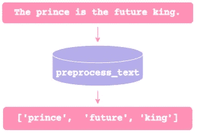

作者图片

预处理的级别可以随实现的不同而不同。在一些实现中，可以选择做很少的预处理，保持文本几乎原样。另一方面，你也可以选择做一个比这个例子更彻底的预处理。

```
def preprocess_text(document):
    tokeniser = RegexpTokenizer(r"[A-Za-z]{2,}")
    tokens = tokeniser.tokenize(document.lower())
    key_tokens = [token for token in tokens 
                  if token not in stopwords.words('english')]
    return key_tokens

corpus = []
for document in text:
    corpus.append(preprocess_text(document))
corpus
```

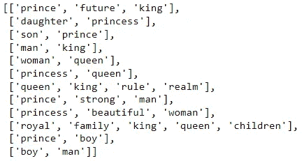

作者图片

现在每个文档都由令牌组成。我们将在自定义语料库上使用 Gensim 构建 Word2Vec:

```
dimension = 2
window = 2word2vec0 = Word2Vec(corpus, min_count=1, vector_size=dimension, 
                     window=window, sg=1)
word2vec0.wv.get_vector('king')
```

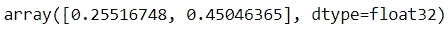

作者图片

我们为上下文选择大小为 2 的`window`。这意味着我们将在焦点标记之前和之后查看 2 个标记。`dimension`也被设置为 2。这是指向量的大小。我们选择 2 是因为我们可以很容易地在二维图表中将其可视化，并且我们正在使用一个非常小的文本语料库。这两个超参数可以用不同的值来调整，以提高用例中单词嵌入的有用性。在准备 Word2Vec 时，我们通过指定`sg=1`来确保使用 Skip-gram 算法。一旦嵌入准备就绪，我们就可以看到令牌的嵌入`'king'`。

让我们看看嵌入有多直观。我们会挑选一个样本词:`'king'`，看看向量空间中与它最相似的词是否有意义。让我们找出与`'king'`最相似的 3 个词:

```
n=3
word2vec0.wv.most_similar(positive=['king'], topn=n)
```

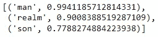

作者图片

这个元组列表显示了与`'king'`最相似的单词及其余弦相似度。鉴于我们使用的数据非常少，这个结果还不错。

让我们为词汇表准备一个嵌入的数据框架，这是唯一标记的集合:

```
embedding0 = pd.DataFrame(columns=['d0', 'd1'])
for token in word2vec0.wv.index_to_key:
    embedding0.loc[token] = word2vec0.wv.get_vector(token)
embedding0
```

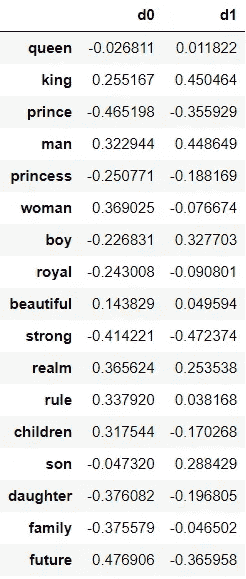

作者图片

现在，我们将可视化二维向量空间中的记号:

```
sns.lmplot(data=embedding0, x='d0', y='d1', fit_reg=False, aspect=2)
for token, vector in embedding0.iterrows():
    plt.gca().text(vector['d0']+.02, vector['d1']+.03, str(token), 
                   size=14)
plt.tight_layout()
```

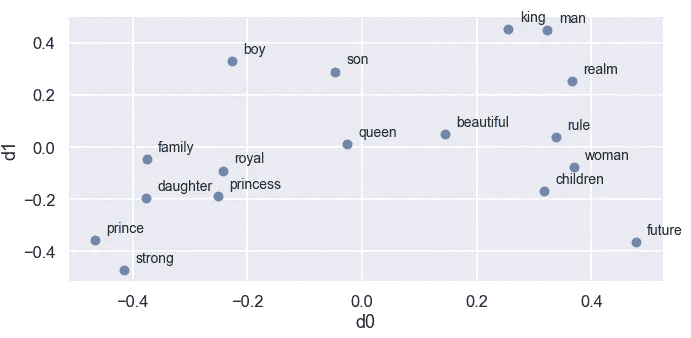

作者图片

> 🔗如果你想了解更多关于 Gensim 中 Word2Vec 的知识，这里有一个由 Gensim 的创建者 Radim Rehurek 编写的教程。

好吧，这是个不错的热身。在下一节中，我们将创建一个嵌入我们自己的 Word2Vec。

## 🔨手动 Word2Vec —方法 1

我们将从语料库中查找词汇开始。我们将为词汇表中的每个标记赋值:

```
vocabulary = sorted([*set([token for document in corpus for token in 
                           document])])
n_vocabulary = len(vocabulary)
token_index ={token: i for i, token in enumerate(vocabulary)}
token_index
```

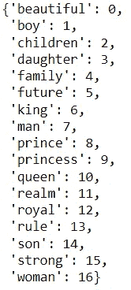

作者图片

现在，我们将制作标记对作为神经网络的准备。

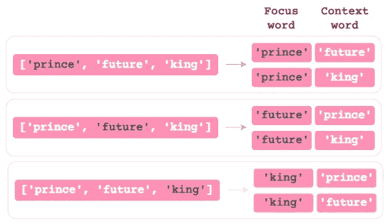

作者图片

```
token_pairs = []for document in corpus:
    for i, token in enumerate(document):
        for j in range(i-window, i+window+1):
            if (j>=0) and (j!=i) and (j<len(document)):
                token_pairs.append([token] + [document[j]])n_token_pairs = len(token_pairs)
print(f"{n_token_pairs} token pairs")token_pairs[:5]
```

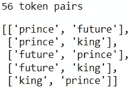

作者图片

令牌对已经准备好了，但是它们仍然是文本形式。现在我们需要对它们进行一次热编码，以便它们适用于神经网络。

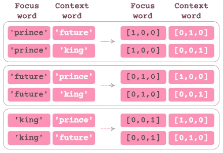

作者图片

```
X = np.zeros((n_token_pairs, n_vocabulary))
Y = np.zeros((n_token_pairs, n_vocabulary))for i, (focus_token, context_token) in enumerate(token_pairs):    
    X[i, token_index[focus_token]] = 1
    Y[i, token_index[context_token]] = 1
print(X[:5])
```

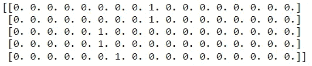

作者图片

现在输入数据已经准备好了，我们可以建立一个只有一个隐藏层的神经网络:

```
tf.random.set_seed(42)
word2vec1 = Sequential([
    Dense(units=dimension, input_shape=(n_vocabulary,), 
          use_bias=False, name='embedding'),
    Dense(units=n_vocabulary, activation='softmax', name='output')
])
word2vec1.compile(loss='categorical_crossentropy', optimizer='adam')
word2vec1.fit(x=X, y=Y, epochs=100)
```

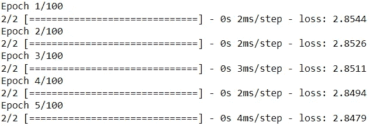

作者图片

我们指定隐藏层没有偏见条款。因为我们希望隐藏层有线性激活，我们不需要指定。图层中的单元数反映了矢量的大小:`dimension`。

让我们从隐藏层中提取权重，我们的嵌入。

```
embedding1 = pd.DataFrame(columns=['d0', 'd1'])
for token in token_index.keys():
    ind = token_index[token]
    embedding1.loc[token] = word2vec1.get_weights()[0][ind]
embedding1
```

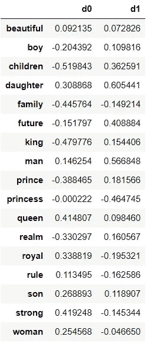

作者图片

使用我们的新嵌入，让我们看看与`'king'`最相似的 3 个单词:

```
vector1 = embedding1.loc['king']
similarities = {}for token, vector in embedding1.iterrows():
    theta_sum = np.dot(vector1, vector)
    theta_den = np.linalg.norm(vector1) * np.linalg.norm(vector)
    similarities[token] = theta_sum / theta_densimilar_tokens = sorted(similarities.items(), key=lambda x: x[1], 
                        reverse=True)
similar_tokens[1:n+1]
```


作者图片

太好了，这说得通。我们可以保存嵌入并使用 Gensim 加载它们。一旦加载到 Gensim，我们可以检查我们的相似性计算。

```
with open('embedding1.txt' ,'w') as text_file:
    text_file.write(f'{n_vocabulary} {dimension}\n')
    for token, vector in embedding1.iterrows():
        text_file.write(f"{token} {' '.join(map(str, vector))}\n")
text_file.close()embedding1_loaded = KeyedVectors.load_word2vec_format('embedding1.txt', binary=False)
embedding1_loaded.most_similar(positive=['king'], topn=n)
```

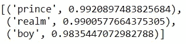

作者图片

Gensim 计算的相似性与我们的手动计算相匹配。

我们现在将可视化向量空间中的嵌入:

```
sns.lmplot(data=embedding1, x='d0', y='d1', fit_reg=False, aspect=2)
for token, vector in embedding1.iterrows():
    plt.gca().text(vector['d0']+.02, vector['d1']+.03, str(token), 
                   size=14)
plt.tight_layout()
```

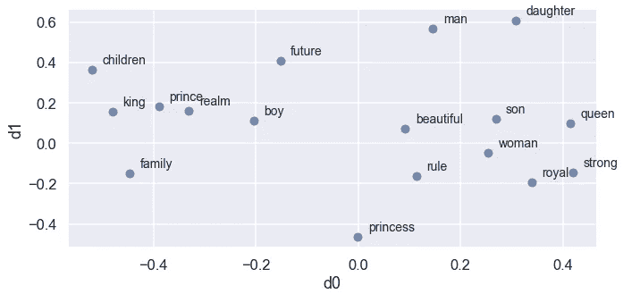

作者图片

在下一节中，我们将利用面向对象的编程方法手动创建单词嵌入。

## 🔨手动 Word2Vec —方法 2

我们将从创建一个名为`Data`的类开始，它集中了与数据相关的任务:

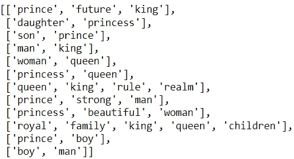

作者图片

我们可以看到,`corpus`属性看起来和前面几节中的一样。

```
len([token for document in data.corpus for token in document])
```

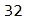

作者图片

我们的玩具语料库中有 32 个代币。

```
len(data.focus_context_data)
```


作者图片

与之前不同的是，`data.focus_context_data`没有被格式化为标记对。相反，这 32 个标记中的每一个都与它们所有的上下文标记映射在一起。

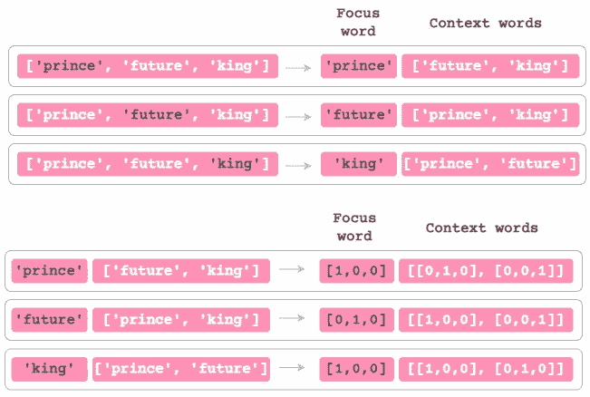

作者图片

```
np.sum([len(context_tokens) for _, context_tokens in 
        data.focus_context_data])
```

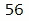

作者图片

像以前一样，我们总共还有 56 个上下文标记。现在，让我们将关于 Word2Vec 的代码集中在一个对象中:

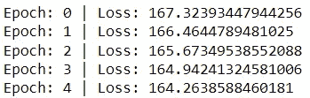

作者图片|仅部分输出

我们刚刚训练了我们的自定义 Word2Vec 对象。让我们检查一个样本向量:

```
word2vec2.extract_vector('king')
```

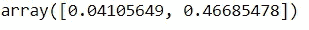

作者图片

我们现在来看看与`'king'`最相似的三个词:

```
word2vec2.find_similar_words("king")
```


作者图片

这很好。是时候将嵌入转换成数据帧了:

```
embedding2 = pd.DataFrame(word2vec2.w1, columns=['d0', 'd1'])
embedding2.index = embedding2.index.map(word2vec2.data.index_token)
embedding2
```

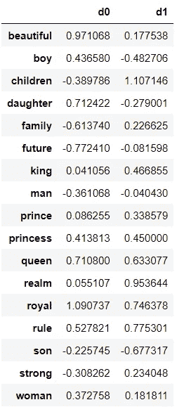

作者图片

我们现在可以很容易地看到新的嵌入:

```
sns.lmplot(data=embedding2, x='d0', y='d1', fit_reg=False, aspect=2)
for token, vector in embedding2.iterrows():
    plt.gca().text(vector['d0']+.02, vector['d1']+.03, str(token), 
                   size=14)
plt.tight_layout()
```

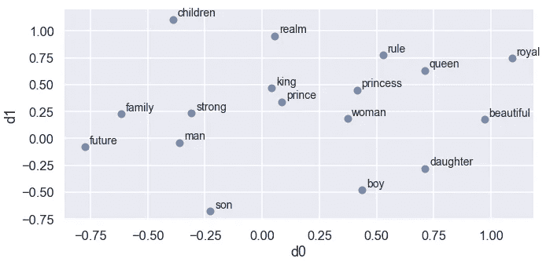

作者图片

正如我们之前所做的那样，我们可以再次保存嵌入并使用 Gensim 加载它，然后进行检查:

```
with open('embedding2.txt' ,'w') as text_file:
    text_file.write(f'{n_vocabulary} {dimension}\n')
    for token, vector in embedding2.iterrows():
        text_file.write(f"{token} {' '.join(map(str, vector))}\n")
text_file.close()embedding2_loaded = KeyedVectors.load_word2vec_format('embedding2.txt', binary=False)
embedding2_loaded.most_similar(positive=['king'], topn=n)
```

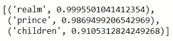

作者图片

在计算余弦相似度寻找相似词时，我们这次用了`scipy`。除了浮点精度误差，这种方法与 Gensim 的结果相匹配。

这就是这篇文章的全部内容！希望您已经对什么是单词嵌入以及 Word2Vec 如何使用 Skip-gram 算法生成单词嵌入有了基本的了解。到目前为止，我们关注的是用于 NLP 的 Word2Vec，但是这种技术对于推荐系统也是有帮助的。[这里](http://mccormickml.com/2018/06/15/applying-word2vec-to-recommenders-and-advertising/)有一篇关于这方面的深刻文章。如果你想了解更多关于 Word2Vec 的知识，这里有一些有用的资源:
◼️ [第二讲|单词向量表示法:word 2 vec—YouTube](https://www.youtube.com/watch?v=ERibwqs9p38)
◼️[Google code archive—Google code project hosting 的长期存储](https://code.google.com/archive/p/word2vec/)
◼️ [word2vec 参数学习讲解](https://arxiv.org/pdf/1411.2738.pdf)


由 [Milad Fakurian](https://unsplash.com/@fakurian?utm_source=medium&utm_medium=referral) 在 [Unsplash](https://unsplash.com?utm_source=medium&utm_medium=referral) 上拍摄的照片

*您想要访问更多这样的内容吗？媒体会员可以无限制地访问媒体上的任何文章。如果您使用* [*我的推荐链接*](https://zluvsand.medium.com/membership)*成为会员，您的一部分会费将直接用于支持我。*

谢谢你看我的帖子。如果你感兴趣，这里有我的一些帖子的链接:

◼️️ [管道、ColumnTransformer 和 FeatureUnion 解释](/pipeline-columntransformer-and-featureunion-explained-f5491f815f?source=your_stories_page-------------------------------------)◼️️[feature union、ColumnTransformer &管道用于预处理文本数据](/featureunion-columntransformer-pipeline-for-preprocessing-text-data-9dcb233dbcb6)t5】◼️[用这些提示丰富您的 Jupyter 笔记本](/enrich-your-jupyter-notebook-with-these-tips-55c8ead25255)
◼️ [用这些提示组织您的 Jupyter 笔记本](/organise-your-jupyter-notebook-with-these-tips-d164d5dcd51f)
◼️ [解释 Scikit-用 SHAP 学习模型](/explaining-scikit-learn-models-with-shap-61daff21b12a)
◼️️ [在 scikit 中选择特性](/feature-selection-in-scikit-learn-dc005dcf38b7)
◼️️ [比较](/comparing-random-forest-and-gradient-boosting-d7236b429c15)

再见🏃 💨