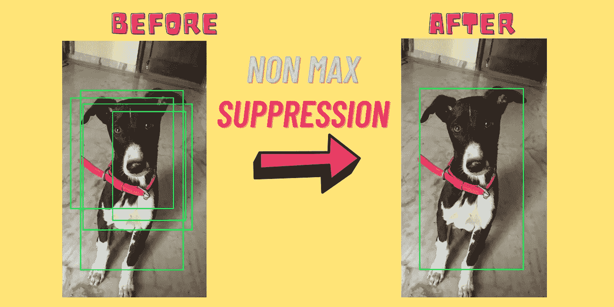
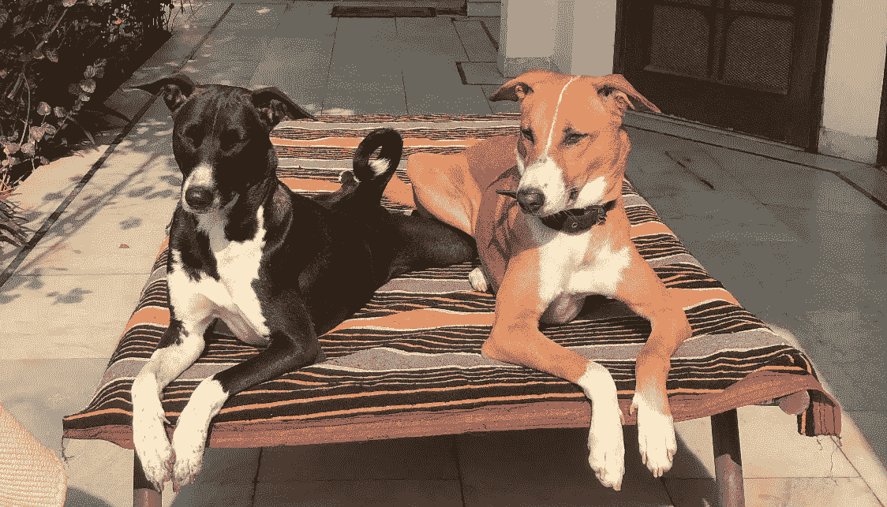
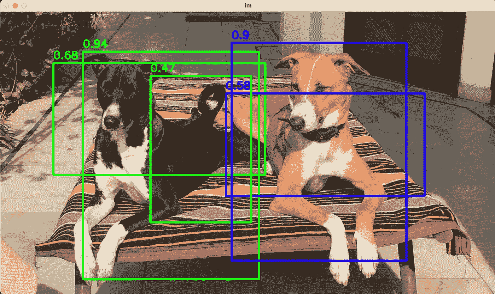
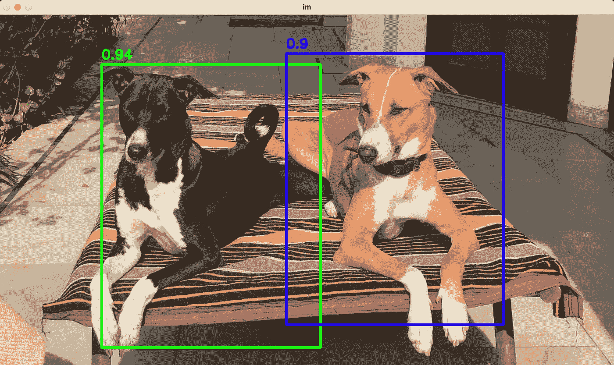

# 目标检测中非极大值抑制算法的直观性与实现

> 原文：<https://towardsdatascience.com/intuition-and-implementation-of-non-max-suppression-algorithm-in-object-detection-d68ba938b630>

## 本文解释了非最大值抑制技术的使用和实现，该技术用于图像中的对象检测



描绘非最大抑制的封面艺术。(来源:图片由作者提供)

计算机视觉是能够识别和理解图像和场景的人工智能的基本领域之一。它包括各种子领域，例如图像识别、对象检测、图像分割、图像生成、图像超分辨率等等。由于大量的实际使用案例，对象检测可能是计算机视觉最深刻的方面。

## 目标检测

对象检测针对计算机系统在图像中定位对象并识别每个对象的能力。对象检测已经广泛用于人脸检测、车辆检测、行人计数、安全系统和自动驾驶汽车。“对象检测模型从向端到端学习范式的发展中受益匪浅:建议、特征和分类器成为一个神经网络，将一般对象检测的结果增强了两倍[1]。”通常，所有现代对象检测模型都遵循三步过程:

1.  建议窗口的搜索空间(通过滑动窗口或使用建议稀疏)。
2.  用分类器/回归器对窗口进行评分。
3.  组合可能属于同一对象的窗口。

这最后一步被称为 ***“非最大抑制”***

## 边界框

在物体检测中，我们通常使用包围盒来描述物体在图像中的空间位置。边界框是一个矩形，使用左上和右下坐标绘制。另一种常用的边界框表示包含矩形的中心以及矩形的高度和宽度。

# 非最大值算法(NMS)

可以使用下面的步骤来解释该算法:
**输入:**边界框列表以及类名和每个检测到的对象的输出概率。

1.  移除输出概率分数小于指定阈值的边界框。
2.  按照输出概率的降序排列剩余边界框的列表。
3.  遍历边界框的排序列表，直到至少剩下一个元素。
4.  从列表中移除第一个边界框，并将其标记为*“当前元素”*此外，检查其与同一类对象列表中其他元素的边界框的并集交集(IOU)。如果 IOU 高于指定阈值，则从列表中删除该元素，并将当前元素添加到*最终列表中*
5.  重复步骤 3 和 4。
6.  返回*'最终列表'*

## NMS 算法预演

假设，我们有下面的图像(图 1)包含两只狗(左一只:*玛雅*和右一只:*佐罗*)，并且我们有一个对象检测模型来区分图像中的玛雅和佐罗。



图一。两只狗坐着:玛雅(左)和佐罗(右)。(来源:图片由作者提供)

当使用上面的图像对我们的对象检测模型(没有 NMS)进行推理时，我们将得到如图 2 所示的输出。在这里我们可以看到，我们得到了多个边界框，在单个对象上有各自的概率分数。



图二。具有相应输出概率的对象上的多个边界框。(来源:图片由作者提供)

我们的目标是为一个对象选择最合适的边界框。换句话说，我们必须从概率为 0.94、0.68 和 0.47 的三个框中为*玛雅*选择一个边界框。同样，我们也必须从概率为 0.9 和 0.58 的两个边界框中为*佐罗*找到最佳边界框。

根据该算法，我们将首先丢弃所有那些概率分数小于指定阈值的边界框。例如，如果我们将阈值设为 0.5，我们将丢弃 Maya 概率为 0.47 的边界框。此外，我们将找到具有最高概率分数的包围盒，并将其 IOU 与同类的所有其他包围盒进行检查。如果 IOU 高于阈值(表示相同的对象)，我们丢弃具有较小概率分数的边界框。类似地，我们将对图像中所有检测到的对象执行这些步骤。最终输出如图 3 所示。



图 3。应用非最大抑制后的最终边界框。(来源:图片由作者提供)

# 密码

首先，我们将初始化概率置信阈值和 IOU 阈值。例如，如果边界框的概率低于概率置信度阈值，那么我们将丢弃该边界框。类似地，如果 IOU 分数高于定义的阈值，我们将不考虑具有低输出概率的边界框。

```
import cv2
class NMS:
    def __init__(self) -> None:
        self.conf = 0.5
        self.iou_threshsold = 0.4
```

下面代码中的 IOU 函数计算两个区域的 IOU。顾名思义，IOU 就是两个区域的交集面积和两个面积的并集的比值。在 IOU 函数中，bboxes1 和 bboxes2 是一个包含四个元素的列表，它们是:

```
[ **X**(top-left), **Y**(top-left), **X**(bottom-right), **Y**(bottom-right) ]
```

下面的代码在图像上绘制边界框，并将概率分数放在框的顶部。参数 *'images'* 是一个图像对象， *'bboxes_list'* 包含被检测对象的坐标、类别和概率输出。

```
bboxes_list = [**class**, **X**(top-left), **Y**(top-left), **X**(bottom-right), **Y**(bottom-right), **output_probability**]**Sample values:**
0 187 90 586 607 0.94
0 120 116 600 370 0.68
1 511 185 961 418 0.58
0 340 145 568 478 0.47
1 524 70 920 565 0.92
```

下面的函数是上述 NMS 算法的实现。该函数在应用非最大值抑制算法后返回所需的边界框。

以下是 NMS 类的驱动程序代码。我们首先读取‘coordinates . txt’来获取包围盒的坐标和其他细节；然后，我们应用 NMS 算法得到想要的包围盒。

```
**coordinates.txt**
0 187 90 586 607 0.94
0 120 116 600 370 0.68
1 511 185 961 418 0.58
0 340 145 568 478 0.47
1 524 70 920 565 0.92
```

完整代码可从以下网址获得:

[](https://github.com/prateekchhikara/non-max-suppression) [## GitHub-prateekchhikara/非最大抑制

### 此时您不能执行该操作。您已使用另一个标签页或窗口登录。您已在另一个选项卡中注销，或者…

github.com](https://github.com/prateekchhikara/non-max-suppression) 

# 结论

本文概述了非最大值抑制算法的需求以及 python 实现。除此之外，我们用一个图像例子解释了这个算法。

# 参考

1.  Hosang，Jan，Rodrigo Benenson 和 Bernt Schiele。“学习非最大抑制。”IEEE 计算机视觉和模式识别会议论文集。2017.