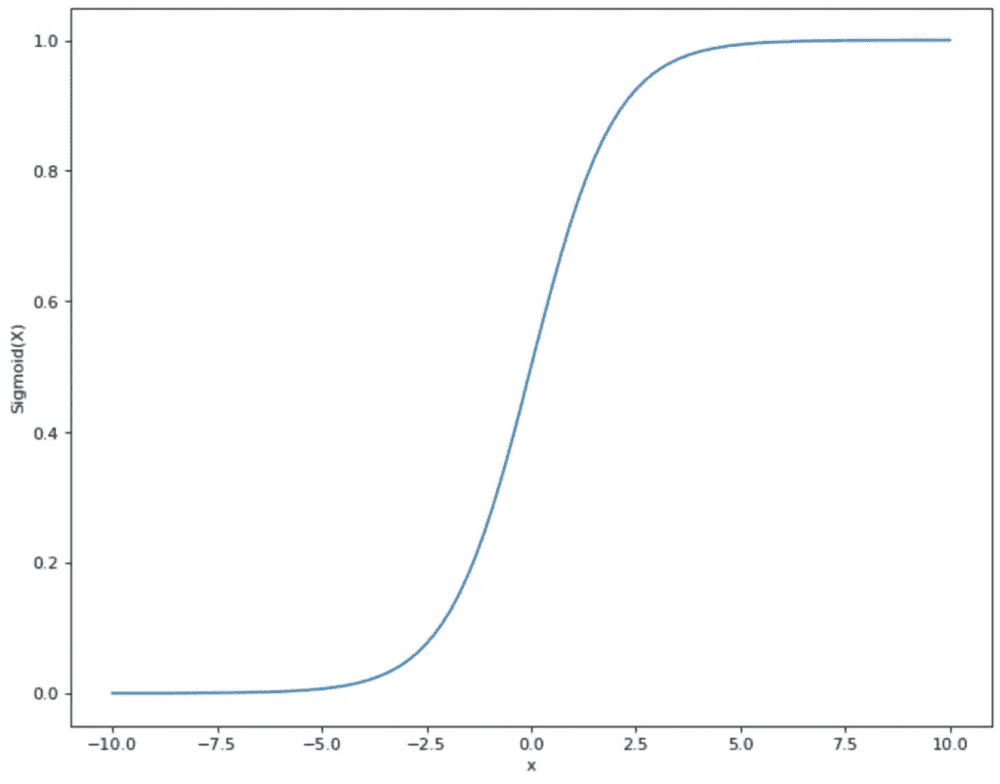

# 人工神经网络直观指南

> 原文：<https://towardsdatascience.com/intuitive-guide-to-artificial-neural-networks-17805150e91a>

## 人工神经网络功能简介

Preethi Viswanathan 在 [Unsplash](https://unsplash.com/s/photos/neural-network?utm_source=unsplash&utm_medium=referral&utm_content=creditCopyText) 上拍摄的照片

人工神经网络(ANN)是人工智能和机器学习领域最常用的术语。在这篇文章中，我们想更仔细地看看简单网络的构造，并希望消除许多人的恐惧。

我们将尝试在本介绍中尽可能少地使用数学，以便即使是不熟悉机器学习主题的读者也能容易地接触到该主题。

人工神经网络基于人脑的生物结构。这用于建模和解决困难的基于计算机的问题和数学计算。

# 构建模块:神经元

在我们的大脑中，从感觉器官接收到的信息被记录在所谓的神经元中。这些细胞处理信息，然后传递输出，导致身体的反应。信息处理不仅发生在单个神经元中，也发生在多层节点网络中。

在人工神经网络中，这种生物学原理被复制并以数学方式表达。神经元(也称为节点或单元)处理一个或多个输入，并从中计算出一个输出。该过程执行三个步骤:

权重因子决定了输入对于神经元解决问题的重要性。如果输入非常重要，系数 w 的值会变大。不重要的输入值为 0。

2.对神经元的所有加权输入求和。此外，增加了偏置 b:

3.随后，结果被赋予所谓的激活函数。

有多种激活功能可供使用。在许多情况下，这是乙状结肠功能。这将取值并将它们映射到 0 和 1 之间的范围内:

Sigmoid 函数|来源:作者图片

这对神经网络有好处，即来自步骤 2 的所有值都在给定的较小范围内。因此，sigmoid 函数限制理论上位于(- ∞，+ ∞)之间的值，并将它们映射到(0，1)之间的范围内。

既然我们了解了单个神经元的功能以及节点内的各个步骤，我们就可以转向人工神经网络了。这只是这些神经元在不同层次上的集合。

# 网络:输入层、隐藏层和输出层

信息通过网络的不同层传递:

*   **输入层**:在传递到下一层之前，模型的输入在神经元中被输入和处理。
*   **隐藏层**:一个或多个所谓的隐藏层接管实际的信息处理。来自前几层的输入在神经元中以加权的方式进行处理，并传递到下一层。这将一直持续到到达输出层。由于这一层中的计算是不可见的，而是在“隐藏”中进行的，这些神经元的集合被称为隐藏层。
*   **输出层**:该层跟随最后一个隐藏层，接受神经元的输出。这一层中节点的输出包含神经网络的最终结果或决策。

神经网络|来源:作者图片

# 人工神经网络是如何学习的？

在人工智能的背景下，人们经常谈论这样一个事实，即模型必须经过训练，并且需要大量数据才能提供良好的结果。但是这个过程对于人工神经网络到底意味着什么呢？

从数据中，为每个单独的数据集计算遍历网络时产生的结果，并进行比较，以查看网络的结果与数据集的实际结果相比有多好。在这个过程中，人工神经网络的预测应该越来越接近实际结果。

为此，人工神经网络有一个调节螺丝，通过每个训练步骤使结果更接近实际结果，即单个神经元输出的加权。在学习过程中，他们的权重不断变化，以改变结果的准确性。也就是说，每个神经元决定前面神经元的哪些输出对它们的计算重要，哪些不重要。在最好的情况下，这个权重随着每个新的数据集而增强，并且总体结果变得更加准确。

这里举一个小例子来说明这一点，当然不建议模仿。数学课上，有三个好朋友坐在你旁边。对于课堂上计算的每一道题，你可以让他们三个都告诉你他们的结果，因为你自己不能再进一步了。他们三个总是愿意给你一个数字作为解决方案。因此，在课程(训练阶段)中，你要找出三个同学中哪一个通常成绩最好。

所以对于你计算的每个任务，你问他们三个的结果，通过与老师的结果比较，找出你可以从三个同学中的哪一个得到最好的结果。根据子领域的不同，你会发现一个输入比另一个更好。因此，您可以在培训阶段更改和优化权重。在考试中，你将确切地知道为了得到正确的结果，你必须求助于三者中的哪一个。

这正是网络中所有神经元所做的。在训练期间，根据有多少神经元“坐在”附近，给它们一定数量的输入。在训练过程中，他们在每一步都决定哪一个初步结果最适合他们，然后将它与实际结果进行比较，看他们是否正确。在训练之后，也就是在测试中，他们就能准确地知道哪些先前的神经元是最重要的。

# 损失函数

人工神经网络的目标是在每个训练步骤中减少自我预测结果和实际结果之间的差异。为了实现这个目标，并且能够跟踪到那里，就有了所谓的损失函数。它提供了一个数学陈述，说明网络的响应与期望的实际响应有多远。

在最佳情况下，损失函数值为 0，因为人工神经网络的结果与实际结果完全匹配。因此，在每个训练步骤中，尝试将损失函数近似为值 0。为了找到损失函数的最小值并快速逼近它，例如使用[梯度下降](https://databasecamp.de/en/machine-learning/gradient-descent)。

# 这是你应该带走的东西

*   人工神经网络由大量神经元组成。在训练阶段，单个神经元的权重被改变和优化。
*   网络由三种不同的层类型组成:输入层、隐藏层和输出层。
*   人工神经网络的目标是最小化损失函数，即预测结果和实际结果之间的差异。

*如果你喜欢我的作品，请在这里订阅***或者查看我的网站* [*数据大本营*](http://www.databasecamp.de/en/homepage) *！还有，medium 允许你每月免费阅读* ***3 篇*** *。如果你想让***无限制地访问我的文章和数以千计的精彩文章，请不要犹豫，通过点击我的推荐链接:*[【https://medium.com/@niklas_lang/membership】](https://medium.com/@niklas_lang/membership)每月花$***5****获得会员资格***

**     **