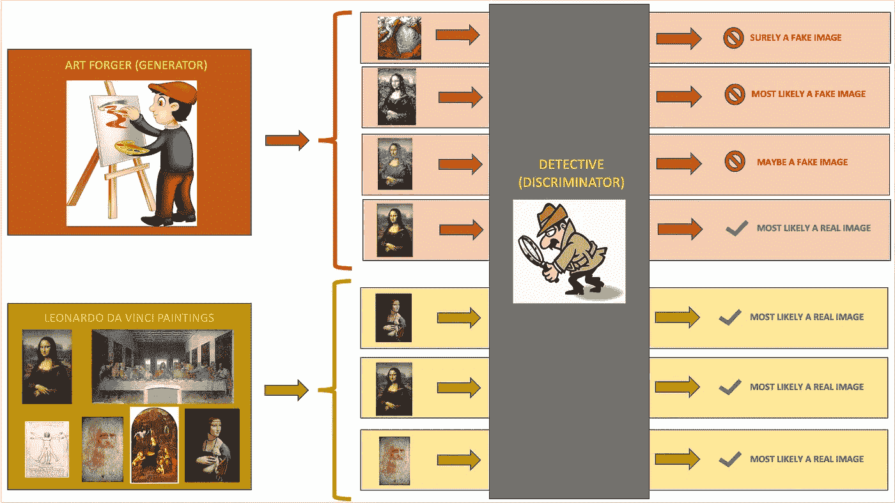
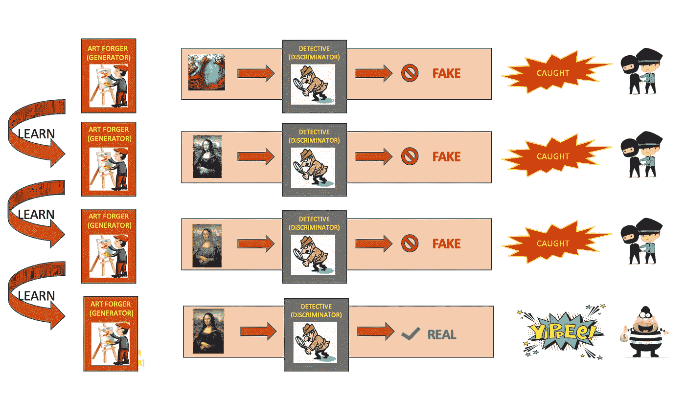
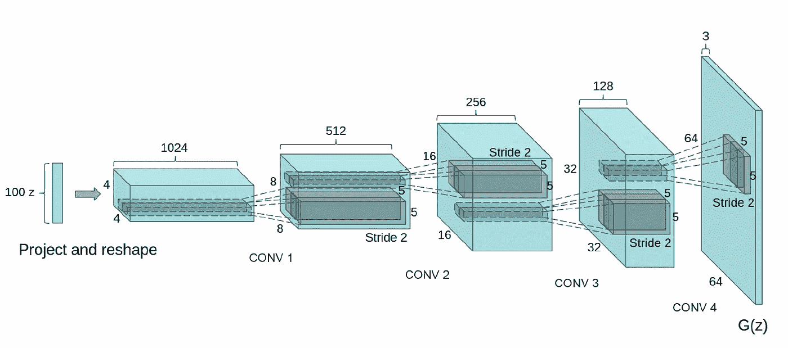
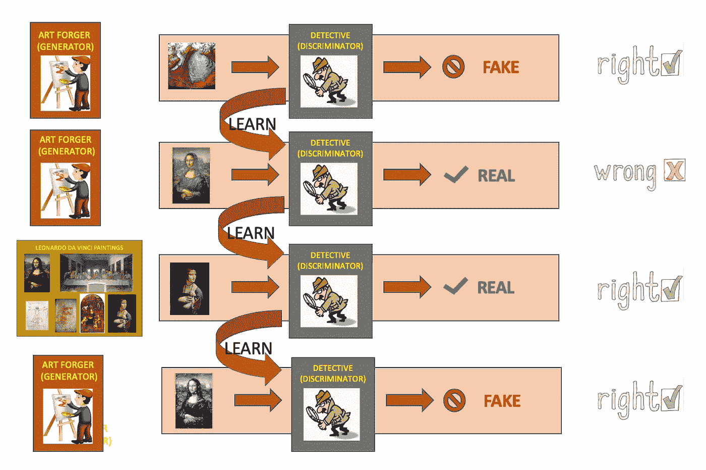
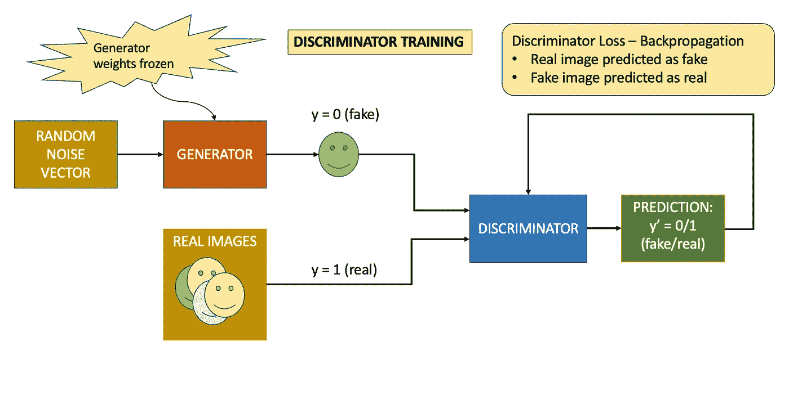
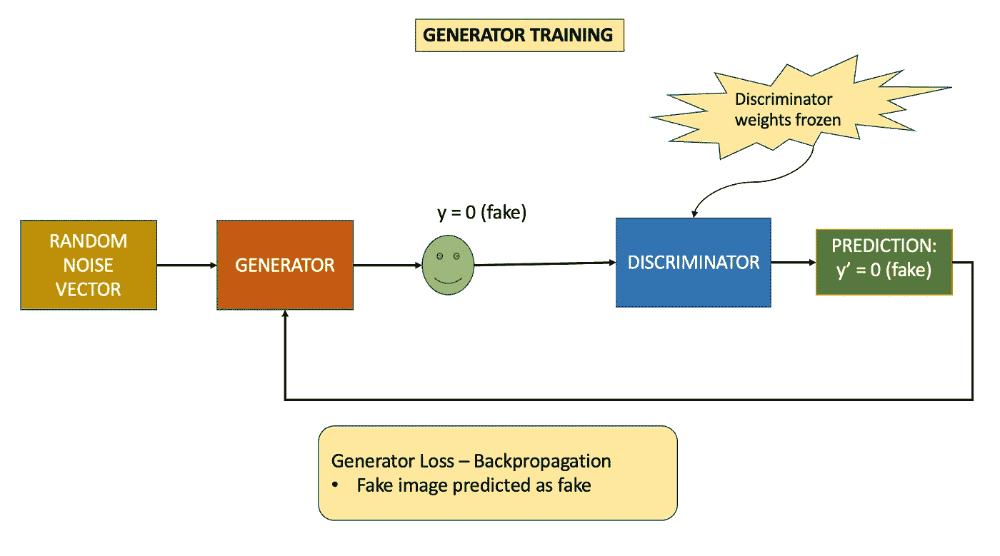
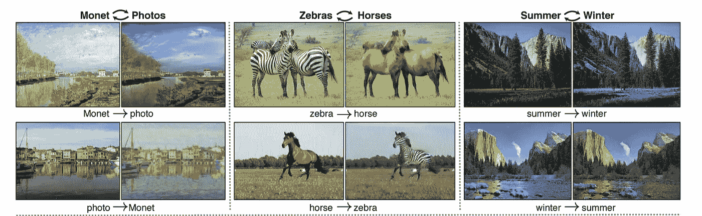
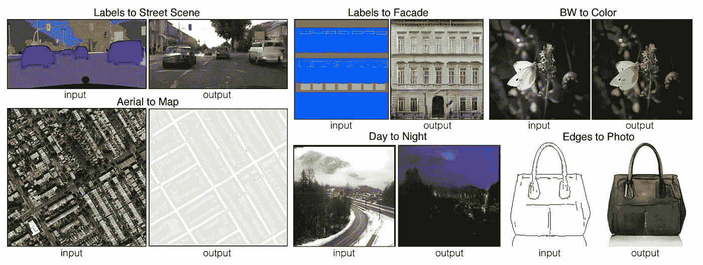
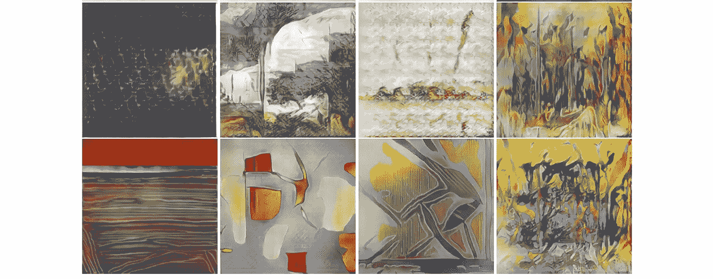

# 生成对抗网络的直观介绍

> 原文：<https://towardsdatascience.com/intuitive-introduction-to-generative-adversarial-networks-gans-230e76f973a9>

## 解释甘斯在计算机视觉中的魔力

**生成器-鉴别器直觉**(图片由作者提供)

> 假设一个艺术伪造者试图创作达芬奇的假画，一个侦探试图鉴别这幅画是真迹还是赝品。
> 
> 起初，伪造者可能不擅长创作达芬奇画作的复制品，侦探可能更容易发现假画。
> 
> 随着时间的推移，伪造者了解到侦探在画作中检查的关键成分，以将其分类为真画或假画。类似地，随着侦探看到更多的真画和伪画，侦探能够了解区分这两者所需的更精细的细节。
> 
> 最终，伪造者会很好地学会这个技巧，以至于伪造者会开始愚弄侦探，让他相信这些假画是达芬奇的真迹。现在我们可以说对伪造者的训练已经完成了。

这正是 GAN 的工作原理。

# GANs 简介

生成性对抗网络(GANs)是近十年来令人惊叹的创新之一，它导致了最近许多最先进的产品。2014 年，Ian Goodfellow 等人在论文[中首次提出了 GAN。自问世以来，GANs 已有多种不同的版本，以满足不同的需求。](https://arxiv.org/abs/1406.2661)

生成对抗网络(GANs)是一种基于深度学习的生成模型，它发现输入数据中的潜在模式，并从中生成新的样本。不要被名字或定义吓倒，一旦你读到这篇文章的结尾，你会被它的简单性所折服。

基本的 GAN 架构有两个神经网络，生成器和鉴别器。生成器是生成假数据的伪造者，鉴别器是检测器，其主要作用是将输入数据分类为真或假。一旦生成器能够创建可以欺骗鉴别器认为它是真实的数据，那么模型训练就完成了，并且生成器被训练来创建“好的”假数据。

深度卷积生成对抗网络或 DCGANs 是专门用于图像数据的 GAN 的流行方法之一。DCGAN 在发生器中的输入噪声向量和输出图像之间添加卷积层。此外，鉴别器使用卷积层将实际和生成的图像分类为真实或伪造。

# 甘——监督学习还是非监督学习？

GAN 内部使用两个神经网络，生成器和鉴别器。

生成器网络从潜在向量(在 DCGAN 的情况下是噪声向量)生成图像，并且是一种无监督的机器学习。鉴别器网络将图像分类为真或假，并且是一种监督学习，因为标签(真/假)用于训练模型。

现在转到 GAN 的工作，在训练期间，GAN 接受两个输入，随机噪声数据和未标记的输入数据。使用这两个输入，它生成类似于输入数据的数据。因为 GAN 的所有输入都是未标记的，所以 GAN 是一种无监督的机器学习。

# 甘模特培训

GAN 内部有两个相互竞争的神经网络。发生器网络的目标是欺骗鉴别器网络，而鉴别器网络的目标是正确识别输入是真还是假。

## 培训发电机

在我们的伪造者-侦探故事中，这是伪造者每次迭代学习的方式:

**发电机从错误中吸取教训**(图片由作者提供)

发生器架构是一个神经网络，它接收噪声输入向量并将其转换为输出图像(在 DCGAN 的情况下)。

下面是从 DCGAN 论文中挑选的一个发电机架构示例。如下图所示，发生器的输入是一个大小为 100 的噪声矢量 z。这首先被投影和整形为 1024×4×4 数据，随后是 512×8×8、256×16×16 和 128×32×32 的卷积层。最后，将其输入输出层，生成 64x64 的 RGB 图像。

DCGAN 发生器示例(来源: [DCGAN paper](https://arxiv.org/pdf/1511.06434.pdf)

## 训练鉴别器

下面是侦探如何在每次迭代中学习:

**鉴别器从先前的预测中学习**(图片由作者提供)

鉴别器是简单的二元分类器，将输入数据分类为真实或虚假。在 DCGAN 的情况下，鉴别器是一个卷积神经网络(CNN ),它进行二进制分类。CNN 的输入是一幅图像，鉴别器需要将其分类为真实图像或虚假图像。

# 甘的失落——直觉

如前所述，GAN 架构中涉及两个神经网络，因此在模型训练步骤中需要反向传播两种类型的损耗。

## 鉴频器损耗

鉴别器对来自生成器的虚假数据和真实数据进行分类。

**鉴频器丢失**(图片由作者提供)

当它将发电机数据分类为假数据或者将实际数据分类为真数据时，那么它做得很好，否则它会对输出进行错误分类，并且该模型需要针对该输入进行重新训练。

因此，当鉴别器将假图像分类为真实图像或者将真实图像分类为假图像时，它被罚以鉴别器损失，并且该损失通过鉴别器网络反向传播以更新权重和偏差。

请注意，在训练鉴别器时，发生器权重和偏差将被冻结。

## 发电机损耗

生成器的作用是从噪声输入中创建图像，并且它没有任何关于预期输出类型的标记信息。因此，发生器使用鉴别器的输出来更新其网络参数。

**发电机损耗**(图片由作者提供)

如果鉴别器将生成器生成的图像误分类为真实图像，则生成器正在完成其工作，但是如果鉴别器可以识别出生成的图像是赝品，则生成器需要更新。

因此，当鉴别器识别出假图像并将其分类为假图像时，则计算发电机损耗并将其反向传播到发电机网络以更新其权重和偏差。

请注意，在训练发生器时，鉴别器权重和偏差将被冻结。

*要对甘斯背后的数学有一个基本的了解，可以参考这篇后续文章:* [*解码甘斯*](/decoding-the-basic-math-in-gan-simplified-version-6fb6b079793) 中的基本数学

# 甘斯有什么酷的？

这里有一个简单的例子。

## **图像到图像的翻译——不成对方法**

这里，从一个域到另一个域进行图像到图像的转换，而不需要输入图像和输出图像之间有任何关系。有不同类型的 GAN 实施这种方法，如 CycleGAN、DualGAN 和 DiscoGAN。

示例:

*   从马域转换到斑马域
*   将夏季图像更改为冬季图像

来源:[周期一致的敌对网络](https://arxiv.org/abs/1703.10593)

## **图像到图像翻译—成对方法:**

这里，在输入和输出之间存在自然的映射，或者对于每个输入图像存在映射的输出图像。条件敌对网络使用这种方法。

示例:

*   将街道视图地图更改为卫星视图地图
*   黑白到彩色图像
*   草图到实际图像

来源:[条件敌对网络](https://arxiv.org/abs/1611.07004)

## **创造艺术一代**

创意对抗网络(CAN)是 GAN 的扩展，其中模型学习艺术家的风格，并创建与该风格匹配的新绘画的图像。在这里，鉴别器在来自画家的大量真实艺术品上接受训练，它可以准确地将图像分类为真/假。此外，鉴别器还对艺术品所属的时间段进行分类。生成器将使用这个额外的时间周期度量以及真/假分类来训练自己。

来源:[创意对抗网络](https://arxiv.org/abs/1706.07068)

## 还有更少的…

*   从 2D 图像生成三维模型
*   将文本标题转换为图像
*   从低分辨率图像生成高分辨率图像
*   生成不存在的人的真实图像
*   将照片转换为表情符号
*   从一个领域到另一个领域创建医学图像

# 结论

这只是展示 GANs 强大功能的一小部分应用示例。随着数以千计的研究论文和 GANs 的几个变种，很明显，这项技术正在积极发展，它在未来拥有巨大的潜力。

当我们到达这篇文章的结尾时，我希望你已经对 GAN 的工作有了一个基本的了解，并且它帮助你更深地潜入这个 maGANical 的世界。祝你好运！！