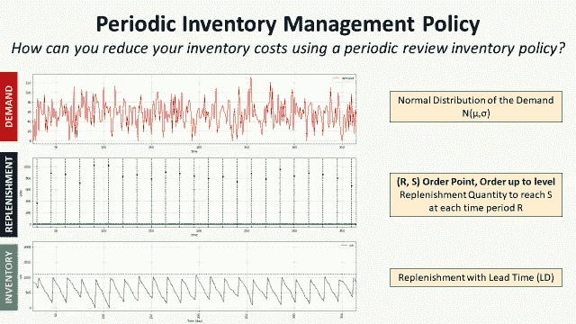
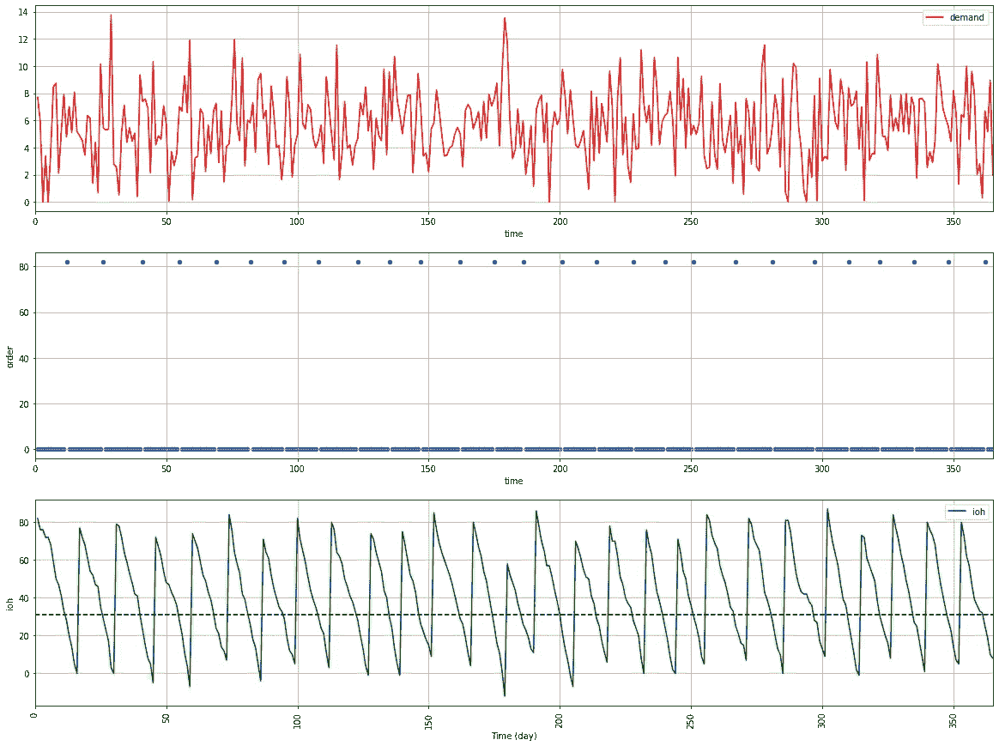
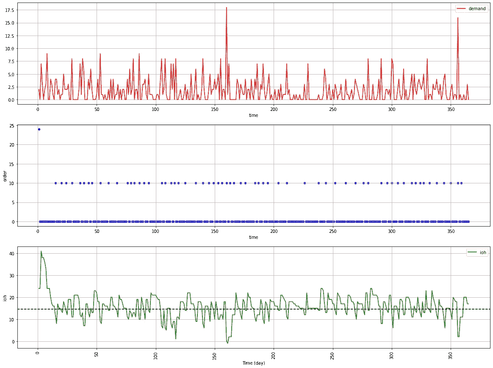
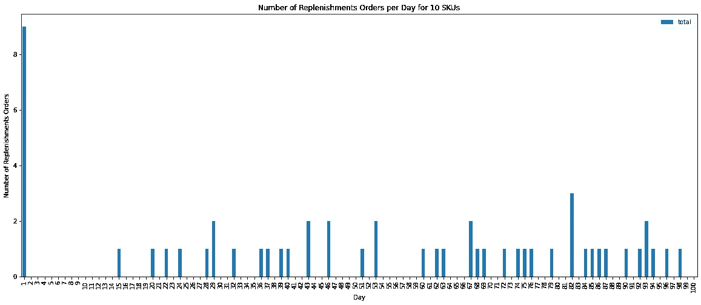
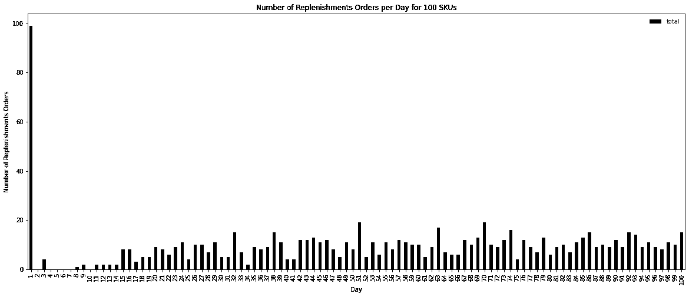
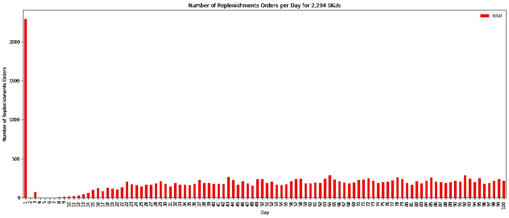
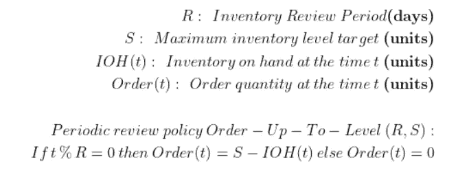
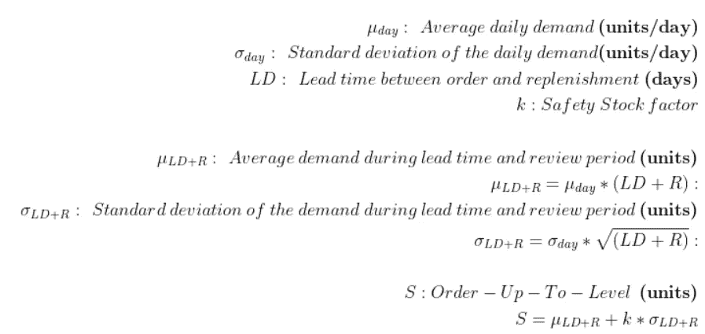
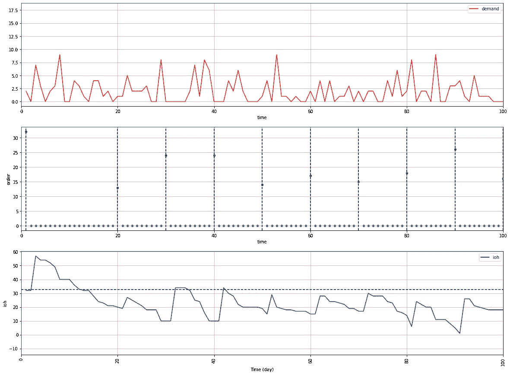
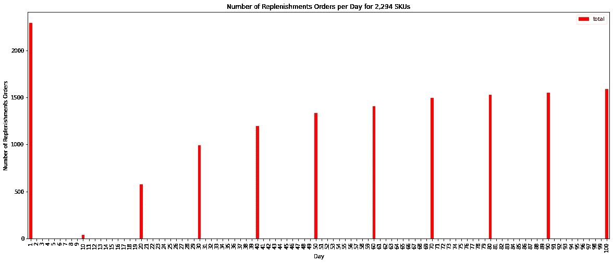

# 零售库存管理—定期审查政策

> 原文：<https://towardsdatascience.com/inventory-management-for-retail-periodic-review-policy-4399330ce8b0>

# 零售库存管理—定期审查政策

## 根据**定期审查政策**实施库存管理规则，以减少**商店补货数量**



(图片由作者提供)

## 目标

设计库存管理规则，使**最小化补货数量**并满足**商店需求**。

## 介绍

对于大多数零售商来说，库存管理系统采取**固定**、**基于规则的**方法来预测和**补货**订单管理。

目标是建立一个**补货政策**，最小化**订购**、**持有**和**短缺**成本。

在之前的文章中，我们已经建立了一个基于**连续审查库存策略的模拟模型，**假设需求的**正态分布**。

[](https://www.samirsaci.com/inventory-management-for-retail-stochastic-demand-2/) [## 零售库存管理——随机需求

### 供应链优化模拟安全库存水平对库存管理绩效指标的影响…

www.samirsaci.com](https://www.samirsaci.com/inventory-management-for-retail-stochastic-demand-2/) 

然而，当你处理**一个可能有**不同补货周期长度**的大型项目组合**时，这种政策可能**低效**。

在本文中，我们将改进这个模型，并用 Python 实现一个**定期审查策略**，以限制**的补充数量**。

💌新文章直接免费放入你的收件箱:[时事通讯](https://www.samirsaci.com/#/portal/signup)

```
**SUMMARY**
**I. Scenario** 1\. Problem Statement*As an Inventory Manager of a mid-size retail chain, you are in charge of setting the replenishment quantity in the ERP.*
2\. Limits of the continuous review policy*What is the impact a continuous review policy on the number of replenishments when you handle several hundred SKUs?*
**II. Periodic Review Policy: Order-Up-To-Level (R, S)** 1\. Introduction of the Inventory Policy2\. Definition of the Safety Stock3\. How do you define k?
**III. Example of Replenishment Policies
IV. Conclusion**
```

# 一.情景

## 1.零售库存管理

作为一家中型零售连锁企业的**库存经理**，你负责在 [**ERP**](https://youtube.com/shorts/v0_R8P6MLQ0) 中设置**补货数量。**

因为你的**仓库运营经理**在抱怨**订单频率**，你开始挑战 [**ERP**](https://youtube.com/shorts/v0_R8P6MLQ0) 中实施的**补货规则，尤其是针对**快速跑者**。**

之前，我们已经基于**持续审查策略**实施了几个库存规则。

在每个**时间 t** 我们检查现有库存(IOH):


方程式—(图片由作者提供)

**举一个 SKU 的例子**



N(2000，50)的持续审查政策

我们每年需要 **27 个补货订单**。

> **问题** 如果你管理**2294 个 SKU**，你需要多长时间订购一次？

## 2.持续审查政策的限制

> 你可以在我的 Github 资源库中找到带哑数据的源代码:[链接](https://github.com/samirsaci/inventory-periodic)
> 我的作品集其他供应链相关文章: [Samir Saci](http://samirsaci.com)

我们假设我们只有 365 天的销售额

*   **10 家店铺** (STORE_1，… STORE_10)
*   **1 产品系列**(食品 _ 杂货)
*   **2294**唯一 SKU(商店 ID +产品系列+商品代码)

## **模拟 1**

让我们对 **1 SKU** 实施持续审查政策

*   SKU:商店 _ 1-食品 _ 杂货店 _009
*   k = 3
    (需求分布标准差的 3 倍)设计的安全库存
*   订单数量:Q = 3 x 平均数量 _ 年销售量



持续审查政策**1 SKU**——(图片由作者提供)

> ***评论*****第 18 个 100 天补货**

## **模拟 2**

如果我们现在有 **10 个 SKU**需要管理，会怎么样？



补充了 **10 个 SKU**——(图片由作者提供)

> ***评论*****第 54 期第 100 天补货**

## 模拟 3

如果我们有 **100 个 SKU**要管理呢？



补充了 **100 个 SKU**——(图片由作者提供)

> ***备注******935*补货**前 100 天不到 10 天无订单

## 模拟 4

如果我们有 **2，294 个 SKU**需要管理，会怎么样？



补充 2994 个 SKU——(图片由作者提供)

> ***评论*****前 100 天 19267 次补货**(不到 10 天没有订单)

用这种方法，当你有一个大的投资组合时，补充的数量会激增。

## **解决方案**

我们将利用**定期审查**来制定补货政策。

[](http://samirsaci.com) [## 萨米尔·萨奇

### 数据科学博客，专注于仓储，运输，数据可视化和机器人流程自动化…

samirsaci.com](http://samirsaci.com) 

# 二。定期审查政策:订单逐级(R，S)

## 1.库存政策介绍

为了解决补充频率的问题，让我们引入一个定期检查策略(s，Q)

*   在每个周期 R，将审查现有库存 **(IOH)** 水平
*   商店将订购达到 S 的库存水平

为了简化理解，让我们介绍一些符号:



方程式—(图片由作者提供)

## 2.最高级别订单的定义

如何计算等级 S:



方程式—(图片由作者提供)

计算 S 水平是为了将库存水平设置为满足审查期间和补货提前期的需求。

## 3.你怎么定义 k？

您的绩效指标将直接受到安全库存水平的影响

1.  您为两个指标中的任何一个设定目标*(例如:我希望周期服务水平为 95%)*
2.  根据需求的分布(正态分布、泊松分布)来计算达到这个目标的 k 值
3.  你修正你的再订购点

**代号**

[](http://samirsaci.com) [## 萨米尔·萨奇

### 数据科学博客，专注于仓储，运输，数据可视化和机器人流程自动化…

samirsaci.com](http://samirsaci.com) 

# 三。补充政策示例

## 1.以 SKU 为例:商店 _ 1-食品 _ 杂货店 _009

评审周期:R = 10 天
k = 1



经验需求的定期审查政策 SKU =**STORE _ 1-FOOD _ 杂货店 _ 009**——(图片由作者提供)

> ***备注******前 100 天 10 次补货*** *vs.* **18 次补货**无缺货

## 2.如果你处理全部投资组合，需要补充多少资金？



补充 2994 个库存单位(图片由作者提供)

> ***评论*****13986 次*补货****vs .***19267 次补货**前 100 天只有 10 天补货

# 四。结论

*关注我的 medium，了解更多与供应链数据科学相关的见解。*

实施定期审查政策后，您将通过以下方式降低运营成本

*   **限制补货的时间窗口**
    这将优化您的库存管理、订单准备和运输管理资源。
*   **减少补货数量**
    这将增加每次补货的数量，并为同时交货的商店提供装运整合的机会。

# 关于我

让我们连接上 [Linkedin](https://www.linkedin.com/in/samir-saci/) 和 [Twitter](https://twitter.com/Samir_Saci_) ，我是一名供应链工程师，正在使用数据分析来改善物流运作和降低成本。

如果你对数据分析和供应链感兴趣，可以看看我的网站

[](https://samirsaci.com) [## Samir Saci |数据科学与生产力

### 专注于数据科学、个人生产力、自动化、运筹学和可持续发展的技术博客

samirsaci.com](https://samirsaci.com) 

[1] —供应链科学，华莱士·j·霍普