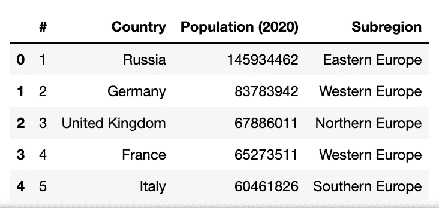
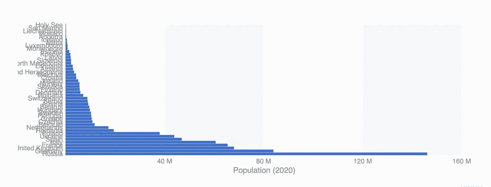
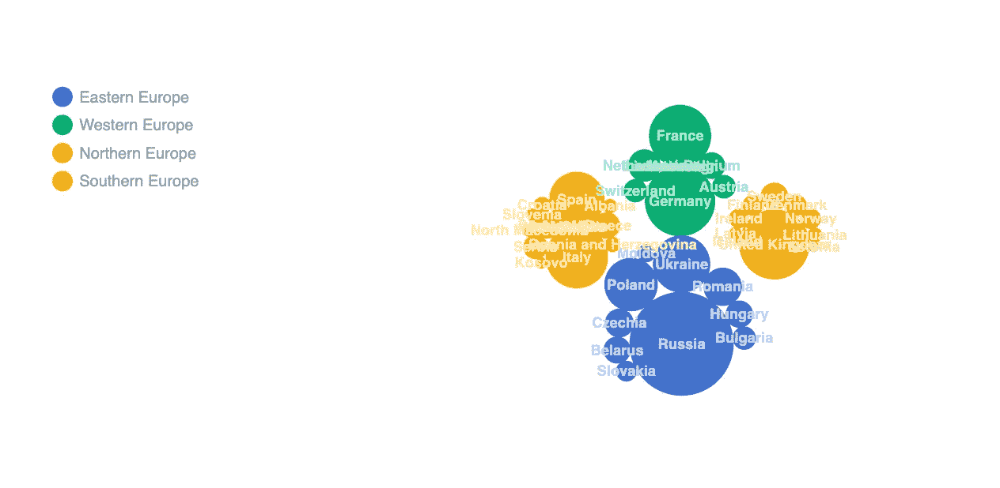
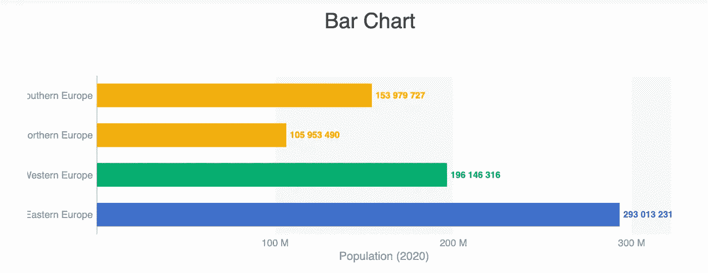
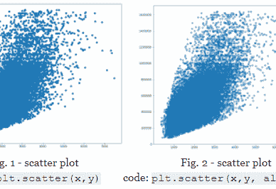
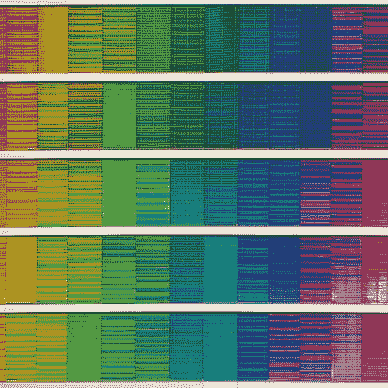
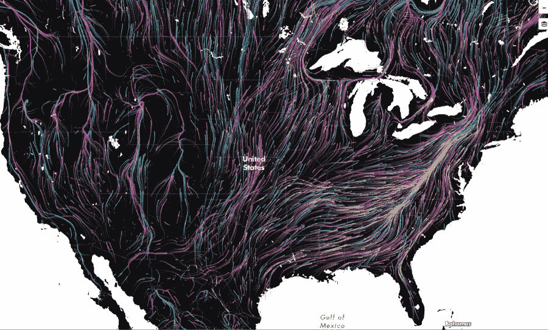

# ipyvizzu:用 Python 构建图表动画的快速库

> 原文：<https://towardsdatascience.com/ipyvizzu-a-fast-library-to-build-charts-animations-in-python-126c100522c5>

## 数据可视化

## ipyvizzu 库的概述，以及一个实际的例子。


照片由[车窗](https://unsplash.com/@windows?utm_source=medium&utm_medium=referral)上的 [Unsplash](https://unsplash.com?utm_source=medium&utm_medium=referral) 拍摄

传达分析结果是数据科学家的必备技能之一。传达结果的一个可能的策略是使用**动画**，它可以帮助观众快速抓住要点并吸收你想要传达的信息。

最近，我发现并测试了一个非常有趣的 Python 库，它有助于快速制作动画图形。这个库叫做`ipyvizzu`。您可以通过 pip 安装它，如下所示:

```
pip install ipyvizzu
```

您只能在 Jupyter 笔记本中使用`ipyvizzu`库，因此如果您还没有 Jupyter，您需要安装它。

这里有一个你可以建立的可视化的例子:


作者提供的视频

文章组织如下:

*   `ipyvizzu`图书馆概述
*   实际例子

# ipyvizzu 库概述

[ipyvizzu](https://github.com/vizzuhq/ipyvizzu) 库是 [Vizzu](https://github.com/vizzuhq/vizzu-lib) 库的 Python 版本，是用 Javascript/C++实现的数据可视化库。

`ipyvizzu`库与 Pandas 数据框架 100%兼容，因此直接从数据构建图表非常简单。要将数据框添加到`ipyvizzu`图表中，您需要声明一个`Data()`对象，然后将数据框添加到其中:

```
from ipyvizzu import Datadf = <MY_PANDAS_DATAFRAME>
data = Data()
data.add_data_frame(df)
```

然后，您可以用创建的数据构建一个图表:

```
from ipyvizzu import Chartchart = Chart()
chart.animate(data)
```

这是基本结构。然后就可以建立动画了。与视频类似，动画由帧或*通道*组成。在`ipyvizzu`中，您需要定义每个通道的结构，例如通过定义条形图或气泡图。对于每个通道，您可以指定以下配置:

*   x 轴
*   y 轴
*   大小
*   标签
*   颜色

例如，要定义条形图，指定 x 轴和 y 轴就足够了，而对于气泡图，您可以指定气泡的大小和标签。

当您从一个通道移动到另一个通道时，您可以更改轴或保持轴不变。如果你想保持轴不变，你可以省略它，否则，你有两个选择:

*   从以前的配置中分离轴，并附加一个新轴
*   直接设置新轴。

这两个选项有两种不同的结果，因此我建议你尝试一下，以了解你需要哪个选项。

以下示例显示了如何构建显示条形图的配置:

```
chart.animate(
    Config(
        {
            "channels": {

                "x": {"set": ["Date"]},
                "y": {"set": ["Time"]},

            },
            "title": "Bar Chart",
            "geometry": "rectangle",
            "orientation": "vertical",
        }
    )
)
```

请注意，您还需要指定几何图形来构建条形图。支持的几何图形包括圆形、区域、直线和矩形。

关于`ipyvizzu`图书馆的更多细节，你可以阅读它的[官方文档](https://vizzuhq.github.io/ipyvizzu/index.html)。

# 2 一个实例

此示例使用手动构建的数据集，该数据集包含 45 个欧洲国家的人口。对于每个国家，数据集还包含其所属的次区域。此示例的目标是构建以下动画:


作者提供的视频

首先，我加载数据集:

```
import pandas as pd
df = pd.read_csv('../sources/eu_regions.csv',sep=';')
```



作者图片

然后，我将它添加到一个`Data()`对象中:

```
from ipyvizzu import Chart, Data, Config, Style
data = Data()
data.add_data_frame(df)
```

现在，我创建图表:

```
chart = Chart(width="700px", height="300px")
chart.animate(data)
```

我添加第一个频道:

```
chart.animate(
    Config(
        {
            "channels": {
                "y": {"set": ["Country"]},
                "x": {"set": ["Population (2020)"]},

            }
        }
    ),y={
        "duration": 3,

    }
)
```

我还指定了持续时间。下图显示了第一个通道:



作者图片

现在我将图表转换成气泡图:

```
chart.animate(
    Config(
        {
            "channels": {
                "y": None,
                "x": None,
                "size": {"set": ["Country","Population (2020)"]},
                "label": {"set": ["Country"]},
                "color": {"set": ["Subregion"]},

            },"geometry": "circle"
        }
    )
)
```



作者图片

最后，我再次将其转换为条形图，但这次它是按子区域分组的:

```
chart.animate(
    Config(
        {
            "channels": {
                "y": {"set": ["Subregion"]},
                "x": {"set": ["Population (2020)"]},
                #"y": {"detach": ["Country"]},
                "y": {"set": ["Subregion"]},
                "label": {"set": ["Population (2020)"]},
               "size" : None

                #"size": {"set": None},
            },"geometry": "rectangle"
        },
    )

)
```



作者图片

# 摘要

恭喜你！您刚刚学习了如何使用`ipyvizzu`库在 Python 中快速构建动画！这个库非常简单和直观，因此你可以用它来创建非常吸引人的动画来交流你的结果！

您可以从我的 [Github 资源库](https://github.com/alod83/data-science/tree/master/DataVisualization/ipyvizzu)下载本教程中使用的代码。

如果你读到这里，对我来说，今天已经很多了。谢谢！你可以在[这个链接](https://alod83.medium.com/my-most-trending-articles-4fbfbe107fb)阅读我的趋势文章。

# 相关文章

[](/an-overview-of-visual-techniques-for-exploratory-data-analysis-in-python-d35703d43faf)  [](/data-visualisation-principles-part-2-layout-and-emphasis-d682bbc38217)  [](/data-visualisation-principles-part-1-a-practical-example-in-altair-b6e16f665fc6)  

## 您知道上下文分析对于构建有效的可视化非常重要吗？

**上下文分析**涉及数据集周围所有*世界的分析。数据集周围的世界可能包括不同的方面。例如，如果您正在测量一段时间内海面的温度，环境可能包括天气条件、一些船只的存在等等。*

定义上下文分析有三个要素:

*   事件
*   环境
*   时间

点击继续阅读更多关于上下文分析的内容[。](/can-context-analysis-help-extract-meaningful-insights-178a21a88e9f)

# 来自社区的文章


[当归罗杜卡](https://alod83.medium.com/?source=post_page-----126c100522c5--------------------------------)

## 数据可视化

[View list](https://alod83.medium.com/list/data-visualisation-050355d230cb?source=post_page-----126c100522c5--------------------------------)25 stories

[当归罗杜卡](https://alod83.medium.com/?source=post_page-----126c100522c5--------------------------------)

## 地理数据

[View list](https://alod83.medium.com/list/geo-data-382b57a080b9?source=post_page-----126c100522c5--------------------------------)3 stories