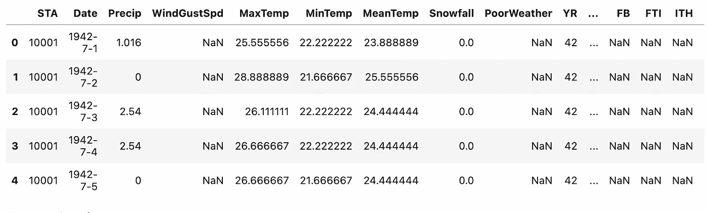
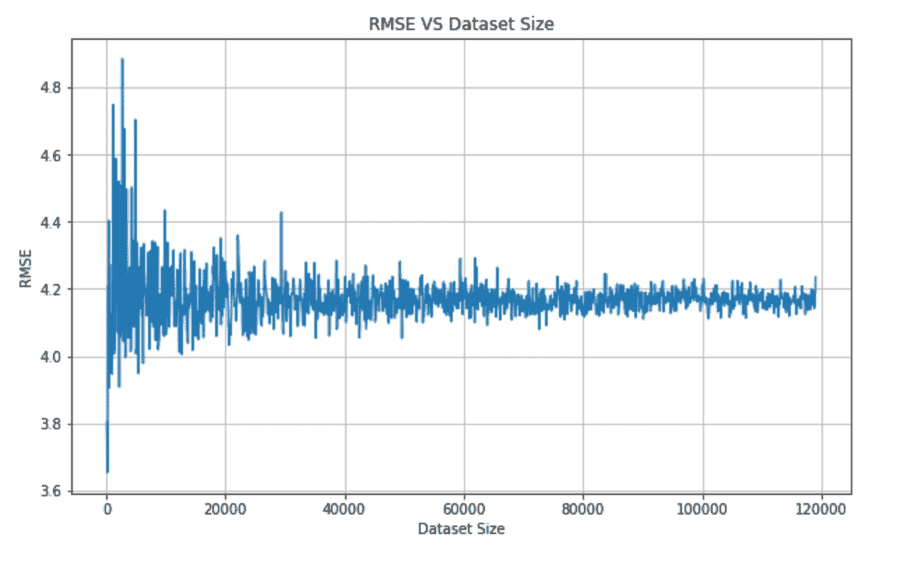
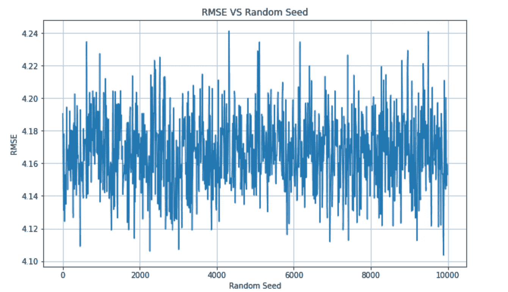
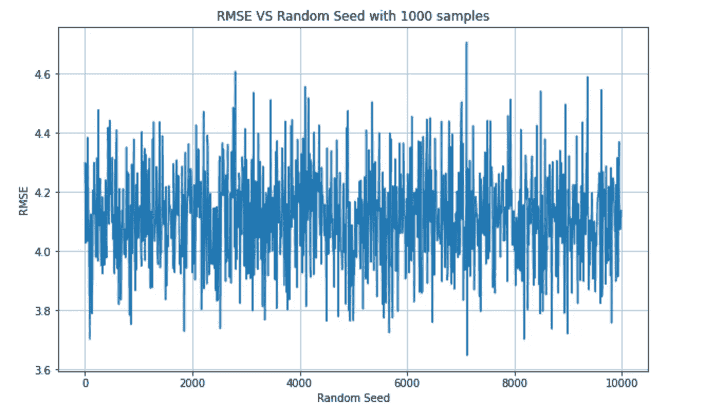

# 小数据集有风险吗？

> 原文：<https://towardsdatascience.com/is-a-small-dataset-risky-b664b8569a21>

## 机器学习

## 关于在数据科学项目中使用小数据集的一些思考和测试。


照片由[马丁·萨特勒](https://unsplash.com/@martinsattler?utm_source=medium&utm_medium=referral)在 [Unsplash](https://unsplash.com?utm_source=medium&utm_medium=referral) 上拍摄

最近我写了一篇关于使用 scikit-learn Python 包提供的`train_test_split()`函数的风险的文章。那篇文章引发了很多评论，有些是正面的，有些是令人担忧的。本文主要关注的是，我使用了一个**小数据集**来演示我的理论，即:*使用* `*train_test_split()*` *函数时要小心，因为不同的种子可能会产生非常不同的模型。*

主要关心的是`train_test_split()`函数的行为并不奇怪；问题是我用了一个小数据集来论证我的论文。

在本文中，我试图通过改变数据集大小来发现线性回归模型的性能。此外，我比较了该算法与通过改变`train_test_split()`函数中的随机种子所获得的性能。

我把文章组织如下:

*   小数据集可能存在的问题
*   可能的对策
*   实际例子

# 1 小数据集的可能问题

小数据集是具有少量样本的数据集。数量*小*取决于要解决问题的性质。例如，如果我们想分析关于给定产品的平均意见，100，000 条评论可能很多，但如果我们有相同数量的样本来计算 Twitter 上讨论最多的话题，样本数量真的很少。

让我们假设我们有一个小数据集，即样本数量不足以代表我们的问题。我们至少会遇到以下问题:

*   [异常值](/how-to-detect-outliers-with-python-pyod-aa7147359e4b) —异常值是显著偏离数据集其余部分的样本。
*   [过拟合](https://medium.com/geekculture/why-overfitting-makes-machine-learning-algorithms-perform-worse-7414ce71031a) —一个模型在训练集中表现良好，但在测试中表现不佳
*   采样偏差-数据集不反映现实。
*   [缺失值](/data-preprocessing-with-scikit-learn-missing-values-8dff2c266db) —样本不完整，一些特征可能会缺失。
*   …

# 2 可能的对策

对于小数据集的问题，一个显而易见的对策是增加数据集的大小。我们可以通过**收集新数据**或**产生新的合成数据**来实现这一结果。

另一个可能的解决方案是使用**集成方法**，而不是只使用一个最佳模型，我们可以训练不同的模型，然后将它们组合起来以获得最佳模型。

其他对策可能包括使用**规则化**、**置信区间、**和**联合方法**，正如这篇题为[小数据的问题以及如何处理它们](https://www.edupristine.com/blog/managing-small-data)的非常有趣的文章所描述的。

# 3 一个实例

在这个例子中，我们使用了美国政府工程许可证下 Kaggle 上提供的第二次世界大战的天气条件。该实验建立了一个非常简单的线性回归模型，该模型试图在提供最低温度的情况下预测最高温度。

我们运行两组测试:第一组改变数据集大小，第二组改变作为输入提供给`train_test_split()`函数的随机种子。

在第一组测试中，我们使用随机抽取的可变数量的样本(从 100 到整个数据集大小)运行 1190 次测试，然后，对于每次测试，我们计算均方根误差(RMSE)。

在第二组测试中，我们运行了另外 1000 个测试，将`random_seed`的变量值作为`train_test_split()`的输入，然后我们计算 RMSE。最后，我们根据平均值和标准偏差比较两组测试的结果。

## 3.1 加载数据集

首先，我们加载数据集作为熊猫数据帧:

```
import pandas as pd
df = pd.read_csv('Summary of Weather.csv')
```



作者图片

数据集有 119，040 行和 31 列。在我们的实验中，我们只使用了`MinTemp`和`MaxTemp`列。

## 3.2 首次测试电池

现在，我们运行第一组测试电池，包括改变样本数量。我使用 Pandas dataframe 的`sample()`方法抽取随机数量的样本。

```
from sklearn.model_selection import train_test_split 
from sklearn.linear_model import LinearRegression
from sklearn import metrics
import numpy as np RMSE = []
min_samples = 100
max_samples = df.shape[0]
ranges = np.arange(min_samples,max_samples, step=100)for i in ranges:
    part_df = df.**sample**(i) X=part_df[['MinTemp']]
    y=part_df[['MaxTemp']] X_train, X_test, y_train, y_test = train_test_split(X, y, test_size=0.3, random_state=42) model=LinearRegression()
    model.fit(X_train , y_train) y_pred=model.predict(X_test)
    RMSE.append(np.sqrt(metrics.mean_squared_error(y_test, y_pred)))
```

我们将不同测试生成的所有 RMSE 值存储在一个名为 RMSE 的变量中。当实验终止时，我们绘制结果:

```
import matplotlib.pyplot as pltplt.plot(ranges,RMSE)
plt.show()
```



作者图片

我们注意到，在初始振荡后，RMSE 稳定在一个或多或少的恒定值。更准确地说，我们可以计算最大值和最小值:

```
np.min(RMSE), np.max(RMSE)
```

它给出了以下输出:

```
(3.700500440100217, 5.15890122331206)
```

以及平均值和标准偏差:

```
np.mean(RMSE), np.std(RMSE)
```

它给出了以下输出:

```
(4.165471878040767, 0.06967357593477533)
```

## 3.3 第二个测试电池

现在，我们修改我们的实验。我们考虑样本的最大数量，并且我们改变作为输入给`train_test_split()`函数的随机种子。

```
RMSE = []
min_samples = 1
max_samples = 1000
ranges = np.arange(min_samples,max_samples, step=100)X=df[['MinTemp']]
y=df[['MaxTemp']]for i in ranges:

    X_train, X_test, y_train, y_test = train_test_split(X, y, test_size=0.3, **random_state=i**) model=LinearRegression()
    model.fit(X_train , y_train) y_pred=model.predict(X_test)
    RMSE.append(np.sqrt(metrics.mean_squared_error(y_test, y_pred)))
```

我们绘制结果:



作者图片

我们计算最小值和最大值:

```
(4.144196003481974, 4.203668944159636)
```

以及平均值和标准偏差:

```
(4.173624815653212, 0.01890965953356617)
```

如果我们对只有 1000 个样本的更小的**数据集执行相同的实验，我们将获得以下结果:**



作者图片

我们计算最小值和最大值:

```
(3.647761928502935, 4.70608576601509)
```

以及平均值和标准偏差:

```
(4.113545430001568, 0.16428398911463052)
```

## 3.4 讨论

我们可以得出结论:

*   在本例中，小于 10，000 的数据集太小，不足以表示问题(考虑到 RSME 的大值)
*   如果我们考虑一个大数据集，结果不会受到`train_test_split()`函数的随机种子的影响
*   如果我们考虑一个只有 1000 个样本的小数据集，结果取决于`train_test_split()`函数的随机种子。

# 摘要

恭喜你！您刚刚了解了使用小数据集的风险！

我要特别感谢[丹·卡特](https://medium.com/u/c1817270117e?source=post_page-----b664b8569a21--------------------------------)、[s·阿迪巴特拉](https://medium.com/u/d32b0b2a5055?source=post_page-----b664b8569a21--------------------------------)和[艾伯特·伊扎德](https://medium.com/u/f6901303cde7?source=post_page-----b664b8569a21--------------------------------)，他们对[我之前的文章](/why-you-should-not-trust-the-train-test-split-function-47cb9d353ad2)表达了一些担忧。没有他们的评论，我永远也不会理解我在这篇文章中描述的一些概念。

如果你读到这里，对我来说，今天已经很多了。谢谢！你可以在[这篇文章](https://alod83.medium.com/which-topics-would-you-like-to-read-c68314dc6813)中读到更多关于我的信息。

# 相关文章

</why-you-should-not-trust-the-train-test-split-function-47cb9d353ad2>  </hypothesis-testing-made-easy-through-the-easy-ht-python-package-2ee395b95fe2>  </three-tricks-on-python-functions-that-you-should-know-e6badb26aac2> 