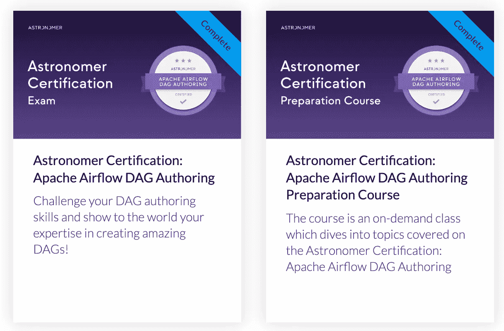
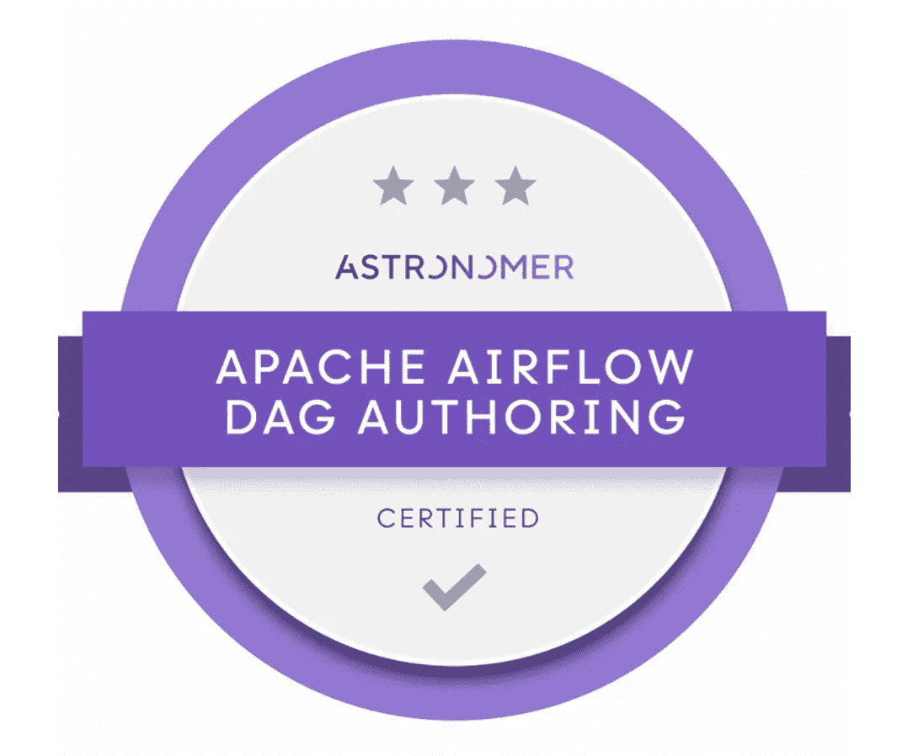
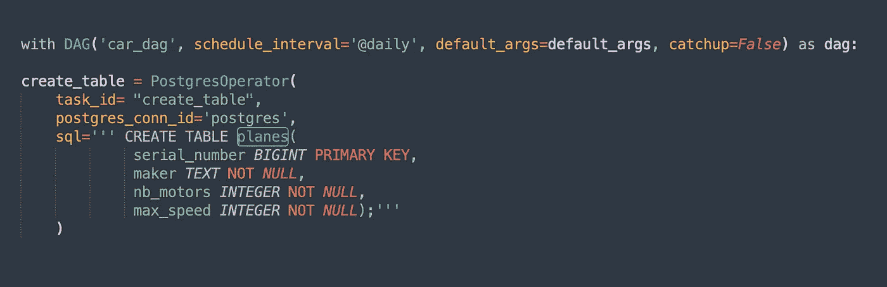
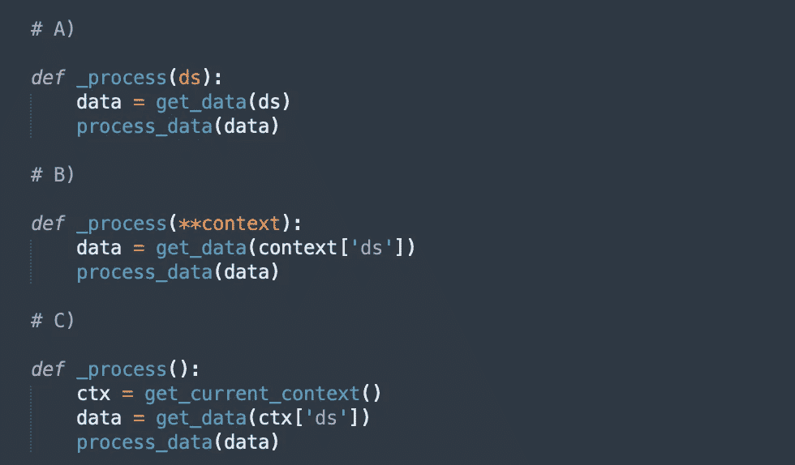
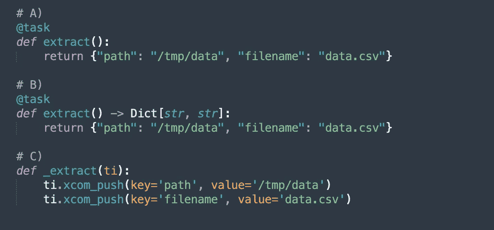

# Apache Airflow DAG 创作认证值得您花费时间吗？

> 原文：<https://towardsdatascience.com/is-apache-airflow-dag-authoring-certification-worth-your-time-98b0b37dfcd9>

## 天文学家认证的诚实审查。


照片由像素上的[像素化地](https://www.pexels.com/@pixabay/)拍摄

*> > >还不是中等会员？考虑与我的* [***推荐链接***](https://anbento4.medium.com/membership) *签约，以获得 Medium 提供的一切服务，费用低至每月 5 美元***！**

# ***简介***

*作为一名数据工程师，我的大部分工作是设计可靠、高效和可重复的 ETL 作业。*

*在过去的两年里，[**Apache air flow**](https://airflow.apache.org/)一直是我用来创作、调度和监控数据管道的主要指挥者。*

*出于这个原因，我最近决定挑战自己，参加 DAG 创作 的 [**天文学家认证，旨在评估按照最佳实践设计和创建数据管道的知识。**](https://academy.astronomer.io/plan/astronomer-certification-dag-authoring-for-apache-airflow-exam)*

*在开始 [**天文学家**](https://medium.com/u/579d6e4b362c?source=post_page-----98b0b37dfcd9--------------------------------) 提供的准备课程一个多月后，我通过了考试，因为我主要在周末学习，我真的想吸收课程提供给我的东西。*

*在这篇文章中，我想与大家分享我对这门课程的真实评价，我用来通过考试的策略以及对一些问题的回答，其中包括:*

*   ***这个认证是给谁的？***
*   *考试包括哪些内容？*
*   *值得你花时间吗？*

*此外，在最后，我提出了考试中我做错的 **5 个问题**，并与你分享我为什么会犯这些错误以及你如何避免它们。*

# *认证概述*

*[**天文学家**](https://www.astronomer.io/) 是由 Apache Airflow 支持的基于云的数据编排平台的领先提供商。*

*他们的服务包括在云中部署和管理一个或多个气流实例，使客户能够专注于构建、运行和监控数据管道，而不是担心管理他们的环境。*

*该公司目前提供两种专业认证:*

*   ***阿帕奇气流基础认证** | ***等级*** *:基础**
*   ***Apache air flow DAG Autoring**|***级别:*** *中级**

*特别是，学习 Apache Airflow DAG 创作认证，[可以让您按照最佳实践，用 Python 设计和创建可靠的数据管道。](https://academy.astronomer.io/astronomer-certification-apache-airflow-dag-authoring)*

*[](/3-nanodegrees-you-should-consider-to-advance-your-data-engineering-career-in-2021-baf597debc72) [## 3 门数据工程课程，在 2022 年推进您的职业发展

### 加入数据行业，改变角色或通过注册数据工程简单地学习前沿技术…

towardsdatascience.com](/3-nanodegrees-you-should-consider-to-advance-your-data-engineering-career-in-2021-baf597debc72) 

# 谁的认证？

该认证面向所有数据专业人员(*其中包括数据工程师、BI 工程师、数据科学家*)，他们始终使用 Apache Airflow 来完成工作，并希望证明自己的知识。

因为考试是为了评估更高级的课题，天文学家建议**至少有 6 个月的气流实践经验**。

他们还提到“*如果你在创建 Dag 方面有丰富的经验，那么你可以准备将你的技能直接应用到认证考试中。*”

然而，我强烈建议你利用天文学家提供的准备课程。这是因为，尽管我已经使用气流 2 年多了，但我从未应用过备考课程中教授的好的部分概念，这些概念最终经常出现在考试中。

# 考试由什么组成？

考试由 75 道选择题组成，给你 60 分钟的时间完成考试。**及格分数是 70%** ，相当慷慨，因为你只需要 **53 个正确答案**就能及格。

然而，**请不要低估考试**:为了通过考试，你必须证明你掌握了气流创造 Dag 的不同特征，每种特征的优缺点以及它们的局限性。

在根据特定用例选择数据管道的设计时，您应该充满信心。您应该对最常见的操作符有扎实的了解，并熟悉不太常见的操作符，尤其是在定义 DAG 依赖关系、设置不同的分支、通过传感器等待事件等方面...

## 我用了什么策略？

我以 150 美元的价格购买了考试和准备课程**。通常这给了你两次**的机会，**意味着如果你失败了一次，你可以免费重试**。****

****

**在天文学家[网站](https://academy.astronomer.io/page/astronomer-certification)上捆绑购买的考试+预备课程**

**然后，**我看了一遍备考课程中的所有视频**，没有做笔记，也没有花太多时间，然后立即尝试考试，以了解题型及其难度。有趣的是，**我的分数是 50/75** ，意味着我失败了，但我离下限只有 3 个正确答案。**

**然而，在这一点上**我确切地知道预期的问题类型**以及我最纠结的主题，因此**我第二次(在某些情况下第三次)观看了所有视频。**在这一轮，我做了很多笔记，并试图在我的本地气流环境中复制部分代码。**

**最后，一天早上，我决定是时候重考了:**我设法得到了 62/75 的分数**这意味着比第一次多了 **12 个正确答案，但仍然有点低于我的预期(*考虑到所有额外的时间投入！*)。****

**我过去一直是个“A”学生，但那不一定能支付账单，而且很费时间，所以我对自己几乎 83%的正确回答率非常满意，因为我可以将注意力转移到其他事情上。**

**一旦我通过了考试，我就获得了一张**官方证书，并通过[可信地](https://www.credly.com/org/astronomer/badge/astronomer-certification-dag-authoring-for-apache-airflow)共享为数字证书**。徽章看起来像这样:**

**[](https://www.credly.com/org/astronomer/badge/astronomer-certification-dag-authoring-for-apache-airflow)

我在[收到的数字徽章是可信的](https://www.credly.com/earner/earned/badge/85649a21-6a2b-4702-96cf-5d51ebf8be29)。** 

# **值得你花时间吗？**

**当谈到评估我在认证上投入的时间是否值得时，我会诚实地说我在说:*“是和不是”*。**

## **为什么是的？**

**我认为导师把课程组织得很好，讲授得也很好。这不是我和马克·兰伯特一起上的第一堂课，我真的很喜欢他积极的态度和他的口音，所以看视频是一种娱乐。**

**通过课程**,我接触到了许多以前从未在 Airflow** 中使用过的主题和功能，这让我变得更加专业，也让我能够在工作场所分享这些知识。**

**尽管仅仅通过认证不可能确定一个人在气流方面有多好，但我想说**投入时间和资源为考试学习，向雇主展示了我致力于掌握气流并对此充满热情**。如果有什么不同的话，我离成为这个领域的专家又近了一步。**

**此外， [**天文学家**](https://medium.com/u/579d6e4b362c?source=post_page-----98b0b37dfcd9--------------------------------) **在提供基于云的气流服务**时应该被认为是市场的领导者，所以这是获得气流认证的最佳(*如果不是唯一的*)选择。**

## **为什么没有？**

**然而，他们没有既定竞争对手的事实也是一个缺点:**这是因为提供气流认证实际上是** [**天文学家**](https://medium.com/u/579d6e4b362c?source=post_page-----98b0b37dfcd9--------------------------------) 的次要业务，用于宣传他们的主要服务并间接产生潜在客户。**

**例如，**我发现没有监考的考试很奇怪**:如果你和你的同事一个接一个地参加考试，并且她在你尝试之前通过了考试，她将能够访问完整的问题和答案列表，这意味着你可以使用它来提前知道准确的答案。没有监考，人们就可以参加考试，而不尊重诚信的价值，我不喜欢这个主意。**

**最重要的是，我有理由相信**题在考试**中不会旋转太多(如果根本不会的话)。我有这样的印象是因为我尝试了两次考试，我可以说，在这两次考试中，问题基本上是相同的。我建议天文学家**有一个更大的随机旋转问题池**会让认证更受尊重。**

**最后一点，尽管非常有帮助，但参加两次考试的想法会诱使学生没有做好充分的准备，因为万一失败，经济后果和同龄人的压力将是最小的。我建议天文学家**在第一次尝试**后引入某种挑战，比如更高的及格分数**。****

**[](/3-ways-to-create-tables-with-apache-spark-32aed0f355ab) [## 用 Apache Spark 创建表格的 3 种方法

### 学习如何用 PySpark 构建托管和非托管表，以及如何在您的项目中有效地使用它们

towardsdatascience.com](/3-ways-to-create-tables-with-apache-spark-32aed0f355ab) 

# 5 道模拟试题

无论你是在考虑参加气流认证，还是已经学习了一段时间，了解当天你将不得不面对的问题类型，可以帮助你确定需要复习的主题。

在这一部分中，我给出了 **5 道模拟题，这些问题与我在 DAG 创作考试**中发现的问题非常相似，我在那里提供了错误的答案。我将与你分享正确的答案，并解释为什么我个人当时感到困惑。

## 问题 1

```
Your DAG has:— A start date set to the 1st of January 2022
— A schedule interval set to [@daily](http://twitter.com/daily) 
— An end date set to the 5th of January 2022How many DAG Runs will you end up with?**Options**- 3
— 4 
— 5 → CORRECT ANSWER
```

## **解释**

**的正确答案是** **总共有 5 个 DAG 运行**，因为 DAG 将在 1 月 2 日午夜第一次*触发*，依此类推，直到 1 月 6 日，根据公式:

```
 **triggered_date =** start_date + schedule_interval
```

因此请记住，`execution_date`、`start_date`和`triggered_date`是气流中三个不同的概念，要计算 DAG 运行的次数，您只需将**触发日期**的数量相加。在考试中，我被弄糊涂了，因为出于某种原因，我认为间隔是唯一的，这意味着 1 月 5 日不包括在`start_date`中。*当然不是这样*……*傻我！*

## 问题 2

```
What are some different ways of creating DAG dependencies? (*Select all that apply*)**Options**— ExternalTaskSensor → CORRECT ANSWER
— BranchPythonOperator 
— TriggerDagRunOperator → CORRECT ANSWER
— SubDAGs (even if you know that it is BAD) → CORRECT ANSWER
```

## 说明

这个问题有**多个正确选项**(准确地说是 *3 个*)，因为`ExternalTaskSensor`、`TriggerDagOperator`以及`SubDAGs`所有创建 DAG 依赖的方法，尽管**子 DAG**都不是最佳实践。

有趣的是，我第一次尝试做对了，但第二次做错了，因为我认为他们试图通过添加`SubDAGs`选项来使我产生偏见，但这实际上也是正确的。

## 问题 3

```
Can you run this task twice for the same execution date (to backfill, for example)?**Options**— YES 
— NO → CORRECT ANSWER
```



## 说明

如果你不仔细阅读代码*的话，这个问题就有点棘手* : **正确答案是否定的**，因为按照现在的情况，SQL 代码只能运行一次。为了使任务**幂等**，以便它可以多次运行，代码应该改为:

```
**CREATE TABLE IF NOT EXISTS planes(…)**
```

这个我答错了，因为我忘了注意`PosgresOperator`中的 SQL 代码，我凭经验知道通过 UI 或 CLI 回填是可能的，所以我天真地回答**是**。

## 问题 4

```
You want to process your data incrementally. Therefore you need to get the current execution date of your DAG Run.What is the best way to get it from the PythonOperator?**Options**- A → CORRECT ANSWER
- B 
- C
```



## 说明

显然**正确答案是**，但是我不记得在准备过程中看到过类似的东西。我实际上选择了 B，因为`**context`变量也可以用来访问执行日期变量`ds`。

我建议天文学家修改这个问题，或者制作一个关于这个主题的更深入的视频。像现在这样，对我来说似乎有点困惑。

## 问题 5

```
With the PythonOperator, what is the most efficient way to push multiple XComs at once?**Options**- A 
- B → CORRECT ANSWER
- C
```



## 说明

**正确答案是 B** ，因为推送多个 XComs 的最有效方式实际上是在定义函数时**指定由** `PythonOperator` ( *在本例中是一个字典*)返回的值的类型。这个方法在关于带有任务流 API 的 **XComs 的视频中有明确的说明。**在考试中，我错误地选择了 A，忘记了值类型也必须清楚地写在上面。

# 结论

在这篇文章中，我分享了一个由天文学家提供的 Apache Airflow DAG 创作认证的诚实评论。

在为通过考试而学习时，我找不到很多额外的材料和反馈，所以这是我回馈社区和帮助那些想获得认证的人的方式。

希望我分享的建议和模拟问题能帮助你尽快通过考试，如果你需要额外的帮助，请随时联系我。** 

*****免责声明:*** *在发表文章之前，一份草稿已经与天文学家分享，天文学家授权我分享几个模拟问题，类似于 DAG 创作认证考试中出现的问题。****