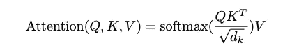
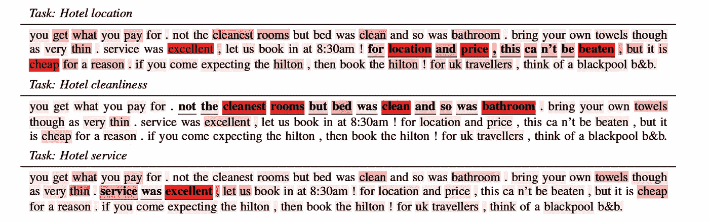
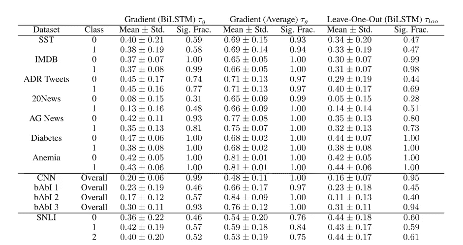
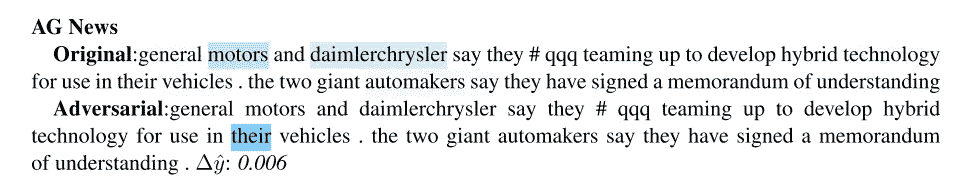
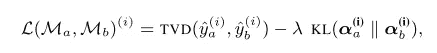
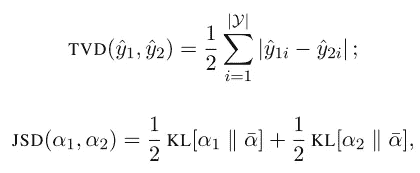
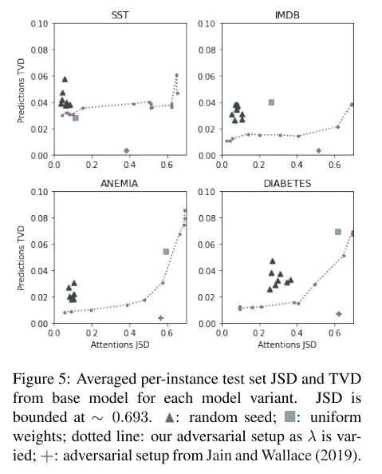

# 是注意力解释？

> 原文：<https://towardsdatascience.com/is-attention-explanation-b609a7b0925c>

[伊森·m .](https://unsplash.com/@itsethan?utm_source=medium&utm_medium=referral)在 [Unsplash](https://unsplash.com?utm_source=medium&utm_medium=referral) 上拍摄的照片

机器学习中的模型解释问题一直存在。出于各种原因，我们需要玻璃盒子模型。首先，数据科学家希望理解模型的预测，以避免数据泄露，并能够进行调试。项目经理希望了解模型选择背后的原因，以避免盲目决策，尤其是在银行或医疗保健等“敏感”领域。最后，用户想知道为什么一个模型做出一个预测来信任它。

在自然语言处理领域，有许多方法来解释模型的预测。最常用的一种就是看注意力地图。这个想法是训练一个具有注意力层的神经网络，并使用这些层来突出文本的重要部分。

最近看到两篇文章，“[注意不是解释](https://arxiv.org/abs/1902.10186)”和“[注意不是解释](https://arxiv.org/abs/1908.04626)”，讨论了注意机制对自然语言处理中模型解释的适用性。相当大的牛肉，是吧？我想在这篇博文中分享这些论文中的一些见解。

# 什么是注意力

在我们跳到论文辩论之前，让我们回顾一下注意力。

注意力机制在 20 世纪 90 年代被引入，但在发表了“[注意力是你所需要的全部](https://arxiv.org/abs/1706.03762)”之后开始流行。注意力机制试图增强输入数据的某些部分，同时减弱其他部分。动机是输入的某些部分比其他部分更重要。因此，我们应该给予他们更多的关注。理解哪个部分更重要取决于上下文，一个模型试图学习它。

有多种方法可以计算注意力。最常用的方法之一是缩放的点积注意力，这是在“[注意力就是你所需要的一切](https://arxiv.org/abs/1706.03762)”一文中介绍的:

> 注意功能可以描述为将查询和一组键-值对映射到输出，其中查询、键、值和输出都是向量。输出被计算为值的加权和，其中分配给每个值的权重由查询与相应键的兼容性函数来计算。
> 
> 输入包括维度为 **dk** 的查询和关键字，以及维度为 **dv** 的值。我们计算查询中所有键的点积，将每个键除以 **dk** 的平方根，并应用 softmax 函数来获得值的权重。

该图摘自“[关注是你所需要的全部](https://arxiv.org/abs/1706.03762)”一文。

下面给出了基于方面的情感分析任务的注意力可视化的例子。根据注意力分数来突出显示单词。我们看到单词“*位置*”、“*价格*”和“*优秀*”对于“酒店位置”任务是重要的，而单词“*最干净的房间*”和“*浴室*”对于“酒店清洁度”任务是重要的。这些词或多或少被认为是重要的，所以我们可以得出结论，模型做得很好。

该图摘自“[自然语言处理中的注意力](https://arxiv.org/abs/1902.02181)

注意机制是类变压器模型的核心部分之一，类变压器模型是现代自然语言处理技术的发展水平。与此同时，注意力提高了模型的性能，并且很自然地被认为可以用来理解模型的决策。然而，很少有研究证明这样的解释。那么，我们可以用注意力地图来理解一个模型吗？

# 注意不是解释

贾恩和华莱士在 2019 年发表了他们的论文“[注意力不是解释](https://arxiv.org/abs/1902.10186)”。本文对我们可以用注意力权重作为模型解释的主张进行了评估。在论文中，他们提出了注意力权重的两个属性，这两个属性对于“作为解释的注意力”方法应该是存在的:

1.  注意力权重应该与特征重要性度量(例如，基于梯度的度量)相关联；
2.  替代的(或反事实的)注意力权重配置应该在预测中产生相应的变化(如果没有，那么它们作为解释也是同样合理的)。

作者使用不同的 NLP 任务和数据集运行了几个实验来测试这些属性。他们旨在回答以下问题:*习得的注意力权重与特征重要性的替代性、自然的衡量标准一致吗？*和*如果我们关注不同的特征，预测会有所不同吗？*

在其中一个实验中，作者分析了注意力解释和替代解释方法之间的相关性——基于梯度的特征重要性和留一法(LOO)测量。他们发现观察到的相关性是适度的。他们的结论是，一般来说，注意力权重与标准特征重要性分数并不完全一致。

均值和标准差。戴夫。梯度/留一重要性测量和注意力权重之间的相关性。该图摘自“[注意不是解释](https://arxiv.org/abs/1902.10186)”一文。

在另一个实验中，作者试图生成一个替代的注意力地图，产生一个接近的预测。如果另一张注意力地图与最初的非常不同，但做出了同样的预测，那么解释的可靠性就成问题了。他们将这种另类注意力地图称为“对抗性注意力”。作者成功地用随机排列找到了许多对立的注意力。

例如，在下图中，我们看到了 AG 新闻数据集实例的注意力地图。“*汽车*”和“*戴姆勒克莱斯勒*”这两个词是必不可少的。将注意力地图替换为对抗性的注意力地图，这样“ *their* ”这个词就变得必不可少了，但这并不会太多地改变预测。一个预测 delta 等于 0.006，但是“解释”却完全不同！

该图摘自“[注意不是解释](https://arxiv.org/abs/1902.10186)”一文。

作者得出结论，注意力地图为模型预测提供透明性或有意义的解释的能力充其量是值得怀疑的。

# 注意不是不解释

在发表“[注意不是解释](https://arxiv.org/abs/1902.10186)”的论文后不久，Wiegreffe 和 Pinter 做出了回应——“[注意不是解释](https://arxiv.org/abs/1908.04626)”,他们在回应中对之前工作中的假设提出了质疑。在论文中，他们提出了两个主张来支持这一观点——存在并不意味着排他性，注意力分布并不原始。

## 存在并不意味着排他

注意提供*一个*解释，而不是*一个*解释。也就是说，产生准确预测的替代注意力地图的存在并不能证明注意力地图不能用作解释。鉴于 LSTM 模型的自由度，我们可以使用不同的注意力地图获得准确的预测就不足为奇了。产生接近预测的替代注意力地图的存在并不否定注意力地图对于解释的有用性。

## 注意力分配不是原始的

注意力是一个模型组件，其参数是在模型训练期间学习的。对抗性注意消除了注意和其他层次之间的联系。为了使对立的注意力“公平”，作者进行了以下实验。他们训练并微调了一个模型，其目标是在拥有不同注意力地图的情况下，做出与初始模型类似的预测。如果我们可以实现与初始模型相同的性能，但注意力分布完全不同，这就质疑了注意力和预测之间有意义的联系。

为了训练模型，作者使用了以下损失函数:

该图摘自“[注意不是不解释](https://arxiv.org/abs/1908.04626)的论文。

其中 TVD 是总变化距离，用于比较预测得分，JSD-詹森-香农散度用于比较注意力加权分布:

该图摘自“[注意不是不解释](https://arxiv.org/abs/1908.04626)的论文。

这种损失促使最小化预测之间的距离，同时最大化初始和敌对注意力分布之间的距离。

该图摘自“[注意不是不解释](https://arxiv.org/abs/1908.04626)”一文。

从实验结果中，我们看到作者未能实现与对抗模型相似的性能。这表明，经过训练的注意力学到了一些关于表征和预测之间关系的有意义的东西，这些东西不容易被敌对的“黑客”攻击。

他们在“[注意力不是解释](https://arxiv.org/abs/1908.04626)”论文中的主要结论是，贾恩和华莱士并没有否定注意力机制对于解释的有用性。然而，在两篇论文中，作者都同意需要进行进一步的研究。

# 是注意力解释？

那么，注意力是解释吗？不，注意力不应该被盲目地当作一种解释，尤其是对决策而言。

正如在[关于“注意力不是不解释”](https://medium.com/@byron.wallace/thoughts-on-attention-is-not-not-explanation-b7799c4c3b24)的思考中指出的，一个提供*似是而非*但同时提供*不可信*解释的模型将是最危险的可能结果。然而，注意力权重可以用于低风险的任务:健全性检查和模型调试。我们可以开始思考“*注意力不是解释*”，就像“*相关性不是因果关系*”一样。相关性可以是因果关系，但一般来说，它不是。

# 链接

1.  [注意力不是解释](https://arxiv.org/abs/1902.10186)
2.  [关注不是不解释](https://medium.com/@yuvalpinter/attention-is-not-not-explanation-dbc25b534017)中等博客帖子
3.  [注意不是不解说](https://arxiv.org/abs/1908.04626)论文
4.  [自然语言处理中的注意力](https://arxiv.org/abs/1902.02181)
5.  [关于“注意不是不解释”的思考](https://medium.com/@byron.wallace/thoughts-on-attention-is-not-not-explanation-b7799c4c3b24)