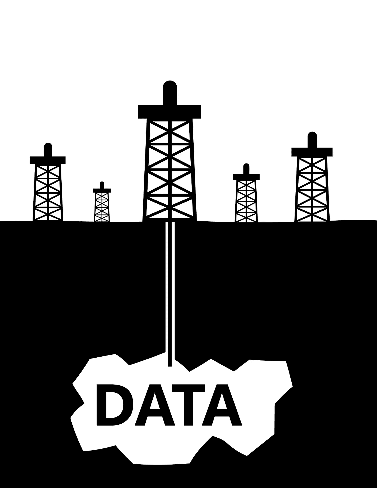
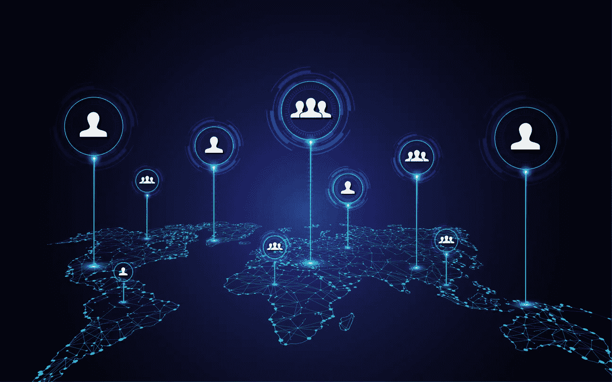

# 数据是 21 世纪的新石油，还是一种被高估的资产？

> 原文：<https://towardsdatascience.com/is-data-the-new-oil-of-the-21st-century-or-just-an-overrated-asset-1dbb05b8ccdf>

## 意见

## 用简单的英语比较数据和石油

图片来自 Shutterstock，授权给 Frank Andrade

过去几年，数据作为战略资产的概念越来越流行，然而，普通人无法看到数据的真正价值。

我们知道大型科技公司已经收集数据很长时间了。我们知道，年复一年，关于数据使用的新法规层出不穷。也就是说，我们大多数人仍然不明白数据可能对我们的社会产生的影响。

几年前，《经济学人》发表了一篇名为“世界上最有价值的资源不再是石油，而是数据”的文章然而，对于普通人来说，仍然很难理解数据如何成为新的石油。

数据和石油有一些相似之处，但也有一些不同之处。以下是其中的一些。

# 数据和石油需要提炼

数据和石油很少以原始状态使用。

如果油未经提炼，就不能使用。为了使石油变得有用，它必须被提取、提炼和分配。数据也是如此。我们不会一提取数据就使用它，但我们必须在数据准备好进行分析之前先对其进行处理。

Clive Humby 是一位数据科学企业家，他创造了“数据是新的石油”这一说法，以下是他对石油和数据的比较。

> “数据是新的石油。就像石油一样，数据是有价值的，但如果未经提炼，就无法真正使用。必须把它变成气体、塑料、化学物质等。创建一个有价值的实体来推动盈利活动。因此，必须对数据进行分解和分析，使其具有价值。”

这是真的。一旦收集了数据，就需要对其进行清理和转换，以获得所需的格式。为什么？好吧，现实世界的数据是混乱的，所以我们可能需要处理不准确或缺失的数据。

图片来自 iStockphoto，授权给 Frank Andrade

简单地说，假设你从一项调查中收集了数据。你可以相信从选择题中获得的结果不需要太多的预处理，但随着开放式问题的出现，事情发生了变化，因为人们可以回答他们想要的任何问题(有时没有遵循一个共同的模式)，甚至可以留下一个答案空白。

真实世界的数据有时就像那些开放式问题一样杂乱。

这就是为什么原始数据是不够的。只有在数据被“提炼”之后，我们才能通过制作报告、进行分析和创造有价值的东西来充分利用它。

## 石油是一种有限的资源，但每天都会产生越来越多的数据

石油如此值钱的原因之一是稀缺性的概念。那里可能有未被发现的石油储备，但是，事实是，石油是一种有限的资源。有一天，这个星球上将没有任何石油，我们必须找到一些其他形式的能源。

数据不会出现这种情况。

不仅公司拥有大量数据，甚至互联网上也有公开的数据，而且人们每天都在创造越来越多的数据。怎么会？每当你在网飞上看一部电影，在亚马逊上购买一件产品，或者在 Spotify 上听一首歌，都会产生一个新的数据点。

这些数据点在全球范围内每秒钟都会产生！

图片来自 iStockphoto，授权给 Frank Andrade

由于有数百万个数据点，大型科技公司可以开发一个良好的推荐系统，可以预测你可能喜欢的电影或歌曲，或者根据购买历史建议购买产品。

除此之外，与石油不同，数据可以重复使用而不会损失质量。一个工程师可以将数据集用于一个目的，而另一个工程师可以将同一数据集用于完全不同的目的。

但是如果数据是无限的，它怎么会这么有价值呢？价值取决于观察者的眼睛。关于体育统计的数据集对电子商务公司来说可能毫无用处，但对职业足球俱乐部来说却非常有价值。

## 数据和石油不是每个人都能得到的

是的，数据是无限的，但不是每个人都能得到。

没有一家公司会分享他们可能花了几年时间收集的数据(至少不是免费的)。网站上的可用数据也会发生类似的情况。数据就在那里，你可以以某种方式提取它，但它受到隐私准则和条款的保护。这意味着，尽管您可以提取数据，但您应该对如何使用这些数据三思而行。

让我们以 HiQ 和 LinkedIn 的案例为例。

HiQ 从 LinkedIn 提取了公开数据。LinkedIn 在给 HiQ 的停止信中援引了 CFAA。尽管美国上诉法院驳回了 LinkedIn 的请求，但这并没有授予 HiQ 将提取的数据用于商业目的的自由。

叶卡捷琳娜·博洛夫索娃在[像素](https://www.pexels.com/photo/brown-wooden-gavel-on-brown-wooden-table-6077326/)上拍摄的图片

如你所见，数据收集存在伦理问题，这与石油开采有很大不同。

即使是从客户那里收集数据的公司也不能随心所欲地使用这些数据。例如，[通用数据保护条例](https://gdpr.eu/what-is-gdpr/#:~:text=The%20General%20Data%20Protection%20Regulation,to%20people%20in%20the%20EU.) (GDPR)强制要求组织收集与欧盟人民相关的数据。那些违反其隐私和安全标准的人可能会支付高达数千万欧元的罚款。

**外卖**

*   像石油一样，数据也需要提炼。否则，它就不能用了，因为它没有那么值钱。
*   与石油不同，数据是人类每天创造的无限资源。它甚至可以重复使用，很少失去它的质量。
*   数据无处不在，但并非每个人都能获得。你可以提取数据，但是你应该三思而后行。

用 Python 学习数据科学？ [**通过加入我的 10k+人电子邮件列表，获得我的免费 Python for Data Science 备忘单。**](https://frankandrade.ck.page/26b76e9130)

如果你喜欢阅读这样的故事，并想支持我成为一名作家，可以考虑报名成为一名媒体成员。每月 5 美元，让您可以无限制地访问数以千计的 Python 指南和数据科学文章。如果你用[我的链接](https://frank-andrade.medium.com/membership)注册，我会赚一小笔佣金，不需要你额外付费。

 [## 通过我的推荐链接加入媒体——弗兰克·安德拉德

### 作为一个媒体会员，你的会员费的一部分会给你阅读的作家，你可以完全接触到每一个故事…

frank-andrade.medium.com](https://frank-andrade.medium.com/membership)