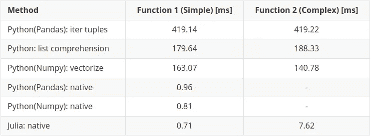

# Julia 真的比 Python 和 Numpy 快吗？

> 原文：<https://towardsdatascience.com/is-julia-really-faster-than-python-and-numpy-242e0a5fe34f>

## 最佳化

## C 的速度和 Python 的简单性


cottonbro 工作室拍摄的照片

**Python，连同 numpy/pandas 库，基本上已经成为数据科学专业的首选语言(…我将在这里快速添加一个 R)。**

**然而，众所周知，Python 虽然快速且易于实现，却是一种缓慢的语言。因此需要像 numpy 这样优秀的库来提高效率…但是如果有更好的选择呢？**

Julia 声称使用起来至少和 Python 一样简单和直观，同时执行起来要快得多。让我们来验证一下这个说法……

# 朱莉娅是什么？

万一你不知道朱莉娅是什么，这里有一个快速入门。

Julia 是一种开放源代码语言，它是动态类型的，直观的，像 Python 一样易于使用，但具有像 c 语言一样的执行速度。

它已经存在了大约 10 年(诞生于 2012 年)，所以它是一种相对较新的语言。然而，它正处于一个成熟的阶段，你不会称之为时尚。

语言的原创者活跃在相关的工作领域:

> 对于我们所做的工作—科学计算、机器学习、数据挖掘、大规模线性代数、分布式和并行计算— …
> 
> ——[julialang.org](https://julialang.org/blog/2012/02/why-we-created-julia/)——杰夫·贝赞森、斯特凡·卡尔平斯基、维尔卡·b·沙阿、艾伦·埃德尔曼

总而言之，它是一门**专门设计用于数据科学领域的现代语言**。创作者本身的目标告诉你很多:

> 我们想要 C 的速度和 Ruby 的活力。我们想要一种同形异义的语言，既有像 Lisp 那样的真正的宏，又有像 Matlab 那样明显、熟悉的数学符号。我们想要像 Python 一样可用于一般编程，像 R 一样易于统计，像 Perl 一样自然用于字符串处理，像 Matlab 一样强大用于线性代数，像 shell 一样善于将程序粘合在一起。这种东西学习起来非常简单，却能让最严肃的黑客感到高兴。我们希望它是交互式的，我们希望它是编译过的。
> 
> (我们有没有提到它应该和 C 一样快？)
> 
> ——[julialang.org](https://julialang.org/blog/2012/02/why-we-created-julia/)——杰夫·贝赞森、斯特凡·卡尔平斯基、维拉尔·b·沙阿、艾伦·埃德尔曼

听起来很刺激，对吧？

# 速度测试的基础

我以前写过一篇文章，讨论使用 Python 中的 numpy 库进行矢量化:

</how-to-speedup-data-processing-with-numpy-vectorization-12acac71cfca>  

本文将要进行的速度测试基本上是本文的扩展/比较。

# 测试将如何进行？

将在简单数学语句的执行速度之间进行比较:

**功能 1 —简单求和**

```
#Pythondef sum_nums(a, b):
    return a + b#Juliafunction sum_nums(x,y)
    x + y
end
```

和更复杂的条件语句:

**功能 2 —更复杂(逻辑和算术)**

```
#Pythondef categorise(a, b):
    if a < 0:
        return a * 2 + b
    elif b < 0:
        return a + 2 * b
    else:
        return None#Juliafunction categorise(a, b)::Float32
    if a < 0
        return a * 2 + b
    elseif b < 0
        return a + 2 * b
    else
        return 0
    end
end
```

当通过以下方法运行时:

1.  Python- pandas.itertuples()
2.  Python 列表理解
3.  Python- numpy.vectorize()
4.  Python-原生熊猫方法
5.  Python- native numpy 方法
6.  朱莉娅-本土方法

# 本文的笔记本


照片由[蒂拉查德·库姆塔农](https://www.pexels.com/photo/white-spiral-notebook-beside-orange-pencil-544115/)拍摄

上一篇文章包括一个用 Python 写的 Jupyter 笔记本。我从上一篇文章中取出了这个笔记本(没有改变)，并使用利用 Python 3.10 的 [deepnote](https://deepnote.com/) 实例重新运行它。

Python 运行和 Julia 运行的 deepnote 实例都有**完全相同的**基本 CPU 实例(即硬件)。这确保了本文包含的计时结果是直接可比的。

***注意:*** *我已经确保在每台笔记本电脑中都包含 CPU 信息，这样您就可以看到使用了什么确切的硬件，并且它们实际上完全相同。*

## 运行朱莉娅笔记本

值得注意的是，无论你是希望像我一样使用 [deepnote](https://deepnote.com/) 中的笔记本，还是使用 [colab](https://colab.research.google.com/) 中的笔记本，你都需要在各自的环境中设置 Julia。这主要是因为大多数公共在线实例目前只为 Python 设置(至少是现成的)。

## 环境设置

**深注**

由于 deepnote 使用了 docker 实例，你可以很容易地建立一个“本地”docker 文件来包含 Julia 的安装说明。这意味着你不必像在 Colab 中那样用安装代码污染 Jupyter 笔记本。

在环境部分选择“本地”。/Dockerfile "。这将打开实际的 docker 文件，您应该在其中添加以下内容:

```
FROM deepnote/python:3.10RUN wget https://julialang-s3.julialang.org/bin/linux/x64/1.8/julia-1.8.2-linux-x86_64.tar.gz && \
    tar -xvzf julia-1.8.2-linux-x86_64.tar.gz && \
    mv julia-1.8.2 /usr/lib/ && \
    ln -s /usr/lib/julia-1.8.2/bin/julia /usr/bin/julia && \
    rm julia-1.8.2-linux-x86_64.tar.gz && \
    julia  -e "using Pkg;pkg\"add IJulia\""ENV DEFAULT_KERNEL_NAME "julia-1.8"
```

你可以从[这个](https://julialang.org/downloads/)页面把上面的更新到最新的 Julia 版本，但是在编写的时候 1.8.2 是最新的版本。

**Colab**

对于 colab，所有的下载和安装代码都必须包含在笔记本本身中，并且在安装代码运行后刷新页面。

幸运的是，[aurélien Geron](https://github.com/ageron)(…我发现这里的一些人会熟悉这个名字)已经在他的 GitHub 上为 colab 的 Julia 提供了一个[入门笔记本](https://colab.research.google.com/github/ageron/julia_notebooks/blob/master/Julia_Colab_Notebook_Template.ipynb)，这可能是最好的入门方式。

## 笔记本

原始笔记本可在以下位置找到:

<https://github.com/thetestspecimen/notebooks/tree/main/julia-python-comparison>  

…或者在 deepnote 或 colab 中快速启动。

Python 笔记本:

[](https://deepnote.com/launch?url=https%3A%2F%2Fgithub.com%2Fthetestspecimen%2Fnotebooks%2Fblob%2Fmain%2Fjulia-python-comparison%2Fpython.ipynb)[](https://colab.research.google.com/github/thetestspecimen/notebooks/blob/main/julia-python-comparison/python.ipynb)

朱莉娅笔记本:

[](https://deepnote.com/launch?url=https%3A%2F%2Fgithub.com%2Fthetestspecimen%2Fnotebooks%2Fblob%2Fmain%2Fjulia-python-comparison%2Fjulia.ipynb)[](https://colab.research.google.com/github/thetestspecimen/notebooks/blob/main/julia-python-comparison/julia.ipynb)

# 结果呢


由[卢卡斯](https://www.pexels.com/photo/person-pointing-paper-line-graph-590041/)拍摄

如果你还没有阅读我之前关于 numpy 向量化的文章，我鼓励你去阅读(显然！)，因为在我们进入 Julia 结果之前，它将帮助您了解 Python 方法是如何堆叠的。

所有的都会在文末总结对比，如果没有时间也不用太担心。

## 输入数据

定义一个随机数生成器，以及两列取自正态分布的一百万个随机数，就像 numpy 矢量化文章中的内容一样:

**功能 1 —简单求和**

使用 Julia 的 [BenchmarkTools](https://github.com/JuliaCI/BenchmarkTools.jl) 可以自动获得对函数性能的合理估计，因为“@benchmark”方法会自动决定评估函数多少次，以获得对运行时的合理估计。它还提供了丰富的统计数据，如下所示:

为了更好地与 Python 方法进行比较，我们将使用平均时间，在本例中是 711.7 微秒(或 **0.71 毫秒**)来对一个一百万元素的数组和另一个一百万元素的数组求和。

**功能 2 —更复杂(逻辑和算术)**

该方法返回内容的示例:

基准:

所以更复杂的方法导致平均执行时间为 7.62 毫秒。

# 这与 Python 相比如何？


照片由[马克西姆·冈查伦诺克](https://www.pexels.com/photo/two-people-holding-pineapple-fruits-against-a-multicolored-wall-4412925/)拍摄

现在进行实际对比。首先让我们一起看看结果是什么样的:



结果表—按作者分类的表

图 1 —所有结果—按作者分类

然后我们可以继续进行分解。

## 结果:功能 1 —简单

从图 1 中的简单求和函数可以很清楚地看出，确保使用优化的库(比如与 Python 相关的 numpy)会有很多好处。差异如此之大，以至于更快的方法看起来几乎为零。

我在关于 numpy 矢量化的前一篇文章中介绍了这方面的原因，所以如果你想了解更多细节，请参考这篇文章。

图 2 —简单函数最快的三个结果—按作者分类

然而，即使是优化的 Python 库也不足以将执行速度提升到一种语言的水平，这种语言从一开始就被设计为快速的。

正如你在图 2 中看到的，在这个特定的测试中 **Julia 使用本机内置实现比使用 C 执行的 Python (numpy)优化库快 14%**。

## 结果:功能 2-复杂

尽管之前的成绩已经令人印象深刻，但在第二次测试中，朱莉娅彻底击败了对手。

正如我在[的上一篇文章](https://medium.com/towards-data-science/how-to-speedup-data-processing-with-numpy-vectorization-12acac71cfca)中解释的那样，在 numpy 中实现复杂函数的“本地”版本是不可能的，所以我们立刻失去了前一轮中最接近的竞争对手。

在这种情况下，即使 numpy 的“矢量化”方法也无法与 Julia 相提并论。

图 3—复杂函数最快的两个结果—作者图

在完成更复杂的计算时，Julia 比 numpy 矢量化整整快 18 倍。

## 发生了什么事？

numpy 在某些情况下如此快速的一个方法是，它使用**预编译**和优化的 C 函数来执行计算。如你所知，如果使用正确，C 是非常快的。但是，重要的一点是:如果某个东西是**预编译**的，那么它就是固有固定的。

这说明，如果你的计算很简单(比如函数 1)，并且在 numpy 库中有一个预定义的**优化的**函数，那么执行时间*几乎与 Julia 的*相同。

然而，如果你要执行的计算有点复杂或定制，并且没有被优化的 numpy 函数覆盖，那么在速度方面你就不走运了。这是因为您必须依靠标准 Python 来填补空白，这导致了我们在图 2 中看到的“复杂”函数的巨大差异。

# 结论

在回答方面:**Julia 真的比 Python 和 Numpy 快吗？**

嗯，是的，在某些情况下，差距还很大。

和往常一样，重要的是要看到这些结果的本来面目，一些特定函数的小比较。即便如此，结果仍然是真实和相关的。Julia 是一种快速的语言，虽然我们在本文中没有过多地涉及它，但它实际上也很容易使用。

如果你想更全面地了解 Julia 与其他语言相比有多快，你可以看看 Julia 网站上的通用基准:

<https://julialang.org/benchmarks/>  

同样的结果，它独树一帜，尤其是在数据科学领域。除非你用 c 写所有的代码。

# 最后一个问题…


图片来自[皮克斯拜](https://pixabay.com//?utm_source=link-attribution&amp;utm_medium=referral&amp;utm_campaign=image&amp;utm_content=1872634)

如果 Julia 那么优秀，为什么没有 Python/Pandas/NumPy/R 那样的牵引力和认可度？

我觉得这个问题的答案主要是时间。它只是存在的时间还不够长，但现实是 Julia 正在崛起，在某个时候(至少在我看来)它可能会接管数据科学领域。例如，它已经被微软、谷歌、亚马逊、英特尔、IBM 和 Nasa 等公司使用。

Python 和 R 是现阶段的行业标准，这将需要很大的动力来改变，不管这个新贵有多好。

另一个因素是学习资源的可用性。同样，由于时间的原因，以及大量的人使用 Python 和 R 进行数据科学研究，可供学习的资源非常丰富。而对于 Julia 来说，虽然有大量的文档，但它并不能真正竞争所有的学习资源(目前还不能！).

…但是如果你想冒险，我鼓励你给朱莉娅一个机会，看看你有什么想法。

如果你觉得这篇文章有趣或者有用，记得关注我，或者[注册我的时事通讯](https://medium.com/@maclayton/subscribe)来获取更多类似的内容。

如果你还没有，你也可以考虑订阅媒体。你的会员费不仅直接支持我，也支持你所阅读的其他作家。你还可以完全不受限制地访问媒体上的每个故事。

使用我的推荐链接注册会给我一点回扣，对你的会员资格没有影响，所以如果你选择这样做，谢谢你。

<https://medium.com/@maclayton/membership> 