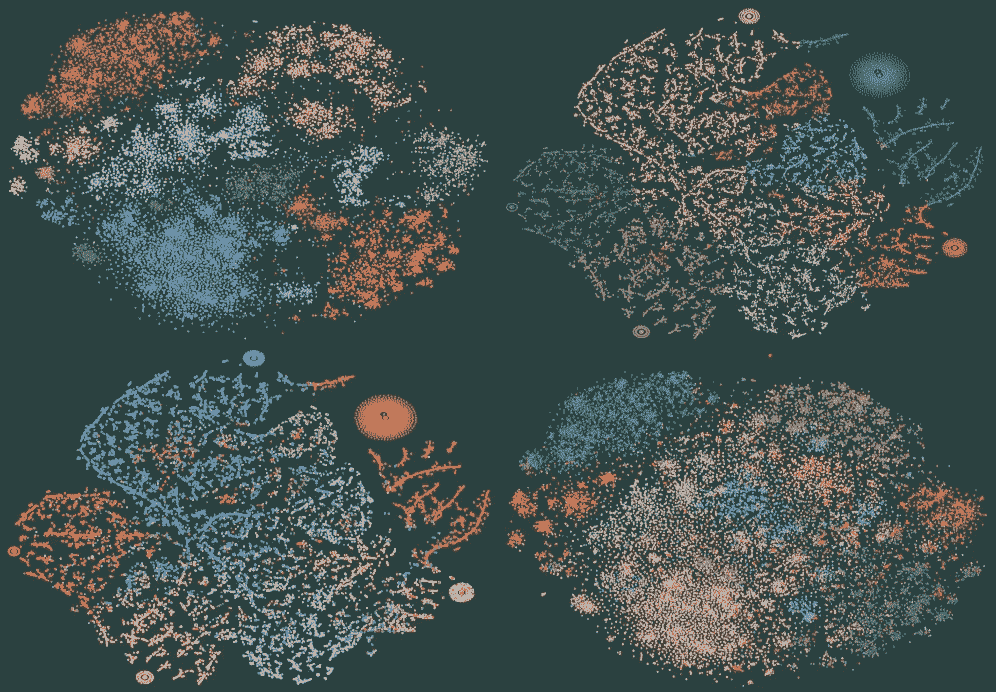
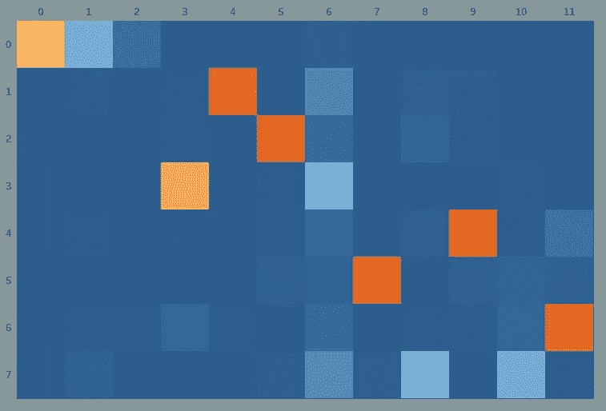
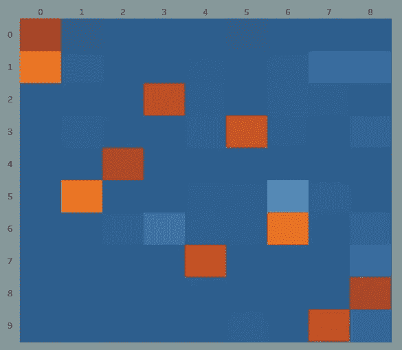
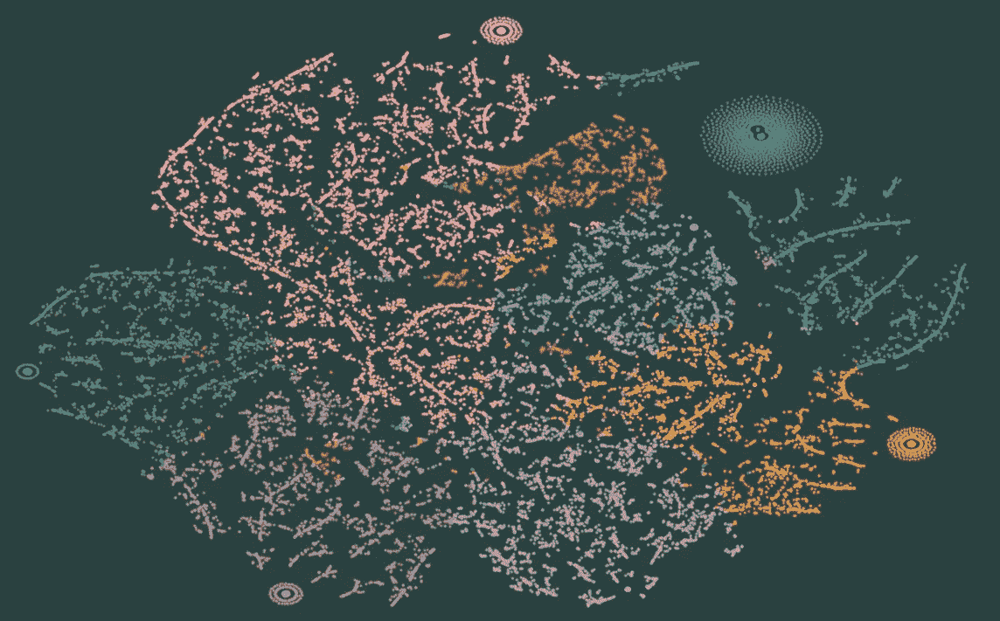
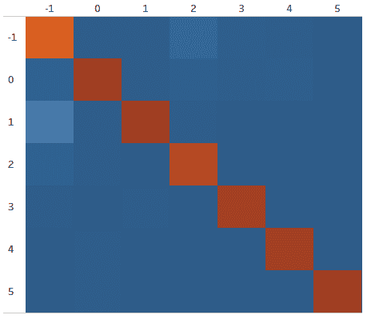
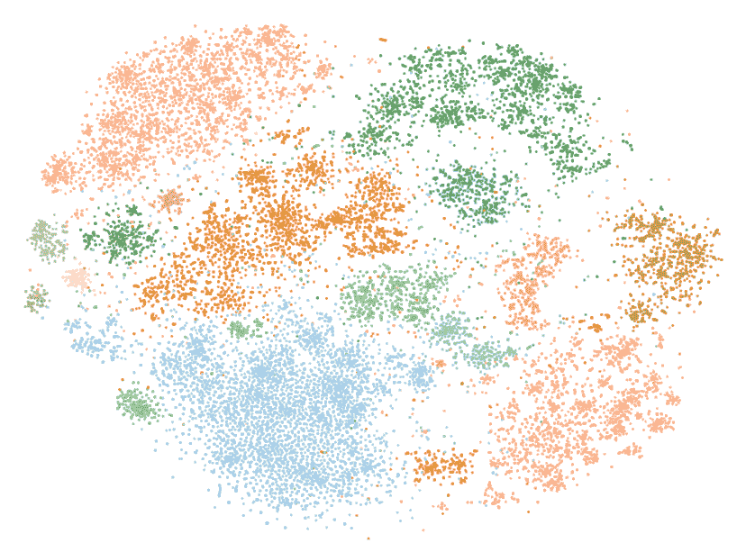
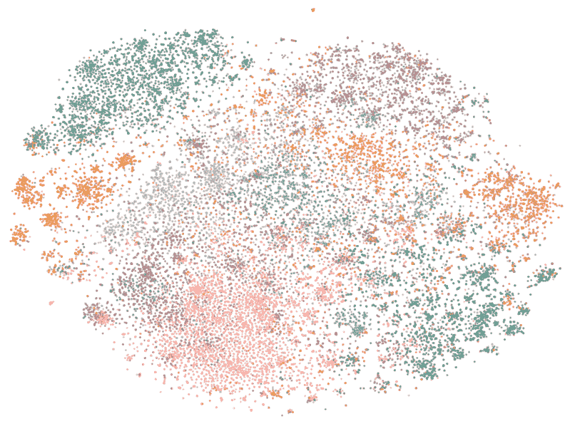
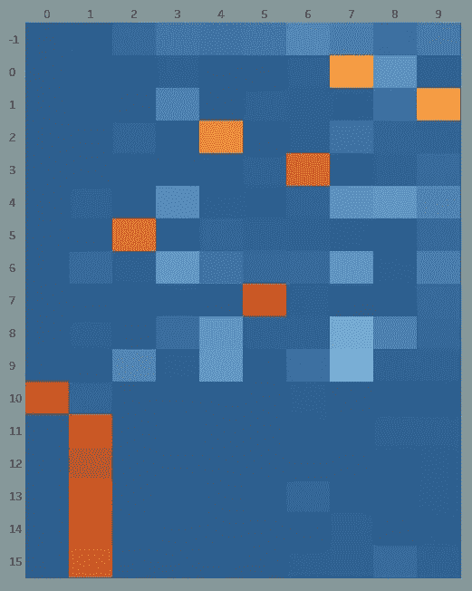
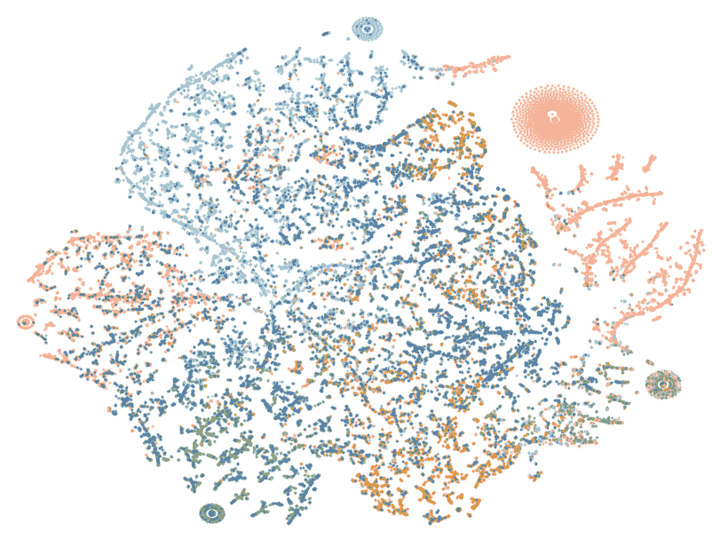
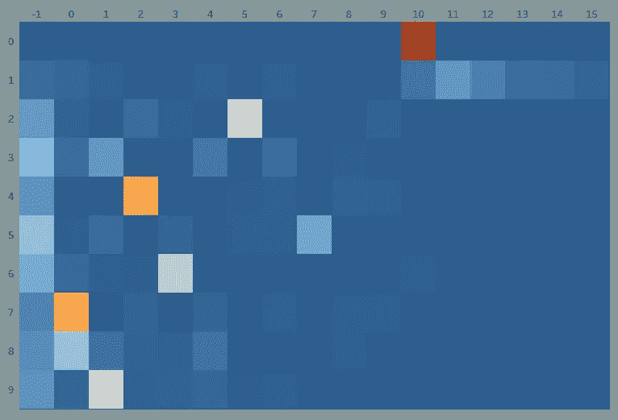

# LDA 话题建模死了吗？

> 原文：<https://towardsdatascience.com/is-lda-topic-modeling-dead-9543c18488fa>

图片作者。

## 利用嵌入式主题模型克服 LDA 的缺点

2003 年的论文*Latent Dirichlet Allocation*将 LDA 确立为现在可能是最著名和最广泛使用的主题建模算法(Blei et al. 2003)。然而，尽管 LDA 无处不在且经久不衰，但经历过 LDA 的人都很熟悉它的局限性。除了它的不稳定性之外，LDA 需要更多的文本预处理来获得好的结果。即使抛开实现细节不谈，LDA 也有一个更普遍的问题，这个问题困扰着主题建模者，不管他们使用什么算法——缺乏评估他们模型的基础事实。

为主题模型建立基础事实的唯一可靠和一致的方法是让专家创建一个公共的语料库主题词汇表，然后让多个注释者将词汇表应用到文本——这是一个耗时且昂贵的过程。这种“手工”方法，在社会科学中已经实践了几十年，正是无监督主题建模试图解决的问题。

获得一个客观的标准来衡量和评估一个模型的实际限制无疑导致了许多 ML/AI 实践者忽略了主题建模而去做其他不那么麻烦的工作。然而，尽管有缺点，主题建模，特别是 LDA，已经被证明足够有用来保持它们的流行。一篇讨论这个问题的论文简明扼要地总结了主题建模在面临其缺点时的持续吸引力

> *…虽然不能保证一个“主题”将对应于一个可识别的主题或事件或话语，*它们经常以其他方法无法做到的方式做到这一点 *(Nguyen et al. 2020)* *(着重部分由作者标明)*。

对于这些作者和许多其他人来说，主题建模已经被证明是“足够好”的，值得他们继续关注。

本文探讨了一种新的技术，使用语言嵌入的主题建模，有效地解决了使用 LDA 时遇到的两个最突出的问题。这种新方法在论文 [*BERTopic:用基于类的 TF-IDF 过程进行神经主题建模*](https://arxiv.org/abs/2203.05794)*(Grootendorst 2022)中有详细描述。BERTopic 是一个从嵌入数据中产生主题模型的端到端工具。默认情况下，它利用 [HDBSCAN](https://github.com/scikit-learn-contrib/hdbscan) 来识别语言嵌入中包含的主题。尽管̶̶h̶̶̶d̶̶̶b̶̶̶s̶̶̶c̶̶̶a̶̶̶n[[umap](https://umap-learn.readthedocs.io/en/latest/index.html)(bertopic 中默认使用它来减少语言嵌入的维度)是随机的，并且会受到运行变化的影响，但根据我的经验，它比 LDA 产生更稳定和可预测的主题分组。其次，因为 BERTopic 主题模型不同于它们总结的嵌入数据，所以有可能评估特定的运行是否很好地表示了底层数据结构。这个特性有效地创建了一个逐模型的基本事实，可用于评估和调优。没有什么可以和 LDA 相比。*

# *TL；速度三角形定位法(dead reckoning)*

*用 BERTopic，别用 LDA！LDA 是一个强大的主题建模工具，但是它的不稳定性是一个主要的，通常不被承认的绊脚石。BERTopic 没有不稳定的问题。重要的是，本文试图证明作为主题建模基础的单词嵌入可以有效地创建一个基础事实，在此基础上可以对给定的主题模型进行评估和调整。从实用的角度来看，BERTopic 也更容易使用，因为没有文本预处理，并且如下所示，比 LDA 的资源密集度低得多。*

# *免责声明和链接*

*我与 BERTopic 项目没有官方关系(与 LDA 或 EnsembleLDA 也没有官方关系)。作为本文的配套，我创建了一个 [Tableau 演示](https://public.tableau.com/views/IsLDATopicModelingDead/EmbeddingsStory?:language=en-US&:display_count=n&:origin=viz_share_link)，它将允许读者交互式地探索为本文创建的模型。本文中使用的数据是公开许可的，可以在[ka ggle](https://www.kaggle.com/danrobinson707/datasets?scroll=true)([CC0 license](https://creativecommons.org/publicdomain/zero/1.0/))上找到。我将一些技术细节和注释放在了文章末尾的附录中。*

# *不稳定的地面*

*反对 LDA 的案例沿着两条轴线展开。首先是算法固有的不稳定性。我以前写过关于 [LDA 主题模型不稳定性](/lda-topic-model-instability-c2fedb77d249)和为给定 LDA 模型建立客观正确的[目标主题数量](/determining-the-right-lda-topic-model-size-part-ii-ff4312e9fd9)时固有的[困难](/use-metrics-to-determine-lda-topic-model-size-1a1feaa1ff3c)。为本文生成的所有模型都是从同一个语料库中生成的。LDA 或 EnsembleLDA 在三种不同的配置中针对语料库运行。对每一对进行评估，以确定它们彼此的一致程度。*

*使用 [Gensim LDA](https://radimrehurek.com/gensim/models/ldamodel.html) 实施的默认参数的第一次 LDA 运行产生了以下热图，该热图比较了每个模型主题的文档/主题分配:*

**

*不相关的主题模型。图片作者。*

*橙色单元格表示出现在第一个模型的主题 2 和第二个模型的主题 4 中的文档数量，并记录了 62%的重叠。这是本次运行中最相关的主题对。尽管每个模型都基于相同的数据和相同的参数，但这些模型代表了非常不同的主题集。然而，通过增加我们对问题的处理能力，有可能得到更好的结果。*

*[EnsembleLDA](https://radimrehurek.com/gensim/models/ensemblelda.html) ，通过将多个模型协调到单个模型实例中，明确处理 LDA 模型不稳定性问题。使用与上述相同的数据和设置，我们可以看到模型相关性的显著提高:*

**

*改进的模型相关性。图片作者。*

*然而，这种改善是有代价的。在 Colab+实例上运行时，前两次相关性差的运行只需要几秒钟就能生成。上述改进的运行每个模型花费了三个多小时。如果我们在这个问题上投入更多的资源，将每个模型的处理时间增加到 9 个小时以上，结果会继续改善:*

**

*图片作者。*

*但是，尽管最后一组的相关性更好，LDA 模型不稳定性的影响是显著的。在第一次运行中，选择任意数量的 12 个主题作为模型的参数。但是，随后的四个模型都是用 EnsembleLDA 生成的。EnsembleLDA 的一个引人注目的特点是，在无人监督的情况下，该算法将收敛于优化数量的主题。然而，尽管 EnsembleLDA 在选择主题数量方面做得很好，但我们必须注意，在示例中，对于有多少个主题仍然没有达成一致。在 EnsembleLDA 模型中，我们分别看到 8、11、10 和 9 个主题。因此，即使后来的模型已经显著减少了它们的文档/主题分配中的漂移，在这个数据集中的主题数量上仍然没有一致意见。*

*其他判断 LDA 模型正确性的方法呢？最常见的方法之一是使用基于 npmi 的一致性分数(Lau et .艾尔。2014).有许多不同的变体，这里我们用 c_v，一个常见的选择。前两个模型的结果分别是. 291 和. 295。这些分数比第二组模型的分数低，分别为 0.578 和 0.566。然而，尽管最后一组模型显示出其主题之间的一致性比倒数第二组有显著提高，但它们的得分. 551 和. 549 比第二组差*。虽然基于 npmi 的指标在实验室中表现良好，但以我的经验来看，它们往往达不到自己的承诺。**

# **使用可视化来理解模型**

**在散点图中可视化文档提供了信息丰富的可视参考，有助于理解每个模型中三万个文档的分布。以下是两个最佳相关 EnsembleLDA 模型之一的 TSNE·2D 简化:**

****

**2D TSNE 对 LDA 输出的预测。鼓励读者通过[互动版](https://public.tableau.com/app/profile/dan.in.berkeley/viz/IsLDATopicModelingDead/EmbeddingsStory)探索剧情。图片作者。**

**我们可以清楚地看到主题之间的空间分隔。这个可视化的[交互版本](https://public.tableau.com/app/profile/dan.in.berkeley/viz/IsLDATopicModelingDead/EmbeddingsStory)允许用户放大并悬停在代表单个文档的每个点上。通过这种方式，可以了解文档的内容是如何以特定的方式将它们分类的。**

# **BERTopic 替代方案**

**如果您不熟悉 BERTopic 的软件包，我推荐您阅读它的文档以及它的作者 Maarten Grootendorst 发表的文章和论文中的 BERTopic 的[架构和方法](https://maartengr.github.io/BERTopic/algorithm/algorithm.html)。简而言之，BERTopic 使用 HDBSCAN(或任何其他您愿意使用的聚类机制)来确定语料库中的主题。然后，它使用 TF-IDF 的变体— c-TF-IDF，它不是查看单个文档来提取有意义的词汇，而是聚合整个主题的文档并从整个主题中提取有意义的词汇。虽然我认为 c-TF-IDF 本身是一个重要的贡献，但在本文中，我将重点关注通过对 BERT 句子嵌入进行 HDBSCAN 聚类的主题发现，并将其与上面的 LDA 模型进行比较，而不涉及 c-TF-IDF 词汇发现阶段。**

**在 BERTopic 中，模型不稳定的问题实际上是不存在的。下面是一个热图，比较了使用相同语料库和相同参数创建的两个不同模型的文档分配:**

****

**图片作者。**

**根据设计，HDBSCAN 不会尝试对低于阈值的文档进行分类，这些文档被分配到类别 1。此外，BERTopic 从文档总数的最大到最小重新编号所有主题，这说明了上面矩阵的对称对角线-这是 BERTopic 的纯粹美学特征。**

**值得注意的是，连续的 BERTopic 运行将在很大程度上产生相同数量的主题。虽然在文档分配方面，模型与模型之间存在一些偏差和变化，但与 LDA 相比，不稳定性程度是最小的。最后，这些模型是使用启用 GPU 的 Colab+帐户在几分钟内创建的，与需要数小时计算时间的资源密集型 LDA 实现相比，这是一个巨大的实际差异。**

# **我的袖子里几乎没有任何东西**

**细心的读者会注意到，上面使用的 BERTopic 模型只产生了六个主题(除了-1“主题”)。在使用这个语料库时，我发现当 HDBSCAN 针对嵌入运行时，存在一个“自然”的分割，其中体育故事包含大约六分之一的数据，并分成五个主题领域(有趣的是组织为:足球/橄榄球/板球、赛车、高尔夫、网球、拳击、游泳/跑步/奥运会)，而所有其余的被组织为一个非体育相关文档的超级集群。因此，我将数据集分为两部分，运动和非运动。当 BERT 运行这两个分段的语料库时，体育分段保留了与原始语料库中出现的相同的内部组织，将体育分成六个分段。然而,“非体育”这个以前只有一个类别的 blob 被分解成了十个独立的主题。我对 HDBSCAN 难以细分非体育超级集群的原因的假设是，当所有数据都在一个组中时，hdb scan 无法在划分体育主题的同时将较大的数据集细分为更精细的分组。当文集被分成两个独立的部分时，一切都水落石出了。**

**正因为如此，也因为 BERTopic 中还没有工具来执行这种操作，下面的主题分组是从两个不同的 BERTopic 模型中组合起来的。用于获得正确的 HDBSCAN 参数的工具和技术超出了本文的范围。**

# **嵌在…中的基本事实。嵌入？**

**下面是 2D·TSNE 对伯特嵌入的投影，覆盖了来自伯特普的最终主题，删除了-1 文档:**

****

**图片作者。**

**在图像的左上方，巨大的粉红色星团主要是足球，还有橄榄球和板球。其他运动:赛车、高尔夫、网球、拳击和游泳/跑步/奥运会，位于紧接其下方和左侧的五个集群中。Tableau 表示允许用户自由地遍历数据集，并向下查看文档级别，以了解更多关于 BERTopic 如何分割该语料库的信息。**

**另一个细分展示了 BERTopic 在主题之间进行精细、有价值的区分的能力。这种能力似乎远远超出了 LDA 的能力范围。另一个在 BERTopic 模型中可以观察到的细微差别的例子是大的中央绿色星团和它左边的两个分离的绿色星团。这些都是一个主题及其主题词的一部分:**

**狗，动物，动物，狗，物种，就像，猫，动物园，时间**

**最左边的群集似乎大部分或全部是关于狗的，中间的是关于猫的，大的分组(从左到右按空间组织)是关于外来动物、野生动物、海洋生物的，然后在这个更大的群集的边缘有一个分组与考古问题和少量的生物科学文献有关。这种清晰的空间/语义组织可以在整个 BERTopic 模型中找到。**

**我们可以使用散点图来比较由 BERTopic 和 LDA 创建的两个不同的模型。首先，我们可以将 LDA 主题叠加到 BERTopic 模型上:**

****

**图片作者。**

**LDA 主题通常与从 BERT 嵌入外推的坐标位置有很好的相关性。换句话说，较少数量的 LDA 主题或多或少符合 BERTopic 生成的主题分组。使用相同的 BERT 到 LDA 映射的热图，我们可以看到相同的有序数据的另一个视图:**

****

**BERT 主题/文档分布在左下方，LDA 分布在上方。图片作者。**

**0 和 1 LDA 主题是与体育相关的故事。我们可以看到，LDA 将这些文档分为两个集群，BERTopic 分为 6 个集群。其他六个 BERTopic 主题大致对应于 LDA 主题，但是剩余的四个 BERTopic 主题集群与 LDA 主题没有明确的关系。**

**反向视图，将 BERT 主题投影到 LDA 坐标上，揭示了一个更混乱的视图:**

****

**图片作者。**

**在这种情况下，我们可以看到，虽然一些领域大体一致，但在有分歧的地方，事情是相当混乱的。例如，右边有两只“眼睛”的粉色区域是体育报道。两个模型都很好地选择了足球故事。然而，LDA 模型无法有效地区分不同种类的运动。**

**翻转的热图以不同的形式显示了混淆程度:**

****

**左下方是 LDA 主题，上方是 BERT 主题。图片作者。**

**只有三个 LDA 主题可以说与它们的 BERTopic 对等物有任何程度的关联。**

# **那又怎样？**

**上面的两个模型，一个是由 BERTopic 创建的，另一个是由 EnsembleLDA 创建的，显然是不同的，很难找到比通过关于它们各自的文档/主题分配的协议更多的东西。我们应该从哪里来解释这种分歧呢？主题建模者一直在处理这种不确定性。由于没有客观测量的基础，建模者只能做出他们所能收集到的最明智的主观判断。**

**然而，我认为，基于嵌入的主题模型提供了一种替代诉诸纯粹的主观措施。有了上面的数据，我对散点图的分析充满信心，BERTopic 模型在主题聚类定义方面更加精确。此外，我无法找到利用 LDA 散点图来辨别底层数据组织的任何有意义的东西，或者可以做些什么来改进模型。虽然每个散点图都是该特定模型的一个很好的表示，但据我所知，它与文档本身的底层语义结构无关。一次又一次基于 BERT 的散点图揭示了关于文档的惊人的组织良好的和重要的信息，以合理化的空间关系表达。在 LDA 可视化中找不到任何可比较的东西。**

**希望这篇文章激发了人们对嵌入主题建模的兴趣，特别是 BERTopic。这里介绍的简单实用的事实是:BERTopic 不需要文本预处理；LDA 模型不稳定性的论证问题；和经验丰富的主题建模者的兴趣所在。**

**然而，除了这些实际考虑之外，还有一种直觉，即 BERTopic 为其主题模型使用的嵌入有效地为主题建模建立了迄今为止难以捉摸的基础事实。基于我迄今为止的探索，似乎有理由认为 BERT 嵌入比 LDA 为创建主题模型创造了更坚实的基础。**

**当我们查看 LDA 嵌入时，我们看到的是一个数学过程的结果，该数学过程只有直接的语料库可以操作和推断语义。每个 LDA 模型代表一个小的、封闭的关系世界。当使用嵌入时，我们将我们的数据连接到一个更大的信息体，这个信息体声称在某种程度上代表了语言本身。在我看来，当检查基于嵌入的模型数据时，这种更大的关系是可见的。**

# **附录**

**这些例子使用的数据是随机选择的，一个更大的公开许可的数据集[新闻文章](https://www.kaggle.com/harishcscode/all-news-articles-from-home-page-media-house) ( [CC0 许可](https://creativecommons.org/publicdomain/zero/1.0/))的 [3 万篇文章子集](https://www.kaggle.com/datasets/danrobinson707/newsdf) ( [CC0 许可](https://creativecommons.org/publicdomain/zero/1.0/))。**

**正如文章中提到的，我跳出了 BERTopic，获得了优化的 HDBSCAN 参数，以便与 BERTopic 一起使用，从而得到这里显示的输出。用于实现它们的方法是从 BERTopic 模型中提取嵌入(实际上是嵌入的 UMAP 缩减)，然后运行一系列改变 *min_sample_size* 和 *min_cluster_size* HDBSCAN 参数的实验。根据确定的主题群的数量和离群值的数量-1，文档分配来判断输出。我在这个数据集上发现，在几十次运行随机选择的值时，会产生“自然”数量的主题。有了这些数据，话题的数量聚集在 3、7 左右，然后跃升到 50 多个。我选择了产生这些异常值最少的集群配置的参数，然后运行散点图。基于这些结果，我认为将语料库分成两部分并重新运行调优实验可能是有意义的。最终结果如上所示，并形成 Tableau 表示的数据。我希望将来能更详细地写下这个技巧，鼓励那些对细节感兴趣的人通过我个人资料中的 LinkedIn 帐户与我联系。**

**学术界已经认识到，缺乏基本事实是主题建模的一个障碍。要了解更多关于这个问题的信息，我建议:**

> **Nguyen，d .，Liakata，m .，DeDeo，s .，Eisenstein，j .，Mimno，d .，Tromble，r .，和 Winters，J. (2020)。*我们如何用文字做事:将文本作为社会和文化数据进行分析*。人工智能前沿，3，62。**
> 
> **奥康纳，b，巴曼，d，&史密斯，N. A .(未注明)。社会科学的计算文本分析:模型假设和复杂性。2022 年 6 月 28 日检索，来自[https://people . cs . umass . edu/~ wallach/workshop/nips 2011 CSS/papers/oconnor . pdf](https://people.cs.umass.edu/~wallach/workshops/nips2011css/papers/OConnor.pdf)**
> 
> ***人文学科中的主题建模:概述*。(未注明)。检索于 2022 年 6 月 28 日，来自[https://Smith . UMD . edu/news/topic-modeling-in-the-humanity-an-overview/](https://mith.umd.edu/news/topic-modeling-in-the-humanities-an-overview/)**

# **文献学**

**文中引用:**

**布莱博士，Ng，A. Y .，&乔丹，M. I. (2003 年)。潜在狄利克雷分配。*机器学习研究杂志:JMLR* 。[https://www.jmlr.org/papers/volume3/blei03a/blei03a.pdf?ref=https://githubhelp.com](https://www.jmlr.org/papers/volume3/blei03a/blei03a.pdf?ref=https://githubhelp.com)**

**Grootendorst，M. (2022)。BERTopic:使用基于类的 TF-IDF 过程的神经主题建模。在*arXiv【cs。CL]* 。arXiv。http://arxiv.org/abs/2203.05794**

**刘，J. H .，纽曼博士和鲍德温博士(2014 年)。机器阅读茶叶:自动评估主题连贯性和主题模型质量。*计算语言学协会欧洲分会第 14 届会议论文集*，530–539。**