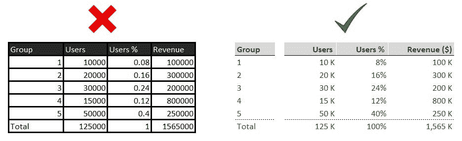
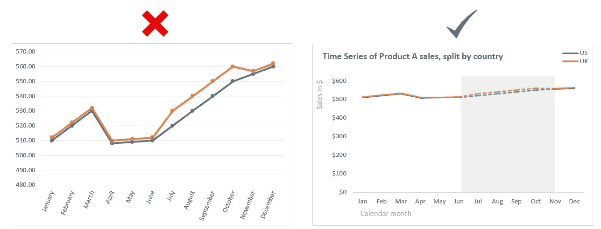

# 公开演讲是数据科学家的克星吗？

> 原文：<https://towardsdatascience.com/is-public-speaking-the-cryptonite-of-data-scientists-bb7dac5925d6>

## 帮助我提高演讲技巧的三个关键课程

*照片由* [*撒迦利亚*](https://unsplash.com/@amusementcentral_?utm_source=unsplash&utm_medium=referral&utm_content=creditCopyText) *上* [*下*](https://unsplash.com/s/photos/superman?utm_source=unsplash&utm_medium=referral&utm_content=creditCopyText)

大约七年前，在我攻读硕士学位期间，我是被选中与东南水务合作的三名学生之一。交易是公司会给我他们电表的数据，然后我会用这些数据作为我论文分析的基础。但是有一个陷阱！我还必须准备一套我论文的见解，并向 10 位利益相关者现场展示。

尽管我现在意识到这是一个锻炼我的演讲技巧和提升我的简历的好机会，但当时我并不这么认为。这将是我在商业环境中的第一次演示，在我的脑海中，我几乎绝对肯定地知道，不仅我会非常紧张，而且他们可能还会问我一些问题，这些问题会显示我缺乏作为分析师的经验(我第一次尝试冒名顶替综合症)。

从那以后，我花了很多时间来提高我的演讲技巧。我在培训会议上向商业利益相关者介绍了 300 多次。最近，我还有机会在帝国理工学院的数据科学研究行业展示会和我公司的数据科学峰会上进行现场演示(每次大约有 40 名观众)。

这次旅行让我意识到，演讲在很大程度上是一项可教的技能。当然，一些分析师比其他人更有演讲天赋，但是一些步骤可以帮助即使是最差的演讲者(像我一样)随着时间的推移而提高。为了帮助现在正在经历类似旅程的有抱负的数据科学家，我在下面概述了**三个关键经验，它们帮助**我提高了我的演示技巧(软技能和技术技能)和**获得了我作为数据科学家的第一份工作**。

# 完美不是在没有什么可以增加的时候，而是在没有什么可以拿走的时候

照片由[无修改](https://unsplash.com/@norevisions?utm_source=unsplash&utm_medium=referral&utm_content=creditCopyText)在 [Unsplash](https://unsplash.com/s/photos/clean?utm_source=unsplash&utm_medium=referral&utm_content=creditCopyText) 上拍摄

演示就像在大海里寻找珍珠一样。你通常要在探索数据时打开许多牡蛎，才能找到隐藏的珍珠。我在职业生涯开始时最常犯的一个错误是在我的演示中包括所有我打开的牡蛎。这与 Antoine de Saint-Exupery 的建议完全相反。相反，我应该只留下珍珠，其余的都留下。

首先，向非技术人员介绍和解释这些步骤要复杂得多，这大大增加了任务的难度。但更重要的是，这完全没有必要。商业利益相关者不会认为不详细的陈述不专业或不合标准。事实上，现实中恰恰相反。你的演讲越有针对性，越简单，就越容易理解，相比之下，过于沉重的演讲会让你的听众在几分钟后就失去兴趣。

在您开始创建演示文稿之前，有三个关键方面需要关注，它们可以帮助您从您的走带设备中分离噪音和信号:

*   **谁**是你的受众，他们的技术熟练程度如何？是业务利益相关者还是数据科学家？他们是高管、高级、中级还是初级？
*   **为什么**听众应该关心你演讲主题？如果你想说服他们，或者更好的是，激发他们参加演示，你会如何在 1 分钟或不到 1 分钟的时间内解释你演示的主要思想或目标？
*   **你会呈现什么**？如果受众和主要目标已经明确，下一步就是相应地设计你的演示文稿的初始结构、章节和流程。这很可能会随着演示的进展而改变，但仍将基于最初的设计。一般来说，我的牌组通常有五组，很少超过九组。这与研究表明大多数成年人平均可以在短期记忆中储存 7 个项目(5 到 9 个)有联系。这个想法是由米勒(1956)提出的，他称之为神奇的数字 7。所以通常，我有五个部分，每个部分有两到三张幻灯片，每一张都有助于我的分析结论(解决为什么)。

虽然花时间清楚地定义**谁**、**为什么**和**什么**可能会让你觉得这是一个不必要的步骤，但实际上会节省你的时间。更重要的是，它将为您的观众和您的演示创建一个更简单、更有针对性的平台。我将用伟大的法国数学家布莱士·帕斯卡的话来结束这一节:

> '如果我有更多的时间，我会写一封更短的信'

# **2)你的视觉效果应该是资产而不是负债**

由[安德烈·泰森](https://unsplash.com/@andretaissin?utm_source=unsplash&utm_medium=referral&utm_content=creditCopyText)在 [Unsplash](https://unsplash.com/s/photos/order?utm_source=unsplash&utm_medium=referral&utm_content=creditCopyText) 上拍摄的照片

既然我们已经讨论了如何从概念上设计演示文稿，下一步就是幻灯片的内容了。每张幻灯片都有两个主要组成部分，即实际的视觉效果(表格或图表)和对其中发现的见解的简短总结。

## **表格**

在现场演示中使用表格通常是一个坏主意，因为它与我们的语言系统相互作用，这意味着我们必须阅读它们才能理解它们。这并不理想，因为在你演讲的时候，你希望你的听众把注意力集中在你所说的内容上，而不是试图去解读表格。在大多数情况下，您最好将数据可视化，或者将核心数字保留在幻灯片中，并在附录中添加完整的表格。这不适用于仪表板，因为它们的目标不同于 30 分钟的演示。

如果你决定使用桌子，记住你要让设计淡出背景，让珍珠占据中心舞台。这主要取决于你对边框、格式和字体的选择。

作者图片

## **图表**

因为它们与我们的视觉系统相互作用，图表会比表格更快更容易地表达观点。然而，如果过于复杂，它们也可能是灾难性的。你的图表的唯一目的应该是帮助观众理解你想要传达的观点。另一方面，假设**图很复杂，需要更多的努力才能理解。在这种情况下，最有可能的结果是你的观众会决定他们不想在它上面投入更多的时间，并在精神上检查**(这是可以理解的)。

*   为图表使用标题
*   在 x 轴和 y 轴上使用标题，但是用浅色突出它们
*   你的 y 轴应该从 0 开始，以避免错误的视觉洞察
*   避免使用 3d 图表，因为它们会扭曲视觉解释，导致弊大于利
*   使用元素对齐并保留空白来突出珍珠
*   删除网格线
*   使用图例标注数据
*   使用颜色和形状来突出洞察力
*   选择最能展示你洞察力的图表

作者图片

## **总结**

摘要通常位于幻灯片的顶部。这应该是不言自明的，这样观众就能理解这些见解以及它们如何有助于你的演示的主要目标。这也可以帮助你决定你的幻灯片的有效性。如果没有清晰的摘要或者没有提供任何增量信息，您可以考虑更改甚至删除幻灯片。

# 假装它，直到你成功了

由 [Jonny Kennaugh](https://unsplash.com/@jonny_k?utm_source=unsplash&utm_medium=referral&utm_content=creditCopyText) 在 [Unsplash](https://unsplash.com/s/photos/bike?utm_source=unsplash&utm_medium=referral&utm_content=creditCopyText) 上拍摄的照片

这是演讲和公开演讲的标准语录，也是我职业生涯初期最讨厌的一句话。但这可能是给我的最好的建议。和其他事情一样，**提高的唯一方法就是练习**。

类似于你第一次骑自行车，你对第一次尝试不感兴趣，也不会因为失败而感到尴尬，因为你从来没有尝试过。相反，你首先使用辅助轮骑自行车，一旦你感到自信，你就开始不用辅助轮骑自行车，并在几次摔倒后坚持下去。

同样的原则也适用于演讲。你应该从小的演示开始，让自己感觉更自信，然后逐渐走向更多的观众。你也不应该害怕向别人寻求帮助。在我职业生涯的初期，我会在实际演示之前给自己演示十多次，甚至到今天，我仍然会做几次模拟演示，以确保我对流程和结构有信心。有时，我也会向我的同事做演示，这样做的好处是可以从那些没有花 10 多个小时做演示的人那里获得新的视角。这是测试你的牌组是否有足够的质量，以及它的结构和珍珠是否能被除你之外的其他人清楚地理解的最好方法。

# 结束语

就像好的演示一样，我想以上述三条经验的快速总结来结束这篇文章。我希望他们能像帮助我一样帮助你。

*   你的陈述应该简单明了，围绕你的目标和听众来组织(清楚地定义是谁，为什么和什么)
*   在幻灯片中使用视觉效果和摘要，使观点更容易理解。任何不利于这个方向的元素都应该被移除或改变
*   公开演讲可能令人生畏，但是通过练习和循序渐进，即使是最困难的演讲者也能变得熟练

# 保持联系

如果你喜欢阅读这篇文章，并想了解更多，别忘了 [**订阅**](https://medium.com/@alex.vamvakaris.ds/subscribe) ，让我的故事直接发送到你的收件箱。

在下面的链接中，您还可以找到一个免费的 PDF 演示，介绍如何使用 r。

 