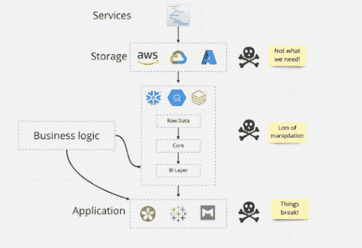
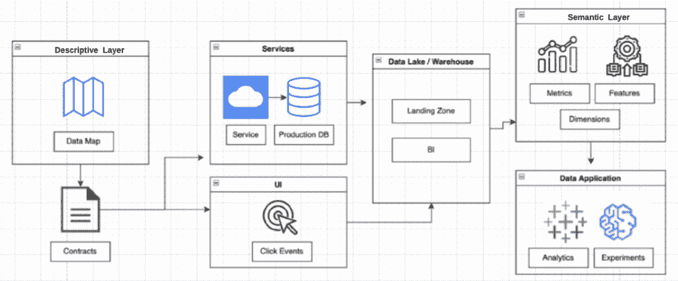
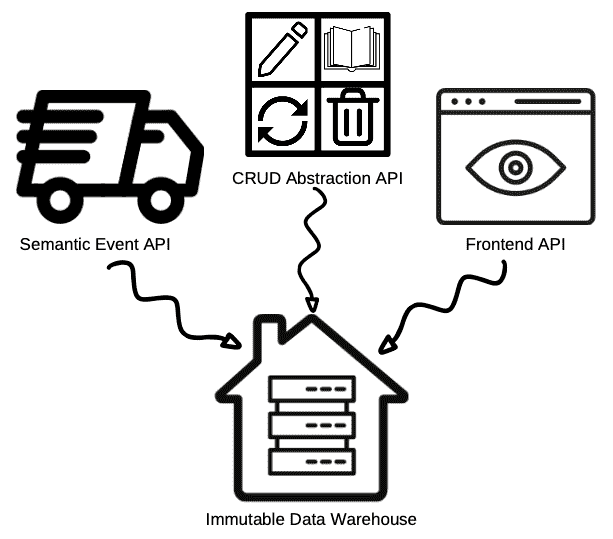

# 现代的数据仓库坏了吗？

> 原文：<https://towardsdatascience.com/is-the-modern-data-warehouse-broken-1c9cbfddec3e>

## 意见

现代数据仓库体系结构在许多层面上都产生了问题。图片由 Chad Sanderson 提供。

数据仓库是现代数据栈的基础，所以当我们在 LinkedIn 上看到护航队数据负责人 [Chad Sanderson](https://www.linkedin.com/in/chad-sanderson/) 宣称，“[数据仓库崩溃了](https://www.linkedin.com/posts/chad-sanderson_there-are-two-main-types-of-data-quality-activity-6909891078686953472-keb3?utm_source=linkedin_share&utm_medium=member_desktop_web)”时，它引起了我们的注意。

当然，Chad 指的不是这项技术，而是它是如何被使用的。

在他看来，数据质量和可用性问题源于传统的最佳实践，即将数据“转储”到仓库中，然后进行操作和转换以满足业务需求。这与 Snowflake 和 Databricks 等提供商为确保客户在存储和消费方面高效(换句话说，节省资金和资源)所做的努力并无出入。

不管你是否同意下面详述的 Chad 的方法，无可争议的是他的观点如何引起了大量的争论。

“一个阵营对我很生气，因为他们认为这不是什么新鲜事，需要长时间的手动流程和拥有 30 年经验的数据架构师。另一个阵营对我很生气，因为他们的现代数据堆栈根本不是这样建立的，也不是他们构建数据产品的方式，”Chad 说。

我将让您自己决定“不可变数据仓库”(或主动与被动 ETL)是否是您的数据团队的正确道路。

无论如何，我强烈支持推动我们的行业前进需要的不仅仅是对数据仓库和[数据观察平台](https://www.montecarlodata.com/blog-what-is-data-observability/)等技术的概述，而是关于如何部署它们的坦率讨论和独特视角。

我们让查德接手。

# 不可变数据仓库如何结合规模和可用性

来自查德·桑德森的观点

现代数据堆栈有许多排列，但数据仓库是一个基础组件。过于简单化:

*   数据通过被动管道提取(实际上只是 ETL 中的“E ”),然后转储到…
*   一个数据仓库，在那里数据被处理和存储，然后…
*   转换成数据消费者所需的格式，用于…
*   特定用途，如分析仪表板、机器学习模型或记录系统(如 Salesforce 或 Google Analytics)中的激活…
*   数据可观察性、治理、发现和编目等技术或流程在整个体系中运行。

在深入探讨这种方法的挑战和建议的替代方法之前，有必要探究一下我们是如何达到我们所定义的“现代数据堆栈”的。

## 我们是怎么到这里的？

在数据的早期，有了像比尔·恩门这样的先驱，最初的 ETL(提取、转换、加载)过程包括从数据源中提取，并在进入数据仓库之前进行转换。

许多企业至今仍以这种方式运营。对于数据质量至关重要的大公司来说，这一流程涉及一个手动的密集型治理框架，数据工程师和嵌入不同领域的数据架构师之间紧密耦合，以便快速利用数据获得运营洞察。

谷歌、脸书等科技巨头抛弃了这一过程，开始将几乎所有东西都转储到数据仓库中。对于快速成长的初创公司来说，逻辑组织数据的投资回报率没有这个更快、更具可扩展性的过程高。更不用说，加载(ELT 中的“L ”)已经变得更容易集成到云中。

与此同时，流行的转换工具使得在仓库中转换数据比以往任何时候都更容易。模块化代码和显著减少的运行时使 ETL 模型大大减少了痛苦…以至于流行的转换工具的使用从数据工程师扩展到了数据消费者，如数据科学家和分析师。

似乎我们已经找到了一个新的最佳实践，并且我们正在走向事实上的标准化。以至于提出一个替代方案会引起迅速而强烈的反应。

## 仓库中被动 ETL 或转换的挑战

一旦数据进入数据仓库，严重依赖于数据转换的体系结构和流程会出现几个问题。

第一个问题是数据消费者(分析师/数据科学家)和数据工程师之间的脱节，实际上是鸿沟。

项目经理和数据工程师将在分析师的上游建立管道，分析师的任务是回答来自内部利益相关者的某些业务问题。不可避免地，分析员会发现数据不能回答他们所有的问题，项目经理和数据工程师已经离开了。

当分析师的反应是直接进入仓库并编写一个脆弱的 600 行 SQL 查询来获得答案时，第二个挑战就出现了。或者，数据科学家可能会发现，他们构建模型的唯一方法是从生产表中提取数据，这些生产表作为服务的实现细节。

生产表中的数据不用于分析或机器学习。事实上，服务工程师经常明确声明不要依赖这些数据，因为这些数据随时都可能发生变化。然而，我们的数据科学家需要做他们的工作，所以他们无论如何都要做，当表被修改时，下游的一切都会中断。

第三个挑战是，当您的数据仓库成为垃圾场时，它就变成了数据垃圾场。

一项来自 Hadoop 时代的 Forrester 研究发现，企业中 60%到 73%的数据没有用于分析。T2 最近的一项希捷研究发现，企业 68%的可用数据未被使用。

因此，数据科学家和分析师花费太多时间在过度处理的生产代码堆中搜索上下文。作为数据工程师，除了数据质量，我们还需要强调数据*可用性*。

如果您的用户不能在您当前的数据仓库中可靠地找到并利用他们需要的东西，那还有什么意义呢？

## 另一种方法:引入不可变数据仓库

不可变数据仓库概念(也称为主动 ETL)认为，数据仓库应该是真实世界的数据表示，而不是随机查询、中断的管道和重复信息的混乱。

有五个核心支柱:

**#1 制定业务计划，分配所有者**。为了让企业真正从他们拥有的大量数据中获得价值，团队需要后退一步，在通过代码定义实体和事件以实现明确的分析目的之前，对他们的业务进行语义建模。这可能是一个从最关键的业务元素开始的迭代过程。

实体关系图(ERD)是基于现实世界的业务地图，而不是现在存在于数据仓库或生产数据库中的。它定义了关键实体、它们的关系(基数等)，以及表明它们已经交互的真实世界的动作。每个实体和事件都有一个工程负责人。端到端的自动化沿袭可以帮助建立 ERD，并使其可操作。

**#2 数据消费者预先定义他们的需求，然后签订合同**。也许最有争议的租户是数据应该从业务需求中涌现出来，而不是从非结构化管道中渗透出来。数据分析师和科学家不是在你仓库满是灰尘的货架上搜寻是否有足够接近他们需要的数据集*，除非数据消费者首先直接请求和定义，否则没有数据进入仓库。*

*如果没有业务问题、流程或驱动数据的问题，任何数据都不会进入数据仓库。一切都是为了要完成的任务而设计的。*

*这一过程必须设计得简单，因为数据需求总是在变化，不断增加的摩擦会威胁到采用。在康弗公司，实施新合同需要几分钟到几小时，而不是几天到几周。*

*接下来，是起草数据契约的时候了，这是业务和工程领导之间关于事件/实体的模式应该是什么以及该资产最有效最需要的数据的协议。例如，可能现有的 inboundCall 事件缺少 OrderID，这使得很难将电话呼叫与已完成的订单联系起来。*

*SLA、SLIs 和 SLO 是一种类型的[数据契约，您可以将](https://www.montecarlodata.com/blog-one-sla-at-a-time-our-data-quality-journey-at-red-digital/)应用于这种变更管理和利益相关者联合的模型。*

***#3 活跃环境中的同行评审文档**。同样，我们需要一个针对生产的代码(GitHub)或 UX (Figma)的同行评审过程，对于数据资产也应该有一个对等的过程。然而，对于这篇评论来说，正确的抽象层次不是代码，而是语义。*

*该审查过程应该与 GitHub 拉请求具有相同的结果——版本控制、相关方的签署等——都通过云处理。通过应用现代的、基于云的技术，我们可以加速旧的流程，使它们在发展最快的互联网业务中变得更加可行。*

*数据目录可以作为预数据仓库定义表面，但挑战在于没有胡萝卜和大棒让数据消费者保持元数据最新。对于一个使用 ELT 流程并完成模型的数据科学家来说，回去记录他们的工作的动机是什么？*

***#4 数据通过管道传输到合同**中定义的预建模仓库。转换发生在消费层的上游(理想情况下在服务中)。然后，工程师在他们的服务中实现数据契约。数据通过管道进入数据仓库，理想情况下，建模元数据可以自动连接和分类。*

***#5 重点在于防止数据丢失以及确保数据的可观察性、完整性、可用性和生命周期管理**。事务发件箱模式用于确保生产系统中的事件与数据仓库中的匹配，而日志和偏移处理模式([，我们在护航](https://medium.com/convoy-tech/logs-offsets-near-real-time-elt-with-apache-kafka-snowflake-473da1e4d776)中广泛使用)用于防止数据丢失。这两个系统共同确保了数据的完全完整性，因此不可变数据仓库是整个业务中发生的事情的直接表示和真实来源。*

*数据质量和可用性需要两种不同的心态。数据质量在很大程度上是一个技术挑战。想想“后端”工程。另一方面，数据可用性是一个“前端”工程挑战，需要与创建卓越客户体验相同的技能。最后，一个不可变的数据仓库不适合进行 Pb 级的测量竞赛，也不适合拿出你的大数据统计数据。弃用和维护与资源调配一样重要。*

*这种方法利用技术的优势来实现两全其美。传统方法的治理和业务驱动方法与现代数据堆栈相关的速度和可扩展性。*

## *不可变数据仓库的工作原理。像对待 API 一样对待数据。*

**

*不可变数据仓库的层。图片由 Chad Sanderson 提供*

*让我们从回顾围绕不可变数据仓库的整个堆栈开始。*

***1。描述层**:与传统的仓库不同，描述层将业务逻辑移到服务层之上，将数据消费者放在驾驶座上。消费者能够提供他们的需求，而不需要技术技能，因为数据工程师是代码翻译者的关键需求。这些合同可以保存在一个数据目录中，甚至可以保存在一个通用文档存储库中。*

***2。数据仓库**:数据仓库的主要功能是“数据展示”和底层计算层。*

***3。语义层**:数据消费者构建数据产品，这些产品经过验证并与业务部门共享。语义层中的资产应该被定义、版本化、审查，然后通过 API 提供给应用层使用。*

***4。应用层:**这是使用数据完成一些业务功能的地方，比如实验、机器学习或分析。*

***5。端到端支持:**支持跨数据栈的数据操作的解决方案，比如数据可观察性、目录、测试、治理等等。理想的情况是，一旦数据到达仓库，就有完美的、预先建模的、高度可靠的数据，但是您仍然需要涵盖现实世界可能向您抛出的所有排列(并且在流程越界时有强制执行机制)。*

*不可变数据仓库本身是为流设计的——从流到批量数据比从批量数据到流更容易——因此由三种不同类型的 API 支持。*

**

*蒙特卡洛图像库。*

*   ***语义事件 API:** 这个 API 是针对语义现实世界服务水平事件的，这些事件是公司的核心构件，而不是来自前端应用的事件。例如，在车队的情况下，这可能是当一个货物被创建或解除搁置。来自真实世界的事件构建在服务代码中，而不是 SQL 查询中。*
*   ***CRUD Abstraction API:** 数据消费者不需要看到所有的生产表，特别是当它们只是数据服务的实现细节时，他们使用这些数据服务来产生洞察力或制定决策。相反，当生产表中的数据资产的属性被更新时，API 包装或抽象层(例如，dbt)将公开对仓库中的数据消费者有意义的 CRUD 概念，例如，数据是否是新的或行容量是否在预期阈值内。*
*   ***前端 API:** 有很多工具已经可以处理前端事件定义和发射，比如 Snowplow、Mixpanel 和 Amplitude。也就是说，一些前端事件非常重要，团队需要能够使用长偏移管道来确保它们的交付和完整性。在某些情况下，前端事件对于机器学习工作流至关重要，而“足够近”的系统无法满足这一要求。*

*随着情况的变化(也许一个服务需要变成多个服务)，或者如果数据科学家头脑中的模式不适合现实世界中发生的情况，还需要有一个位于仓库外部的映射层。*

*映射应该通过流式数据库在仓库的上游处理，或者在仓库本身中处理。在这一层，BI 工程师将工程中出现的东西与数据消费者需要的东西相匹配，这可以自动生成[金博尔数据集市](https://www.astera.com/type/blog/data-warehouse-concepts/)。*

## *不可变数据仓库也面临挑战。以下是一些可能的解决方案。*

*我并不认为不可变的数据仓库是银弹。像任何方法一样，它也有优点和缺点，当然也不适合每个组织。*

*像数据网格和其他崇高的数据架构计划一样，不可变的数据仓库是一种理想状态，很少是现实。实现或者试图实现一个梦想是一个旅程，而不是目的地。*

*应该考虑和缓解的挑战有:*

*   *定义描述性图层的前期成本*
*   *处理没有明确所有权的实体*
*   *实施新方法，实现快速实验*

*虽然定义描述层是有成本的，但是可以通过软件大大加速，并通过优先考虑最重要的业务组件来迭代完成。*

*这需要一个包括数据工程师在内的协作设计工作，以防止数据质量责任在分布式数据消费者之间扩散。如果你第一次没有做对也没关系，这是一个反复的过程。*

*处理没有明确所有权的实体可能是一个棘手的治理问题(也是一个经常困扰数据网格支持者的问题)。数据团队通常无权在业务方面对这些问题进行分类。*

*如果有一个跨多个团队的核心业务概念，并且是由一个整体而不是微服务产生的，那么最好的方法是建立一个强大的审查系统，并有一个专门的团队随时准备进行更改。*

*数据工程师仍然可以在不限制工作流程的情况下进行试验并获得灵活性。实现这一点的一种方法是通过一个单独的暂存层。然而，来自这些暂存区的 API 数据不应该被下游或跨外部团队使用。*

*关键是，当你从实验转移到生产或者让边界团队可以访问时，它必须经过相同的审查过程。就像在软件工程中，你不能仅仅因为你想更快地前进，就在没有审查过程的情况下进行代码更改。*

## *祝您在数据质量之旅中好运*

*现代数据堆栈有许多排列，作为一个行业，我们仍在经历一个实验阶段，以了解如何最好地铺设我们的数据基础架构。*

*显而易见的是，我们正在迅速走向一个未来，在这个未来，更多的任务关键型、面向外部的复杂产品将由数据仓库“驱动”。*

*无论选择哪种方法，这都要求我们作为数据专业人员提高我们的标准，加倍努力获得可靠、可扩展、可用的数据。数据质量必须是所有数据仓库的核心，不管是什么类型。*

*从我的角度来看，底线是:当你建立在一个庞大的、无定形的基础上时，东西会坏掉，很难找到。当你真的找到它时，很难弄清楚它到底是什么。*

*不管是不是不可改变的，也许是我们尝试新事物的时候了。*

****本文与*** [***查德桑德森***](https://www.linkedin.com/in/chad-sanderson/) ***合著。****

**对提高您的数据仓库的数据质量感兴趣吗？约个时间跟* [*蒙特卡洛团队*](https://www.montecarlodata.com/request-a-demo/) *聊聊。**