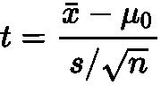

# 正态曲线好到不真实吗？

> 原文：<https://towardsdatascience.com/is-the-normal-curve-too-good-to-be-true-c7cf2fd33997>

## 你的数据是这样认为的。


作者图片

你还记得那天在统计学课上你听说了正态曲线吗？它是钟形的。它是对称的。它有一个公式。自然界中许多可以测量的东西都遵循这个形状——这是**上帝曲线**。

传统的推断统计学实际上是建立在这样的假设之上的，即通过足够多的实验(即样本)，我们得到的分布将是正态的(是的，我现在省略了技术细节)。

从这个角度来看，坦率地说，我们也可以说正常曲线是*便利的*。最起码有时候会被当成常识。

> *…给定的人口通常是围绕一个统计标准来观察的——water house，2004 (* [*来源*](https://www.tandfonline.com/doi/abs/10.1080/0885626032000167151) *)*

但是正态曲线好到不真实吗？说到推理测试，不幸的是似乎如此。根据过去半个世纪进行的研究，基于正态假设的传统方法在很多情况下都失败了。

在本文中，我将在[Deepnote](http://deepnote.com) 中使用图表和模拟来展示依赖于常态的传统方法是如何让我们失败的。我们还将看看用 Python 实现的[替代方法，它们更加强大和准确。将提供所有代码，以便您可以自己检查结果。](https://joss.theoj.org/papers/10.21105/joss.02241)

# 正态曲线的神话

实际上有一篇关于正态曲线流行的很棒的论文，作者是 Micceri，叫做 [*《独角兽》、《正态曲线》和其他不可思议的生物*](https://psycnet.apa.org/record/1989-14214-001?doi=1) (这是个标题！).论文检查了 440 个大样本分布，发现它们在统计上是非正态的。因此，米塞利质疑假设正态性的统计数据的稳健性。确实有其他的论文和书籍研究和评论正态曲线的存在( [1](https://link.springer.com/article/10.1007/s11135-005-6104-0) 、 [2](https://journals.sagepub.com/doi/abs/10.1177/016059768100500103?journalCode=hasa) 、 [3](https://books.google.ca/books?hl=en&lr=&id=_D_4VKNrHygC&oi=fnd&pg=PA1&dq=normal+curve+myth&ots=QRpNJ7vbFY&sig=sjYHZ1ZmjH9Eu_jzEWrh9CKEji8&redir_esc=y#v=onepage&q=normal%20curve%20myth&f=false) )。

> 神圣的钟形曲线肯定已经从上到下裂开了。也许，像自由钟一样，它应该被铭记在某个地方，作为对更英雄的日子的纪念——欧内斯特,《费城询问报》。1974 年 11 月 10 日。( [*来源*](https://journals.sagepub.com/doi/abs/10.1177/016059768100500103?journalCode=hasa) *)*

# 学生 t 分布

正态曲线有一个近亲叫做[学生的 *t* 分布](https://en.wikipedia.org/wiki/Student%27s_t-distribution)。我们可以很容易地用它来证明，我们在统计中被告知的假设，并不总是与现实相符。

t 也是钟形的，尾巴轻，对称。当样本量达到∞，t 分布接近正态分布。在许多统计学书籍的后面(当然还有网上)，你可以找到基于各种场景的 T 的阈值。当我们进行 T 检验时，这些阈值帮助我们确定我们的结果是否具有统计显著性。

当然，我们对这些数字门槛的信心应该和潜在的假设一样坚定。也就是说，我们假设，



遵循一个分布。但是真的吗？让我们检查一下。

比较假设的和估计的 t 分布

灰色曲线是假设的 *t* 分布。蓝色曲线是我们在现实中得到的 *t* 分布。为了澄清，我使用[计算机](https://deepnote.com/project/yourabnormalcurvefreecodecampembeds-LPV2t0PUSVuz6LJUPUbACw/%2Fnotebook.ipynb/#7a580020-4fb7-4a0a-b1f3-10b77143d94f)基于对数正态总体分布(5000 个样本；n=20)。正如您在这个场景中看到的，我们假设 T 遵循一个 *t* 分布并不成立。由此可以得出一个非常严肃的结论:**当样本来自偏斜分布时，T 检验会导致假阳性率增加(I 型错误)**。对于重尾或轻尾分布都是如此。你可以通过对比上图中的左尾巴来直观地理解这一点。蓝色曲线中间的 95%比灰色曲线宽得多。这意味着，相比之下，我们更有可能以惊呼“我的结果很重要”而告终，而实际上并不是( [4](https://psycnet.apa.org/record/1998-00122-003) ， [5](https://www.mendeley.com/reference-manager/reader/9563eed0-503e-3e3e-b898-e28b23275eb3/73c4775b-87e9-623f-7255-87ba04912c73) )。

我们可以将 T-test 置于许多其他场景中，以确定它的表现如何。事实上，[这个笔记本](https://deepnote.com/project/yourabnormalcurvefreecodecampembeds-LPV2t0PUSVuz6LJUPUbACw/%2Fnotebook.ipynb)允许你有计划地调整人口分布的偏度和权重(异常值的比例)。我们可以将此作为估计 I 型错误率的模拟的基础。让我们来看看当总体具有重尾时 T 检验的表现，并且让我们将它与一个稳健的替代方法进行比较:**百分位引导检验**(不要担心，我很快将向您展示如何使用它！).

比较第一类错误率

在这种情况下，我将虚构的人口形状设置为对称的，就像一条正态曲线，但允许它有沉重的尾部(所谓的[污染的正态](https://blogs.sas.com/content/iml/2016/12/28/contaminated-normal-distribution.html))。从上面的图表可以看出，T 检验的假阳性(I 型错误)比例实际上非常低。有意思。与我们从对数正态分布中取样相比，这似乎是相反的效应模式。

你可能会说，“那么，较低的假阳性率是好的，对吗？”嗯，是的，但是我们正在创造一个新的问题……

为了简单起见，我略读了一些技术细节，但让我这么说吧:通常，研究人员对 5%的假阳性率“还行”。如此严格的比率反映了我们希望在假阳性方面稳妥一些。我们正在优化低假阳性率，但代价是假阴性(第二类错误)。

上面图表中的测试旨在将假阳性率保持在 5% (0.05)。任何高于 5%的都意味着太多的假阳性。任何远低于 5%的数字都意味着太多的假阴性(缺乏敏感性或统计[能力](https://en.wikipedia.org/wiki/Power_of_a_test))。

总而言之，与百分位数自举检验等稳健检验相比，T 检验在以下方面存在问题:

*   当采样来自偏斜、重尾或轻尾分布时，I 型误差会增加。
*   当采样来自对称的重尾分布时，功耗会降低。

我们还可以说更多，特别是在低概率覆盖率(中间的 95%)的含义方面，以及事实上 *t* 是[并不总是以](https://en.wikipedia.org/wiki/Noncentral_t-distribution)为零为中心，但是如果你感兴趣，你可以在这里阅读更多关于那个[的内容。只要说有更好的选择就够了！](https://link.springer.com/book/10.1007/978-1-4419-5525-8)

# T 检验的可靠替代方法

好的，百分位数自举测试，你在上面已经看到了，在第一类错误和功效方面都表现得很好。与假设正态性的传统测试(以及基于[平均值和标准偏差](https://medium.com/towards-data-science/still-using-the-average-24e759a78026)的测试)相比，这一点尤其正确。百分位自助检验**没有**的正态假设。

百分位引导测试很容易描述(另外，我将在后面介绍一个 Python 库用于计算)。首先，下面是比较两个独立组时的步骤:

1.  用第一组中的替换值 *n* 随机重新采样。
2.  用第二组中的替换值 *n* 随机重新采样。
3.  计算两个重新取样组的平均值之差。
4.  存储得到的平均差值，并多次重复步骤 1-3。
5.  如果存储值的中间 95%(置信区间)包含 0，则两组之间没有统计差异。否则，你会发现不同之处。

是的，就是这样。感谢现代计算机，像这样的大规模迭代是微不足道的。我们不是假设一个特定的形状来悬挂我们的假设，而是简单地建立我们自己的经验决定的抽样分布。

# 引入假设

[假设](https://joss.theoj.org/papers/10.21105/joss.02241)是一个用于稳健统计的同行评审 Python 库。它基于 [Rand R. Wilcox 的](https://dornsife.usc.edu/cf/labs/wilcox/wilcox-faculty-display.cfm)R 方法集合[这里](https://dornsife.usc.edu/labs/rwilcox/software/)。假设有许多稳健测试的功能，包括单因子和双因子设计的方法以及测量关联的方法。[文档](https://alcampopiano.github.io/hypothesize/)提供了可运行示例的“启动链接”,因此您可以立即使用这个库。

**计算百分位自举测试**

我们看到了百分位数自举测试是多么容易用语言来描述，但是让我们看看用假设来计算是多么容易。同样，假设我们正在比较两个独立的组。

让我们导入两样东西:

1.  一种称为修整均值的稳健估计量。这比使用样本平均值要好得多，因为你可以在这里阅读[和](https://medium.com/towards-data-science/still-using-the-average-24e759a78026)。
2.  测试本身，也就是所谓的`pb2gen`。我使用 Wilcox 的命名约定— `pb2gen`代表“广义 p 值的百分位数自举”，以防您感到疑惑。

```
from hypothesize.utilities import trim_mean from hypothesize.compare_groups_with_single_factor import pb2gen
```

然后，我们简单地传递 Pandas 数据帧的列(代表两个组)、修整平均值和修整量(在本例中为 20%)。

```
results=pb2gen(df.column_1, df.column_2, trim_mean, .2)
```

‌Hypothesize 返回的结果字典如下:

```
{ 
'ci': [-0.22625614592148624, 0.06961754796950131], 
'est_1': 0.43968438076483285, 
'est_2': 0.5290985245430996, 
'est_dif': -0.08941414377826673, 
'n1': 50, 
'n2': 50, 
'p_value': 0.27, 
'variance': 0.005787027326924963 
}
```

在结果字典中，我们可以看到置信区间和 p 值。让我们看另一个例子。置信区间包含 0，所以我们说组间没有统计学差异。

**计算稳健相关性**

有两个定量栏？这对于一个成功的皮尔森 r 相关来说是一个完美的工作——相信我，如果你认为 T 检验有问题，你肯定会想[读读](https://www.elsevier.com/books/introduction-to-robust-estimation-and-hypothesis-testing/wilcox/978-0-12-820098-8?country=CA&format=print&gclid=Cj0KCQiAxoiQBhCRARIsAPsvo-x-BsG8NJfo8t3mOu9t58FOAe_17-x4wxGrSED9h8jaPbo-ozj03PoaAoRNEALw_wcB&gclsrc=aw.ds)关于相关性和回归是如何受到未满足的假设和异常值的影响(它变得很糟糕)。

```
from hypothesize.measuring_associations import wincor
results=wincor(df.column_1, df.column_2, tr=.2)
```

这就是全部了。这是结果字典，显示了相关性和重要性，以及其他细节。

```
{
 'cor': 0.08515087411576182,
 'nval': 50,
 'sig': 0.558539575073185,
 'wcov': 0.004207827245660796
}
```

# 行动呼吁

过去，统计学家理所当然地依赖正态性等便利的假设。我是说，你能想象手工做 5000 个 bootstrap 样本吗？！当然不是。传统的推理测试，尤其是那些依赖于均值和方差的测试，确实有严重的缺点。幸运的是，对稳健替代方法的研究已经超过 50 年，计算这些新方法的软件也变得越来越容易获得。

**考虑在你的技能中加入稳健的统计数据**。关于这个主题的权威书籍是 Wilcox 的[稳健估计和假设检验的介绍](https://www.elsevier.com/books/introduction-to-robust-estimation-and-hypothesis-testing/wilcox/978-0-12-820098-8)。如果你喜欢不太专业的东西，试试[现代统计方法的基础](https://link.springer.com/book/10.1007/978-1-4419-5525-8)。

如果你想马上体验一下，Deepnote 可以让你轻松地投入学习。尝试[这个笔记本](https://deepnote.com/project/yourabnormalcurvefreecodecampembeds-LPV2t0PUSVuz6LJUPUbACw/%2Fnotebook.ipynb)开始玩本文中使用的模拟。或者，尝试[这一个](https://deepnote.com/project/robuststatisticsinpython-Duplicate-xaNNQB6GSfmVEyvfzu16mg/%2Fnotebook.ipynb/#00012-f8d3cb3a-9190-429f-be97-f3b22a344872)来探索来自假设的一些健壮的方法——不需要安装或设置。

享受更强大和准确的统计数据！