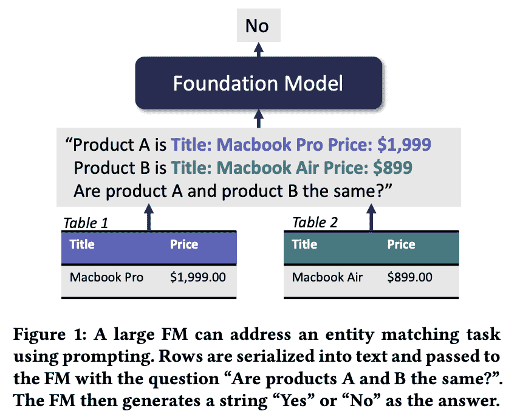
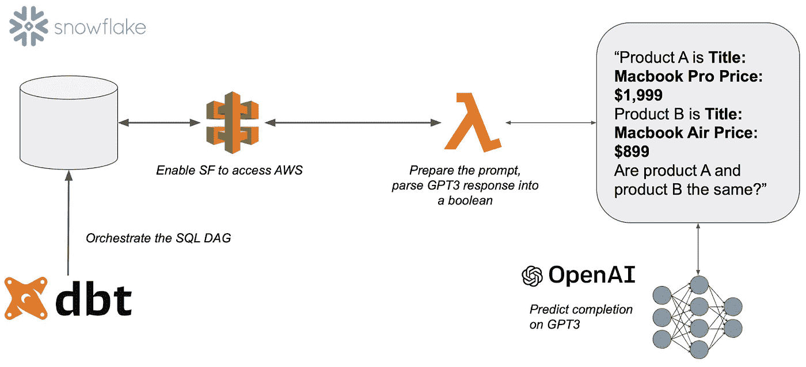
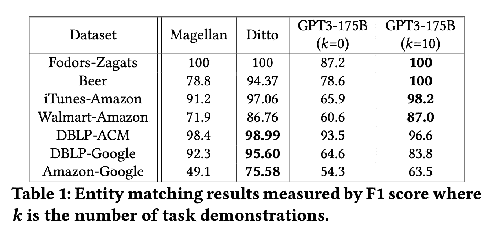
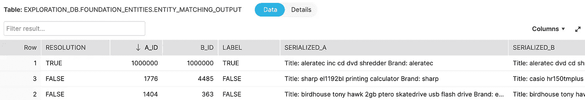

# “这是你吗？”具有大型语言模型的现代数据堆栈中的实体匹配

> 原文：<https://towardsdatascience.com/is-this-you-entity-matching-in-the-modern-data-stack-with-large-language-models-19a730373b26>

## 液体火箭发动机的生产试验

## 壮举。Avanika Narayan


“用人工智能识别人的系统，以黑客帝国的风格”[图片由 DALLE2 生成]

## 数据仓库时代的实体匹配

T 数据宇宙至少和漫威宇宙一样忙于生产一个又一个闪亮的新东西:在“现代数据栈”(MDS)开始使用[雪花](https://www.snowflake.com/en/)和 [dbt](https://www.getdbt.com/) 之后，大量的工具一直在帮助人们连接和管理他们在 MDS 内的所有数据源*。您有来自 Salesforce 的客户数据吗？完美！你有谷歌分析的广告数据吗？带他们进来！你有 WorkDay 的员工数据吗？*多多益善*！*

举个具体的例子。假设您正在为您的预测和报告功能合并供应商反馈，例如，反馈会告诉您产品 x 将有多少库存。虽然不同反馈的产品的*确切的*形状和形式不同，但通过检查，人们通常能够确认产品 A 和 B 是*相同的*，而产品 C 不是(它是一个三脚架，但显然不是同一件物品):

*   **产品 A** :新-targus 红色 tg-6660tr 三向云台三脚架 66-meytg 6660 tr，targus 生产，价格 31.0
*   **产品 B** : targus 生产的 targus red tg-6660tr 三向云台三脚架，价格 29.98
*   **产品 C** :新黑灰色 flexpod 手爪三脚架，球头，sunpack 生产，无价格

产品元数据以一种不明显的、难以预测的方式变化:价格可能略有不同，属性可能会出现和消失，某些商品的数据可能会丢失。虽然写下规则和模糊匹配来摆脱它肯定是可能的，但这需要大量的时间和代码(编写、测试和维护)。

在一个很远很远的星系中，一种新的 NLP 模型已经学会了自然语言的(一些)细微差别(以及关于我们世界的事实！)通过在 45tb 的自然语言 web 文本(例如，Reddit、维基百科等)上学习预测句子中的下一个单词(例如，“猫在*_ _ _ _ _ _*”)。令人惊讶的是，非常大的神经网络，可以解决我们的猫完成也*学会了如何解决广泛的* [其他任务太](https://arxiv.org/abs/2005.14165):

> 如果我们告诉你同样的技术也可以解决实体匹配呢？

特别是，[NLP 领域的某人](https://arxiv.org/pdf/2205.09911.pdf)最近认识到实体解析是这些模型可以解决的许多任务之一:向模型描述两个项目，然后要求完成类似“项目 A 和项目 B 是同一个项目吗？_____"!

在这篇文章中，我们(Jacopo + Avanika)分享了一个[开源 repo](https://github.com/jacopotagliabue/foundation-models-for-dbt-entity-matching) ，它在 MDS 实现了一个实体解析管道，由 [GPT-3](https://en.wikipedia.org/wiki/GPT-3) ，一个大型语言模型(LLM):不需要机器学习或 MLOps 的知识——*管道在 SQL 中的 dbt 上作为雪花外部函数*运行。我们唯一需要的 Python(大约 20 行)是为连接我们的仓库和 LLM 的 AWS Lambda 提供动力。

除了为期一天的项目的乐趣之外，使用 GPT3 进行构建让我们得以一窥其存在严重缺陷、悲剧性地不完整但却令人着迷的数字大脑的内部。虽然这种方法令人惊讶地工作，我们讨论了我们的设置目前的一些限制，希望兴奋的读者将开始使它变得更好。

[*克隆回购*](https://github.com/jacopotagliabue/foundation-models-for-dbt-entity-matching) *，在 Github 上给当明星，一起唱！*

## **问题设置**

事实证明，既然我们在 Salesforce、WorkDay、Marketo 和无数其他来源中都有 John Smith，那么*连接*表就很困难:来自纽约的 **John Smith 和来自曼哈顿**的 **John P. Smith 是同一个人吗？换句话说，*实体解析*的问题开始出现:数据只有在可连接的情况下才有用，但是现在连接不再那么确定了。**

*实体解析*的任务是协调我们的提要之间的信息，通过这种方式，我们可以跨提要匹配两个相同的产品，并将其余的产品标记为唯一的:虽然我们的示例以产品为特色(即，在 BSD 3 条款许可下，在开源 [deepmatcher repo](https://github.com/anhaidgroup/deepmatcher) 中可用的 [Amazon-Walmart 数据集](https://github.com/anhaidgroup/deepmatcher/blob/master/Datasets.md))，但是对于 Salesforce 和 Crunchbase 中的*公司*，或者中的*雇员*，也会出现相同的挑战

> 实体解析当然不是一个新问题，但在 MDS 环境中它(算是)是一个新问题，以前的解决方案可能不太管用:字符串操作和简单的基于规则的模糊匹配很难用 SQL 表达，而且构建和维护它们的成本很高；机器学习解决方案需要标签和建模工作，以及一系列不一定与 MDS 主要角色、数据工程师和分析工程师重叠的技能。

[如果你想了解以“手动”方式做事的复杂性，[这个](https://www.youtube.com/watch?v=cL2dBMuY2lw)是一个很棒的演讲，可以让你获得一些视角。]

在没有专门的 ML 管道的情况下，我们需要解决的难题来自于“[基金会模型能争论你的数据吗](https://arxiv.org/pdf/2205.09911.pdf)？”(仅供参考，“基础模式”为 LLM 的 Stanford-ese)；特别是，我们发现大型语言模型，如 OpenAI GPT-3，如果作为问答问题，可以解决实体解析。虽然对 LLM 的全面解释已经超出了本文的范围，但是记住 LLM 可能看起来令人生畏，但是它们确实只是接受*文本作为输入，并产生更多文本作为输出*的系统。

> LLM 所能做的就是根据我们提供给它们的一些文本生成文本。

它们有用的诀窍确实在我们的语言中:事实上，英语非常灵活，我们可以将标准的 ML 问题转换成问题/例子，并要求 LLM 生成我们寻求的答案作为“正确的文本延续”。例如:

*   我们可以通过提供带有相应标签的句子作为示例来解决一个[情感分析](https://en.wikipedia.org/wiki/Sentiment_analysis)问题(“我讨厌这里的食物:情感是负面的”)，然后要求 LLM 为一个新句子生成完成(“我喜欢披萨:情感是 _____”)。
*   我们可以通过要求模型“将这个翻译成法语”，然后等待它为目标句子生成适当的完成来解决机器翻译问题:“你有哪些房间可用？_____”(正如我们在这里[所做的](https://watch.screencastify.com/v/NZtEdBgT5P0iRebJacof))。
*   最后，我们还可以将实体匹配转化为(大致)完成句子“这些产品是一样的吗？_____”，用文字描述完这些产品后。



如果我们问了正确的问题，LLM(“FM”代表基础模型)可以处理实体匹配[原始图片来自 arxiv 论文，由本文作者之一合著]。

如果这是真的，我们“只是”需要一种方法来将从事 MDS 的分析工程师连接到 GPT-3 的推理 API:一旦设置完成，灵活的实体解析算法将作为标准 dbt 管道的一部分用于数据转换。雪花外部函数允许我们建立这个桥梁，并使流程神奇地工作。

## **将碎片连接在一起**

大部分设置是将 Snowflake 连接到 AWS 支持的端点(查看 [repo](https://github.com/jacopotagliabue/foundation-models-for-dbt-entity-matching) 了解详情)。一旦这样做了，分析工程师的开发者体验就是她所了解和喜爱的基于 SQL 的 DAG。当您键入 *dbt run* 时:

*   初步转换准备原始数据并标准化产品元数据。
*   最后一个转换调用 SQL 中的*，一个包装端点的函数。*
*   当到达终点时，几行 Python 代码为 GPT-3 准备元数据作为一个*问题*，并通过 OpenAI API 运行它以获得响应。
*   解析后的响应成为雪花表中的布尔值，表明行中的产品对实际上是否相同。



提议的实现的功能工作流程:左边是 MDS，GPT 3 号通过 API 调用提供的智能，由 Lambda 代理。[图片由作者提供]

AWS lambda 与 OpenAI *和*雪花到端点的连接都是一次性的过程，可以由*一个*数据工程师在几分钟内完成。然后，实际的实体解析算法在一个 SQL 命令中被抽象出来，可供不了解 Python、AWS 和机器学习的分析工程师使用:

```
SELECT     
     external_functions.lambda.resolution(em.SERIALIZED_A, em.SERIALIZED_B) AS RESOLUTION,  
     em.* 
FROM
    matching_input AS em
```

> 它只是工作。

正如我们的朋友皮耶罗(Piero)和克里斯(Chris)有力地论证的那样，“机器学习的未来将取决于它掌握在我们其他人的手中”:SQL 的声明性本质和声明性 ML 的兴起(例如[pred base](https://predibase.com/))之间的联姻有望将机器学习系统带入分析世界。随着大型语言模型的效率和可移植性的提高，数据堆栈的每个部分都将受益于少量预测。

## 有用吗？

该论文报告了在经过一些提示性的体操之后相当令人鼓舞的准确性——也就是说，在实验了问题回答问题应该如何真正被设计，以及我们应该向 GPT-3 提供哪些例子之后:



与标准行业系统相比，在沃尔玛-亚马逊数据集和其他几个数据集上的实体匹配结果。[原始表格来自[arxiv 论文](https://arxiv.org/pdf/2205.09911.pdf)，由本帖作者之一合著]。

虽然即时调优仍然是艺术而不是科学，但它比标准 ML 设置中所需的等效调优有一个明显的优势:ML 调优是 Python 和数学的结合，而即时调优*只需要英语。分析工程师不需要学习新的语言或工具，只是简单地调整他们的问题(毕竟，“我语言的限制意味着我世界的限制”。*

如果你想看到系统的运行，GitHub repo[包含了一步一步的截图和完整的指令来重现管道。](https://github.com/jacopotagliabue/foundation-models-for-dbt-entity-matching)



仓库中的最后一个表:LABEL 是来自原始数据集的金色标签，RESOLUTION 是来自 GPT3 的答案，SERIALIZED_A / B 包含发送到 LLM 的产品序列化。[作者截图]

## **局限性和未来工作**

在 MDS 内运行 GPT-3 算法的明显限制是成本和规模:如果你一天需要数万次预测，当前的流量将使你的 DAG 更慢*和*明显更昂贵。然而，尽管还不太实用*但*，我们发现这种方法的优雅及其诱人的潜力很吸引人:

> 灵活的、通晓世界知识的模型，其神奇的力量可以被没有受过 ML 训练的从业者用 SQL 唤起。

在 MDS 和 LLM 的交叉点上是否有一整套功能等待被发现和大规模生产？

虽然这个问题的答案肯定超出了本项目的范围，但我们对进一步污染数据操作、可扩展工程和大型语言模型的前景感到兴奋:

> “你可以给思想定价。有些花费很多，有些花费很少。一个人如何支付思想的费用？我认为，答案是:有勇气”。

## 再见，太空牛仔

这篇文章是由[阿瓦妮卡](https://twitter.com/avanika15)和[雅格布](https://jacopotagliabue.it/)共同完成的，也是(J)正在进行的用维特根斯坦的话交换[网球课](https://www.mercurynews.com/2013/09/17/freshman-makes-immediate-impact-at-paly/)(A)的计划的一部分。

当然，如果没有[这篇](https://arxiv.org/pdf/2205.09911.pdf)精彩的论文(作者阿瓦妮卡与伊内斯·横山雅美、劳雷尔·奥尔和克里斯托弗·雷)、雪花的可扩展性和 OpenAI APIs，这篇文章是不可能发表的。

如果你(在工业界或学术界)正在从事数据和 LLM 的交叉工作，请 [*务必联系*](https://www.linkedin.com/in/jacopotagliabue/) *、*我们计划下一步该怎么做！