# 为什么你的数据可视化应该是色盲友好的

> 原文：<https://towardsdatascience.com/is-your-color-palette-stopping-you-from-reaching-your-goals-bf3b32d2ac49>

## 尤其是当你试图说服男人

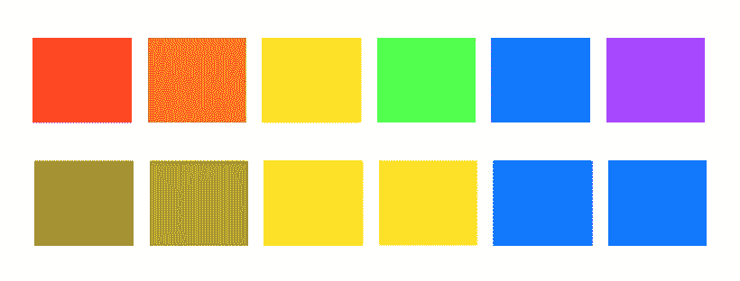

图片由作者提供。

你以前遇到过这种情况吗？你以为你的数据分析报告很有说服力。数据支持你的论点，你完善了你的数据可视化。但是你需要说服的人就像“咩”一样。

你的论点不够有力吗？还是你的数据可视化没有你想象的那么有效？**单一的调色板使得色盲者难以理解数据可视化**。例如，红色和绿色的组合使得数据可视化对于患有该色盲的人来说无效。

色盲是一种遗传疾病，使得人们很难区分特定的颜色，最常见的是红色和绿色。色盲影响着大约 1/12(8%)的男性和 1/200(0.5%)的女性[2]。在全球范围内，大约有 3 亿人受到不同程度的色盲影响——这大约相当于美国的人口[2]。

> 色盲影响着大约 1/12 的男性和 1/200 的女性。

这意味着很有可能你的观众中有人对你的数据可视化体验与你想象的大相径庭，尤其是如果你的观众主要是男性的话。例如**如果你试图说服马克·扎克伯格，你最好不要使用红色和绿色的组合，因为据说他很难区分这些颜色。在最糟糕的情况下，您选择的颜色甚至会使您的数据可视化对某些观众来说难以理解，从而妨碍您进行令人信服的论证。**

即使你的观众没有视觉缺陷，**黑白打印对你的数据可视化的影响可以和完全色盲的人**(是的，人们还在打印)类似。

在本文中，您将学习如何使您的数据可视化易于访问，以确保您的观众中的每个人都能完全理解您试图传达的信息，以实现您的目标。我们首先快速概述不同类型的色盲，看看糟糕的颜色选择如何使您的数据可视化无法说服色盲患者。然后，我们将讨论两种策略，通过利用正确的调色板和其他视觉辅助工具来创建更易访问的数据可视化。

# 什么是色盲？

色盲是一种遗传疾病，使得人们很难区分红色、绿色或蓝色的光。然而，一小部分色盲者根本看不到任何颜色。

色盲的三个主要类别是**红绿、蓝黄和完全色盲**【2，3】。对于红绿和蓝黄色盲，色盲的类型可分为**受影响的颜色(红、绿、蓝)**和**严重程度(异常:不规则或无视:失明)**。

## 红绿色盲

最常见的一类是红绿色盲。而**正常** **(红光弱)**，是对红光的敏感度降低，**异常【绿光弱】**是对绿光的敏感度降低。**红盲**和**绿盲**都让你根本分不清红色和绿色。因此，红色和绿色以及蓝色和紫色的颜色组合对于有这些情况的人来说是有问题的[2，3]。

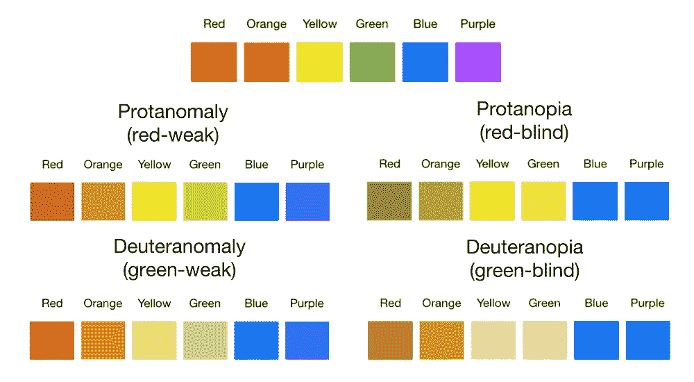

红绿色盲(图片由作者提供，色盲由[科布利斯](https://www.color-blindness.com/t)【1】模拟)

## **蓝黄色盲**

蓝黄色盲比红绿色盲少见。虽然**三色异常(蓝弱)**是对蓝光的敏感度降低，但**三色异常(蓝盲)**让你无法区分蓝色和绿色、紫色和红色、黄色和粉红色[2，3]。


蓝黄色色盲(图片由作者提供，色盲由[科布利斯](https://www.color-blindness.com/t)【1】模拟)

## **完全色盲**

完全色盲非常罕见[2，3]。完全色盲或色盲的人看不到任何颜色。

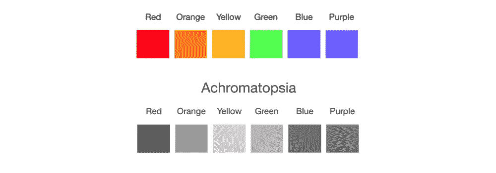

完全色盲(图片由作者提供，色盲由[科布利斯](https://www.color-blindness.com/t)【1】模拟)

# 选择可访问的调色板

让我们看一个由于调色板而导致的无效数据可视化的例子。第一眼看上去，下面的数据可视化看起来可以有效地展示 D 列中的值是正还是负。这是一种表示积极与消极，甚至是好与坏的流行方法，因为我们经常把绿色和“好”联系在一起，而把红色和“危险”联系在一起。对于视力正常的人来说，很明显，第 1 行具有最大的负值-0.99，第 3 行具有最大的正值 0.75。

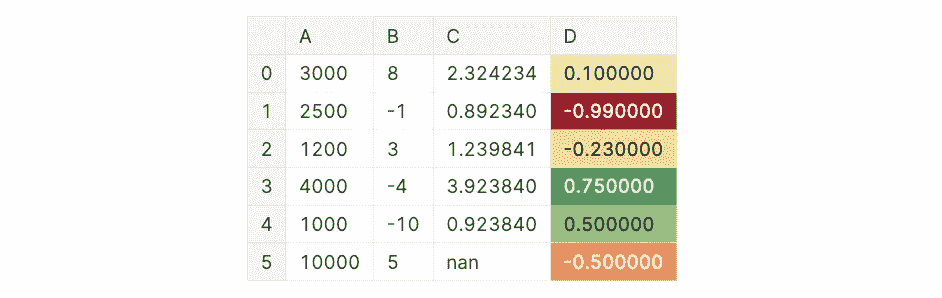

红-黄-绿渐变用于区分 d 列中的正值和负值。(图片由作者从 [Kaggle](https://www.kaggle.com/code/iamleonie/essential-techniques-to-style-pandas-dataframes) 获得)

然而，对于红绿色盲的人来说，上面的数据可视化很难阅读。下面你可以看到之前用红绿色盲模拟的数据可视化。最后三排有相似的棕黄色阴影。与视力正常的人看到的相比，很难识别最后一行是负值，而上面的两个值是正值。

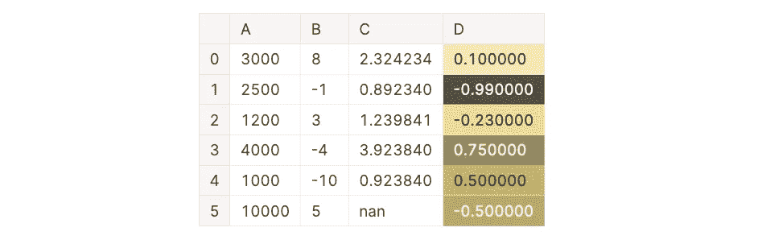

模拟红绿色盲(图片由作者从 [Kaggle](https://www.kaggle.com/code/iamleonie/essential-techniques-to-style-pandas-dataframes) 转换成[科布利斯](https://www.color-blindness.com/coblis-color-blindness-simulator/)【1】)

虽然有不同类型的色盲，但选择一个无障碍的调色板并不困难。首先，**确保避免红色和绿色、蓝色和紫色、蓝色和绿色或红色和黄色等有问题的颜色组合**。此外，像 [ColorBrewer](https://colorbrewer2.org/) 和 [Coolors](https://coolors.co/) 这样的在线资源可以帮助你挑选色盲友好的调色板。

在 [ColorBrewer](https://colorbrewer2.org/) 中，您可以将选项设置为仅显示左侧工具栏中的色盲友好调色板。


[ColorBrewer](https://colorbrewer2.org/) 截图

在[coolers](https://coolors.co/)中，您可以通过点击工具栏中的眼镜符号来启用色盲模拟器。

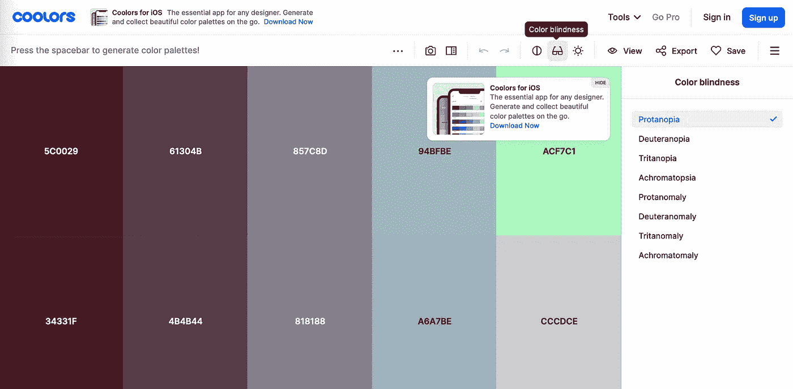

[酷派](https://coolors.co/)截图

如果您没有时间创建自定义调色板，Seaborn 可视化库提供了一个现成的色盲友好调色板[5]。您可以使用以下代码片段设置调色板:

```
sns.color_palette("colorblind")
```

下面你可以看到改进的数据可视化，它有一个色盲友好的调色板(在这个例子中我们用的是“coolwarm”)。不仅对于视力正常的人来说，而且对于红绿或蓝黄色盲的人来说，正值和负值都很容易区分。

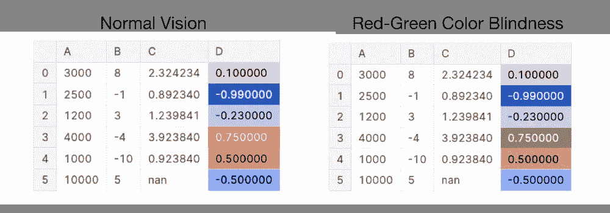

通过色盲友好的调色板改进数据可视化。左:正常视力。右图:模拟红绿色盲。(图片由作者从 [Kaggle](https://www.kaggle.com/code/iamleonie/essential-techniques-to-style-pandas-dataframes) 用[科布利斯](https://www.color-blindness.com/coblis-color-blindness-simulator/)【1】转换而来)

然而，即使有了色盲友好的调色板，对于完全色盲的人来说，上面的例子也很难理解。

# 不要只依赖颜色

虽然您可以通过选择更好的颜色组合来使您的数据可视化更容易访问，但您不能只依赖颜色。**黑白打印对数据可视化的影响，就像一个完全色盲的人所经历的一样。**虽然左边的数据可视化有一个色盲友好的调色板，但它不适合完全色盲或黑白打印的人。

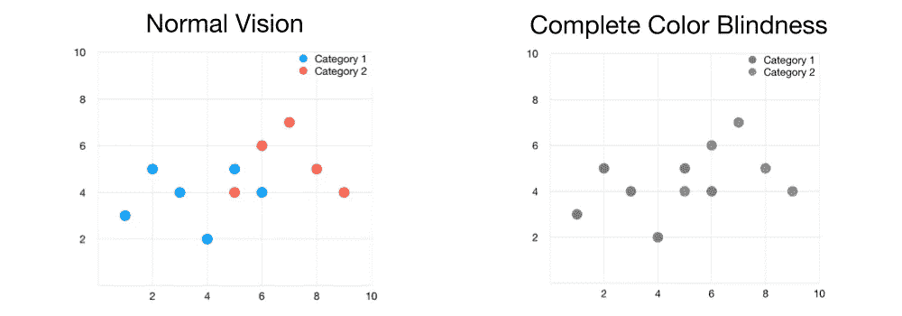

左:数据可视化与色盲友好的调色板。右图:模拟完全色盲的相同数据可视化(图片由作者用[科布利斯](https://www.color-blindness.com/coblis-color-blindness-simulator/)【1】转换)

为了确保您的受众能够完全理解您的数据可视化，除了使用色盲友好的调色板之外，您还可以使用以下策略。

*   使用不同色调的颜色
*   使用不同的标记形状、线条样式和宽度以及填充图案
*   添加文本

下面你可以看到，结合这些策略不仅为完全色盲的人，也为视力正常的人增加了可读性。

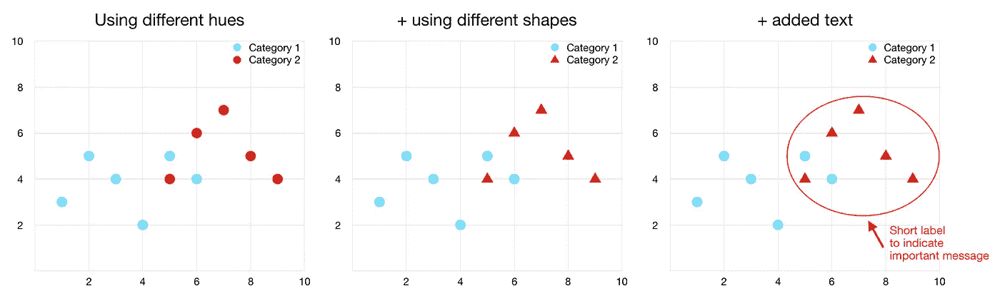

适用于黑白打印或完全色盲的人的改进的数据可视化。(图片由作者提供)

有了这三种策略，对于色盲和黑白打印的人来说，数据可视化的可读性提高了。

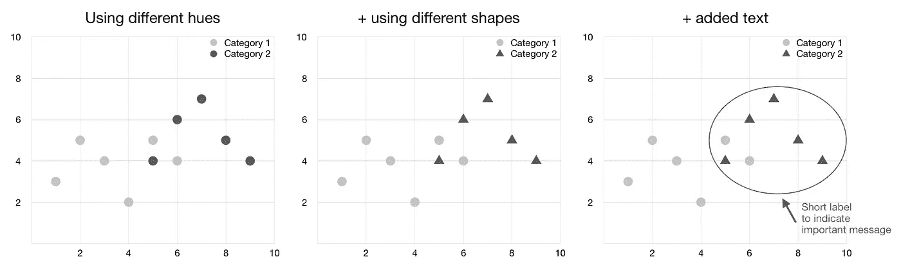

模拟完全色盲，改善数据可视化。(图片由作者用[科布利斯](https://www.color-blindness.com/coblis-color-blindness-simulator/)【1】转换而来)

# 结论

这篇文章解释了为什么**不可访问的调色板会使数据可视化对色盲者无效**。由于色盲影响了 8%的男性和 0.5%的女性，你的观众中很有可能有人是色盲。因此，为调色板考虑色盲有助于您的数据有效地讲述一个故事。

像 [ColorBrewer](https://colorbrewer2.org/) 和 [Coolors](https://coolors.co/) 这样的在线资源可以帮助创建一个可访问的调色板。你也可以用[科布利斯](https://www.color-blindness.com/coblis-color-blindness-simulator/)【1】来模拟你的数据可视化对各种色盲的有效性。

**考虑到完全色盲或者黑白打印，不能只靠颜色。**因此，用不同的色调、标记形状、线条样式、填充图案和文本来支持色盲友好的调色板，可以提高数据可视化的效率。

下图总结了本文的要点:

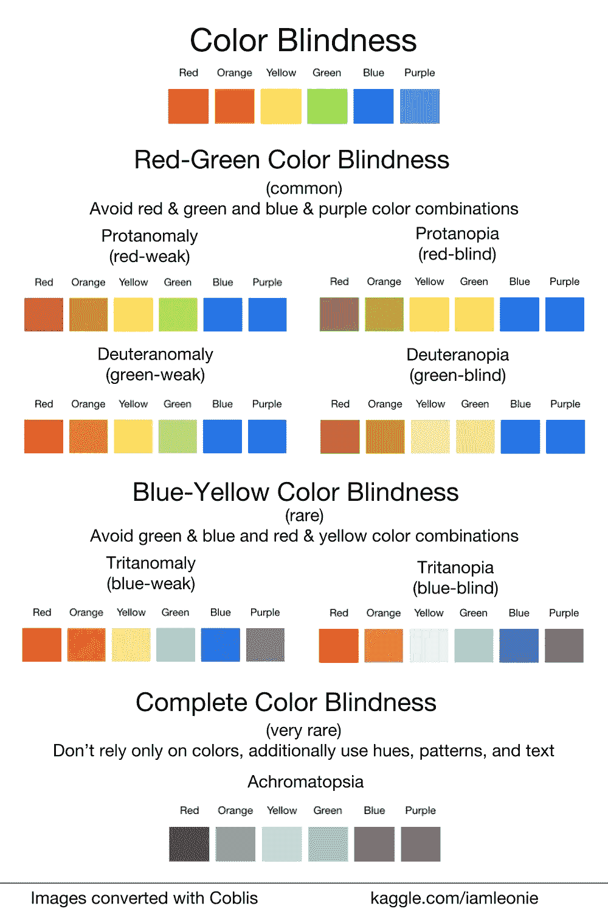

色盲类型总结(图片由作者从[科布利斯](https://www.color-blindness.com/t)【1】获得灵感)

# 喜欢这个故事吗？

要阅读更多来自我和其他作家的故事，请在 Medium 上注册。报名时可以用我的 [*推荐链接*](https://medium.com/@iamleonie/membership) *支持我。我将收取佣金，不需要你额外付费。*

[](https://medium.com/@iamleonie/membership) [## 通过我的推荐链接加入 Medium—Leonie Monigatti

### 阅读 Leonie Monigatti(以及媒体上成千上万的其他作家)的每一个故事。您的会员费直接…

medium.com](https://medium.com/@iamleonie/membership) 

*在*[*LinkedIn*](https://www.linkedin.com/in/804250ab/)*和*[*ka ggle*](https://www.kaggle.com/iamleonie)*上找我！*

# 参考

[1]科布利斯，《色盲模拟器》color-blindness.com。[http://www . color-blind . com/coblis-color-blind-simulator/](http://www.color-blindness.com/coblis-color-blindness-simulator/)(2022 年 7 月 8 日访问)

[2]色盲意识，“色盲的类型。”colourblindawareness.org。[https://www . colour blind awareness . org/colour-blind/types-of-colour-blind/](https://www.colourblindawareness.org/colour-blindness/types-of-colour-blindness/)(2022 年 7 月 8 日访问)

[3]国家眼科研究所，“色盲的类型。”nei.nih.gov。[https://www . nei . NIH . gov/learn-on-eye-health/eye-conditions-and-diseases/color-blindness/types-color-blindness](https://www.nei.nih.gov/learn-about-eye-health/eye-conditions-and-diseases/color-blindness/types-color-blindness)(2022 年 7 月 8 日访问)

[4] J. A. Vargas，“脸书的面貌”newyorker.com。https://www . new Yorker . com/magazine/2010/09/20/the-face-of-Facebook(2022 年 7 月 8 日访问)

[5] M. Waskom，“选择调色板”pydata.org。https://seaborn.pydata.org/tutorial/color_palettes.html[(2022 年 7 月 8 日访问)](https://seaborn.pydata.org/tutorial/color_palettes.html)