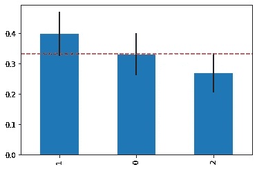
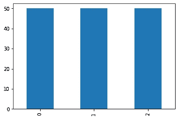
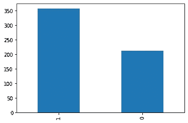
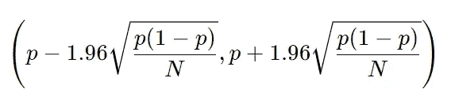
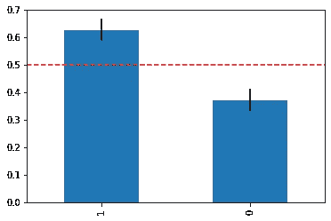
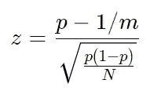
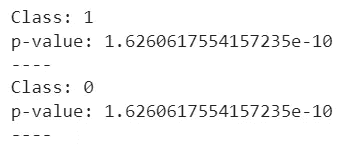
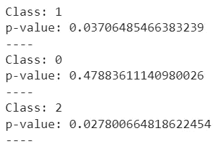
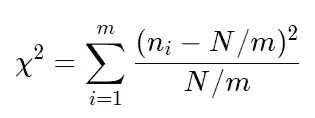

# 你的数据集不平衡吗？

> 原文：<https://towardsdatascience.com/is-your-dataset-imbalanced-292d2a0a1321>

## 查看数据集是否不平衡的一些技巧



作者图片

对于数据科学家来说，处理不平衡的数据集总是很困难。如果我们处理不当，这样的数据集可能会给我们的机器学习模型带来麻烦。因此，在采取适当的预防措施之前，测量数据集的不平衡程度非常重要。在这篇文章中，我建议一些可能的技术。

# 我们如何定义“不平衡”？

当一些目标类的频率比其他目标类低时，我们说分类数据集是不平衡的。

例如，让我们看看 iris 数据集的目标变量的分布。



作者图片

正如我们所见，频率都是相同的，数据集完全平衡。

现在让我们更改数据集，使用乳腺癌数据集。



作者图片

正如我们所看到的，这两个类有不同的频率，所以数据集是不平衡的。

所以，一般来说，不同的频率让我们可以说数据集是不平衡的。然而，通常的经验导致定义为“不平衡”的数据集，其中目标值具有非常不同的频率。

事实上，一般来说，稍微不同的频率对大多数模型来说并不是一个大问题。当一个或多个类别的频率非常低时，问题就出现了。在这些情况下，模型可能无法正确地学习如何处理它们。

像往常一样，我们必须量化“非常小”是什么意思。让我们看一些技术来评估我们是否应该考虑一个不平衡的数据集。

# 数据可视化

数据可视化可以给我们一些非常有用的见解，那么我们为什么不应该将它用于这项任务呢？

我建议的方法是用类的频率和它们的 95%置信区间绘制一个条形图。记住，给定一个频率 *p* ，事件总数等于 *N* ，95%置信区间计算如下:



给定 *m* 类，期望频率为 *1/m* 。因此，我们可以绘制置信区间和与预期频率相关的水平线，并查看它是否穿过置信区间。

我们先导入一些库和“乳腺癌”数据集。

```
import numpy as np 
import pandas as pd 
from scipy.stats import norm,chisquare 
import matplotlib.pyplot as plt
from sklearn.datasets import load_breast_cancer as d X,y = d(return_X_y = True)
```

现在，让我们用类的频率、95%置信区间和预期频率绘制条形图。

```
freqs =pd.Series(y).value_counts() /len(y) std_errors = np.sqrt(freqs*(1-freqs)/len(y)) expected_frequency = 1/len(np.unique(y)) freqs.plot(kind='bar',yerr=std_errors*1.96) 
plt.axhline(expected_frequency,color='red',linestyle='--')
```



作者图片

正如我们所看到的，间隔距离预期的频率很远，所以数据集平衡的置信度只有 5%。相当小。

如果我们对“葡萄酒”数据集重复这个过程，结果如下。


作者图片

现在，对于类别 0，期望的频率线正确地穿过置信区间，但是对于类别 1 和 2，期望的频率线仅仅略微穿过置信区间。所以我们可以说，在 95%的置信度下，类 0 是平衡的，而我们不确定类 1 和类 2。

这种简单的方法可以给我们清晰的图形证据，这在数据科学中总是一个好主意。

# z 检验

对于那些喜欢使用 p 值的人，我们可以计算 t 尾 z 检验的 p 值，以评估给定频率和预期频率之间的统计差异。我们必须对每门课进行 z 测试。零假设是频率等于预期频率(即数据集是平衡的)。

在等于 *N* 的多个事件上，将给定频率与预期频率 *1/m* 进行比较的 z 变量为:



对于双尾 z 检验，p 值为:


我们乘以 2，因为这是一个双尾测试。

在 Python 中，我们可以写:

```
for target_val in freqs.index: 
   z = (freqs[target_val] - expected_frequency)/ std_errors[target_val]    print("Class:",target_val) print("p-value:",norm.cdf(-np.abs(z)))      
   print("----")
```

对于乳腺癌数据集，结果是:



作者图片

p 值非常小，因此我们拒绝表示数据集平衡的零假设。

对于葡萄酒数据集，我们得到:



作者图片

这些结果完全符合图形分析。类别 1 和类别 2 的 p 值较小，我们拒绝零假设。类 0 的 p 值很高，我们不拒绝零假设。

# 卡方检验

如果我们想对整个数据集使用单个测试，而不是对每个类使用一个测试，我们可以使用 Pearson 的卡方检验。

如果我们有 *m* 个类和 *N* 个总记录以及每个类作为记录，我们可以通过计算统计量来计算这样一个测试的 p 值:



该变量分布为具有 *m-1* 自由度的卡方分布。我们可以进行的测试是单尾测试。无效假设是数据集是平衡的。

在 Python 中，我们只用一行代码就可以做到:

```
chisquare(pd.Series(y).value_counts()).pvalue
```

对于乳腺癌数据集，结果是 1.211e-09。所以我们拒绝零假设。对于葡萄酒数据集，p 值为 0.107，因此我们不拒绝零假设。

请记住，卡方检验只有在您的预期出现次数很大(即大于 20)时才有效，否则其背后的近似值将不再可靠。

# 一些实用的建议

我的建议是始终使用数据可视化。这很清楚，没有偏见，所以它总是一个好主意。但是，如果您的同事需要一个 p 值，您可以使用 z 检验来逐类评估 p 值。否则，您可以使用卡方检验计算总体结果。

# 结论

在这篇文章中，我提出了一些评估数据集是否不平衡的技术。选择适当的技术将为您提供不同的见解，并引导您采取不同的策略来处理不平衡的数据(例如，SMOTE 重采样或类分组)。

*原载于 2022 年 6 月 26 日 https://www.yourdatateacher.com*[](https://www.yourdatateacher.com/2022/06/27/is-your-dataset-imbalanced/)**。**