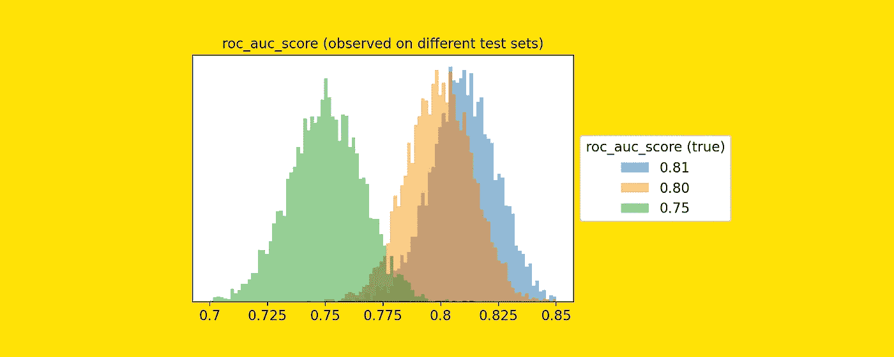
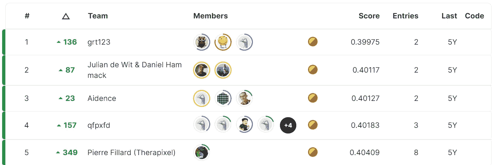
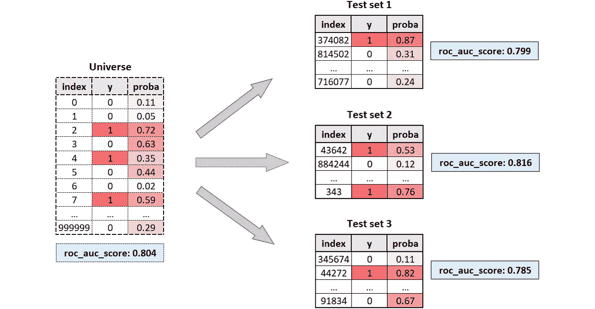
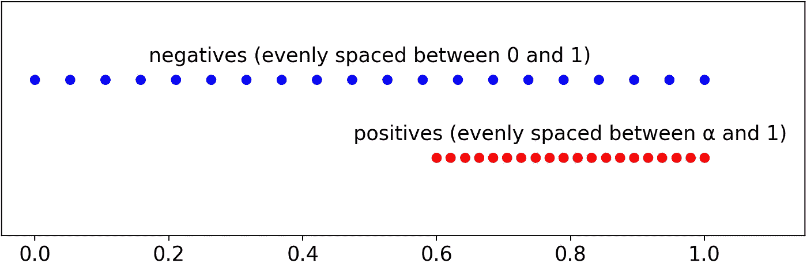
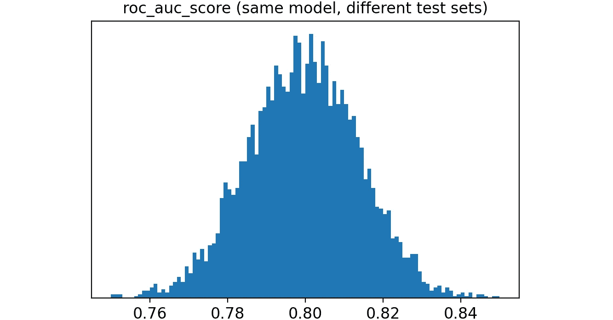
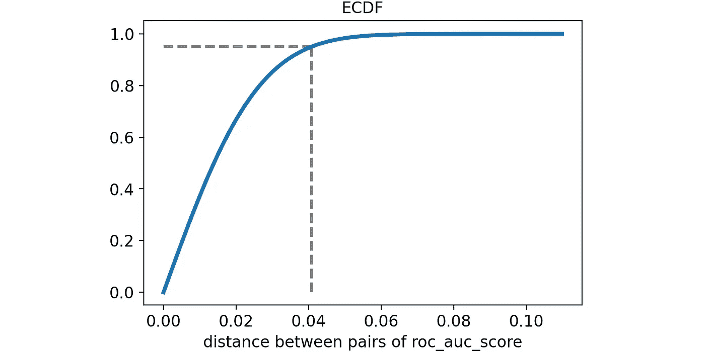
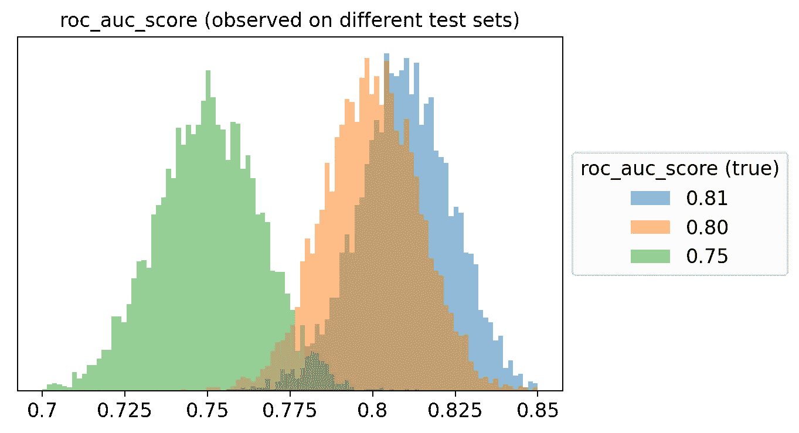
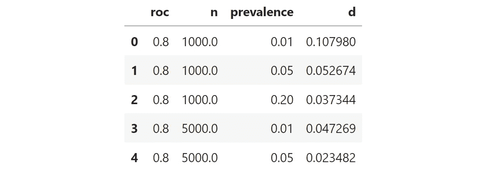
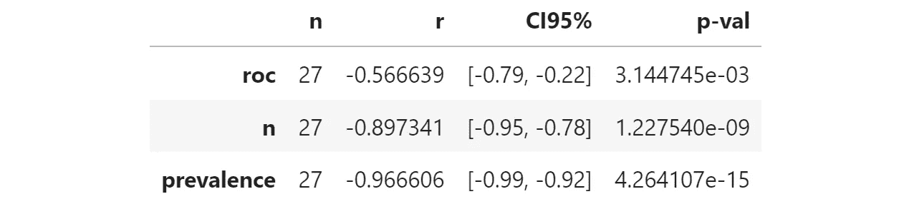
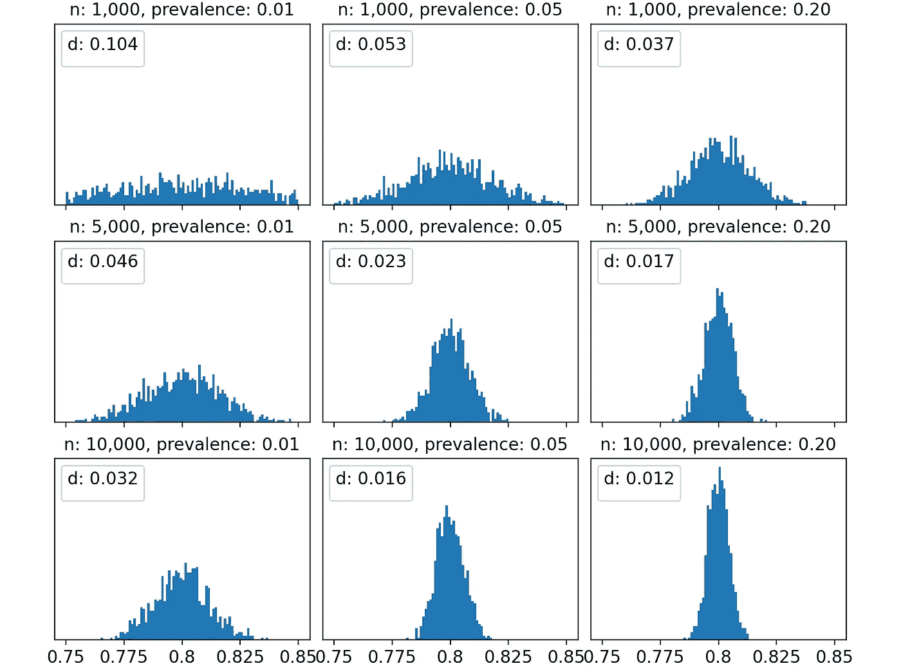

# 你的模特是最好的还是最幸运的？

> 原文：<https://towardsdatascience.com/is-your-model-the-best-one-or-the-luckiest-one-7cfd1f43ea6>

## 如何避免在选择最佳模型时被随机性所迷惑



[图片由作者提供]

我们已经习惯了 Kaggle 中的数据科学挑战，ROC 分数 0.1%的变化就能决定赢得 10 万美元还是一无所获。

以[数据科学碗 2017](https://www.kaggle.com/competitions/data-science-bowl-2017/overview) 挑战赛为例。第一名的奖金为 50 万美元，第二名为 20 万美元，第三名为 10 万美元，以此类推。选择的评估标准是对数损失。这是最终的排行榜:



[截图来自 [Kaggle](https://www.kaggle.com/competitions/data-science-bowl-2017/leaderboard)

现在，你认为第一名的模特和第二名的模特有什么不同？

如果你的回答是:“区别在于第一个模型比第二个模型更好，因为它的对数损失更小”，那么你可能有些操之过急了。事实上，

> 我们如何确定测试集上更好的度量意味着更好的模型，而不仅仅是更幸运的模型？

我举了一个关于 Kaggle 的例子，但是同样的推理也适用于任何现实生活中我们需要选择一个模型的情况。

对于数据科学家来说，知道在模型选择中哪个部分是偶然发挥作用的是一项基本技能。在本文中，我们将看到如何量化选择最佳模型过程中的随机性。

# 实际上，“最佳模式”是什么？

首先，我们需要一个关于我们所说的“最佳模式”的明确定义。

假设我们有两个模型，A 和 B，我们想选择最好的一个。我们都同意最好的模型是在看不见的数据上表现最好的模型。

因此，我们收集了一些测试数据(在训练中没有使用)并在此基础上评估我们的模型。假设模型 A 的 ROC 分数为 86%，模型 B 的 ROC 分数为 85%。这是否意味着模型 A 优于模型 B？暂时来说，是的。

但是想象一下，过了一段时间，您收集了更多的数据，并将其添加到之前的测试集中。现在 A 型还是 86%，B 型已经提高到 87%。在这一点上，B 比 a 好，怎么可能？

显然，唯一明确的定义如下:

> 对于给定的任务，最佳模型是对所有可能的不可见数据表现最佳的模型。

这个定义的重要部分是“**所有可能的**”。事实上，我们总是可以访问有限的数据，所以我们的测试数据集只是所有可能的未知数据的一小部分。这就像说我们永远不会真正知道什么是最好的模型！

为了处理这个问题，我们需要一个新的概念。

# 介绍宇宙

从现在开始，我们将把所有可能看不见的数据集称为“宇宙”。在现实世界中，我们永远无法观测到宇宙，只能观测到从宇宙中随机抽取的一个测试数据集。



我们从来不观察宇宙，我们只观察一个单一的测试数据集，它是一个小的，随机的部分。[图片由作者提供]

**一个模型真正的表现是它在宇宙上的表现**。在这种情况下，模型的真实 ROC 得分为 80.4%。然而，我们永远无法观察宇宙，因此，我们永远无法观察模型的真实 ROC。

我们所能观察到的是在测试集上计算的 ROC 分数。有时候会高一点(81.6%)，有时候会小一点(79.9%和 78.5%)，但是我们没有办法知道真实的 ROC 评分和观测的 ROC 评分有多远。

我们所能做的就是尝试评估这个过程中有多少随机性。为了做到这一点，我们需要模拟宇宙，并从中抽取许多随机测试数据集。这样，我们就可以量化观察到的分数的离差。

# 如何模拟宇宙？

我们的目标是获得一个具有给定 ROC 分数的观察宇宙。事实证明，有一个非常简单的方法可以做到这一点。

首先，我们需要设定宇宙中期望的个体数量(通常是一个很大的数字)。然后，我们需要设置流行度，即阳性百分比(我们可以将其保留为 50 %，这是默认设置)。第三步是选择我们希望在宇宙中的 ROC 分数。

最后，我们可以计算宇宙中每个个体的预测概率:负数必须均匀分布在 0 和 1 之间，而正数必须均匀分布在α和 1 之间。



如何获得具有任意 ROC 分数的数据集？[图片由作者提供]

其中，α可通过以下公式从 ROC 中获得:


当 ROC 大于或等于 50%时，α和 ROC 之间的关系。[图片由作者提供]

ROC 为 50%时，α为 0，表示阴性和阳性的分布是相同的。反之，当 ROC 为 100%时，α为 1，意味着所有的阳性都集中在 1 上:阴性和阳性之间没有重叠。

在 Python 中，这可以转化为以下函数:

```
def **get_y_proba**(roc, n=100000, prevalence=.5):
  **'''Get two arrays, y and proba, for a given roc (greater than .5)'''** n_ones = int(round(n * prevalence))
  n_zeros = n - n_ones y = np.array([0] * n_zeros + [1] * n_ones) alpha = (roc - .5) * 2 proba_zeros = np.linspace(0, 1, n_zeros)
  proba_ones = np.linspace(alpha, 1, n_ones)
  proba = np.concatenate([proba_zeros, proba_ones]) return y, proba
```

# 获取我们的不确定性度量

既然我们已经有了创建合成宇宙的方法，让我们用下面的命令来获得我们的宇宙:

```
y_universe, proba_universe = get_y_proba(roc=.8, n=100000, prevalence=.5)
```

因此，我们的宇宙由 100，000 个观察值组成，其中一半是正面的，ROC 得分为 80%。

现在，让我们模拟不同测试集的提取。我们将提取 5000 个不同的测试集，每个测试集由来自宇宙的 1000 个观测值组成。这是相应的代码:

```
rocs_sample = []for i in range(5_000):
  index = np.random.choice(range(len(y_universe)), 1_000, replace=True)
  y_sample, proba_sample = y[index], proba[index]
  roc_sample = roc_auc_score(y_sample, proba_sample)
  rocs_sample.append(roc_sample)
```

这是观察到的 ROC 分数的分布:



在来自 ROC 分数为 80%的宇宙的不同测试集上观察到的 ROC 分数。[图片由作者提供]

正如您所看到的，结果非常不同，从不到 76%到超过 84%不等。

在正常应用中，我们想要回答的问题如下。我有两个模型，一个 ROC 分 78%，一个 82%。**它们拥有相同潜在 ROC 的可能性有多大，而这种差异只是偶然的结果？**

为了得到一个概念，我们可以计算模拟中每对观察到的 ROC 分数之间的距离。Scikit-learn 有一个函数`pairwise_distances`允许这样做。

```
import numpy as np
from sklearn.metrics import pairwise_distances

dist = pairwise_distances(np.array(rocs_sample).reshape(-1,1))
dist = dist[np.triu_indices(len(rocs_sample), k=1)]
```

让我们在经验累积分布函数中可视化 ROC 得分之间的成对距离。



ROC 评分间成对距离的经验累积分布函数。[图片由作者提供]

第 95 百分位(用虚线突出显示)约为 4%。这意味着两个模型(具有相同的性能)之间的差异只有 5%的时候大于 4%。

因此，用统计学术语来说，我们会说小于 4%的差异不显著！这非常有趣，因为通常我们会认为 82%的 ROC 模型比 78%的 ROC 模型好得多。

为了获得这个概念的另一个可视化，我模拟了三个不同的宇宙，一个 ROC 得分为 75%，另一个为 80%，最后一个为 81%。这些是他们观察到的 ROC 分数的分布。



在来自不同领域的不同测试集上观察到的 ROC 分数分别为 75%、80%和 81%。[图片由作者提供]

很明显，从这个情节来看，最好的模型往往不会赢！想象一下比较几十个模型，每个模型都有不同的真实 ROC 分数。

> 你实际上不太可能选择最好的模型。很有可能，你会选择最幸运的一个。

# 我能做些什么吗？

所以你是在告诉我，我不可能 100%确定一个型号比另一个好？这听起来像一场噩梦。当然:数据科学中没有百分百确定的事情。然而，不要绝望。

有理由预计，选择最佳模型的不确定性程度既取决于宇宙的特征，也取决于从宇宙中提取的测试集的特征。特别是，有三个参数决定了不确定性:

*   真实 ROC:在宇宙上计算的 ROC 分数。
*   样本维数:测试集中的观察值数量。
*   样本流行率:测试集中阳性的百分比。

为了了解这些因素对不确定性的影响，我通过为每个因素尝试不同的值来模拟所发生的情况:

*   真实 ROC: 70%，80%，90%。
*   样本维数:1000、5000 和 10000 个观测值。
*   样本患病率:1%、5%和 20%。

因为我们正在为三个参数尝试三个值，这意味着 27 种可能的组合。

对于每个组合，我模拟了一个宇宙，然后对 1000 个不同的测试集进行了采样，并测量了各自的 ROC 分数。然后，我计算了 1000 个 ROC 分数的距离矩阵。最后，我取了距离的第 95 个百分位数(从现在开始称为“d”)。正如我上面所说的，这是选择模型的不确定性的一种度量。

例如，这是 27 次试验中的前 5 次。



27 次试验中的前 5 次。输入是宇宙中的 roc 分数(“ROC”)、观察次数(“n”)和测试集的流行度。输出是 ROC 得分之间距离的第 95 个百分位数(“d”)。[图片由作者提供]

我们用第 95 个百分点来衡量不确定性。该数值越高，比较 ROC 曲线的不确定性越高。

因为我们想知道不确定度如何依赖于 3 个参数，所以测量每个参数和“d”之间的偏相关是很有趣的。这是结果:



每个参数和我们的不确定性测量值之间的部分相关性(观察到的 ROC 评分之间距离的第 95 个百分点)。[图片由作者提供]

称为“r”的列显示了每个参数和不确定性之间的部分相关性。所有相关系数都是负的，表明增加这三个系数中的任何一个都会减少不确定性。特别是，

*   真 ROC。宇宙中较高的 ROC 值意味着较少的不确定性。这是有意义的，因为根据定义，ROC 越高意味着不确定性程度越小。
*   样本维度。增加样本维数可以减少不确定性。这是非常明显的，并且在统计中经常发生。
*   样本患病率。流行程度的提高减少了不确定性。患病率越低意味着阳性越少。越少的阳性意味着随机抽样时权重越大。因此，更大的不确定性。

出于好奇，对于固定的真实 ROC(在本例中为 80%)，让我们也可视化当改变样本维度和样本流行度时观察到的 ROC 分数的分布。



样本中 ROC 评分的分布，针对不同的样本维度和样本患病率。请注意，真实的 ROC 得分始终为 80%。[图片由作者提供]

我觉得这个形象不言自明。以左上图为例。样本规模和患病率都非常小:我们有 1000 个观察值和 1%的阳性，这意味着 10 个阳性和 990 个阴性。在这种情况下，不确定性非常高，得到的 ROC 分数分布几乎是均匀的，从 75%到 85%。此外，ROC 得分之间距离的第 95 百分位是 10%，这意味着观察到的 ROC 为 75%和观察到的 ROC 为 85%之间没有显著差异。

然而，随着我们逐步提高样本维度和/或患病率，情况会有所改善，观察到的 ROC 评分分布越来越集中在真实值附近(在本例中为 80%)。例如，通过 10，000 次观察和 20%的患病率，第 95 百分位变成了更合理的 1.2%。

# 这对我有用吗？

确实是。事实上，即使我们在机会面前都很无助，知道在什么条件下你的结果在统计学上是合理的也是很重要的。

重复我们在上一段中看到的模拟可以帮助您了解测试集的数量和流行程度是否足以检测模型性能之间的真正差异。

你可以在[我的 Github 页面](https://github.com/smazzanti/tds_best_or_luckiest/blob/main/model_selection_best_or_luckiest.ipynb)中找到本文使用的所有 Python 代码。

如果你想阅读关于这个主题的彻底讨论，更多的是从假设检验的角度(而不是从模拟的角度)，你可以阅读劳伦·奥克登·雷纳的这篇博客:“[人工智能竞赛不会产生有用的模型](https://laurenoakdenrayner.com/2019/09/19/ai-competitions-dont-produce-useful-models/)”

*感谢您的阅读！我希望你喜欢这篇文章。如果你愿意，* [*在 Linkedin 上加我*](https://www.linkedin.com/in/samuelemazzanti/) *！*