# 这一切都归结于设计模式

> 原文：<https://towardsdatascience.com/it-all-comes-down-to-design-patterns-c7034eb39ef9>

## 通过软件设计模式发现真善美

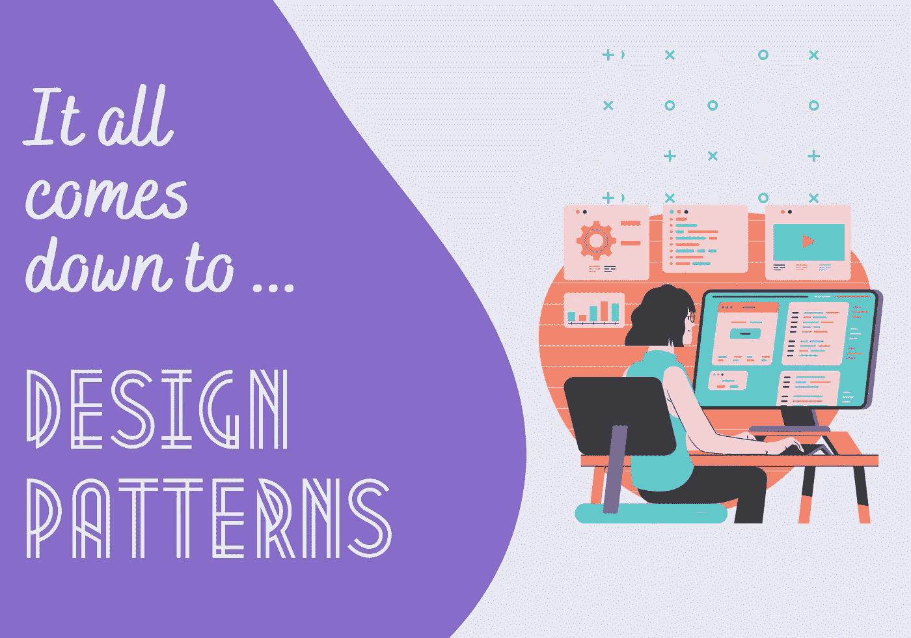

作者图片

虽然软件架构不是关于编码的，但是作为一个软件架构师，你仍然需要有大量关于开发的知识，特别是设计模式。

为什么在你的 IT 工具箱下添加设计模式将有益于你的职业发展有许多原因，但是三个最重要的原因是:

*   设计模式在你使用的任何库、包和框架中都很普遍。如果你理解了一个模式的用法和它的基本原理，你将获得更深的洞察力，这将允许你更快地在许多语言中导航。
*   与开发团队拥有一个**通用词汇表**可以让你更容易、更准确地传达你的设计规范。
*   能够根据对象之间的**交互**来思考有助于设计一个能够经受住时间考验的抽象解决方案。

> 一切都是设计好的；很少有东西是设计好的！

诚然，我没有进行任何科学研究来评估哪些是最常用的模式。这是基于我作为开发人员和架构师在这个领域的经验观察。我们将首先钻研一些关于实体设计的基础知识，然后我们将探索我最重视的一组模式。

# 坚实的原则

我们之前已经看到了坚实的原则如何应用于架构本身，但是这里我们将关注它们在软件工程设计中的重要性。我们只会玩弄它们(也就是说，不会提供任何代码)，但是对于每个想要了解他们的开发团队想要做什么的架构师来说，这将是一个很好的起点。

先说个定义……正如[鲍勃大叔](https://en.wikipedia.org/wiki/Robert_C._Martin)所说:*[*它们不是法律。它们不是完美的真理。这些陈述的顺序是:一天一个苹果，医生远离我。*这意味着它们不是某种“魔法”,不会带来牛奶、蜂蜜和伟大软件的乐土，但它们仍然是健壮和持久软件的重要贡献者。](https://sites.google.com/site/unclebobconsultingllc/getting-a-solid-start)*

*简而言之，这些原则围绕着两个主要概念，它们是成功的企业应用程序的构建块:**耦合**是一个类了解另一个类并与之交互的程度，而**内聚**表示一个类具有单一目的的程度。换句话说:*

> *耦合是关于类之间如何交互的，而内聚则关注单个类是如何设计的。*

*固体代表以下术语:*

## ***➊ —** 单一责任原则*

> ****一个类应该有且只有一个理由改变。****

*这是不言自明的，但是说起来容易做起来难——向现有的类中添加新的行为总是很诱人的，但是这是灾难的一个处方:每个行为都可能是将来改变的原因，所以更少的行为导致在改变期间引入错误的机会更少。*

## ***➋ —** 开闭原理*

> *你应该能够扩展一个类的行为，而不用修改它。*

*您使用的类应该对扩展开放，但对修改关闭。实现这一点的一种方法是通过继承，即创建一个子类，这样原始类就不会被修改，但自定义代码会被添加到子类中以引入新的行为。*

## ***➌ —** 利斯科夫替代原理*

> ****派生类必须可以替换其基类。****

*当将类 A 的行为扩展到子类 B 时，你必须确保你仍然可以在不破坏任何东西的情况下与 B 交换 A。这可能有点吸引人，尤其是当把这一原则与开闭原则结合起来时。*

## ***➍ —** 界面偏析原理*

> ****制作客户特定的细粒度接口。****

*接口和类必须尽可能的专门化，这样调用客户端就不会依赖于它们不使用的方法。这与单一责任原则是相辅相成的。*

## ***➎ —** 依存倒置原则*

> *依靠抽象，而不是具体。*

*高级类不应该依赖于低级类。它们都应该依赖于抽象。同样，抽象不应该依赖于细节。细节应该依赖于抽象。*

# *设计模式*

*四位作者(Gamma，Helm，Johnson & Vlissides)在 1994 年出版了著名的著作《[设计模式:可重用的面向对象软件的元素](https://www.amazon.co.uk/dp/0201633612)》，其中包括 23 种面向对象的设计模式。由于它的名字很长，人们开始称它为“四人帮(g of)的书”。*

*从定义开始:*

> *软件设计模式是对软件工程中常见问题的优化的、可重复的解决方案。这是一个解决问题的模板，可以在许多不同的情况下使用。*

*设计模式不是规定性的，而是有目的地保持高层次。他们的目标是提高代码质量，并最终坚持坚实的原则。他们也遵守这个规则:1。界面设计，2。偏好组合而非继承；3 .封装任何可变性。*

*作为架构师，首先要知道的是基于设计模式的意图或目的的不同类别，概括如下:*

*   *创建:它们提供对象实例化机制。*
*   ***结构**:他们专注于将物体组合成更大的结构。*
*   ***行为**:他们负责有效的沟通和跨对象的责任分配。*

*下图显示了我们将要探索的 GoF 模式:*

*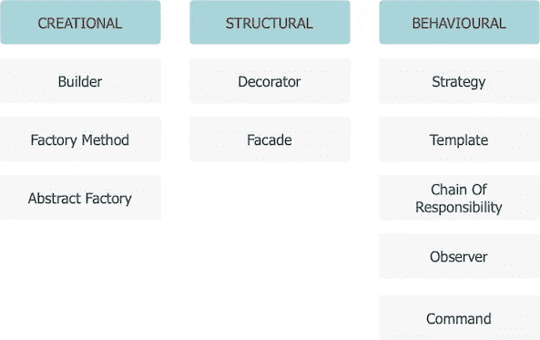*

*最常见的设计模式*

## *➊——建筑|创意*

*构建器模式旨在以**一步一步**的方式构建一个复杂的对象，并将构建与其表示分离开来。本质上，它允许使用相同的代码产生不同类型和表示的对象。*

***—用法说明**:几种复杂的物体可以用相同的整体构建过程来构建，尽管各个构建步骤有所不同。*

*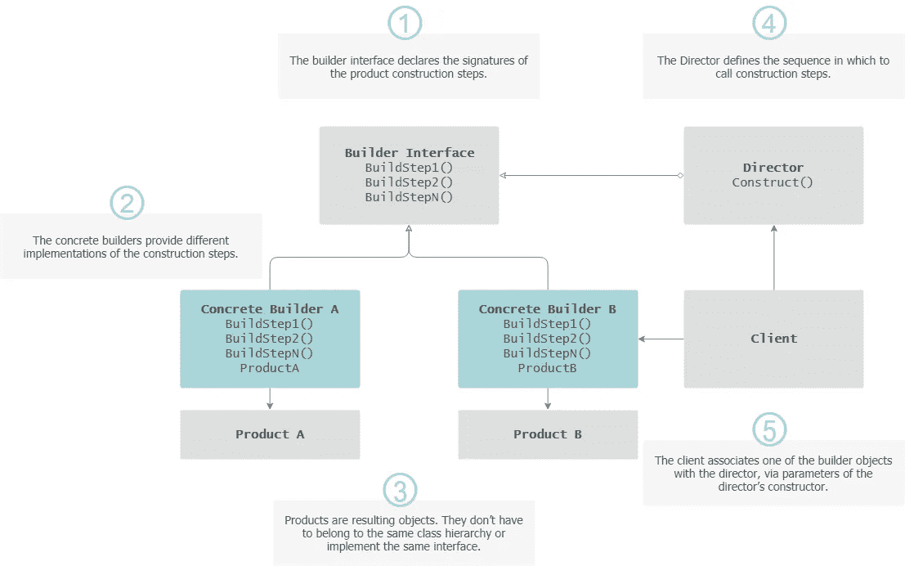*

*构建器模式*

## *➋ —工厂方法|创新*

*工厂方法为**创建对象**定义了一个接口，但是实例化是由子类完成的。*

***—用法说明**:事先不知道对象的确切类型和依赖关系。*

*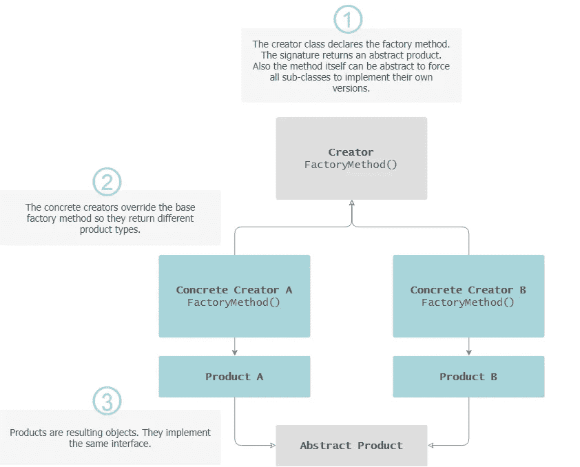*

*工厂方法*

## *➌——抽象工厂|创意*

*抽象工厂捕获如何创建相关对象的**系列，而不指定它们的具体类。***

***—用法说明**:存在不同的情况，需要不同的规则集实现，这些情况要么是事先未知的，要么是可扩展性问题。
⭐️ **与抽象方法**的区别:
抽象工厂:创建其他工厂，这些工厂又创建从基类派生的对象。【工厂方法:创建从特定基类派生的对象。*

*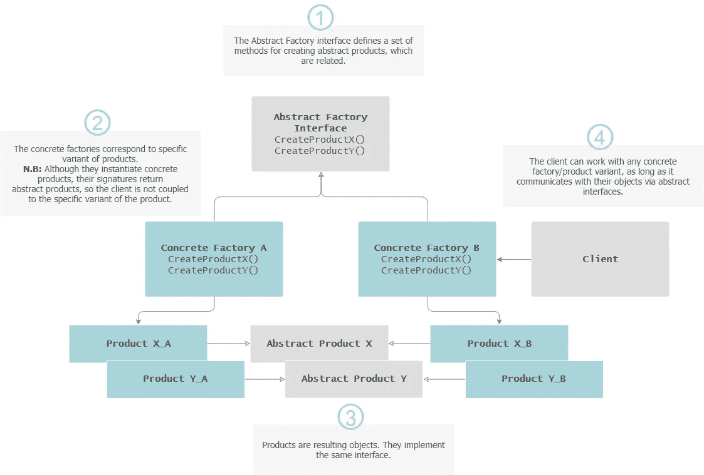*

*抽象工厂*

## *➍ —装饰|结构*

*装饰模式通过将对象放在包含这些行为的特殊包装类中，动态地将新的责任附加到对象上，因此对原始方法的签名没有影响(组合优于继承)。*

***—用法说明**:在运行时给对象分配额外的行为，而不破坏使用这些对象的代码。*

*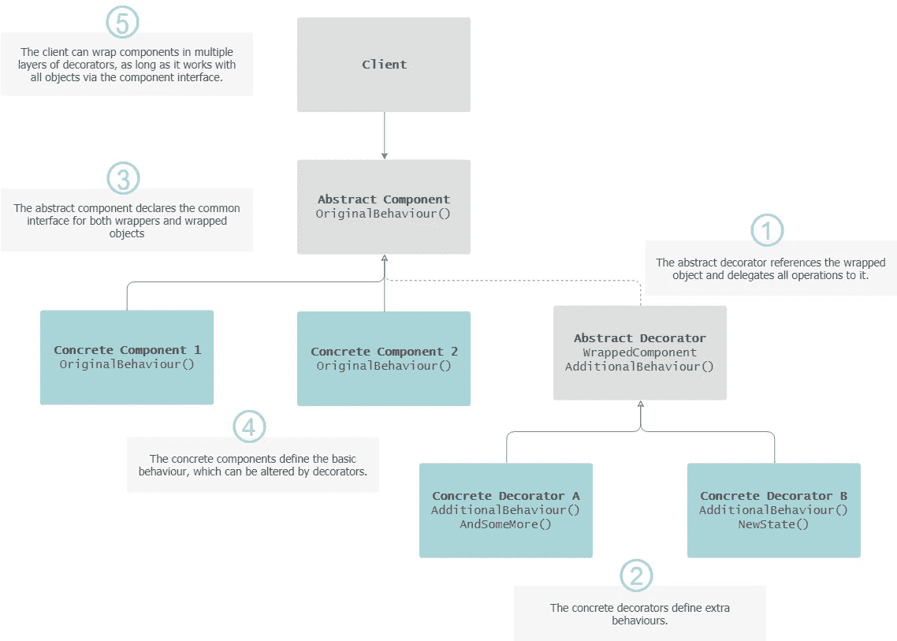*

*装饰图案*

## *➎——立面|结构*

*Facade 模式为库、api、框架或任何其他复杂的类集提供了一个简化的接口。它实际上是一个复杂的从属子系统的包装器。*

***—用法说明**:通过将子系统封装在单个接口对象中，将子系统与其潜在客户分离，该接口对象成为该系统的唯一接入点/网关。*

*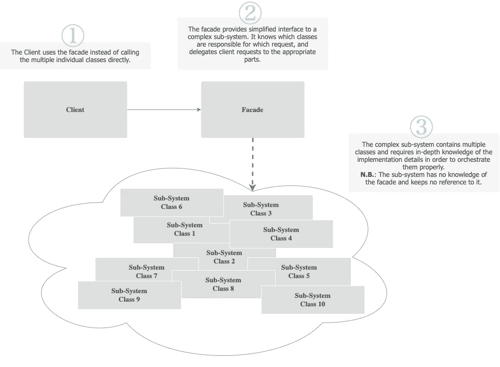*

*立面图案*

## *➎ —存储库*

*存储库模式不是 GoF 模式的一部分，但是它是一个特定于数据的 facade 实现，所以在这里值得一提。它解决了数据检索和持久化的代码集中化问题，并为数据访问操作提供了**抽象，即类似于内存中的域对象集合，允许执行 CRUD 方法，并消除了任何数据库问题。***

***—用法说明**:将业务逻辑与数据访问代码解耦。*

*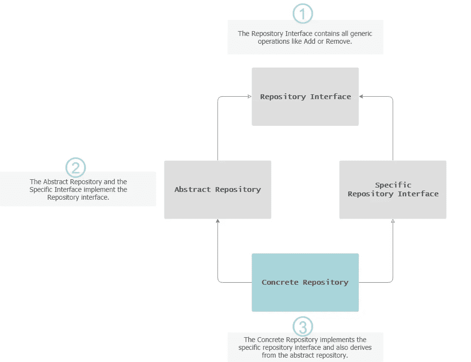*

*知识库模式*

## *➏ **—** 战略|行为*

*策略模式定义了一系列算法，将每个算法放在一个单独的类中，并使它们可以互换。将行为封装在单独的类中，消除了任何条件语句，并在运行时选择正确的算法(即策略)。*

***—用法说明**:一个业务规则有不同的实现，或者需要不同的算法变体。*

*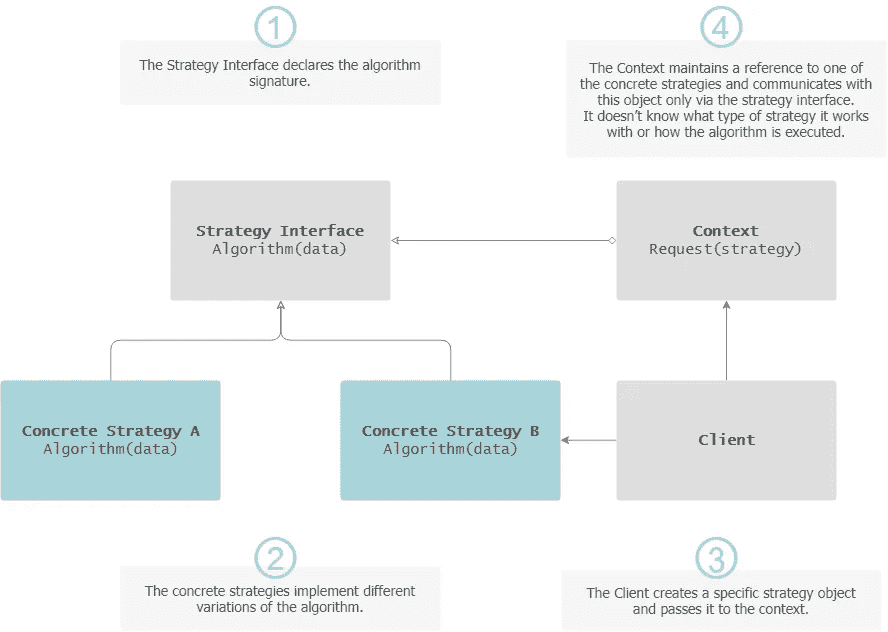*

*战略模式*

## *➐ —模板法|行为*

*模板方法旨在从不同的过程中抽象出一个共同的过程。它定义了算法的**框架**，将一些步骤推迟到子类。子类可以覆盖一些行为，但不能改变框架。*

***—用法说明**:有一组一致的步骤可以遵循，但各个步骤可能有不同的实现方式。
⭐️ **与策略模式**的差异:
模板:通过**子类**在**编译时**选择算法。策略:由**容器**在**运行时**选择算法。*

*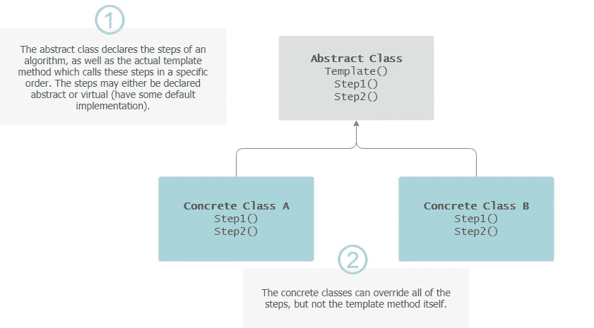*

*模板方法*

## *➑ —责任链|行为*

*责任链模式建议通过启用一个或多个**处理程序**来满足请求，从而避免客户端(请求的发送者)与接收者之间的耦合。这些处理程序链接成一个链，即每个处理程序都有一个对链中下一个处理程序的引用。*

**

***—用法说明**:一个以上的对象可能会处理一个请求，而处理程序(也不是序列)事先并不知道。*

*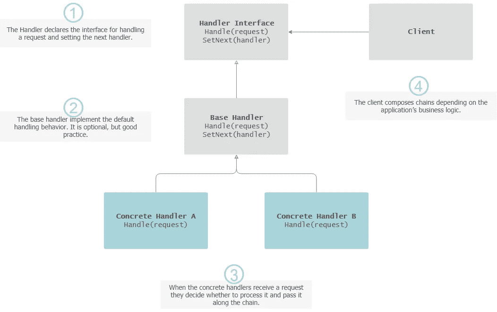*

*责任链*

## *➒ —观察家|行为*

*Observer 模式(也称为 Publish/Subscribe 或 PubSub)通过定义对象之间的一对多依赖关系，实现了简单的**广播**通信，因此当一个对象经历状态变化时，它的所有依赖对象都会得到通知并自动更新。观察者有责任记录他们正在“观察”的事件。*

***—用法说明**:当一个对象的改变需要改变其他对象，而你不知道需要改变多少个对象时。*

*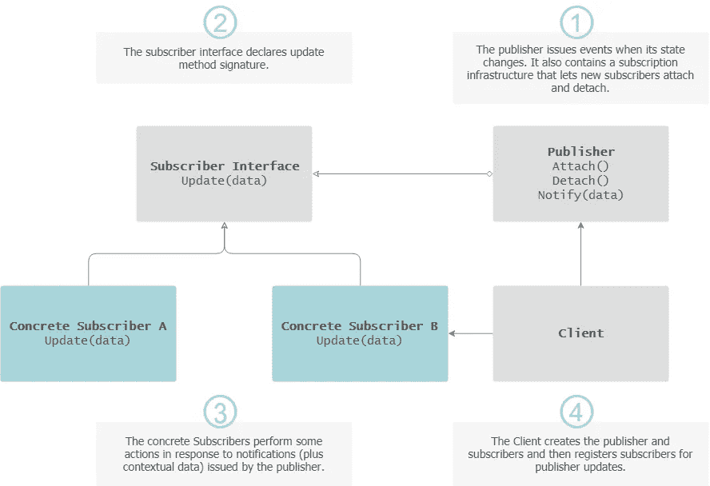*

*观察者模式*

## *➓ —命令|行为*

*Command 模式通过将两个类之间的请求转换成独立的对象来处理它们，这些对象封装了关于请求的所有信息，包括数据、方法参数、业务逻辑等。*

***—用法说明**:在不知道被请求操作的内部或者请求的接收者的情况下，需要向对象发出请求。
⭐️ **注意:**责任链模式可以使用命令将请求表示为对象。*

*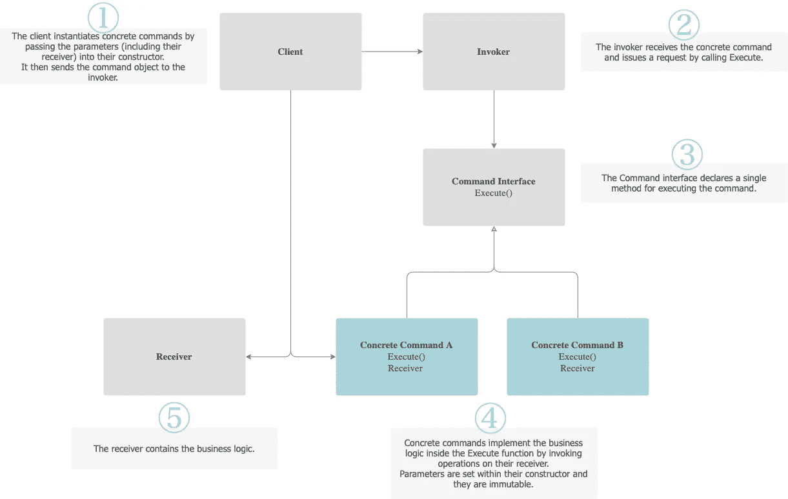*

*命令模式*

# *脚注*

*在这篇文章中，我们仅仅触及了一些设计模式的表面，但是我希望它能让你对构建软件的贡献因素有一个很好的了解，并且提升所有的能力:可扩展性、可维护性和可测试性。让应用程序设计**对变化具有弹性**是交付成功解决方案的关键。*

> *好的设计显而易见。伟大的设计是透明的。*

*感谢阅读！*

**我经常在媒体上写关于领导力、技术&的数据——如果你想阅读我未来的帖子，请*[*‘关注’我*](https://medium.com/@semika) *！**

* *