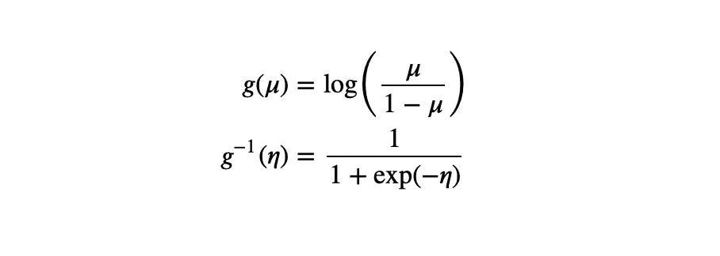
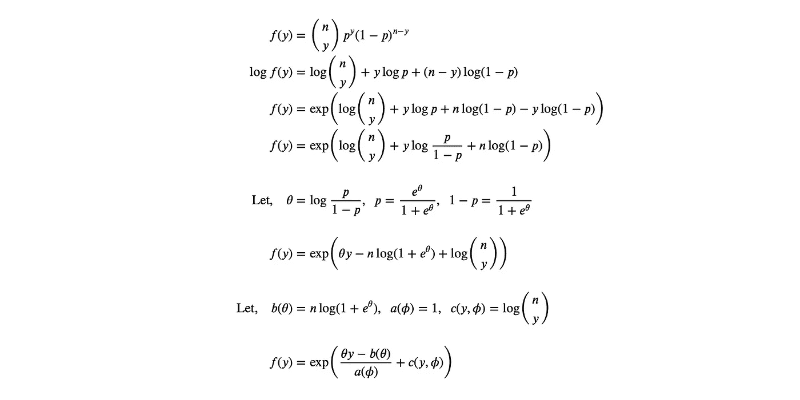

# 迭代加权最小二乘法和 GLMs 解释

> 原文：<https://towardsdatascience.com/iterated-reweighted-least-squares-and-glms-explained-9c0cc0063526>

## 用 Python 实现了详细的实现


图片由[蒂内·伊万尼奇](https://unsplash.com/@tine999)在 Unsplash 上拍摄

*广义线性模型* (GLM)是一种回归模型，我们对通常的线性回归模型的线性假设进行广义化。由于这种非线性，估计回归参数不会像估计线性回归参数那样简单。

*迭代加权最小二乘* (IRLS)算法，有时也称为*迭代加权最小二乘* (IWLS)，是一种找到广义线性模型的最大似然估计的方法。它是加权最小二乘法的扩展。先来一个简短的背景介绍。

# 背景

在线性模型中，我们可以使用正规方程来估计回归的参数，


普通最小二乘估计

这种方法在均值为零和方差不变的情况下会有误差。


线性误差分布

如果预测值和被预测值之间的关系不是线性的，那么如果我们坚持使用上面的正规方程，我们将会得到具有非恒定方差的误差。


非线性误差分布

这种结果并不理想。为了更好的可预测性，我们希望有恒定的误差方差。通过一些我不会展示的数学操作，我们可以使用加权最小二乘法将误差分布转化为标准的多元正态分布。


加权最小二乘估计

由于特定的原因，我们仍然不能将它用于 GLMs。GLM 的 y 变量不同于预测变量。考虑下面的数据(我们也将用于代码)。

这里我们看到 y 变量是一个计数变量，表示成功的次数。对于我们的情况，我们将最大成功数保持为 1，这是一个逻辑回归问题。二项式(和逻辑)回归不预测实例的成功次数，而是预测成功的概率。y 变量和所需预测变量之间的差异是有问题的，因为我们无法将 y 变量代入加权最小二乘方程。为了解决这个问题，我们引入了 IRLS 算法。但是在我们跳到算法之前，我需要解释一下 GLM 的基础知识。

# 广义线性模型(GLM)

顾名思义，GLMs 是线性回归的概括，其中预测变量通过字母`g`表示的链接函数与线性模型相关。


GLMs

如果你预测的变量是有限域的，那么链接函数就很方便。例如，如果您想将概率建模为您的响应变量。如你所知，概率的值只能在 *0* 和 *1* 之间。普通的线性回归不能满足这种定义域限制。因此我们引入了链接函数。下面的形式通常更容易理解。


GLMs

这里的`μ`是要预测的概率。但是，通过适当选择链接函数，您可以使用它来模拟具有任何其他域限制的任何其他变量。

**注**。链接函数必须是可微的。

先说链接功能。对于我们的例子，我们需要找到一个将无限域转换成`[0, 1]`域的函数。很多函数都有这个属性。我将向您展示这种转换最流行的链接函数。



Logit 函数

上面的函数就是著名的 logit 函数。logit link 函数适用于预测概率的二元 *y* 变量。

**注**。仅当 *y* 变量来自指数族分布时，glm 才有效。

# 指数族

逻辑回归有一个值为 1 或 0 的二元 *y* 变量。我们可以说这个数据来自一个具有非常数概率参数的伯努利分布。这个概率就是我们试图模拟的。因为伯努利或二项式分布来自指数族，所以我们可以通过 GLM 对此建模。但是这个指数族是什么呢？

如果一个分布的密度或质量函数可以用下面的形式来表示，那么这个分布就属于指数族。


指数族

我将展示如何以这种形式表示二项分布。



证明二项分布是指数族的一部分

还有其他方法来表示指数族的参数，因为它们不是唯一的。我花了这么长时间来解释指数族，因为我们需要一个参数的方差函数的概念。


方差函数

我知道这很难找到，所以我将提供一个更简单的方法来推导方差函数。本质上，方差函数是一种用均值表示分布方差的方法。


方差定义

二项式分布的均值是`np`，而方差是`np(1-p)`。从上面的推导中我们知道`a(ϕ) = 1`，我可以把我的方差函数表示如下。


二项分布的方差函数

如果我们用`np`代替`μ`，我们将得到方差`np(1-p)`。假设在正态分布的例子中，均值和方差之间没有直接的联系。在这种情况下，您必须使用公式手动找到方差函数。

# 迭代加权最小二乘法

我们从定义一个“新”回归问题开始，


等式 1。新回归

如果我们知道误差的方差，就可以估计参数。误差的方差可通过以下公式获得。


等式 2。误差方差

注意，对于 GLMs，`a(ϕ)`项可以完全忽略，因为它将在下面的计算中抵消。

从这里，我们可以使用加权最小二乘法来估计参数。这就是`a(ϕ)`抵消的地方。


等式 3。加权最小二乘法

使用当前的参数估计，我们找到了`μ`的新值，


等式 4。查找μ

回想一下，我们定义的`z`和`Σ`是`μ`的函数，`μ`是`β`的函数，`β`是`z`和`Σ`的函数。我们通过迭代这个递归关系来估计参数。

如果对数似然的增加不再显著，则算法停止。


等式 5。逻辑回归的对数似然。

注意，这个对数似然方程只对逻辑回归有效。对于其他分布，公式将取决于所选的链接函数。

我们来编译一下。迭代加权最小二乘算法；

1.  在定义的域内初始化`μ`。我将用一个`0.5`概率数组进行初始化。
2.  给定`μ`的当前值，使用*等式 1* 和 e *等式 2* 计算`z`和`Σ`。
3.  给定`z`和`Σ`的当前值，使用加权最小二乘法公式计算`β`；e *第三季*。
4.  给定`β`的当前值，使用*等式 4 计算`μ`。*
5.  如果对数似然的增加(*等式 5* )小于预先指定的ε，则停止。否则，返回步骤 *2* 。

# Python 代码

让我们把所有的拼图拼在一起。首先是链接功能。

接下来，我们的算法部分，

这是我的算法代码。我将这些部分与上面概述的步骤相匹配。请尝试匹配上面的每个等式。

注意，参数中的`X`需要一个截距列。运行下面一行代码，

```
b = IWLS(X, y)
```

会将参数估计值返回给`b`变量。

```
IWLS completed on 8 iterations
array([1.10999575, 9.12479957, 2.18745957])
```

我们可以利用这些信息来预测成功的可能性。

```
phat = ig(X @ b)
yhat = np.where(phat >= 0.5, 1, 0)
```

这里`phat`存储概率预测，而`yhat`存储二项式预测。

# 比较

据我所知，Python `scikit-learn`库没有 IRLS 解算器，所以我们无法将我们的结果与他们的进行比较。但是幸运的是，R `faraway`软件包使用 IRLS 作为他们的 GLM 解算器。我们来对比一下。

运转

```
summary(model)
```

会回来，

```
Call:
glm(formula = Success ~ ., family = binomial, data = df)Deviance Residuals: 
     Min        1Q    Median        3Q       Max  
-1.72517  -0.12458  -0.00007   0.48620   1.07683Coefficients:
            Estimate Std. Error z value Pr(>|z|)
(Intercept)    1.110      1.283   0.865    0.387
Height         9.125      8.489   1.075    0.282
Weight         2.187      2.099   1.042    0.297(Dispersion parameter for binomial family taken to be 1)Null deviance: 13.8629  on 9  degrees of freedom
Residual deviance:  5.6807  on 7  degrees of freedom
AIC: 11.681Number of Fisher Scoring iterations: 8
```

回想一下我们之前的输出，

```
IWLS completed on 8 iterations
array([1.10999575, 9.12479957, 2.18745957])
```

这是精确的参数估计和迭代次数。我不知道他们使用的实际停止条件，但是看起来我们的方法非常符合。

# 恭喜

您已成功完成这篇文章。查看我在 GitHub 上的完整代码，了解如何正确地预处理数据并在实际应用中使用我们的函数。请在评论中分享你的反馈和想法。感谢您的阅读！