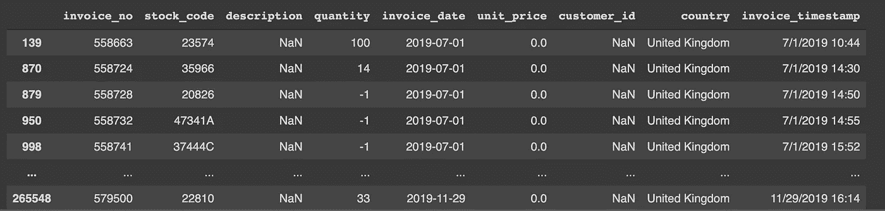

# 如果你的分析没有产生“指数价值”的见解，那也没关系

> 原文：<https://towardsdatascience.com/its-okay-if-your-analysis-doesn-t-result-in-exponential-value-insights-9cff05f09e50>

由 [Lina Trochez](https://unsplash.com/@lmtrochezz?utm_source=medium&utm_medium=referral) 在 [Unsplash](https://unsplash.com?utm_source=medium&utm_medium=referral) 上拍摄的照片

## 解决数据分析师的一些关键难题

据说**分析师是数据故事讲述者**。他们的角色是发现并总结"*有趣的*"事实来回答商业问题。可能是我，但我觉得有一个不成文的期望，数据分析师将*总是*把这些有趣的事实带到他们的交付物中。

## 产生“非凡见解”的压力

很多时候，当我做分析，尤其是[探索性数据分析(EDA)](https://en.wikipedia.org/wiki/Exploratory_data_analysis) 时，我觉得**有义务**去发现有趣的事实——一些*新的*对产品/业务有用的数据。**有时这是无法实现的**。无论我如何分割数据，或者应用哪种分析技术，似乎都没有一种直接的模式可以在回答业务问题时带来“指数价值”。

照片由[布鲁斯·马尔斯](https://unsplash.com/@brucemars?utm_source=medium&utm_medium=referral)在 [Unsplash](https://unsplash.com?utm_source=medium&utm_medium=referral) 拍摄

当这种情况发生时，首先我会沉浸在继续调查数据中。我将陷入困境，去探索更多关于我能用它做什么，直到我到达一个点，当我筋疲力尽，厌倦了探索。一旦达到这一点，我将停止进一步探索，只传递发现的见解，这并没有给我带来太多的满足感，因为它们没有我预期的那样有指数价值。

> 这种“有求必应”的遭遇，常常让我有不安的感觉。我觉得自己没有效率，因为我没有交付预期交付的东西。

沉下情绪，重新思考这些设置后，我意识到我并不是没有效率。我已经对数据进行了统计调查，并总结了它们的特征，这正是我的工作所期望的。

## 如果没有故事，你就不能讲故事

数据分析师被期望发现并总结“*有趣的*事实来回答业务问题。一个常见的挑战是，你甚至没有 ***正确的事实/数据*** ，更不用说发现任何见解了。

每个分析项目的第一条规则是确保 ***你有一个良好的数据基础*** 来工作。高质量的数据需要准确、完整、及时和相关。

有些时候，数据太少，分析师无法从给定的数据中获得任何价值。太少和太不完整的数据使得综合或发现任何模式或见解变得更加困难。即使出现任何模式，也很可能是一次性的或季节性的。它们是不可靠的，因此基于这些见解构建的任何解决方案或决策也可能是不可靠和不可扩展的。

有问题的数据说明(NaN/缺失值、不正确的值)-作者提供的图片

在开始任何分析项目之前，我们可以事先检查数据的可用性和质量，并确保它们准确、完整、及时和相关。处理有问题的数据集毫无意义——它让事情变得复杂，你不太可能从中获得有意义的东西。

## 一个不那么有趣的故事仍然是一个故事

分析的主要目标是发现洞见。一些洞见非常有价值——发现可以改变其他事物工作方式的事物；而其他见解没有那么有价值——可能证实了一些已经广为人知的东西。不管怎样，**它们都是来自数据集**的事实，因此它们都是正确的。

作为一名数据分析师，有从数据集中发掘尽可能多的有趣和有价值的见解的雄心是很自然的。这是一种探索的好奇心，不找到答案是不会停止的。然而，如果你遵循了正确的分析过程和技术，却没有找到“伟大的答案”，重要的是 ***保持中立的立场，接受数据告诉你的不那么有趣的事实*** 。

> 来自分析项目的见解可能与分析师的技能水平有关(分析师在转换数据以真正提取见解方面的熟练程度)，但最重要的是**它们与数据集本身下面的东西有关**。

因此，即使你的分析没有*超出这个世界的洞察力*，这也不是一个失败的项目。正如托马斯·阿尔瓦·爱迪生在建造电灯泡的无数次失败后所说，“ ***我没有失败。*** ***我刚刚发现了一万种行不通的方法。*** ”。尽管分析结果是已经预料到的，而不是新的，你**仍然在确认**它或**增加对假设陈述的置信水平**中传递价值。

久尼尔·费雷拉在 [Unsplash](https://unsplash.com?utm_source=medium&utm_medium=referral) 上拍摄的照片

## 一个故事对一个人来说可能是有趣的，但对另一个人来说却不是

尽管基于科学方法，分析也是一种艺术形式。它依赖于**主观优势**和**认知偏差**。有数不清的方法来转换(分组、排序、过滤)数据，显示数据，也有许多分析/机器学习技术来建模数据。由数据分析师来选择并最好地利用这些工具和技术。

你可能想从多个角度丰富你的分析，采取整体的方法，考虑产品中涉及的不同组件及其相互作用。为了收集新的观点，你可以**与其他分析师或与分析相关的利益相关者(如产品经理、研究人员、设计师、运营团队等)进行讨论**。同样，您也可以与数据团队成员(数据分析师、数据科学家、机器学习工程师等)进行讨论，探索对数据集建模的其他技术。探索数据科学社区项目(例如 Kaggle)和研究论文也可能有所帮助！

主观性不仅在于应该如何分析数据，还在于分析见解的**感知价值**。作为一名数据分析师，您每天都在探索数据集，了解领域背景。这种领域背景意味着你对产品/数据了解如此之多，以至于某些见解已经在你的脑海中浮现。

> 但是对你的利益相关者来说可能不是这样。他们不像你那样深入研究数据，因此你已经知道的一个洞察可能对他们来说是一条新信息。

他们可能不知道 70%的忠实客户只集中在某个地区，或者由于其他产品的推出，出现了季节性销售下降。尽管这些信息对你来说可能并不“非常有价值”，因为你已经知道了它们，**但对你的利益相关者来说仍然非常有价值**。

# 结束语

人们对数据分析师有一种不成文的期望，即从他们的分析中产生指数级的价值洞察——这种信息可以激发商业决策的转变。这给数据分析师造成了一些压力，让他们不得不继续分析以找到他们，当他们找不到任何数据时，他们会感到无能。我上面强调的几点是我们如何解决这个问题，这主要与**重新构建**我们作为数据分析师应该如何看待这个问题有关。