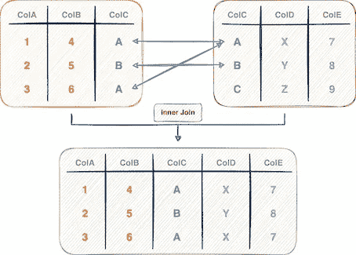
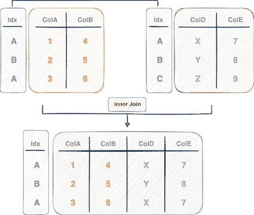
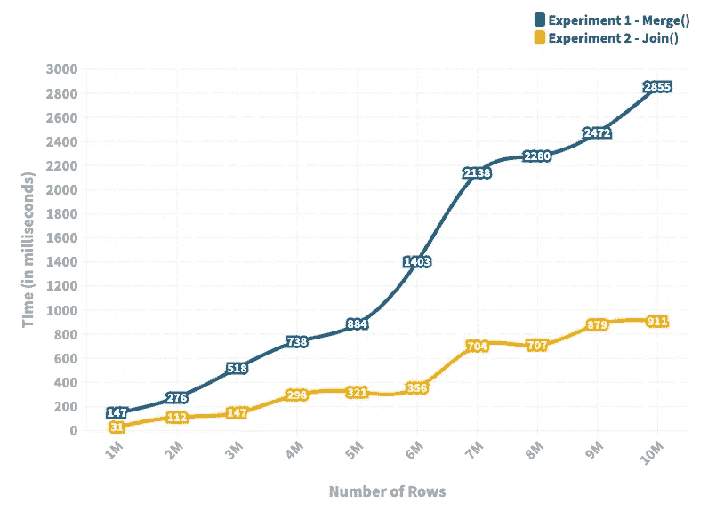

# 是时候告别熊猫里的合并法了

> 原文：<https://towardsdatascience.com/its-time-to-say-goodbye-to-the-merge-method-in-pandas-b7f39a4a3fb6>

## 为什么我在 Pandas 中停止使用合并方法，为什么你也应该这样做

[Alain Pham](https://unsplash.com/@alain_pham?utm_source=medium&utm_medium=referral) 在 [Unsplash](https://unsplash.com?utm_source=medium&utm_medium=referral) 上拍摄的照片

Pandas 中的`merge()`方法无疑是数据科学家在数据科学项目中最常用的方法之一。

该方法源于 SQL 中的表连接思想，并扩展到 pythonic 环境中的表连接，它基于一个或多个列中的匹配值合并两个 Pandas 数据帧。

下图对此进行了说明:

连接表的图解概述(图片由作者提供)

`merge()`方法的直观性质使其成为 Pandas 用户加入数据框架的理想选择。

然而，当谈到运行时，在 Pandas 中有一个相对更好的选择，您应该比`merge()`方法更喜欢。

你可以在这里找到这篇文章的代码。

让我们探索一下🚀！

# 合并表的方法

## 方法 1:使用 merge()

如上所述，在 Pandas 中合并数据帧的传统且最常见的方法是使用`merge()`方法。

如上面的代码块所示，该方法接受两个数据帧，`df1`和`df2`。

此外，我们使用`how`参数(上例中的`"left"`)指定希望执行的连接类型。

最后，我们用`left_on`参数指定匹配第一个数据帧(`df1`)中的值时要考虑的列，用`right_on`参数指定匹配第二个数据帧(`df2`)中的值时要考虑的列。

## 方法 2:使用 join()

join()方法在目标上类似于 Pandas 中的 merge()方法，但是在实现上有一些不同。

1.  `join()`方法在`df2`和`df1`的索引处执行查找。然而，`merge()`方法主要用于使用列中的条目进行连接。
2.  默认情况下，`join()`方法执行左连接。而`merge()`方法在其默认行为中求助于内部连接。

索引值连接表(作者图片)

下面的代码块演示了`join()`方法。

如上所述，`join()`方法执行索引查找来连接两个数据帧。也就是说，对应于相同索引值的行被合并。

因此，在使用`join()`方法时，应该首先将希望执行 join 的列设置为 DataFrame 的索引，然后调用 join()方法。

# 实验装置

为了在 Pandas 中评估`merge()`方法的运行时性能，我们将把它与`join()`方法进行比较。

具体来说，我们将创建两个虚拟数据帧，并使用方法`merge()`和`join()`执行连接。

这个实验的实现如下所示:

*   首先，我们设置来自`(-high, +high)`的整数值。我们将在不同大小的数据帧上比较这两种方法的性能，数据帧的行数来自`rows_list`，列数来自`n_columns`。最后，我们将运行每个实验`repeat`次。

*   `create_df`方法接受一系列参数并返回一个随机数据帧。

*   在下面的代码中，我们在同一个数据帧`df1`和`df2`上测量`merge()`方法和`join()`方法的运行时间。

> 注意，要使用`join()`方法，您应该首先将列设置为数据帧的索引。

# 结果

接下来，我们来看结果。

Join vs Merge 方法的实验结果(图片由作者提供)

*   蓝色线图描述了`merge()`方法的运行时间，黄色线图代表了`join()`方法的运行时间。
*   我们将行数从 100 万改变到 1000 万，并注意到两种方法的运行时间与行数正相关。
*   然而，`join()`方法在运行时间上比传统的`merge()`方法有了显著的改进。
*   随着行数的增加，两种方法的运行时间之间的差异也会增加。这表明您应该始终使用`join()`方法来合并数据帧，尤其是在较大数据集的情况下。

# 结论

总之，在这篇文章中，我们在一个虚拟数据帧上比较了熊猫的`merge()`和`join()`方法的性能。

实验结果表明，就运行时间而言，使用`join()`方法对索引列进行合并比使用`merge()`方法更有效——提供了高达 **4 到 5 倍的性能提升。**

你可以在这里找到这篇文章[的代码。](https://deepnote.com/workspace/avi-chawla-695b-aee6f4ef-2d50-4fb6-9ef2-20ee1022995a/project/Untitled-project-118d9af3-9bb2-4714-8dd4-d3f84b4de020/%2Fnotebook.ipynb)

感谢阅读！

[🧑‍💻**成为数据科学专家！获取包含 450 多个熊猫、NumPy 和 SQL 问题的免费数据科学掌握工具包。**](https://subscribepage.io/450q)

✉️ [**注册我的电子邮件列表**](https://medium.com/subscribe/@avi_chawla) 不要错过另一篇关于数据科学指南、技巧和提示、机器学习、SQL、Python 等的文章。Medium 会将我的下一篇文章直接发送到你的收件箱。