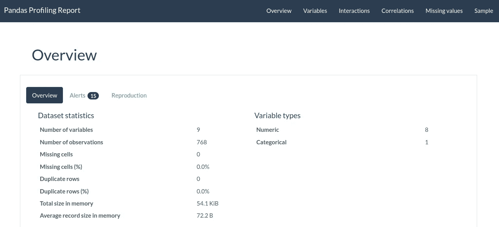
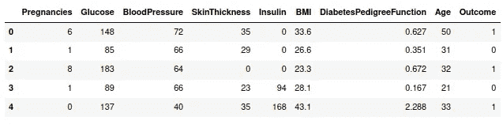
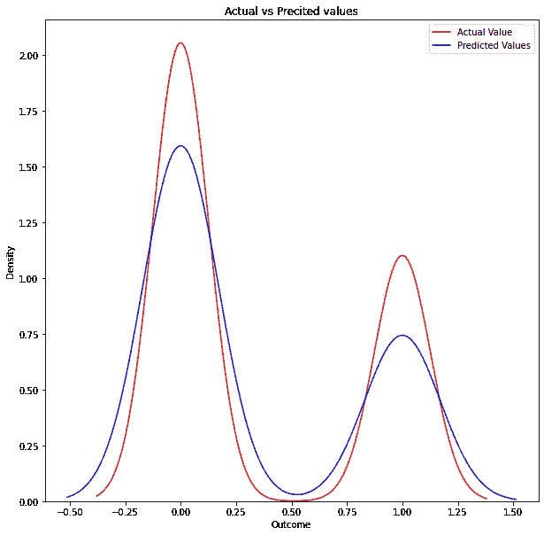
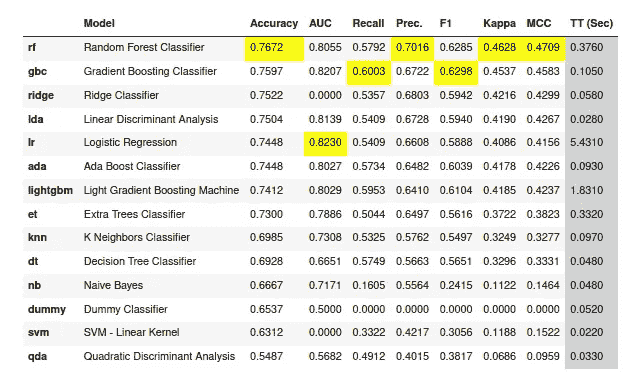

# 我已经训练了我的第一个机器学习模型:下面是它是如何进行的

> 原文：<https://towardsdatascience.com/ive-trained-my-first-machine-learning-model-and-i-got-sad-8abdc0c5b72b>

## 一些最大似然算法的概述和一些个人的思考


马库斯·温克勒在 [Unsplash](https://unsplash.com/s/photos/machine-learning?utm_source=unsplash&utm_medium=referral&utm_content=creditCopyText) 上的照片

最后，我训练了我的第一个机器学习模型！是啊！最终，我做到了。球场上有太多的炒作，我没有看到最终做这件事的时间。

但也许这就是我最初难过的原因:也许，赛场上的炒作太多了。

我在 2021 年 3 月左右开始学习数据科学和编程，当时我是:

*   为我的机械工程学士学位的最后一次考试而学习
*   为我的论文而学习，这当然依赖于数据科学
*   全职工作
*   做所有和我的家庭相关的事情

所以，当然，我花了一年时间才来到这里:训练我的第一个 ML 模型。但我想告诉你这一切是如何进行的，我学到了什么(我学到的东西最终真的让我很开心！).

# k-最近邻:我尝试的第一个算法

在我攻读工程学位的过程中，我学到的真正重要的东西(也许，这是我学到的最重要的东西)是从小处着手，从简单的事情开始，这样我就可以随着时间的推移掌握它们。

我被建议学习的第一个模型(这些天，我正在结束一门数据科学的课程)是 K-NN 和决策树。我决定从 K-NN 开始。我在网上搜索了一下，找到了一个用 K-NN 进行良好锻炼的典型数据集，在这个数据集里，我们有一些特征，如身体质量指数、怀孕、血压等..哪些与糖尿病有关(你可以在网上从不同的来源找到数据；比如这里的。该练习的目的是训练 ML 模型来预测具有这种医学状况的患者是否可能患有糖尿病。

所以，让我们看看一些带注释的代码。

```
#importing all the needed librariesimport pandas as pd
import numpy as np
import pandas_profiling
from pandas_profiling import ProfileReport
from sklearn.model_selection import train_test_split
from sklearn.preprocessing import StandardScaler
from sklearn.neighbors import KNeighborsClassifier as KNN
from sklearn.metrics import confusion_matrix
from sklearn.metrics import accuracy_score
from sklearn.metrics import precision_score
from sklearn.preprocessing import MinMaxScaler#importing data
diab = pd.read_csv('diabetes.csv')
```

现在，我想给你们看的第一个东西是一个包，来自熊猫，这是我几天前发现的；这是“熊猫简介”，我用上面的代码导入了它。这个软件包在探索性数据分析中非常有用，因为它给了我们很多信息。让我们看看:

```
#profiling data
profile = ProfileReport(diab, explorative=True, dark_mode=True)#output in HTML
profile.to_file('output.html')
```

这个软件包确实给了你很多关于数据的信息。例如:



熊猫轮廓的输出。图片由作者提供。

上图向我们展示了 Pandas Profiling 在第一个实例中向我们展示的内容，即变量信息；例如，数据集总共有 9 个变量，其中 8 个是数字变量，1 个是分类变量。

事实上，如果我们键入“diab.head()”，我们可以看到:



' diab.head()'的结果。图片由作者提供。

事实上，我们有 8 个数字特征(前 8 列)和 1 个分类特征(最后一列，名为“结果”，它告诉我们患者是否患有糖尿病，值为 1，值为 0)。

如果您看到前面的图像，您可以看到 Pandas Profililing 给出的输出告诉我们有 15 个警报。在这一部分，软件包会给我们更多的信息，例如，它会告诉我们具有高相关性的特性以及更多。我真的建议你去看一看。

现在，让我们继续分析。首先，我们要用 0 值填充行；事实上，例如血压为 0 毫米汞柱是不现实的。为此，我们可以用同一列上的平均值来代替零；我们可以用下面的代码来实现:

```
#filling zeros with mean value
non_zero = ['Glucose','BloodPressure','SkinThickness','Insulin','BMI']
for coloumn in non_zero:
    diab[coloumn] = diab[coloumn].replace(0,np.NaN)
    mean = int(diab[coloumn].mean(skipna = True))
    diab[coloumn] = diab[coloumn].replace(np.NaN, mean)
    print(diab[coloumn])
```

现在，我们可以开始训练我们的模型。我们希望特征是前 8 列，以便给定一个患者与前 8 列相关的值(年龄、妊娠、BPM 等)，我们希望预测他/她是否患有糖尿病；因此“结果”栏(有/没有糖尿病)将成为我们的标签。

```
#all the column except the last one (features)
X =diab.iloc[:,0:8]#the outcome column (label)
y =diab.iloc[:,8]#feature scaling
scaler = MinMaxScaler()
X = scaler.fit_transform(X)#testing and training
X_train, X_test, y_train, y_test = train_test_split(X, y, test_size=0.2,random_state=0, stratify=y)
```

现在，让我们拟合我们的模型，看看我们的预测:

```
#fitting model
model = KNN(n_neighbors=5).fit(X_train, y_train)#predictions and model accuracy
y_pred = model.predict(X_test)
print(f'Model accuracy on test set: {accuracy_score(y_test, y_pred):.2f}')
```

结果是:

```
Model accuracy on test set: 0.75
```

“嗯嗯……“非常好”是我的第一个评论。但是我们能说点别的吗？我用过 k = 5…是个好选择吗？我怎么能理解我做了一个好的选择？好吧，我们可以试着用下面的代码找到一个好的“k”:

```
#best k
for k in [1,2,3,5,10]:
    model = KNN(n_neighbors=k)
    model.fit(X_train, y_train)
    predictions = model.predict(X_test)
    validation_accuracy = accuracy_score(y_test, ypred)
    print('Validation accuracy with k {}: {:.2f}'.format(k,   validation_accuracy))
```

利用上面的 for 循环，我们迭代地计算列表中指示的值的最佳 k。结果是:

```
Validation accuracy with k 1: 0.71
Validation accuracy with k 2: 0.72
Validation accuracy with k 3: 0.75
Validation accuracy with k 5: 0.75
Validation accuracy with k 10: 0.78
```

因此，根据计算结果，给出最佳精度的 k=10，我们将使用它。为什么我选择测试上面的 k 值？嗯，3 是一个典型值，选择一个“太高”的值会导致模型不稳定。因此，如果您亲自尝试，您会发现对于高于 k=10 的值，精度实际上是相同的。

现在，让我们用最好的 k 来训练我们的模型:

```
#training model with best k
model = KNN(n_neighbors=10).fit(X_train, y_train)#predictions and model accuracy
y_pred = model.predict(X_test)
```

现在，让我们看看混淆矩阵来评估一些指标:

```
#confusion matrix
cm= confusion_matrix(y_test, y_pred)
cm--------array([[89, 11],
       [23, 31]])
```

混淆矩阵给了我们一个很好的结果。事实上，我们有 89+31=120 个值预测良好(89 个真阳性和 31 个真阴性)，23+11=34 个值预测不良(23 个假阴性和 11 个假阳性)。事实上，如果我们计算精度得分，即模型将真阳性预测为真阳性的能力，我们会得到:

```
#precision score
precision = precision_score(y_test, y_pred)print(f'{precision: .2f}')--------------------0.74
```

这是一个令人满意的值。

就是这样。所以，我(最初)的悲伤。该模型训练有素，k=10 的 K-NN 是预测患者是否患有糖尿病的良好算法，知道与其健康状态相关的其他值。

所有对机器学习的炒作到此结束？

嗯，我是一个永远不会满足的人，尤其是在这个领域，我对知识的渴望是我无法满足的。所以，我想更深入一点。

此外，我喜欢图表…我需要看东西。所以，我找到了一种图形化评估我的模型的方法。例如，我们可以绘制核密度估计；在统计学中，KDE 是一种估计随机变量概率密度函数的非参数方法(例如，你可以在这里阅读更多)。我们可以这样做:

```
import matplotlib.pyplot as plt
import seaborn as snsplt.figure(figsize=(10, 10))#diabetes outcome (Kernel Density Estimation)
ax = sns.kdeplot(y, color="r", label="Actual Value") #y = diab['Outcome']#predictions (Kernel Densiti Estimation), in the same plot (ax=ax)
sns.kdeplot(y_pred, color="b", label="Predicted Values", ax=ax)#labeling title
plt.title('Actual vs Precited values')#showing legend
plt.legend()#showing plot
plt.show()
```



实际值(红色)和预测值(蓝色)的 KDE。图片由作者提供。

所以，我们可以看到，两条曲线非常相似，证实了之前的分析。

现在，我对我的学习变得有点高兴了，但我还不够高兴；事实上，我问自己是否能做得更好，至少在理解的层面上。我研究了决策树模型，想看看它如何处理这样的数据。

# 决策树:我尝试的第二个 ML 算法

由于与分割和训练相关的数学和代码与之前相同，我将向您展示模型拟合后的部分:

```
from sklearn.tree import DecisionTreeClassifier#decision tree model and fitting
clf = DecisionTreeClassifier(max_depth=3)
clf.fit(X_train,y_train)#predictions and model accuracy
y_pred = clf.predict(X_test)
print(f'Model accuracy on test set: {accuracy_score(y_test, y_pred):.2f}')----------------------Model accuracy on test set: 0.79
```

这个第一个结果真的让我反思…我得到了 0.79 的准确率，而 K-NN 的准确率是 0.78，k=10('最好的' K！)因为我非常确定 K-NN 是在这种情况下使用的更好的算法。我想尝试找到树的最佳深度，我使用了与最佳 k 相同的方法:

```
#best depth
for d in [3,5,10, 12, 15]:
    model = DecisionTreeClassifier(max_depth=d)
    model.fit(X_train, y_train)
    predictions = model.predict(X_test)
    validation_accuracy = accuracy_score(y_test, y_pred)
    print('Validation accuracy with d {}: {:.2f}'.format(d, validation_accuracy))------------------------------Validation accuracy with d 3: 0.79
Validation accuracy with d 5: 0.79
Validation accuracy with d 10: 0.79
Validation accuracy with d 12: 0.79
Validation accuracy with d 15: 0.79
```

所以，我们用一堆不同的 d 参数得到相同的精度。

现在，如果我们计算混淆矩阵，我们得到:

```
cm= confusion_matrix(y_test, y_pred)
cm
-------------------array([[84, 16],
       [16, 38]], dtype=int64)
```

最后是精度分数:

```
#precision score
precision = precision_score(y_test, y_pred)print(f'{precision: .2f}')-------------------------------0.70
```

最后，我没有报告 KDE 图，因为它实际上与 K-NN 算法生成的图相同。

这些结果让我又有点难过，因为，如前所述，在这种情况下，我非常确定 K-NN 是比 DT 更好的算法，但是正如你所看到的，我们得到的两个模型的结果非常相似。

因此，我问自己:ML 中有这么多算法，一个人(尤其是像我这样的新手)如何能够理解——给定一个问题——哪种算法能够很好地适合给定的问题？

信不信由你，我终于找到了一个让我非常开心的答案。

# Pycaret

所以，我谷歌了一下，找到了 [Pycaret](https://pycaret.org/) 。正如他们在其网站上所说，“Pycaret 是一个开源、低代码的机器学习库，可以自动化机器学习工作流”。要安装它，您只需键入:

```
pip install pycaret
```

工作完成了，像往常一样轻松。

现在，让我真正高兴的是发现了这样一个事实，使用 Pycaret，我们可以比较 ML 模型来预测我们正在研究的问题的值，而且我们是以一种非常简单的方式来做的。Pycaret 给出了比较的结果，它使用“交叉验证”方法来评估各种模型的超参数，并为我们提供了所需的度量，用于决定使用哪种算法来解决我们的问题。让我们看看它是如何工作的:

```
from pycaret.classification import *#defining the features
numeric_features = ['Pregnancies', 'Glucose', 'BloodPressure', 'SkinThickness', 'Insulin', 'BMI', 'DiabetesPedigreeFunction', 'Age']#setting up the data
clf = setup(data=diab, target='Outcome')#comparing the models
best = compare_models()
```



ML 算法与 Pycaret 算法的比较。图片由作者提供。

正如我们所看到的，Pycaret 中的比较非常有用，它告诉我们:

*   K-NN 和 DT 远不是在这种情况下使用的最佳算法(它们处于排名的中下部分)，但是它们为我们提供了具有相似值的度量(请记住，我们已经使用 for 循环计算了超参数，而 Pycaret 使用交叉验证，因此数字略有不同)
*   基于 Pycaret 度量计算的最佳算法是随机森林分类器

在结束之前，请注意在我写作的时候(2022 年 3 月)，Pycaret 并不与所有可用的 scikit-learn 版本兼容；我有 Scikir-learn 版本 1.0.2，不得不降级到 0.23.2。做起来很简单:

```
pip uninstall scikit-learnpip install scikit-learn==0.23.2
```

# 结论

正如我们已经看到的，当学习训练一个 ML 模型时，如果你是一个新手，像我一样，尝试不同的算法是一个好主意。这类练习真的给了我们获得‘动手’项目和算法的可能性。

当然，我们仍然需要知道更多，但是随着时间的推移，我们会越来越有经验。我非常确定 Pycaret 是一个很好的解决方案，可以决定我们面对的特定问题使用什么算法，但我甚至确定经验——我实际上是新手，会有所帮助(可能是大多数)。

*我们一起连线吧！*

[***中等***](https://federicotrotta.medium.com/)

[***LINKEDIN***](https://www.linkedin.com/in/federico-trotta/)*(向我发送连接请求)*

*如果你愿意，你可以* [***订阅我的邮件列表***](https://federicotrotta.medium.com/subscribe)**这样你就可以一直保持更新了！**

*考虑成为会员:你可以免费支持我和其他像我一样的作家。点击 [***这里***](https://federicotrotta.medium.com/membership)**成为会员。***