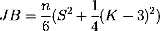
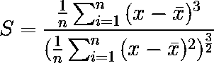
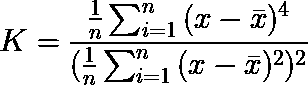
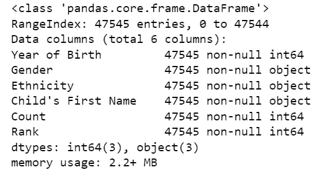
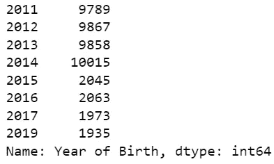
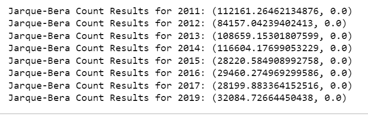

# 用 Python 进行 Jarque-Bera 测试

> 原文：<https://towardsdatascience.com/jarque-bera-test-with-python-98677c073de3>

让您的数据遵循正态分布非常好，因为它允许您利用正态分布提供的所有好处。但是我们如何知道我们的数据遵循正态分布呢？这就是 Jarque-Bera 测试的用武之地。在本文中，我们将了解 Jarque-Bera 测试，如何使用 Scipy 将它应用于 Python 中的数据，以及一些快速练习，并从头开始创建测试统计等式。


茱莉亚·科布利茨在 [Unsplash](https://unsplash.com?utm_source=medium&utm_medium=referral) 上的照片

# 什么是 Jarque-Bera 测试？

Jarque-Bera 测试是一种基于数据的偏斜度和峰度来确定一组数据值是否遵循正态分布的测试。包含偏度和峰度的检验统计方程为:



Jarque Bera 检验统计方程。作者在 https://latex.codecogs.com/eqneditor/editor.php[制作](https://latex.codecogs.com/eqneditor/editor.php)

其中 n =数据值的数量。s 是样本偏斜度(数据偏离平均值的程度)，定义如下:



Jarque Bera 检验统计方程的样本偏度。作者于[https://latex.codecogs.com/eqneditor/editor.php](https://latex.codecogs.com/eqneditor/editor.php)制作

k 是样本峰度(分布的尾部有多厚),定义如下:



Jarque Bera 检验统计方程的样本峰度。作者于[https://latex.codecogs.com/eqneditor/editor.php](https://latex.codecogs.com/eqneditor/editor.php)发表

测试统计结果将总是大于或等于零，因为:

1.  检验统计等式中的样本偏度总是平方的，这意味着 S 总是正的或零。
2.  样本峰度总是正的或零，因为分子是 4 次方，分母是平方。
3.  样本峰度和 3 之间的差是平方，意味着检验统计等式的这一项总是正的或零。
4.  两项之和≥ 0 也将大于或等于零。

如果检验统计量接近于零并且 p 值大于我们的标准值 0.05，我们就知道我们的数据是否遵循正态分布。p 值与数据遵循正态分布的无效假设相关。如果检验统计量很大且 p 值小于 0.05，则数据不符合正态分布。

现在我们已经建立了测试统计，您可以提取一个具有数字特征的数据集，并对它们应用 Jarque-Bera 测试。对于本文，我将使用来自纽约[open data](https://opendata.cityofnewyork.us/data/)的[流行婴儿名字](https://data.cityofnewyork.us/Health/Popular-Baby-Names/25th-nujf)数据集。

## 数据设置和探索

首先，我们将加载必要的导入包并导入数据。注意我们从 Scipy 导入了`jarque_bera`函数。然后我们用`pd.info()`检查数据。



pandas.info()关于流行婴儿名字数据的结果

查看 info 方法的结果，我们看到一个可以应用 Jacque-Bera 测试的`Count`列。这一列是有名字的婴儿总数。我们还看到在那个列中没有丢失的值，所以我们不需要对它应用像`dropna()`这样的方法来删除空值。考虑到有一个`Year of Birth`专栏，让我们看看我们还有多少年的时间。



对 baby_names[“出生年份”]调用 value_counts 方法的结果。

所以我们有 8 年的婴儿名字。有趣的是，前几年的名字总数比后半年多。我还注意到，2018 年被跳过了，在数据的网页上没有任何关于这一点的内容。就本文的目的而言，这不会造成任何伤害。

# Scipy 示例

应用我们的正态分布测试的快速方法是对我们的数据列应用`scipy.stats`函数，如下所示。

这将输出一个元组，左边是测试统计数据，还有一个 p 值。

```
(533643.0597435309, 0.0)
```

左边的值是本文开头的 JB 方程的测试统计量。右边的值是我们假设数据遵循正态分布的零假设的 p 值。它是由 1 与卡方分布的 CDF 之差计算得出的，卡方分布具有应用于检验统计的两个自由度。CDF 再次代表累积分布函数，用于确定分布中一系列可能性的概率。

由于测试统计量非常大，p 值小于 0.05，我们拒绝了零假设，即`Counts`数据来自正态分布。

# 附加实践

如果你正在使用这个数据集并希望进一步实践，我建议你对所有 8 年的`Count`数据进行 Jarque-Bera 测试。您可以单独完成这项工作，也可以创建一个 for 循环，每年进行一次迭代。当你准备好检查答案时，请看下面。

## 答案



Jarque-Bera 每年的计数结果

与所有年份的`Count`列的结果相似，当 p 值小于 0.05 时，测试统计值非常高。因此，假设每年的数据来自正态分布的零假设被拒绝。

# 从头开始示例(编码实践)


照片由[吴伟成](https://unsplash.com/@spencerwuwu?utm_source=medium&utm_medium=referral)在 [Unsplash](https://unsplash.com?utm_source=medium&utm_medium=referral)

在这里，我们将尝试从头开始创建 Jarque-Bera 检验统计方程。这将是一个很好的编码练习，因为公式在数学符号方面并不复杂。为了简单起见，让我们集中使用 Pandas 数据框列作为输入。在你尝试之后，你可以看看我下面的版本。

注意我的可能不是最佳的，因为我列出了更多的步骤。对于正在编写的 Jarque-Bera 最干净的版本，请查看 [Jarque-Bera 测试文档](https://docs.scipy.org/doc/scipy/reference/generated/scipy.stats.chi2.html)中的 [Scipy 源代码](https://github.com/scipy/scipy/blob/v1.9.0/scipy/stats/_stats_py.py#L1875-L1929)。我建议您查看源代码，看看这个测试的 p 值是如何使用测试统计的卡方 CDF 计算的。截至本文撰写时，`chi2`是从`scipy.stats`引进的[。](https://docs.scipy.org/doc/scipy/reference/generated/scipy.stats.chi2.html)

# 什么时候使用 Jarque-Bera 测试最好？


兰迪·塔兰皮在 [Unsplash](https://unsplash.com?utm_source=medium&utm_medium=referral) 上的照片

假设有其他[方法](/6-ways-to-test-for-a-normal-distribution-which-one-to-use-9dcf47d8fa93)来测试数据是否来自正态分布，我们需要看看什么时候最好使用 Jarque-Bera 测试。根据[这些](https://www.statisticshowto.com/jarque-bera-test/) [来源](https://en.wikipedia.org/wiki/Jarque%E2%80%93Bera_test)，建议一个样本的总数据值较大。至少大于 2000。这使得数据可以与具有 2 个自由度的卡方分布进行比较。任何更小的值都可能导致错误的测试统计和 p 值。

# 最后的想法

感谢阅读！同样，让您的数据遵循正态分布非常好！它允许您利用均值、中值和众数都相等的对称分布。当您在数据中处理更多样本时，您还可以依赖中心极限定理。您只需要一个像 Jarque-Bera 测试这样的测试来帮助您确定您是否正在使用正态分布。

如果你喜欢在媒体上阅读，并愿意进一步支持我，你可以使用我的[推荐链接](https://medium.com/@j.dejesus22/membership)注册一个媒体会员。这样做可以用你的会费的一部分在经济上支持我，我将不胜感激。

如果您有任何问题，请随时在 Linkedin[和 Twitter](https://www.linkedin.com/in/jdejesus22/)[上发表评论或联系我们。对 Twitter 上的 DM 开放。如果你喜欢这篇文章，也可以看看我下面的其他相关文章:](https://twitter.com/johnnydata22?lang=en)

[](/hypergeometric-distribution-explained-with-python-2c80bc613bf4)  [](/what-why-and-how-to-read-empirical-cdf-123e2b922480)  [](/point-biserial-correlation-with-python-f7cd591bd3b1)  

直到下一次，

约翰·德杰苏斯