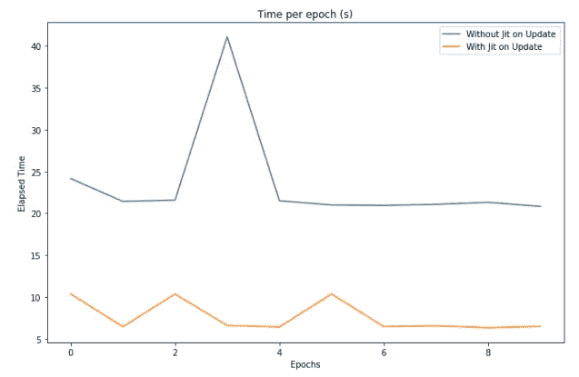

# GPU 和 TPU 上的 jax-Numpy

> 原文：<https://towardsdatascience.com/jax-numpy-on-gpus-and-tpus-9509237d9194>

## 了解该库并从零开始实施 MLP


卢卡斯·凯普纳在 [Unsplash](https://unsplash.com?utm_source=medium&utm_medium=referral) 上的照片

有许多 Python 库和框架，因为它们是我们天空中的星星。好吧，也许没有那么多，但在处理任何给定的任务时，肯定有很多选项可供选择。

Jax 就是这些库中的一个。在过去的几个月里，它作为开发机器学习解决方案的基础框架变得非常流行，尤其是在被 Deep Mind 的人大量使用之后。

对于任何数据科学家来说，比工具更重要的是手头任务的基础知识。然而，对可用工具有一个很好的了解可能会节省很多时间，并使我们成为更有生产力的研究人员。毕竟，如果我们的目标是实现良好的业务结果，我们需要能够快速安全地运行我们的假设。

因此，在这篇文章中，我将谈论 Jax，解释它是什么，为什么我认为应该熟悉它，它的优点，以及如何使用它来实现一个简单的多层感知器。

在这篇文章的最后，我希望你的工具箱里又多了一个在日常工作中可能有用的工具。

这篇文章的所有代码都可以在 [Kaggle](https://www.kaggle.com/tiagotoledojr/jax-library-and-mlp-implementation) 和我的 [Github](https://github.com/TNanukem/paper_implementations/blob/main/jax-library-and-mlp-implementation.ipynb) 上找到。

# 什么是 Jax

Jax 是一个数字/数学库，非常类似于著名的 know Numpy。它是由谷歌开发的，目的只有一个:在处理典型的机器学习任务时，让 Numpy 更容易使用，更快。

为了实现这个结果，Jax 有一些内置的实现，允许大规模处理，如并行化和向量化，更快的执行，如实时编译，以及更简单的机器学习代数，如自动签名。

有了它，人们可以自然地加速他们的机器学习管道，而不必担心写太多代码。如果您使用多处理库来并行化您的实现，您知道这会很快变得难以承受。

但是，更有趣的是，Jax 能够直接在 GPU 和 TPU 等加速器上自动编译您的代码，而不需要任何修改。这个过程是无缝的。

这意味着您可以使用类似于 Numpy 的语法编写一次代码，在您的 CPU 上测试它，然后将其发送到 GPU 集群，而无需担心任何事情。

现在，有人可能会问一个非常合理的问题:Jax 与 TensorFlow 或 Pytorch 有何不同？让我们调查一下。

# Jax x 张量流 x Pytorch

TensorFlow 和 Pytorch 已经在操场上待了很长时间了。他们正在充分利用深度学习库的实现来开发端到端的深度学习管道。

Jax 对成为一个完整的深度学习库没有兴趣。它的目标是成为加速器的核心。因此，您不会看到 Jax 以同样的方式实现数据加载器或模型验证器，您也不应该期望 Numpy 这样做。

但是在我们说话的时候，已经有深度学习库在 Jax 中实现了。他们的目标是使用库中这些优秀的功能来创建更快更干净的实现。众所周知，TensorFlow 和 Pytorch 都遭受了一些技术债务，这使得它们更难高效地开发一些东西。

我相信基于 Jax 的框架将来会在我们的行业中变得更加突出，所以我认为当标准库(不可避免地)发生变化时，了解 Jax 的基础知识是一个很好的开端。

# 关于 Jax 的一些细节

Jax 的目标是尽可能接近 Numpy。有一个低级的库实现，但是这已经超出了本文的范围。现在，我们将认为我们将完全像“GPU 的 Numpy”一样使用它。

首先，我们将安装 Jax:

```
pip install --upgrade "jax[cpu]"
```

这个命令只会为我们安装 CPU 支持来测试我们的代码。如果您想要安装 GPU 支持，请使用:

```
pip install --upgrade "jax[cuda]"
```

请注意，您必须已经安装了 CUDA 和 CuDNN 才能工作。

然后，我们将导入 Numpy 接口和一些重要函数，如下所示:

```
import jax.numpy as jnpfrom jax import random
from jax import grad, jit, vmap
from jax.scipy.special import logsumexp
```

我们现在必须了解 Jax 的一些不同方面。第一个是如何处理随机数生成器。

## Jax 中的随机数

通常，当我们处理 Numpy 时，我们设置一个随机状态整数(比如 42)，并用它来为我们的程序生成随机数。scikit-learn 等传统机器学习库使用这种范式。

当我们处理顺序执行时，这样做很好，但是，如果我们开始并行运行我们的函数，这就成了一个问题。让我告诉你怎么做:

*   我们来定义两个函数，bar 和 baz。每个都将返回一个随机数。
*   让我们定义一个函数 foo，它将对前面两个函数的结果进行计算

在代码中:

```
np.random.seed(0)

def bar(): return np.random.uniform()
def baz(): return np.random.uniform()

def foo(): return bar() + 2 * baz()

print(foo())
```

这里我们设置种子等于零的随机状态。如果你运行这个代码二十次，你将会得到同样的结果，因为随机状态被设置了。

但如果我们在酒吧前给巴兹打电话呢？

```
np.random.seed(0)

def bar(): return np.random.uniform()
def baz(): return np.random.uniform()

def foo(): return 2 * baz() + bar()

print(foo())
```

是的，结果不一样。这是因为函数的执行顺序不再相同。来自随机状态的保证是相同的执行将产生相同的结果，在这种情况下，这不是真的。

现在你可以看到当试图并行化我们所有的函数时，这是如何成为一个问题的。我们不能保证执行的顺序，因此，没有办法强制我们得到的结果的可再现性。

Jax 解决这个问题的方法是定义伪随机数生成器密钥，如下所示:

```
random_state = 42
key = random.PRNGKey(random_state)
```

Jax 中的每个随机函数都必须接收一个密钥，并且这个密钥对于每个函数必须是唯一的。这意味着，即使执行的顺序改变了，结果也是一样的，因为我们使用的键是一样的。

然后我们需要创建一个键列表，每个功能一个键？好吧，那真的很麻烦，所以 Jax 实现了一个叫做 split 的简便方法，它接收一个键并把它分割成所需数量的子键，然后我们可以把它传递给我们的函数:

```
*# Here we split our original key into three subkeys*
random.split(key, num=3)
```

这将返回一个包含 3 个键的列表。这样，我们可以确保在执行过程中结果的可重复性。

## 自动微分

Jax 的主要目标之一是自动区分原生 Python 和 NumPy 函数。当处理机器学习时，这是必需的，因为我们的大多数优化算法使用函数的梯度来最小化一些损失。

在 Jax 中做微分非常简单:

```
def func(x):
    return x**2d_func = grad(func)
```

就这样。现在，函数 d_func 会返回函数的导数，当你给它传递一个值 x 时。

好的一点是，你可以多次应用梯度来得到高阶导数。如果我们要创建一个返回 func 的二阶导数的函数，我们只需做:

```
d2_func = grad(d_func)
```

## 即时编译

Python 是一种解释型语言。还有其他语言，比如 C，叫做编译语言。在编译语言中，代码由编译器读取，并生成机器代码。然后，这个机器码在你调用程序的时候执行。

解释型语言为开发人员提供了一些优势，比如不需要设置变量的数据类型。然而，由于代码不是编译的，所以它通常比编译语言慢。

一些 Python 库如 [Numba](https://numba.pydata.org/) 实现了所谓的实时(JIT)编译。这样，解释器第一次运行一个方法时，它会把它编译成机器码，这样以后的执行会更快。

如果你有一个要运行一万次的方法(比如在一个训练循环中的梯度更新)，JIT 编译可以大大提高你代码的性能。用 Jax 来做非常简单:

```
def funct(x):
    return x * (2 + x)compiled_funct = jit(funct)
```

请注意，不是每个函数都可以编译。我建议您阅读 Jax 文档，以全面了解这种方法的局限性。

我们将在稍后的帖子中看到由此带来的性能提升。

## …向量化…

矢量化是一个过程，在这个过程中，我们的操作(通常发生在一些单位(例如整数)上)被应用到向量中，这允许这些计算并行发生。

这个过程可以在我们的管道中产生巨大的性能改进，Jax 库有一个名为 vmap 的内置函数，它接收一个函数并自动将其矢量化给我们。

在下一节中，当我们实现 MLP 时，我们将看到如何在 for 循环中应用它的例子。

# 在 Jax 中实现 MLP

现在，让我们在 Jax 中实现一个 MLP 来练习我们所学的关于库的知识。为了帮助我们，我们将从 TensorFlow 数据加载器加载 MNIST 数据集。该数据集可以免费使用:

```
import tensorflow as tf
import tensorflow_datasets as tfdsdata_dir = '/tmp/tfds'

mnist_data, info = tfds.load(name="mnist", batch_size=-1, data_dir=data_dir, with_info=True)
mnist_data = tfds.as_numpy(mnist_data)

train_data, test_data = mnist_data['train'], mnist_data['test']

num_labels = info.features['label'].num_classes
h, w, c = info.features['image'].shape
num_pixels = h * w * c

train_images, train_labels = train_data['image'],train_data['label']test_images, test_labels = test_data['image'], test_data['label']
```

在这里，我们只是下载数据，并将其分为训练和测试，以便我们稍后训练我们的模型。

让我们创建一个助手函数来一次性编码我们的目标:

```
def one_hot(x, k, dtype=jnp.float32):
    *"""*
 *Create a one-hot encoding of x of size k.*

 *x: array*
 *The array to be one hot encoded*
 *k: interger*
 *The number of classes*
 *dtype: jnp.dtype, optional(default=float32)*
 *The dtype to be used on the encoding*

 *"""*
    return jnp.array(x[:, None] == jnp.arange(k), dtype)
```

现在，让我们对标签进行编码，并将图像转换为 jnp 张量:

```
train_images = jnp.reshape(train_images, (len(train_images), num_pixels))
train_labels = one_hot(train_labels, num_labels)test_images = jnp.reshape(test_images, (len(test_images), num_pixels))
test_labels = one_hot(test_labels, num_labels)
```

最后，我们将定义一个函数，该函数将生成供我们在训练循环中使用的批量数据:

```
def get_train_batches(batch_size):
    *"""*
 *This function loads the MNIST and returns a batch of images given the batch size*

 *batch_size: integer*
 *The batch size, i.e, the number of images to be retrieved at each step*

 *"""*
    ds = tfds.load(name='mnist', split='train', as_supervised=True, data_dir=data_dir)
    ds = ds.batch(batch_size).prefetch(1)
    return tfds.as_numpy(ds)
```

现在我们的数据已经准备好了，让我们开始实现吧。

## 初始化参数

首先，我们将初始化 MLP 每一层的权重。对于这篇文章，我们将随机启动它们。为此，我们必须使用伪随机数生成器密钥来保证我们的所有执行都是可重复的。

```
def random_layer_params(m, n, key, scale=1e-2):
    *"""*
 *This function returns two matrices, a W matrix with shape (n, m) and a b matrix with shape (n,)*

 *m: integer*
 *The first dimension of the W matrix*
 *n: integer*
 *The second dimension of the b matrix*
 *key: PRNGKey*
 *A Jax PRNGKey*
 *scale: float, optional(default=1e-2)*
 *The scale of the random numbers on the matrices*
 *"""*
    *# Split our key into two new keys, one for each matrix*
    w_key, b_key = random.split(key, num=2)
    return scale * random.normal(w_key, (m,n)), scale * random.normal(b_key, (n,))
```

此方法接收该层的神经元数量及其后一层的神经元数量。此外，我们传递密钥，这样我们就可以分裂它。

现在，让我们创建一个函数，它接收一个包含层大小(神经元数量)的列表，并使用随机层生成器以随机权重填充所有层:

```
def init_network_params(layers_sizes, key):
    *"""*
 *Given a list of weights for a neural network, initializes the weights of the network*

 *layers_sizes: list of integers*
 *The number of neurons on each layer of the network*
 *key: PRNGKey*
 *A Jax PRNGKey*
 *"""*
    *# Generate one subkey for layer in the network*
    keys = random.split(key, len(layers_sizes))
    return [random_layer_params(m, n, k) for m, n, k **in** zip(layers_sizes[:-1], layers_sizes[1:], keys)]
```

## 预测函数

现在我们将创建一个函数，给定一幅图像和权重，它将输出一个预测。为此，我们将首先定义一个 ReLU 函数:

```
def relu(x):
    return jnp.maximum(0, x)
```

现在，对于每一层，我们必须将权重应用于图像，对偏差求和，将 ReLU 应用于结果，并为下一层传播该激活，因此该方法看起来像这样:

```
def predict(params, x):
    *"""*
 *Function to generate a prediction given weights and the activation*

 *params: list of matrices*
 *The weights for every layer of the network, including the bias*
 *x: matrix*
 *The activation, or the features, to be predicted*
 *"""*
    activations = x

    for w, b **in** params[:-1]:
        output = jnp.dot(w.T, activations) + b
        activations = relu(output)

    final_w, final_b = params[-1]
    logits = jnp.dot(final_w.T, activations) + final_b

    return logits - logsumexp(logits)
```

现在，请注意，我们创建了这个函数，它一次只能对一个图像起作用。我们不能将一批 100 个图像传递给它，因为点积会因为形状不匹配而中断。

这就是 vmap 函数派上用场的地方。我们可以使用它来自动允许我们的预测函数处理批量数据。这是通过以下代码行完成的:

```
batched_predict = vmap(predict, in_axes=(None, 0))
```

第一个参数是我们要对其应用矢量化的函数。第二个是一个 tuple，其中包含原始函数的每个输入参数的值，并说明批处理应该在哪个轴上传播。

因此，tuple (None，0)意味着我们不应该对第一个参数(权重)进行批处理，而应该对第二个参数(图像)的行(轴 0)进行批处理。

## 损失和准确性

现在让我们定义两个简单的函数，一个用来计算模型的准确性，另一个用来计算我们的损失:

```
def accuracy(params, images, targets):
    *"""*
 *Calculates the accuracy of the neural network on a set of images*

 *params: list of matrices*
 *The weights for every layer of the network, including the bias*
 *images: list of matrices*
 *The images to be used on the calculation*
 *targets: list of labels*
 *The true labels for each of the targets*

 *"""*
    target_class = jnp.argmax(targets, axis=1)

    *# Predicts the probabilities for each class and get the maximum*
    predicted_class = jnp.argmax(batched_predict(params, images), axis=1)

    return jnp.mean(predicted_class == target_class)

def loss(params, images, targets):
    preds = batched_predict(params, images)
    return -jnp.mean(preds * targets)
```

## 更新功能

我们快到了。现在，我们必须创建更新函数。在我们的 MLP 上，更新将基于步长和损失的梯度来改变权重。正如我们所看到的，Jax 将通过 grad 函数帮助我们轻松做到这一点:

```
def update(params, x, y):
    grads = grad(loss)(params, x, y)
    return [(w - step_size * dw, b - step_size * db)
          for (w, b), (dw, db) **in** zip(params, grads)]
```

## 训练循环

现在我们准备运行我们的训练循环。让我们定义每层的神经元数量、梯度的步长、训练的时期数量和步长:

```
layer_sizes = [784, 512, 512, 10]

*# Training parameters*
step_size = 0.01
num_epochs = 10
batch_size = 128

*# Number of labels*
n_targets = 10
```

现在，让我们初始化我们的权重:

```
params = init_network_params(layer_sizes, random.PRNGKey(0))
```

现在，让我们循环这些时期，训练我们的网络:

```
for epoch **in** range(num_epochs):
    for x, y **in** get_train_batches(batch_size):
        x = jnp.reshape(x, (len(x), num_pixels))
        y = one_hot(y, num_labels)
        params = update(params, x, y)

    train_acc = accuracy(params, train_images, train_labels)
    test_acc = accuracy(params, test_images, test_labels)
    print("Epoch **{}** in **{:0.2f}** sec".format(epoch, epoch_time))
    print("Training set accuracy **{}**".format(train_acc))
    print("Test set accuracy **{}\n**".format(test_acc))
```

这就是了。循环结束后，我们将在 Jax 中成功地训练出一只 MLP！

## 绩效结果

在前面的代码中，我没有在任何地方使用 jit 函数。但是，正如我所说的，这可以大大改善我们的结果，特别是如果一些计算发生了很多，如我们的参数更新。

如果我们要将 JIT 应用到我们的代码中，我们将创建一个 JIT 版本的更新函数，如下所示:

```
jit_update = jit(update)
```

然后，我们将内部 for 循环的最后一行改为:

```
params = jit_update(params, x, y)
```

下图显示了每种情况下每个历元经过的时间:



使用和不使用 JIT 时每个时期的运行时间。由作者开发。

如我们所见，平均而言，我们的培训时间减少了 2 倍！

# 结论

Jax 是一个新手，但已经显示出巨大的潜力。了解我们的地区每天带给我们的新的可能性是很好的。

我将在未来发布一些帖子，介绍一些基于 Jax 的深度学习库，以便我们可以更好地概述这个正在创建的新生态系统。

希望这对你有用！

这篇文章高度基于 Jax 文档。