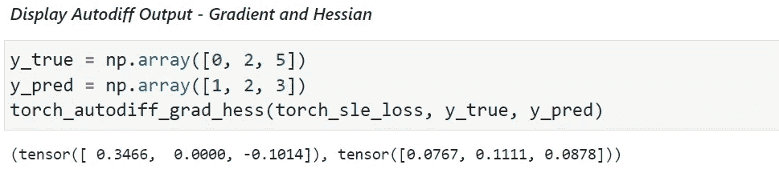
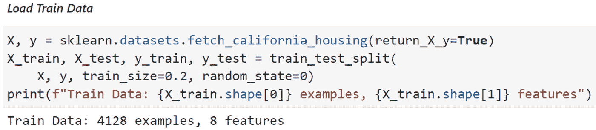
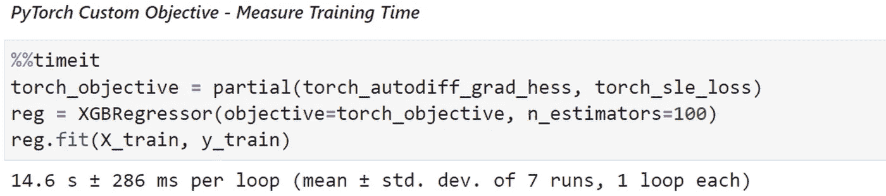
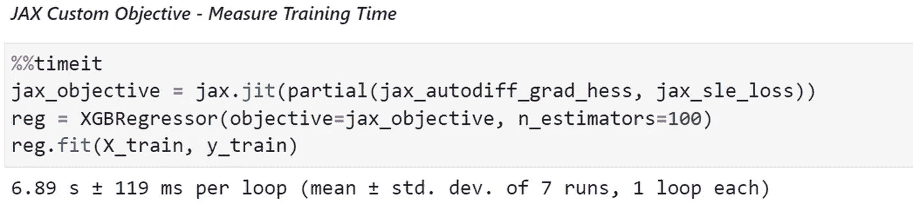

# JAX vs py torch:XGBoost 的自动微分

> 原文：<https://towardsdatascience.com/jax-vs-pytorch-automatic-differentiation-for-xgboost-10222e1404ec>

## 执行快速损失函数原型，以充分利用 XGBoost 的灵活性

马特·阿特兹在 [Unsplash](https://unsplash.com?utm_source=medium&utm_medium=referral) 上拍摄的照片

## 动机

在某些应用中，使用**自定义损失函数运行 XGBoost 可以大大提高**分类/回归**性能**。在时间紧迫的研究环境中，能够快速测试许多不同的损失函数是关键。因此，*手动微分*并不总是可行的(有时甚至容易出现人为错误，或数值不稳定)。

*自动微分*允许我们自动得到一个函数的导数，给定它的计算。它通过将我们的函数表示为具有已知导数的函数的组合来实现这一点，不需要开发人员付出任何努力。

我们将从一个简短的介绍开始，澄清我们的问题。然后，我们将深入研究用 PyTorch 和 JAX 实现自动微分，并将其与 XGBoost 集成。最后，我们将执行运行时基准测试，并展示对于此应用， **JAX 比 PyTorch** 快大约 10 倍。

## 背景

梯度推进是机器学习算法的框架。它基于弱学习器的集合(通常是决策树)输出预测。弱学习器可以根据任意的可微分损失函数进行优化，这给了我们很大的灵活性。我们将把重点放在决策树作为弱学习器的情况上——梯度增强决策树(GBDT)。

在神经网络缺乏的任务中，例如，表格数据和小训练集，GBDTs 表现出最先进的性能。

XGBoost 是一个有效实现 GBDT 的流行库。它提供了一个简单的[接口](https://xgboost.readthedocs.io/en/stable/tutorials/custom_metric_obj.html)，用于为我们的决策树编写定制的损失函数。给定一个定制的损失函数，我们所要做的就是向 XGBoost 提供其梯度和 Hessian 的计算结果。让我们看看如何在几分钟内实现自动微分。

## 问题设置

我们将在[加州住房数据集](https://scikit-learn.org/stable/datasets/real_world.html#california-housing-dataset)上运行我们的实验，这是一个预测房价的回归任务。

我们的损失函数将是对数误差的平方(SLE):

请注意，这种损失对预测不足估计的影响大于预测过高估计。在预测房价时，它可以反映真实的业务需求，我们可以通过选择自定义损失函数来实现。

让我们将其应用于 XGBoost。

## 用 PyTorch 自动计算黑森数

在下文中，我们将重点关注与 PyTorch 的合作，因为这一点很清楚——稍后将与 JAX 进行比较。

使用 PyTorch 计算梯度是神经网络编程中常见的工作。然而，我们很少需要计算赫斯安数。谢天谢地，PyTorch 为我们实现了一个方便的功能`[torch.autograd.functional.hessian](https://pytorch.org/docs/stable/generated/torch.autograd.functional.hessian.html)`。在涵盖了这些技术细节后，我们可以开始实施了。

首先，我们实现了我们的损失函数:

接下来，我们的自动微分:

将它们放在一起:

**图 1:**PyTorch-实体模型数据自动区分演示。

运行在真实世界的数据上:

**图 2:** 加载列车数据并显示汇总。

**图 3:** PyTorch —对现实世界数据进行自动区分的运行时性能(图 2 中加载)。

这给了我们一个使用 PyTorch 自动区分的简单工作实现。然而，该代码不能很好地扩展到大型数据集。因此，在下一节中，我们将展示一种更复杂的方法来改进我们的运行时。

## 使用 JAX 优化运行时性能

如果我们正确使用 JAX，我们可以实现相当大的运行时加速。让我们在 JAX 从上面写下 PyTorch 代码:

我们将损失计算变更为使用`jax.numpy`(进口为`jnp`),

并在 JAX 使用相应的语法进行自动区分，

根据前面的数据，与 PyTorch 实现(图 3)相比，我们看到了约 2 倍的加速:

**图 4:** JAX —对现实世界数据进行自动区分的运行时性能。

请注意，我们使用 [JAX 的《自动烹饪书》](https://jax.readthedocs.io/en/latest/notebooks/autodiff_cookbook.html#hessian-vector-products-using-both-forward-and-reverse-mode)中的`hvp`(黑森矢量积)函数来计算黑森对角线。只有当 Hessian 是对角的(所有非对角条目都为零)时，这个技巧才可能实现，这在我们的例子中是成立的。这样，我们就不会存储整个 hessian，并动态计算它，从而减少内存消耗。

然而，最显著的加速是由于通过“正向-反向微分”对 Hessian 的有效计算。技术细节超出了这篇文章的范围，你可以在 [JAX 的自学食谱](https://jax.readthedocs.io/en/latest/notebooks/autodiff_cookbook.html#hessian-vector-products-using-both-forward-and-reverse-mode)中读到。

此外，我们利用 JAX 的 JIT 编译来进一步减少运行时间，减少了大约 3 倍。

## 运行时性能基准

让我们对运行时性能进行更彻底的比较。

**图 5:** 运行时基准测试结果:JAX 比 PyTorch 快。

我们注意到 PyTorch 实现具有二次运行时复杂度(在示例数量中)，而 JAX 实现具有**线性**运行时复杂度。这是一个巨大的优势，允许我们在大型数据集上使用 JAX 实现。

现在，让我们比较自动微分和手动微分:

**图 6:** 运行时基准测试结果:手动微分比 JAX 快。

事实上，相比之下，手动区分速度非常快(快 40 倍)。然而，对于复杂的损失函数或小数据集，自动微分仍然是工具箱中一项有价值的技能。

该基准测试的完整代码可在此处找到:

 [## GitHub - 1danielr/auto-gb:梯度增强决策树的自动微分。

### 此时您不能执行该操作。您已使用另一个标签页或窗口登录。您已在另一个选项卡中注销，或者…

github.com](https://github.com/1danielr/auto-gb) 

## 结论

我们利用自动微分的能力无缝地使用 XGBoost 中的定制损失函数，并对运行时性能进行了可行的折衷。当然，上面的代码也适用于其他流行的梯度增强库，如 LightGBM 和 CatBoost。

我们看到 JAX 为我们提供了实质性的速度提升，这要归功于它对 Hessian 的高效实现，以及对 JIT 编译的透明利用。此外，我们列出了几行代码，允许我们一般地计算梯度和 Hessians。也就是说，我们的方法可以推广到需要高阶自动微分的额外工作负载。

感谢阅读！我很想听听你的想法和评论😃