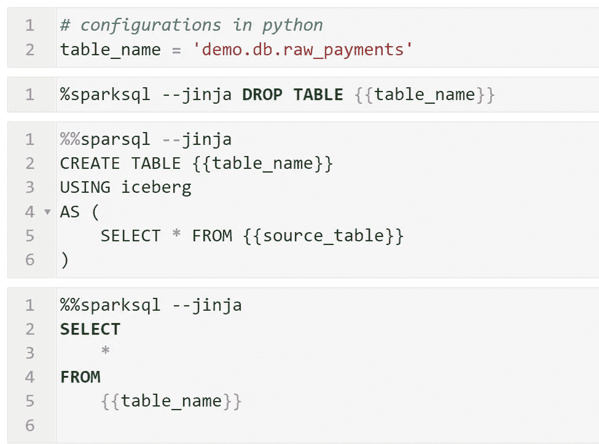
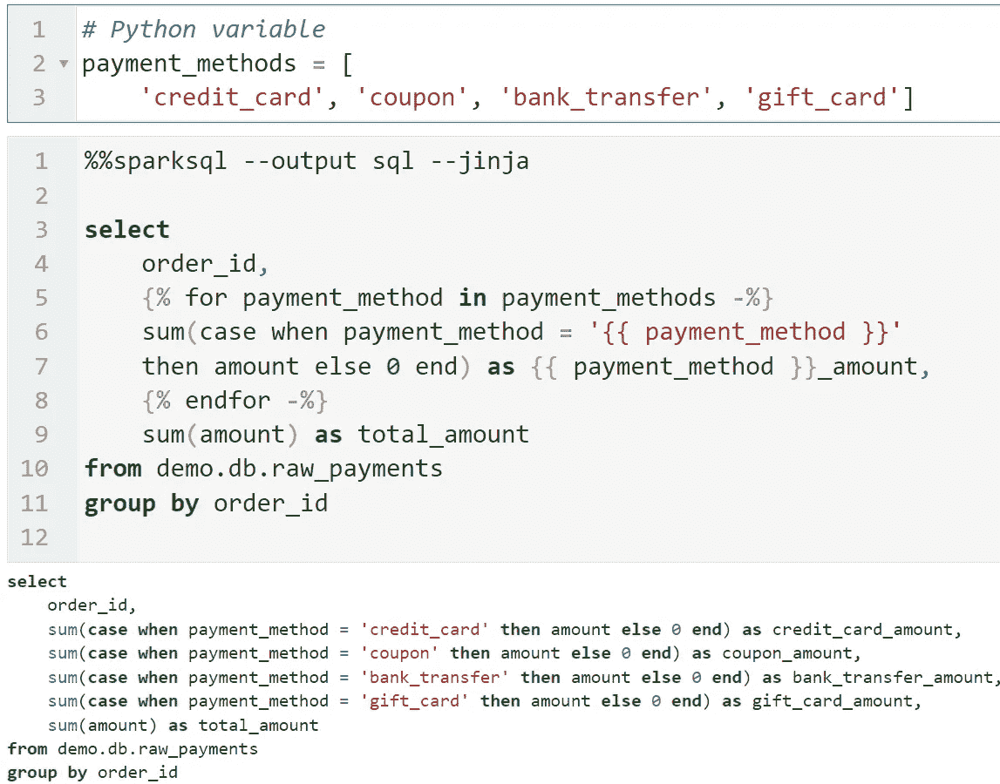
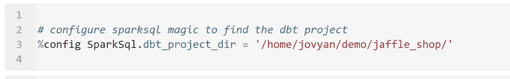
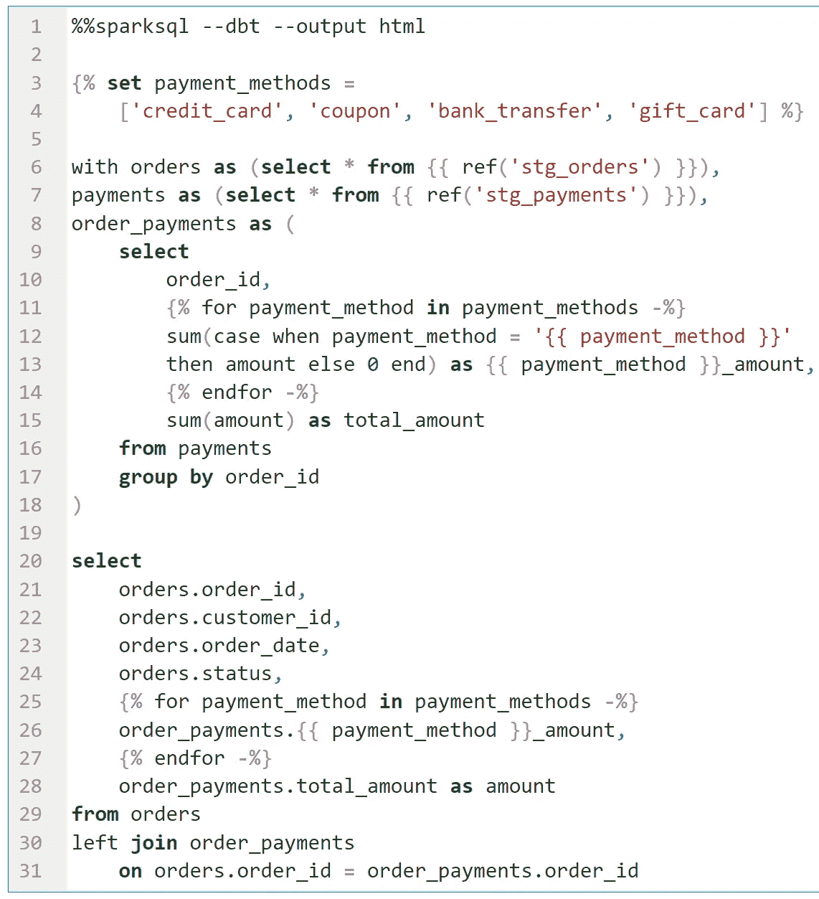
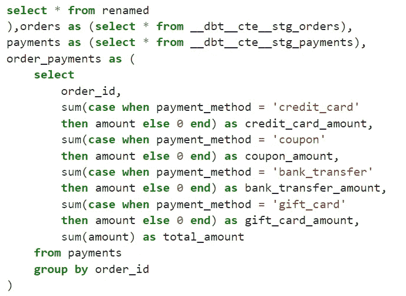
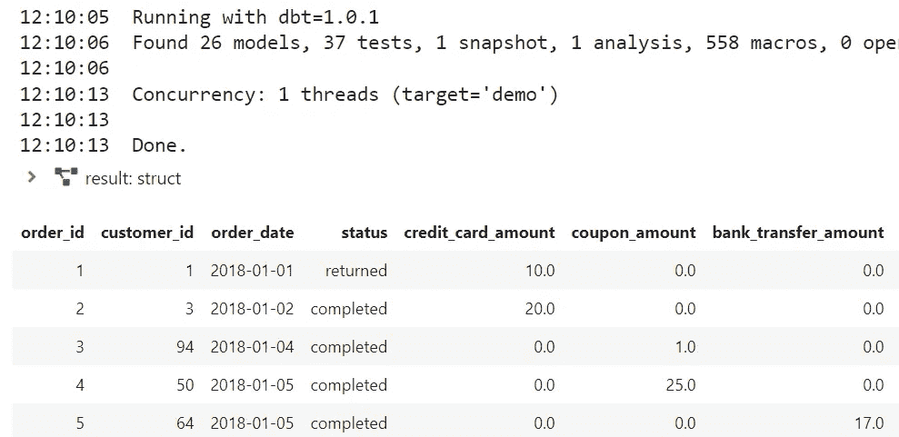
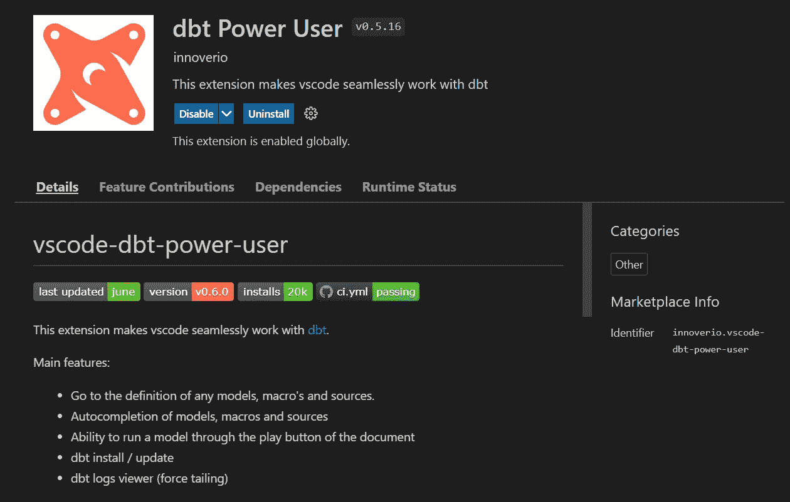
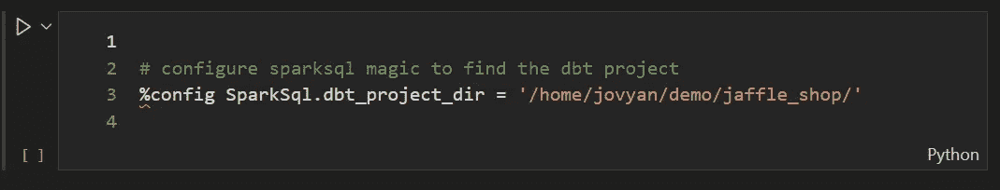
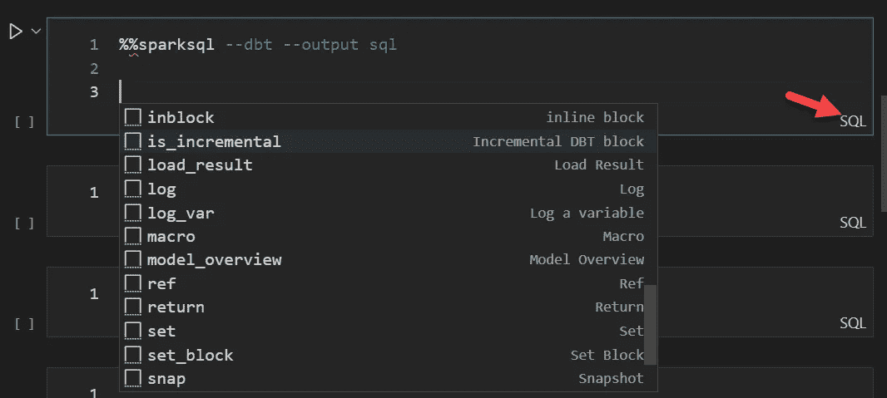
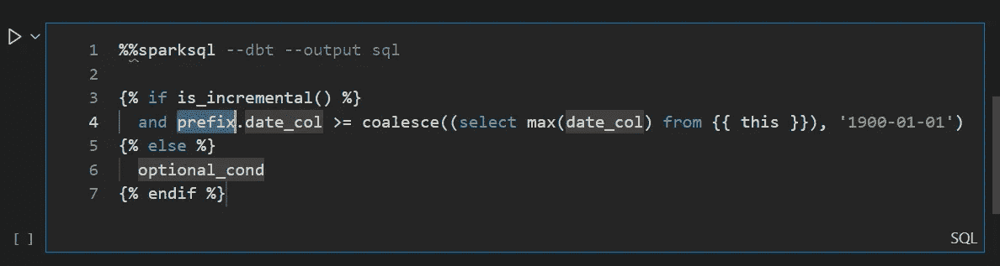

# JupyterLab/VSCode 中的金贾/DBT SQL 模板

> 原文：<https://towardsdatascience.com/jinja-dbt-sql-templating-in-jupyterlab-vscode-1179e818fe17>

## 快速原型化您的 SQL 模板


乔安娜·科辛斯卡在 Unsplash 上的照片

SQL 本身并不适合重用。为了实现可重用性，SQL 通常使用像 Jinja 这样的库进行模板化。例如 [Apache 超集](https://superset.apache.org/)在其数据集定义中利用了 Jinja 模板，当然 [DBT](https://www.getdbt.com/product/what-is-dbt/) 是一个完全围绕 Jinja 模板构建的工具。Jupyterlab-sql-editor 本机支持 Jinja 模板，这使得在 Jupyterlab 和 VSCode 中为超集和 DBT 构建 jinja-sql 模板原型成为可能。

## 使用 Jinja 模板创建可重用的 SQL

`**--jinja**`选项启用了 Jinja 模板支持，使得笔记本中声明的任何变量或函数都可以在 Jinja 标签`**{{}}**`中替换

例如，您可以使用变量来表示 SQL 语句中使用的实际表名。当您拥有用于开发和生产表的数据库模式时，这可能会很有用。



在我们的[上一篇文章](https://medium.com/p/e6ac865b42df)中，我们看到`**%%sparksql**`魔术支持许多输出格式；文本，交互式网格，交互式 JSON 树，html，skip。这个`**%%sparksql**`魔术还有一个锦囊妙计！原谅我的双关语。

`**--output sql**`选项用语法高亮显示结果 SQL 语句。这是一种验证你的 Jinja 模板代码的便捷方式。在这个例子中，我们使用 python 列表变量来自动生成 SELECT 语句。



正如我们所看到的，Jinja `****`已经生成了所需的列。

## 挖掘 DBT 的力量

使用 Jinja 模板来自动生成 SQL 语句是非常强大的，事实上整个项目都是围绕这个想法构建的。 [DBT](https://www.getdbt.com/product/what-is-dbt/) 是一个使用 SELECT 语句开发模块化 SQL 模型的框架，包括一个`**ref()**` Jinja 宏，用于处理依赖性管理(首先构建哪些模型)。

DBT 包含了大量的 Jinja 宏，旨在简化 SQL 语句的阐述。DBT 有一个包管理系统，允许第三方开发者贡献宏库。在 [DBT 中心](https://hub.getdbt.com/)有很多

通过简单地将`**--jinja**`替换为`**--dbt**`选项，并在笔记本上配置您的 DBT 项目的位置，magic 使您能够利用丰富的宏。我们将使用示例项目 [jaffle_shop](https://github.com/dbt-labs/jaffle_shop) 来说明 DBT 的使用。



在 jaffle_shop 中有一个名为 [orders.sql](https://github.com/dbt-labs/jaffle_shop/blob/main/models/orders.sql) 的模型。我们可以将这个文件的内容放在 Jupyter 单元格中，并使用`**--dbt**`通过 DBT 处理模板。我们可以使用`**—-output sql**`来呈现语句，使用`**--output html**`来执行查询并显示结果。



注意 DBT `**ref()**`宏的使用。该宏引用了您的 DBT 项目中现有的 DBT 模型。`**%%sparksql**`实际上使用了 DBT 框架来呈现 SQL 模板。所有的 DBT 模型和宏都提供给`**%%sparksql**` magic。

我们可以呈现 DBT 生成的 SQL。输出很长，我们只展示了其中的一部分。注意产生预期列的`payment_method`循环。还要注意 DBT 处理短暂模型具体化的方式。更多详情[此处](https://docs.getdbt.com/docs/building-a-dbt-project/building-models/materializations#ephemeral)。



如前所述，我们可以执行并显示结果。在显示实际结果之前，请注意 DBT 日志输出。



使用`**%%sparksql**`是构建 DBT 代码原型的一种便捷方式。我们已经用一个预先存在的模型说明了 DBT 的使用。要从头开始创建 DBT 模型，您可能只想显示现有表(DBT 数据源)或预先存在的 DBT 模型的数据。假设您想要创建一个基于`**stg_payments**`的新模型。你可以从展示`**stg_payments**`的数据开始

```
**%%sparksql** --dbt --output htmlselect * from {{ ref('stg_payments') }}
```

然后使用 DBT 的 Jinja 宏开始转换这个数据集。同时查看结果输出或呈现 SQL。

```
**%%sparksql** --dbtselect
    order_id,
    
    sum(case when payment_method = '{{ payment_method }}'
    then amount else 0 end) as {{ payment_method }}_amount,
    
    sum(amount) as total_amount
from {{ ref('stg_payments') }}
group by order_id
```

一旦您有了一个很好的模板化查询，您可以通过简单地将模板复制到 DBT `**.sql**`模型文件中来将它转移到生产环境中，并且确信它实际上会做您期望它做的事情。

## Visual Studio 代码 DBT 高级用户

[DBT 电力用户](https://github.com/innoverio/vscode-dbt-power-user)是 DBT 项目的一个流行的 VSCode 扩展。它支持您的`**.sql**`模型文件的许多 DBT 自动完成特性。



Visual Studio 代码原生支持使用 Jupyter 笔记本，因此`%%sparksql`魔法在 VSCode 内部工作。如前所示，要在笔记本中利用 DBT 项目，你需要做的就是把你的 DBT 的位置给`**%%sparksql**`



一旦笔记本单元格的语言被设置为 SQL，DBT 超级用户的自动补全功能就会启动，你将获得与编辑`**.sql**`文件相同的好处。请注意，如果您在 VSCode 中安装了 [sql-language-server](https://github.com/joe-re/sql-language-server) ，它会在检测到带有`**%%sparksql**`魔法的单元格时自动将语言更改为 sql。



记住，在 JupyterLab 中，VSCode 自动完成是由<ctrl-space>而不是<tab>触发的。</tab></ctrl-space>



例如，如果我们选择上面显示的`**is_incremental**`建议，我们会将以下代码插入到我们的笔记本单元格中。与 DBT 超级用户在`**.sql**`模型文件中的行为相同。

底线是`**%%sparksql**` magic 在 VSCode 和 JupyterLab 笔记本上的工作方式是一样的。您可以将 DBT 模型渲染到 SQL 中，执行查询并查看结果。类似地，VSCode 笔记本也是制作 DBT 模型原型的好方法。一旦你对你的模型感到满意，你可以把它复制到一个`**.sql**`模型文件中。

# 结论

在本文中，我们展示了如何利用`**%%sparksql**`在 JupyterLab 和 VSCode 中轻松构建模板化的 Spark SQL 原型。我们关注的是 Spark，但是 jupyterlab-sql-editor 也包含了一个`**%%trino**`魔法！将来可能会添加更多的 SQL 引擎。欢迎投稿！这是我们的 git repo[cyber centre Canada/jupyterlab-SQL-editor](https://github.com/CybercentreCanada/jupyterlab-sql-editor)。