# Python 的 Seaborn 抖动图

> 原文：<https://towardsdatascience.com/jitter-plots-with-pythons-seaborn-62188bf511b8>

## 显示分类变量分布的一种简单方法

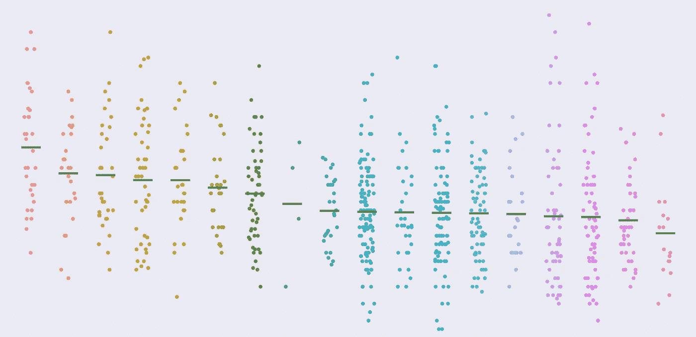

抖动图—图片由作者提供

没有太多的选项来可视化数值在类别中的分布。通常，这些关系需要在展示之前进行总结。

箱线图和小提琴图，包括最大值和最小值、中间值和百分位数，可以帮助可视化这些分布。但是它们可能会让许多观众望而生畏，并使试图展示的内容过于复杂。

本文将使用 Python 的 Seaborn 探索抖动图，这是一种简单且用户友好的可视化分类字段分布的方法。

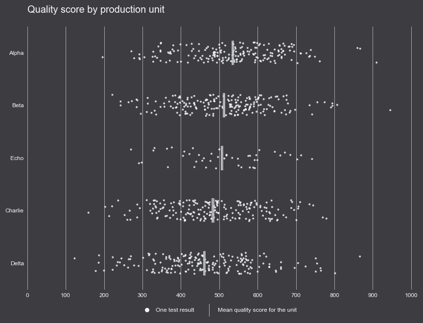

抖动图—图片由作者提供

## 带状图

让我们从导入库和加载一些虚拟数据开始。数据集包括一个类别列和一个数值列。

```
import pandas as pd
import numpy as np
import matplotlib.pyplot as plt
import seaborn as sns# dataurl = 'https://gist.githubusercontent.com/Thiagobc23/0bc5c5f530e8f8fd98710fe1ccb407ce/raw/4e084668a83ab9d0a0ace1425742835a0563bcef/quality.csv'df = pd.read_csv(url)
df_unit = df.groupby('Unit').mean().reset_index()# sort prod units by avg score
df_unit = df_unit.sort_values('Quality Score', ascending=False)# take a look
print('Dataset: \n', df.head())
print('\n Averages: \n', df_unit.head())
```

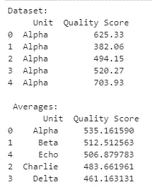

样本数据—作者提供的图片

好的，如果我们尝试用散点图来绘制这些值，我们会得到一个带状图。

```
plt.scatter(df['Unit'], df['Quality Score'])
```

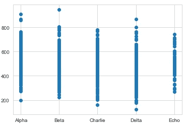

带状图—作者图片

虽然我们可以从这个图表中获得一些信息，例如值的范围，但这里的问题是许多点重叠，我们无法获得分布的清晰图像。

我们有两种主要方法来解决这个问题:[计数图](https://datavizproject.com/data-type/counts-plot/)和抖动图。

第一种尝试通过编码大小来解决重叠问题。记录密度较高的点用较大的点绘制。

第二种更直观，在 x 位置添加随机抖动，同时保持类别之间的一定距离。这使得它看起来更像一个列，而不是一条线，并允许我们看到点和它们集中的地方。

## 抖动图基础

Seaborn 的带状图已经添加了这种抖动，所以我们只需要调用函数，瞧！

```
sns.stripplot(y="Quality Score", x="Unit", data=df)
```

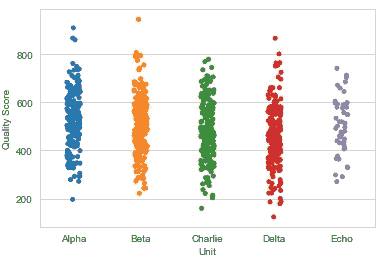

简单抖动图—图片由作者提供

```
sns.stripplot(y="Unit", x="Quality Score", data=df)
```

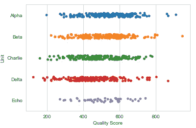

简单抖动图—图片由作者提供

相当简单，现在我们可以对其进行改进，使其信息量更大，更易于阅读。我们将添加一条线来标记每组的平均值，在 y 轴上对类别进行排序，并在底部添加一个图例。

## 增加价值

我们可以用另一个散点图显示每个类别的平均值。这一次，我们将使用管道符号(|)作为标记，而不是点。

我们还将传递参数顺序，根据组的平均值对类别进行排序。

```
**# list with ordered categories
order = df_unit['Unit']****fig, ax = plt.subplots(1, figsize=(12,10))**# Plot lines for the average
**sns.scatterplot(y="Unit", x="Quality Score", data=df_unit, marker='|', s=1000, color='k')**# Jitter plot
sns.stripplot(y="Unit", x="Quality Score", data=df, **order=order**, **zorder=0**)
```

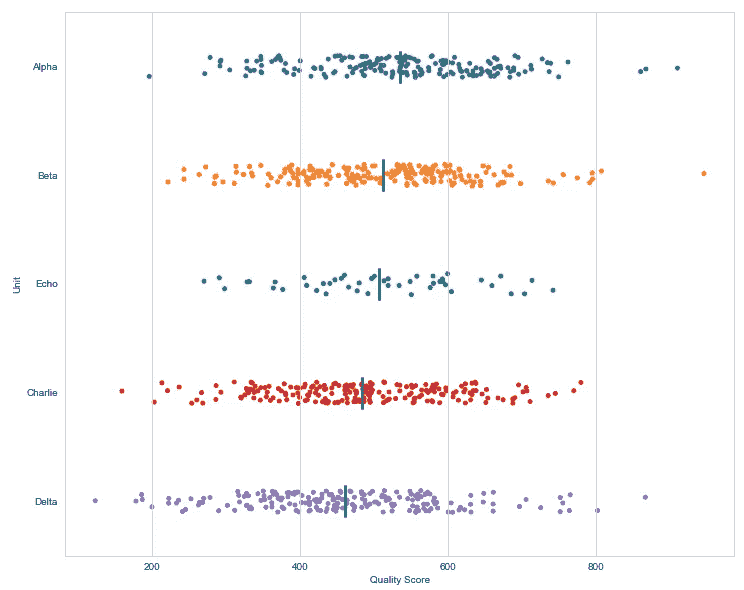

抖动图—图片由作者提供

接下来，我们将添加图例。我们没有任何好的房地产，所以我们将这个数字一分为二，并在底部有一个传奇的支线剧情。

```
**from matplotlib.lines import Line2D**fig, (ax, ax_leg) = plt.subplots(**2**, figsize=(12,10), **gridspec_kw={'height_ratios':[6, 1]}**)# Plot lines for the average
sns.scatterplot(y="Unit", x="Quality Score", data=df_unit, marker='|', s=1000, color='k', ax=ax)# Jitter plot
sns.stripplot(y="Unit", x="Quality Score", data=df, order=order, zorder=0, ax=ax)# Custom Legend
**legend_elements = [Line2D([0], [0], marker='o', color='w', 
                          label='One test result', 
                          markerfacecolor='k', markersize=10),
                   Line2D([0], [0], marker='|', color='k', 
                          label='Mean quality score for the unit', 
                          linestyle='None', markersize=25)]****legend = ax_leg.legend(handles=legend_elements, loc='upper center', 
                       ncol=2, frameon=False, fontsize=12)**
```

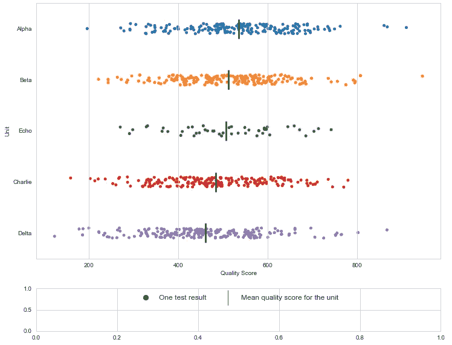

抖动图—图片由作者提供

好吧！一切似乎都已就绪。现在唯一剩下的就是清理干净。

```
fig, (ax, ax_leg) = plt.subplots(2, figsize=(12,10), gridspec_kw={'height_ratios':[6, 1]})# Plot lines for the average
sns.scatterplot(y="Unit", x="Quality Score", data=df_unit, marker='|', s=1000, color='k', ax=ax)# Jitter plot
sns.stripplot(y="Unit", x="Quality Score", data=df, order=order, zorder=0, ax=ax)# custom Legend
legend_elements = [Line2D([0], [0], marker='o', color='w', 
                          label='One test result', 
                          markerfacecolor='k', markersize=10),
                   Line2D([0], [0], marker='|', color='k', 
                          label='Mean quality score for the unit', 
                          linestyle='None', markersize=25)]legend = ax_leg.legend(handles=legend_elements, loc='upper center', 
                       ncol=2, frameon=False, fontsize=12)**ax_leg.set_xticks([])
ax_leg.set_yticks([])****# remove spines
sns.despine(fig, left=True, top=True, right=True, bottom=True)****# title and labels
ax.set_title('Quality score by production unit\n', loc='left', fontsize=20)
ax.set_xlabel('')
ax.set_ylabel('')****# make it tight (:
plt.tight_layout()**
plt.show()
```

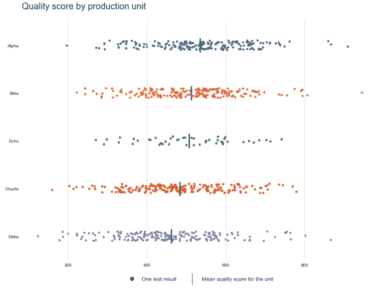

抖动图—图片由作者提供

在示例中，更明显的是，Echo 没有那么多数据点，Alpha、Beta、Charlie 和 Delta 中存在异常值，总体而言，这些值集中在一个类似的范围内。我们无法通过平均值或中值看到那些有价值的见解。

## 结论

汇总统计对于理解大量或复杂的数据集非常有用。平均值、中间值、百分位数等通常比共享整个数据集更容易交流。这些聚合的缺点是，生成的值经常会被查看者误解，尤其是那些不熟悉数据或主题的查看者。


按类别显示平均值的条形图-作者提供的图像

用户可能会将上面的图表理解为“Alpha”比其他人有更好的分数。事实是，我们无法从这张图表中看出这一点。记录数、异常值和方差等变量在平均值中起作用。

因此，为了传达这些数字背后的整个故事，我们需要一个熟悉这个主题的观众，注释所有这些潜在的因素，或者显示组成这个平均值的分数的实际分布。

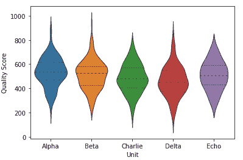

[小提琴情节](https://seaborn.pydata.org/generated/seaborn.violinplot.html#seaborn.violinplot) —作者图片

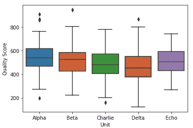

[盒子剧情](https://seaborn.pydata.org/generated/seaborn.boxplot.html#seaborn.boxplot) —图片由作者提供

小提琴图和箱形图是描述分布的最佳选择。但是，由于我们生活在注意力经济中，有一个友好的，更简单的替代方案，如抖动图是很好的。

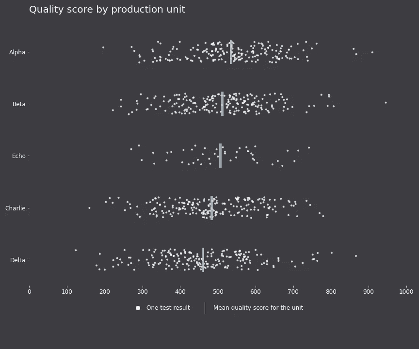

[抖动图—完整代码](https://gist.github.com/Thiagobc23/0bc5c5f530e8f8fd98710fe1ccb407ce)

抖动图可以增加价值，而不会让观众不知所措或导致他们做出错误的假设。

用户可以看到每个数据点，并理解这些数据。在这种情况下，我们可以看到，即使平均值不同，也不仅仅是“阿尔法比其他人做得更好”。

感谢阅读我的文章！你可以在这里找到更多类似的教程:[https://linktr.ee/thiagobc23](https://linktr.ee/thiagobc23)