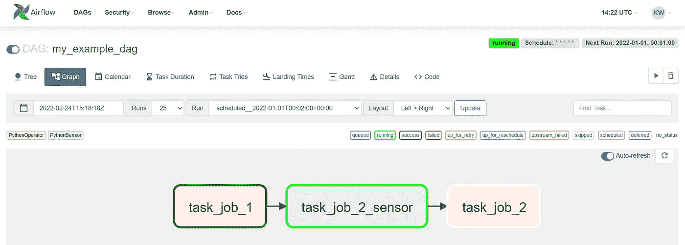
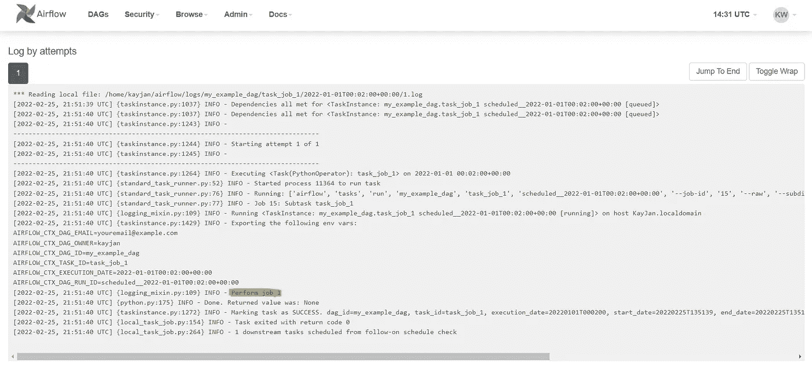

# 使用 Apache AirFlow 2.0 在 10 分钟内完成作业调度

> 原文：<https://towardsdatascience.com/job-scheduling-with-apache-airflow-2-0-in-10-minutes-16d19f548a46>

## 简化工作流管理系统——用 Python 示例解释


照片由[法鲁尔·阿兹米](https://unsplash.com/@fahrulazmi?utm_source=medium&utm_medium=referral)在 [Unsplash](https://unsplash.com?utm_source=medium&utm_medium=referral) 上拍摄

Apache Airflow 是 Airbnb 打造的工作流管理系统。通俗地说，它可以被认为是一个打了兴奋剂的作业调度器*。如果您有应该按计划运行或按顺序运行的 Python 脚本，Apache Airflow 是一个方便而可靠的工具，可以处理这些问题，甚至更多。Apache Airflow 有 4 个组件:元数据数据库、调度器、执行器和 Web 服务器。本文将涉及 Apache Airflow 中使用的组件和术语，如何设置和使用 Apache Airflow 的 Python 示例，以及如何启动 Apache Airflow Web 服务器。*

****注*** : Apache Airflow 只在 Linux 上运行，在 Windows 上可以通过 Docker 或者 WSL2 (Windows 子系统 for Linux)获得。*

****更新*** *:本文是系列文章的一部分。查看其他“10 分钟内”话题* [*此处*](https://medium.com/@kayjanwong/list/in-10-minutes-eeaa9aa67055) *！**

# *目录*

*   *[什么是阿帕奇气流](https://medium.com/p/16d19f548a46/#7ab2)*
*   *[什么是任务和 DAG](https://medium.com/p/16d19f548a46/#101b)*
*   *[安装气流](https://medium.com/p/16d19f548a46/#0b68)*
*   *[用 Python 使用气流](https://medium.com/p/16d19f548a46/#d4b3)*
*   *[启动网络服务器](https://medium.com/p/16d19f548a46/#7aec)*

# *什么是阿帕奇气流*

*Apache Airflow 是一个工作流管理系统，它将任务及其依赖关系定义为代码，并定期执行任务。它提供了一个 web UI，显示当前活动和过去任务的状态，以及关于任务执行的诊断信息。如果需要，用户还可以手动管理任务的执行和状态，使其自动化，但也允许人工干预。*

*气流有几个组成部分，即*

*   ***元数据数据库**:存储关于任务状态的信息*
*   ***调度器**:决定需要执行哪些任务以及执行优先级*
*   ***执行器**:执行任务逻辑的进程*
*   ***网络服务器**:支持向用户显示信息的图形用户界面(GUI)的服务器*

# *什么是任务和 DAG*

*任务被定义为一个工作单元，可以看作是运行脚本的 Python 作业。一个任务实例运行一个单独的任务，并有一个状态，如`running`、`success`、`failed`、`skipped`或`up for retry`等。*

*有两种类型的任务，即*

*   ***操作员**:执行操作。`PythonOperator`可以执行任何可以在 Python 中执行的函数，还有`BashOperator`、`EmailOperator`、`SimpleHttpOperator`等。取决于您的需求*
*   ***传感器**:暂停相关任务的执行，直到满足某个标准。传感器可以检查任何进程或数据结构的状态*

*这两类任务通常按`sensor > operator`顺序执行，其中传感器任务可以暂停操作员任务的执行，直到满足条件。*

*任务可以在有向非循环图(DAG)中链接起来执行。DAG 是一种有向图(任务执行有一个顺序)和无环图(任务不能形成一个永无止境的循环)。*

# *安装气流*

*Airflow 可以作为 Python 包安装，并使用以下命令实例化其数据库，*

```
*$ pip install apache-airflow
$ airflow db init*
```

*现在你已经准备好使用阿帕奇气流！*

# *通过 Python 使用气流*

*使用 Apache Airflow 有 3 个主要步骤。首先，您需要定义 DAG，指定脚本需要运行的时间表，在任务失败时向谁发送电子邮件，等等。接下来，您需要通过将任务链接到 Python 函数来定义操作员任务和传感器任务。最后，您需要定义任务之间的依赖关系，指定任务的顺序。*

*现在，让我们深入了解如何将 Apache Airflow 与 Python 结合使用！*

## *1.定义 DAG*

*要定义 DAG，它只是一个带有传入`default_args`的参数的`DAG`对象。有几个重要的参数需要定义，*

*   *`owner`:DAG 的所有者*
*   *`start_date`:运行 DAG 的开始日期，这必须是历史日期*
*   *`schedule_interval`:运行 DAG 的时间间隔，可以用`datetime.timedelta`或 [CRON schedule](https://crontab.guru/) 格式后的字符串定义*
*   *`email`:失败或重试时发送邮件的邮件地址*
*   *`retries`:重试次数*
*   *`retry_delay`:每次重试之间的延迟*

*更多参数可以在 Apache Airflow 文档中找到。下面是如何实例化 DAG 的示例，*

```
*import datetime

from airflow.models import DAG

# Parameteres
WORFKLOW_DAG_ID = "my_example_dag"
WORFKFLOW_START_DATE = datetime.datetime(2022, 1, 1)
WORKFLOW_SCHEDULE_INTERVAL = "* * * * *"
WORKFLOW_EMAIL = ["youremail@example.com"]

WORKFLOW_DEFAULT_ARGS = {
    "owner": "kayjan",
    "start_date": WORFKFLOW_START_DATE,
    "email": WORKFLOW_EMAIL,
    "email_on_failure": False,
    "email_on_retry": False,
    "retries": 0,
}
# Initialize DAG
dag = DAG(
    dag_id=WORFKLOW_DAG_ID,
    schedule_interval=WORKFLOW_SCHEDULE_INTERVAL,
    default_args=WORKFLOW_DEFAULT_ARGS,
)*
```

## *2.定义任务*

*任务应该链接到它们各自的 Python 函数。任务名称在`task_id`中指定，并且必须是唯一的，而 Python 函数是用`python_callable`参数指定的。*

*在下面的例子中，我定义了两个 Python 函数`job_1`和`job_2`，一个传感器的虚拟函数`sensor_job`，并将它链接到操作员和传感器任务。*

```
*from airflow.operators.python import PythonOperator
from airflow.sensors.python import PythonSensor

# Define functions
def job_1():
    print("Perform job 1")

def job_2():
    print("Perform job 2")

def sensor_job():
    print("Sensor Job")

# Define jobs
job_1_operator = PythonOperator(
    task_id="task_job_1",
    python_callable=job_1,
    dag=dag,
)

job_2_sensor = PythonSensor(
    task_id="task_job_2_sensor",
    python_callable=sensor_job,
    dag=dag,
    poke_interval=180,
)

job_2_operator = PythonOperator(
    task_id="task_job_2",
    python_callable=job_2,
    dag=dag,
)*
```

## *3.定义任务之间的相关性*

*定义了任务之后，我们需要定义任务运行的顺序。这可以使用具有惯例的位移算子`>>`来完成，*

*   *`preceding_task >> subsequent_task`，或者*
*   *`subsequent_task << preceding_task`*

*依赖性也可以用 Pythonic 代码来定义，*

*   *`preceding_task.set_downstream(subsequent_task)`，或者*
*   *`subsequent_task.set_upstream(preceding_task)`*

*就我个人而言，我更喜欢使用位移运算符，因为它可以堆叠，可读性更强。*

```
*# Set dependency
job_1_operator >> job_2_sensor >> job_2_operator*
```

*我把上面所有的代码放在目录`dags_folder/dag.py`里。务必使用`python3 dags_folder/dag.py`运行一次代码，检查是否有错误。完成后，将文件复制到`~/airflow/airflow.cfg`中定义的文件路径。或者，使用绝对路径将`airflow.cfg`文件改为指向您的`dags_folder`目录。*

```
*$ cp dags_folder/dag.py /home/kayjan/airflow/dags/*
```

# *启动 Web 服务器*

*在 Airflow Web 服务器上查看 DAG 之前，仍需要完成一些步骤。*

*首先，用户需要注册，因为 Airflow Web 服务器需要登录凭证。我们可以分别使用以下命令注册用户和删除用户，*

```
*$ airflow users create -r Admin -u <username> -p <password> -f <first_name> -l <last_name> -e <email>
$ airflow users delete -u <username>*
```

*接下来，启动气流调度程序。请注意，要使 DAG 按计划运行，气流调度程序必须正在运行。*

```
*$ airflow scheduler*
```

*通过运行`airflow dags list`命令检查您的 DAG 是否存在。可能有许多其他 Dag 是您现在可以忽略的示例 Dag。*

*最后，打开一个新的终端，用下面的命令启动 Web 服务器，*

```
*$ airflow webserver*
```

*在 Web 服务器上，可以以树形格式查看历史运行及其状态，或者以图形格式查看 DAG。还有其他信息，如 DAG 参数、DAG 代码、任务日志等。您可以使用右上角的播放按钮手动触发 DAG 运行。*

**

*图 1: Apache Airflow Web 服务器树选项卡(查看历史运行和状态)-按作者分类的图片*

**

*图 2: Apache Airflow Web 服务器图表选项卡(查看 DAG)-按作者分类的图像*

**

*图 3:作业 1 的任务日志——按作者分类的图像*

*希望你已经学习了 Apache Airflow 的基础知识，以及如何设置一个运行 Python 代码的 Airflow DAG。Apache Airflow 中有许多新的术语，可能会非常混乱。在这篇介绍之后，您应该能够更好地理解 Apache Airflow 文档、论坛或其他文章。*

*Apache Airflow 上还有更多的功能，比如用 Celery 或 Kubernetes Executors 以分布式方式运行任务，用 XCom 在操作员之间交换信息，用 hooks 定义自己的操作员和传感器。有需求的话可以出续集；)*

*最后，本文中共享的代码总结如下，*

***感谢您的阅读！**如果你喜欢这篇文章，请随意分享。*

# *相关链接*

*阿帕奇气流文件:【https://airflow.apache.org/ *

*阿帕奇气流教程:[https://air flow-Tutorial . readthedocs . io/en/latest/index . html](https://airflow-tutorial.readthedocs.io/en/latest/index.html)*

*阿帕奇气流官方 GitHub:[https://github.com/apache/airflow](https://github.com/apache/airflow)*