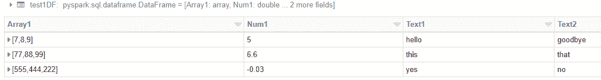
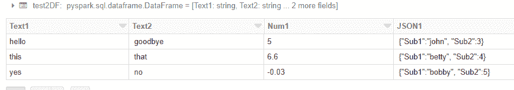
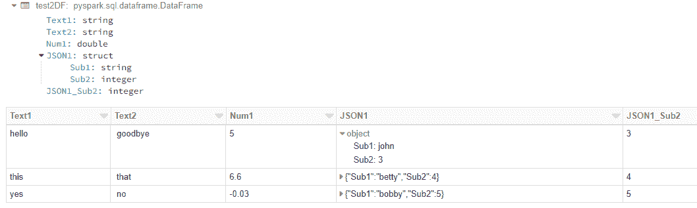
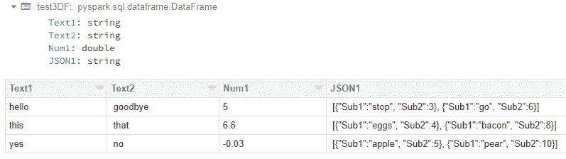

# Databricks 和 PySpark 中的 JSON

> 原文：<https://towardsdatascience.com/json-in-databricks-and-pyspark-26437352f0e9>

# Databricks 和 PySpark 中的 JSON

## 使用 PySpark 在数据块中处理 JSON 数据的技巧和诀窍


[法托斯 Bytyqi](https://unsplash.com/@fatosi?utm_source=medium&utm_medium=referral) 在 [Unsplash](https://unsplash.com?utm_source=medium&utm_medium=referral) 上的照片

在简单的情况下，JSON 很容易在 Databricks 中处理。您可以将 JSON 对象文件直接读入 DataFrame 或表中，Databricks 知道如何将 JSON 解析成单独的字段。但是，正如大多数与软件相关的事情一样，也存在一些问题和变化。本文展示了如何处理最常见的情况，并包括详细的编码示例。

我的用例是已经被转换成 JSON 的 HL7 医疗保健数据，但是这里的方法适用于任何 JSON 数据。考虑的三种格式是:

*   包含完整 JSON 对象的文本文件，每行一个。当您将 JSON 文件加载到 Databricks 表时，这是很典型的。
*   包含各种数据字段(列)的文本文件，其中一个是 JSON 对象。这在计算机日志中很常见，其中有一些纯文本元数据，后面是 JSON 字符串中的更多细节。
*   上述内容的变体，其中 JSON 字段是一个对象数组。

将每种类型的输入放入数据块需要不同的技术。

假设…

*   你能接触到数据块并知道基本操作。如果你是新手，试试免费的[社区版](https://community.cloud.databricks.com/login.html)。
*   我从 json.org 的[那里拿到 JSON 规范，用 jsonlint.com](http://json.org/)的[测试 JSON 对象的有效性。](https://jsonlint.com/)
*   我忽略[1，2，3]和“hello”之类的“裸 JSON”。按照规范，这些是完整的、有效的 JSON 对象，但是我认为它们的形式不好，因为这些字段没有名称，所以很难在下游使用。(Databricks 可以将这些视为普通的输入字段，而不关心它们是否是有效的 JSON。)

包含所有这些代码的完整 Databricks 笔记本位于[https://github . com/chuck connell/articles/blob/master/JSON _ tricks . DBC](https://github.com/ChuckConnell/articles/blob/master/json_tricks.dbc)。复制 URL，然后在 Databricks 中做 Workspace / Import / URL。

虽然这段代码是在 Databricks 中开发的，但它应该也可以在安装了 PySpark 的本机 Apache Spark 中工作，尽管我没有在那里测试过。

# 标准 JSON 对象

标准的 JSON 文本文件如下所示:

```
{ "Text1":"hello", "Text2":"goodbye", "Num1":5, "Array1":[7,8,9] }
{ "Text1":"this", "Text2":"that", "Num1":6.6, "Array1":[77,88,99] }
{ "Text1":"yes", "Text2":"no", "Num1":-0.03, "Array1":[555,444,222] }
```

要将这个文件读入 DataFrame，可以使用标准的 JSON 导入，它从提供的字段名和数据项中推断出模式。

```
test1DF = spark.read.json("/tmp/test1.json")
```

得到的 DataFrame 具有与 JSON 标记匹配的列，并且数据类型被合理地推断出来。(类型推断并不完美，尤其是对于 ints vs floats 和 boolean。)您现在可以只使用它们的普通名称来读取 DataFrame 列；所有的 JSON 语法都不见了。



作者图片

# 带有 JSON 字段的文本文件

包含一些常规字段和一个 JSON 字段的文本文件如下所示:

```
Text1|Text2|Num1|JSON1
hello | goodbye | 5 | {"Sub1":"john", "Sub2":3}
this | that | 6.6 | {"Sub1":"betty", "Sub2":4}
yes | no | -0.03 | {"Sub1":"bobby", "Sub2":5}
```

第一行包含字段名称，这是数据文本文件的标准。我使用竖线来分隔字段，以避免与 JSON 语法中的逗号混淆。(您可能也想这样做，因为 Databricks 文本解析器很难处理嵌入的逗号和引号的转义语法。)

要像这样导入文件，使用一个两阶段的过程，首先将 JSON 字段作为文本读取。注意，我使用“inferSchema ”,因为文件很小；对于大文件，您应该使用。schema(my_schema)哪个更快。

```
test2DF = spark.read\
.option("inferSchema", True)\
.option("header", True)\
.option("delimiter", "|")\
.csv("/tmp/test2.txt")
```

常规字段现在是正确的，JSON 字段是单个文本字符串。



作者图片

我们需要将 JSON 字符串转换成适当的结构，这样我们就可以访问它的各个部分。

```
from pyspark.sql.functions import from_json, col
from pyspark.sql.types import StructType, StructField, StringType, IntegerType# Define the schema of the JSON string.
schema = StructType([
  StructField("Sub1", StringType()), 
  StructField("Sub2", IntegerType()
  )
])# Use the schema to change the JSON string into a struct, overwriting the JSON string.test2DF = test2DF.withColumn("JSON1", from_json(col("JSON1"), schema))# Make a separate column from one of the struct fields.test2DF = test2DF.withColumn("JSON1_Sub2", col("JSON1.Sub2"))
```

现在我们得到了我们想要的——原来的非 JSON 字段，作为真正结构的 JSON 字段，以及提取一个 JSON 项的示例。



作者图片

# 带有 JSON 数组字段的文本文件

包含 JSON 对象数组字段的文本文件如下所示:

```
Text1|Text2|Num1|JSON1
hello | goodbye | 5 | [{"Sub1":"stop", "Sub2":3}, {"Sub1":"go", "Sub2":6}]
this | that | 6.6 | [{"Sub1":"eggs", "Sub2":4}, {"Sub1":"bacon", "Sub2":8}]
yes | no | -0.03 | [{"Sub1":"apple", "Sub2":5}, {"Sub1":"pear", "Sub2":10}]
```

我假设数组中的每个 JSON 对象都有相同的结构。当然，这并不是严格要求的，但是对于逻辑上相关并且在单个数组中的对象来说，这是可能的。

对于这种类型的 JSON 输入，以同样的方式开始，将常规字段读入它们的列，并将 JSON 作为纯文本字段。

```
test3DF = spark.read\
.option("inferSchema", True)\
.option("header", True)\
.option("delimiter", "|")\
.csv("/tmp/test3.txt")
```



作者图片

接下来，使用用户定义的函数(UDF)将 JSON 字符串更改为实际的结构数组。这种编码技巧归功于[https://kontext . tech/column/spark/284/py spark-convert-JSON-string-column-to-array-of-object-struct type-in-data-frame](https://kontext.tech/column/spark/284/pyspark-convert-json-string-column-to-array-of-object-structtype-in-data-frame)。

```
from pyspark.sql.functions import col, udf
from pyspark.sql.types import *
import json# Schema for the array of JSON objects.json_array_schema = ArrayType(
  StructType([
    StructField('Sub1', StringType(), nullable=False), 
    StructField('Sub2', IntegerType(), nullable=False)
  ])
)# Create function to parse JSON using standard Python json library.def parse_json(array_str):
  json_obj = json.loads(array_str)
  for item in json_obj:
    yield (item['Sub1'], item['Sub2'])# Create a UDF, whose return type is the JSON schema defined above. parse_json_udf = udf(lambda str: parse_json(str), json_array_schema)

# Use the UDF to change the JSON string into a true array of structs.test3DF = test3DF.withColumn("JSON1arr", parse_json_udf((col("JSON1"))))# We don't need to JSON text anymore.
test3DF = test3DF.drop("JSON1")
```

结构数组很有用，但是“反规范化”并将每个 JSON 对象放在自己的行中通常更有帮助。

```
from pyspark.sql.functions import col, explodetest3DF = test3DF.withColumn("JSON1obj", explode(col("JSON1arr")))# The column with the array is now redundant.
test3DF = test3DF.drop("JSON1arr")
```

注意，非 JSON 字段现在被复制到多行中，每行一个 JSON 对象。


作者图片

我们可以跨所有阵列从一个特定的 JSON 字段收集数据，这在展开的阵列上要容易得多。

```
display (test3DF.select("JSON1obj.Sub1"))
```

# 结论

JSON 是一种标记文本格式。它是一个可读的文件，包含名称、值、冒号、花括号和各种其他语法元素。另一方面，PySpark 数据帧是一种二进制结构，数据可见，元数据(类型、数组、子结构)内置于数据帧中。上面的说明帮助你把第一个翻译成第二个。

有关更多信息，请参见:

*   [https://kb . databricks . com/Scala/create-df-from-JSON-string-python-dictionary . html](https://kb.databricks.com/scala/create-df-from-json-string-python-dictionary.html)
*   [https://docs . databricks . com/data/data-sources/read-JSON . html](https://docs.databricks.com/data/data-sources/read-json.html)