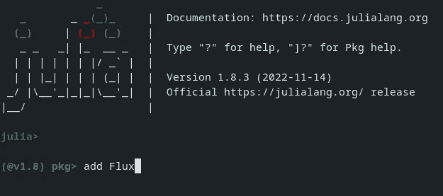

# Julia 的 Flux vs Python 的 TensorFlow:它们如何比较？

> 原文：<https://towardsdatascience.com/julias-flux-vs-python-s-tensorflow-how-do-they-compare-574a3fb5e059>

## 深度学习

## 端到端深度学习项目比较


第三人在[像素](https://www.pexels.com/)上拍摄的照片

**在我的** [**上一篇文章**](/is-julia-really-faster-than-python-and-numpy-242e0a5fe34f) **中，我研究了 Julia 在速度方面比 Python/Numpy 有什么优势。**

虽然知道这些很有用，但这并不是全部。了解它们在语法、库可用性/集成、灵活性、文档、社区支持等方面的比较也很重要。

**本文在 TensorFlow 和 Flux (Julia 的 native TensorFlow equivalent)两个方面从头到尾贯穿了一个图像分类深度学习问题。这应该很好地概述了这两种语言在一般用法上的比较，并有望帮助您深入了解 Julia 在这种情况下是否是您的潜在选择(或优势)。**

**我还将努力强调 Julia 生态系统与 Python 和 TensorFlow 的成熟组合相比的优势，以及更重要的差距或缺点。**

# 介绍

我特意为这个特殊的探索选择了一个图像分类问题，因为它在数据准备和深度学习框架本身方面都提出了一些很好的挑战:

1.  影像需要从磁盘加载(不会使用现成的数据集，如 MNIST)，因此将探索加载和预处理方法和惯例
2.  图像通常表示为 3D 矩阵(高度、宽度、颜色通道)，因此需要特别注意维度排序
3.  为了避免过度拟合，通常需要图像增强，以探索库的可用性和易用性
4.  就空间要求而言，图像本质上是一种“大”数据类型，这迫使我们对批处理、RAM 分配和 GPU 使用情况进行调查

**注意:** *虽然整篇文章中都提供了代码片段，但是 Jupyter 笔记本中包含了完整的端到端工作实现(从图片下载到模型训练),可以使用 Julia 和 Python 版本的代码。有关笔记本的链接，请参见下一部分。*

顺便说一句，如果这是你第一次听说朱莉娅，我推荐你读“什么是朱莉娅？”一节来快速入门:

[](/is-julia-really-faster-than-python-and-numpy-242e0a5fe34f)  

# 参考笔记本

本节详细介绍了笔记本的位置，以及在线环境的环境设置要求，如 [Colab](https://colab.research.google.com/) 和 [Deepnote](https://deepnote.com/) 。

## 笔记本

可以在此处找到适合您本地环境的原始笔记本:

[](https://github.com/thetestspecimen/notebooks/tree/main/julia-python-image-classification)  

…或者在 deepnote 或 colab 中快速启动。

Python 笔记本:

[](https://deepnote.com/launch?url=https%3A%2F%2Fgithub.com%2Fthetestspecimen%2Fnotebooks%2Fblob%2Fmain%2Fjulia-python-image-classification%2Frps_python_tensorflow.ipynb)[](https://colab.research.google.com/github/thetestspecimen/notebooks/blob/main/julia-python-image-classification/rps_python_tensorflow.ipynb)

朱莉娅笔记本:

[](https://deepnote.com/launch?url=https%3A%2F%2Fgithub.com%2Fthetestspecimen%2Fnotebooks%2Fblob%2Fmain%2Fjulia-python-image-classification%2Frps_julia_flux.ipynb)[](https://colab.research.google.com/github/thetestspecimen/notebooks/blob/main/julia-python-image-classification/rps_julia_flux_colab.ipynb)

## Julia 的环境设置

**深度笔记**

由于 deepnote 使用了 docker 实例，你可以很容易地建立一个“本地”docker 文件来包含 Julia 的安装说明。这意味着你不必像在 Colab 中那样用安装代码污染 Jupyter 笔记本。

在环境部分选择“本地”。/Dockerfile "。这将打开实际的 docker 文件，您应该在其中添加以下内容:

```
FROM deepnote/python:3.10

RUN wget https://julialang-s3.julialang.org/bin/linux/x64/1.8/julia-1.8.3-linux-x86_64.tar.gz && \
    tar -xvzf julia-1.8.3-linux-x86_64.tar.gz && \
    mv julia-1.8.3 /usr/lib/ && \
    ln -s /usr/lib/julia-1.8.3/bin/julia /usr/bin/julia && \
    rm julia-1.8.3-linux-x86_64.tar.gz && \
    julia  -e "using Pkg;pkg\"add IJulia\""

ENV DEFAULT_KERNEL_NAME "julia-1.8"
```

你可以从[这个](https://julialang.org/downloads/)页面把上面的更新到最新的 Julia 版本，但是在我写作的时候 1.8.3 是最新的版本。

**Colab**

对于 colab，所有的下载和安装代码都必须包含在笔记本本身中，并且在安装代码运行后刷新页面。

幸运的是， [Aurélien Geron](https://github.com/ageron) 在他的 GitHub 上为 colab 的 Julia 提供了一个[入门笔记本](https://colab.research.google.com/github/ageron/julia_notebooks/blob/master/Julia_Colab_Notebook_Template.ipynb)，这可能是最好的入门方式。

**注意:** *如果你使用上面的“在 colab 中打开”按钮(或者我链接的库中以“Colab”结尾的 Julia 笔记本)，我已经在 Julia 笔记本中包含了这个起始代码。*

# 数据

本文中使用的[数据](https://www.kaggle.com/datasets/drgfreeman/rockpaperscissors)是一组图像，描绘了游戏“石头剪子布”中手的三种可能位置组合。


来自[数据集](https://www.kaggle.com/datasets/drgfreeman/rockpaperscissors)三个不同类别的四个例子。作者合成图像。

每个图像都是 PNG 类型，尺寸为 300(宽)像素 x 200(高)像素，全彩色。

原始数据集总共包含 2188 幅图像，但是本文使用了一个更小的选择，它由三个类别中的每一个类别的 200 幅图像组成(总共 600 幅图像)。这主要是为了确保笔记本可以相对容易地运行，并且数据集是平衡的。

本文中使用的较小数据集可从以下网址获得:

[](https://github.com/thetestspecimen/notebooks/tree/main/datasets/rock_paper_scissors)  

# 这个计划

有两个独立的笔记本。一个是使用 TensorFlow 深度学习框架用 Python 编写的，另一个是用 Julia 编写的，利用了 Flux 深度学习框架。

这两个笔记本使用完全相同的原始数据，并将经历相同的步骤，最终得到一个经过训练的模型。

虽然不可能在两个笔记本之间精确匹配方法论(如你所料)，但我已经尽力让它们尽可能接近。

## 大纲

每个笔记本包括以下步骤:

1.  从远程位置下载图像数据，并提取到本地存储
2.  从本地文件夹结构加载图像以备处理
3.  查看图像数据，并查看样本图像
4.  将数据分成训练/验证集
5.  增强训练图像以避免过度拟合
6.  为模型准备图像(缩放等。)
7.  批量数据
8.  创建模型和相关参数
9.  火车模型(应该能使用 CPU 或 GPU)

# 比较—包装


在 [Unsplash](https://unsplash.com/s/photos/packages?utm_source=unsplash&utm_medium=referral&utm_content=creditCopyText) 上 [Leone Venter](https://unsplash.com/@fempreneurstyledstock?utm_source=unsplash&utm_medium=referral&utm_content=creditCopyText) 拍摄的照片

接下来的比较部分将探索 Julia 与 Python 实现的一些差异(好的或坏的)。通常会按照上一节中的要点进行细分。

## 软件包安装

首先，简单介绍一下软件包的安装和使用。

这两种语言遵循相似的模式:

1.  确保软件包安装在您的环境中
2.  将该包“导入”到您的代码中以使用它

唯一真正的区别是，Julia 既可以在运行代码之前在“环境”中安装包，也可以从代码内部安装包(如本文在 Julia 笔记本中所做的那样):

Julia 中的“Pkg”相当于 Python 中的“pip”，也可以从 Julia 的命令行界面访问。



使用命令行添加包的示例。作者截图

## 包装使用

就能够从代码中访问已安装的包而言，您通常会使用关键字“using”而不是 Python 中使用的“import”:

Julia 也有一个“导入”关键字。有关差异的更多详细信息，请查看[文档](https://docs.julialang.org/en/v1/manual/modules/#Standalone-using-and-import)。在大多数一般用例中，“使用”更合适。

**注意:** *在本文中，当引用模块中的方法时，我特意使用了完整路径，包括模块名。这不是必须的，它只是让我们更清楚地知道方法是从哪个包中被引用的。例如，这两个是等效的和有效的:*

```
using Random

Random.shuffle(my_array) # Full path

shuffle(my_array) # Without package name
```

# 比较—下载和提取


米格尔·Á的照片。[像素上的帕德里纳](https://www.pexels.com/)

图像数据以 zip 文件的形式远程提供。zip 文件包含三个类别的文件夹，每个文件夹包含 200 张图片。

第一步，下载并提取图像文件。这在两种语言中都相对容易，有了可用的库，在 Julia 中可能更直观。Python 实现:

Julia 实现**会是什么样子**会是什么样子:

```
using InfoZIP

download("https://github.com/thetestspecimen/notebooks/raw/main/datasets/rock_paper_scissors/rock_paper_scissors.zip","./rock_paper_scissors.zip")

root_folder = "rps"
isdir("./$root_folder") || mkdir("./$root_folder")

InfoZIP.unzip("./rock_paper_scissors.zip", "./$root_folder")
```

你可能会注意到，我说的是**它可能是什么样子**。如果你看一下笔记本，你会发现在 Julia 中，我实际上使用了一个自定义函数来进行解压缩，而不是使用上面详述的 [InfoZIP](https://juliapackages.com/p/infozip) 包。

原因是我无法在我使用的所有环境中安装 InfoZIP 包，所以我认为包含它是不公平的。

这是包装的问题吗？我想不会。我认为这可能是因为在线环境(colab 和 deepnote)主要不是面向 Julia 的，有时这会引起问题。InfoZIP 在本地安装并运行良好。

> 这是包装的问题吗？我想不会。

我还应该注意，在 colab 中使用 GPU 实例时使用“Plots”库(相当于 matplotlib)会导致安装失败！

这可能看起来相对微不足道，但它直接说明了在处理一种新的语言时可能会遇到的潜在问题。此外，由于社区较小，你不太可能在网上找到问题的解决方案。

仍然值得指出的是，当我在本地的计算机上工作时，我对这两个包都没有这样的问题，我希望随着时间的推移，在线环境如 colab 和 deepnote 可能会变得更加 Julia 友好。

# 比较—处理图像


[伊万·希姆科](https://unsplash.com/@iwnxx?utm_source=unsplash&utm_medium=referral&utm_content=creditCopyText)在 [Unsplash](https://unsplash.com/s/photos/photos?utm_source=unsplash&utm_medium=referral&utm_content=creditCopyText) 拍摄的照片

现在图像已经在本地环境中，可以看看我们如何加载它们并与之交互。

Python:

朱莉娅:

在前面的部分中，事情相对来说是相似的。现在事情开始出现分歧…

这个加载图像的简单示例突出了 Python 和 Julia 之间的一些明显差异，尽管从两个看起来相似的代码块中可能不会立即看出来。

## 零分度与一分度

一般来说，这两种语言的主要区别之一可能是，Julia 对数组和矩阵使用从 1 开始的索引，而不是从 0 开始。

Python —“随机 _ 图像”的第一个元素:

```
img = mpimg.imread(target_folder + "/" + random_image[0])
```

朱莉娅——“图像通道”形状的第一个要素:

```
println("Colour channels: ", size(img_channels)[1])
```

我可以理解这是一个有争议的差异。在现实中，这一切都归结于偏好，但抛开任何个人偏好，1-indexing 在数学上更有意义。

同样值得记住的是这种语言所针对的工作领域(即更多基于数学/统计的编程专业人员，而不是纯粹的程序员/软件工程师)。

不管你的立场如何，有一点是非常需要注意的，特别是如果你正在考虑将一个项目从 Python 移植到 Julia。

## 图像是如何加载和用数字表示的

当使用 python 和“imread”加载图像时，它们被加载到一个 numpy 数组中，其形状(高度、宽度、RGB 颜色通道)为 float32 数字。很简单。

在 Julia 中，图像被加载为:

```
Type: Matrix{RGB{N0f8}}
```

不太清楚…所以让我们稍微探讨一下。

> 在 JuliaImages 中，默认情况下，显示所有图像时假定 0 表示“黑色”，1 表示“白色”或“饱和”(后者适用于 RGB 图像的通道)。
> 
> 也许令人惊讶的是，**这种 0 到 1 的约定甚至在每个颜色通道仅使用 8 位对强度进行编码时也适用**。JuliaImages 使用一种特殊的类型`N0f8`，它将一个 8 位的“整数”解释为 1/255，从而以 256 步对 0 到 1 的值进行编码。
> 
> ——[Juliaimages.org](https://juliaimages.org/latest/tutorials/quickstart/)

事实证明，Julia 使用的这种奇怪的约定实际上对机器/深度学习非常有帮助。

在 Python 中处理图像时，您经常要做的事情之一是将值缩放 1/255，以便所有值都在 0 和 1 之间。这对于 Julia 是不必要的，因为缩放是由图像本身使用的“N0f8”类型自动完成的！

不幸的是，您在本文中看不到这种比较，因为图像是 PNG 类型的，而且 Python 中的 imread 无论如何都将数组作为 0 到 1 之间的浮点值返回(顺便说一下，这是它唯一支持的格式)。


迈克尔·马森在 [Unsplash](https://unsplash.com/s/photos/pixels?utm_source=unsplash&utm_medium=referral&utm_content=creditCopyText) 上的照片

然而，如果您要在 Python 中加载 JPG 文件，您将从 imread 接收 0 到 255 之间的整数值作为输出，并且必须在稍后的预处理管道中对它们进行缩放。

除了自动缩放，还有一点值得注意的是图像实际上是如何存储的。Julia 使用了将每个像素表示为一种对象的概念，因此如果我们查看输出类型和形状:

```
Type: Matrix{RGB{N0f8}}
Shape: (200, 300)
```

字面意思是 200x300 的矩阵。那三个颜色通道呢？我们期望 200x300x3，对吗？

嗯，Julia 将 200x300 矩阵中的每一项视为一个“像素”，在这种情况下，它有三个值，分别代表红色、绿色和蓝色(RGB)，如类型“ **RGB** {N0f8}”所示。我认为它就像一个对象矩阵，对象被定义为有三个变量。

然而，疯狂的背后是有原因的:

> 这种设计选择有利于通用代码处理灰度和彩色图像，而无需引入额外的循环或检查颜色维度。它还为 3d 灰度图像提供了更合理的支持——3d 灰度图像的尺寸可能恰好为 3——因此有助于统一“计算机视觉”和“生物医学图像处理”社区。
> 
> [-Julian images . org](https://juliaimages.org/latest/tutorials/quickstart/)

看起来这些决定是经过深思熟虑的。

然而，你不能将这种格式的图像输入到神经网络中，即使是 Flux 也不行，所以在以后的阶段需要将它分割成“合适的”3D 矩阵。正如你将看到的，事实证明这非常简单。

# 比较—数据准备管道


照片由 [JJ 英](https://unsplash.com/@jjying?utm_source=unsplash&utm_medium=referral&utm_content=creditCopyText)在 [Unsplash](https://unsplash.com/s/photos/pipeline?utm_source=unsplash&utm_medium=referral&utm_content=creditCopyText) 上拍摄

就易用性而言，这绝对是 Python 和 TensorFlow 击败 Julia 的领域之一。

## Python 实现

我可以或多或少地将我所有的图像加载到一个批量优化的数据集中，准备好投入到一个深度学习模型中，只需四行代码:

训练图像增强与模型层一样容易处理:

## Julia 实现

在 Julia 中实现同样的功能需要更多的代码。让我们加载图像，并将它们分成训练集和验证集:

我应该注意的是，在现实中，您可以删除该方法的“加载和缩放”以及“洗牌”部分，并在以后以更简洁的形式处理它，因此它并不像看起来那么糟糕。我主要把这些部分作为参考。

Python 和 Julia 之间一个有用的区别是，如果你愿意，你可以定义类型，但这不是绝对必要的。一个很好的例子是上面函数中为“image_size”指定的“Tuple{Int，Int}”类型。这确保了整数总是被传递，而不必在函数本身中做任何特定的检查。

**增强管道**

图像增强非常简单，就像 TensorFlow 一样。由于 Augmentor 包，您还可以使用“Resize”层(前面提到的一种更简洁的形式)在这里添加图像大小调整:

您还应该注意到，Augmentor(使用 Julia 图像的包装)能够将“RGB{N0f8}”类型更改为 float32 类型的 3D 矩阵，以便传递到深度学习模型中:

我想将上面的三个步骤进行分解，因为我认为理解它们具体做什么是很重要的，因为我可以看到这可能会很混乱:

1.  [SplitChannels](https://docs.juliahub.com/Augmentor/C7n2B/0.6.1/autodocs/#Augmentor.SplitChannels) —获取形状为 160(高)x 160(宽)的矩阵{RGB{N0f8}}的输入，并使用类型数组{N0f8}将其转换为 3(颜色通道)× 160(高)× 160(宽)。**这里值得注意的是，颜色通道成为第一维，而不是像 python/numpy 中那样成为最后一维。**
2.  [PermuteDims](https://docs.juliahub.com/Augmentor/C7n2B/0.6.1/autodocs/#Augmentor.PermuteDims) —只是重新排列数组的形状。在我们的例子中，我们将输出的尺寸改为 160(宽)x 160(高)x 3(颜色通道)。**注:**高度和宽度的顺序也被调换了。
3.  [转换类型](https://docs.juliahub.com/Augmentor/C7n2B/0.6.1/autodocs/#Augmentor.ConvertEltype) —将 N0f8 转换为 float32。

你可能想知道为什么维度需要如此多的转换。这样做的原因是由于在后面的阶段中需要将输入形状输入到通量中的 [Conv 层](https://fluxml.ai/Flux.jl/stable/models/layers/#Flux.Conv)中。一旦我们完成了配料，我会更详细地介绍，因为这是我对整个过程的主要不满之一…

**应用增强**

现在我们有一个有趣的情况。我需要把增强管道应用到图像上。没问题！由于优秀的 [augmentbatch！()](https://evizero.github.io/Augmentor.jl/stable/interface/#Augmentor.augmentbatch!)增强器包提供的功能。

除了无论我如何努力，我都不能让它与数据一起工作。不断的错误(当我疯狂地试图找出一个解决方案时，忘记记下确切的问题，但在各种论坛上都有类似的问题)。

总有可能这是我的错，我有点希望是这样！

作为一种变通方法，我使用了一个使用“非批处理”方法[增强](https://evizero.github.io/Augmentor.jl/stable/interface/#Augmentor.augment)的循环。我还使用 [OneHotArrays](https://github.com/FluxML/OneHotArrays.jl) 包对标签进行了一次性编码:

我认为这很好地说明了 Julia 生态系统的某些领域可能会给你带来一些实现上的麻烦。你也不一定能在网上找到解决方案，因为社区比较小。

然而，Julia 的一个主要优势是，如果你不得不求助于像 for 循环这样的东西来解决问题，或者只是实现一点定制的需求，你可以相当肯定地说，你编写的代码将是优化的和快速的。不是每次使用 Python 都可以依赖的东西。

来自列车管道的一些示例增强图像:

**批处理数据**

Julia 中的批处理是 TensorFlow 级别的简单操作。在朱莉娅中，有多种方法可以做到这一点。在这种情况下，将使用 Flux 内置的[数据加载器](https://fluxml.ai/Flux.jl/v0.10/data/dataloader/#Flux.Data.DataLoader):

这个方法没什么值得注意的。和罐头上写的一模一样。(正如我前面提到的，这是您可以混洗数据的另一个位置。)

我们已经准备好将数据传递给模型，但是首先要稍微绕一下路…

# 混乱的输入形状


在 [Unsplash](https://unsplash.com/s/photos/confusing?utm_source=unsplash&utm_medium=referral&utm_content=creditCopyText) 上由[Torsten dede RICS](https://unsplash.com/@tdederichs?utm_source=unsplash&utm_medium=referral&utm_content=creditCopyText)拍摄的照片

现在我想回到模型的输入形状。您可以在上一节的最后一个代码块中看到数据集具有形状:

***数据:160(宽)x 160(高)x 3(颜色通道)x 32(批次大小)
标签:3(标签)x 32(批次大小)***

在 TensorFlow 中，输入形状为:

***数据:32(批次尺寸)x 160(高度)x 160(宽度)x 3(颜色通道)
标签:32(批次尺寸)x 3(标签)***

来自 Julia 文档:

> 图像数据应按 WHCN 顺序(宽度、高度、通道、批次)存储。换句话说，一个 100×100 的 RGB 图像将是一个`100×100×3×1`数组，一批 50 个将是一个`100×100×3×50`数组。
> 
> - [fluxml.ai](https://fluxml.ai/Flux.jl/stable/models/layers/#Flux.Conv)

我不知道为什么选择这个惯例，尤其是高度和宽度的切换。

坦白说，没什么好抱怨的，这只是一个惯例。事实上，如果根据以前的经验，我会怀疑一些经过深思熟虑的优化是原因。

与其他语言相比，我在定义上遇到了一些稍微奇怪的变化，但我发现这是有真正原因的(正如你所希望的)。

作为一个具体的(相关的)例子，以[朱莉娅的图片](https://juliaimages.org/)包为例。

> 我们使用 CHW(即通道-高度-宽度)顺序而不是 HWC 的原因是，这为`Array`提供了一种记忆友好的索引机制。默认情况下，在 Julia 中，第一个索引也是最快的(即，在内存中有相邻存储)。更多细节，请参考性能提示:[按内存顺序访问数组，沿着](https://docs.julialang.org/en/v1/manual/performance-tips/#Access-arrays-in-memory-order,-along-columns-1)列
> 
> ——[juliaimages.org](https://juliaimages.org/latest/tutorials/quickstart/)

## 额外的困惑

这引出了我的一个主要抱怨。

我可以接受这是一种不同的语言，所以有一个潜在的很好的理由来制定一个新的约定。然而，在加载图像并准备好插入深度学习模型的过程中，我不得不到处改变输入形状:

1.  图像加载到:矩阵{RGB{N0f8}}(高 x 宽)
2.  拆分通道:{N0f8}(通道 x 高度 x 宽度)
3.  移动通道**和**开关高度和宽度:{N0f8}(宽度 x 高度 x 通道)
4.  转换为 float32
5.  Batchsize(作为最后一个元素):{float32}(宽度 x 高度 x 通道 x batchsize)

显然,(通道 x 高度 x 宽度)对于图像来说是最理想的，这就是 native Julia 加载图像的方式。难道不是:

(通道 x 高度 x 宽度 x 批次大小)？

可能会省去很多潜在的困惑。

我真心希望有人能指出我愚蠢地忽略了一些东西(真的)。主要是因为我对设计这种语言时对细节和思想的关注印象深刻。

好的。抱怨够了。回到项目上。

# 比较—模型


照片由 [DS stories](https://www.pexels.com/photo/blue-volkswagen-beetle-scale-model-10215969/) 在 [Pexels](https://www.pexels.com/) 上拍摄

Julia 中的模型定义与 TensorFlow 的顺序方法非常相似。它只是被称为[链](https://fluxml.ai/Flux.jl/stable/models/layers/#Flux.Chain)而不是。

**主要区别:**

1.  **如果您想要使用它，您必须显式地将模型(和数据)加载到 GPU 上**
2.  **你必须显式地指定输入和输出通道(input=>output) — *我相信有* [*形状推理宏*](https://fluxml.ai/Flux.jl/stable/outputsize/#Shape-Inference) *能对此有所帮助，但我们不会在这里深入讨论***

**总而言之，使用起来非常直观。它还迫使您对数据如何在模型中移动和重塑有一个正确的理解。如果你问我，这是一次很好的练习。**

**没有比黑箱系统更危险的了，也没有思考。我们当然都这样做，因为有时我们只是想尽快得到答案，但这可能会导致一些难以追踪和令人困惑的结果。**

> **没有比黑箱系统更危险的了，也没有思考。我们都这样做…**

## **计算设备规格**

**在笔记本的代码中，您可以看到我通过使用变量“calc_device”明确定义了哪个设备(CPU 或 GPU)应该用于计算。**

**将“calc_device”变量改为 gpu 将使用 gpu。将其更改为 cpu 以仅使用 cpu。你当然可以直接用 gpu 或者 cpu 替换所有的“calc_device”变量，工作方式完全一样。**

# **比较—损耗、精度和优化器**

****

**图片来自 [3D 动画制作公司](https://pixabay.com/users/quincecreative-1031690/?utm_source=link-attribution&amp;utm_medium=referral&amp;utm_campaign=image&amp;utm_content=2886223)来自 [Pixabay](https://pixabay.com//?utm_source=link-attribution&amp;utm_medium=referral&amp;utm_campaign=image&amp;utm_content=2886223)**

**同样，非常类似于张量流:**

**有几件事值得注意:**

## **逻辑交叉熵**

**你可能已经注意到模型没有 softmax 层(如果不是快速浏览)。**

> **这在数学上等同于`crossentropy(softmax(ŷ), y)`，但在数值上比单独使用函数`[crossentropy](https://fluxml.ai/Flux.jl/stable/models/losses/#Flux.Losses.crossentropy)`和 [softmax](https://fluxml.ai/Flux.jl/stable/models/nnlib/#Softmax) 更稳定。**
> 
> **- [fluxml.ai](https://fluxml.ai/Flux.jl/stable/models/losses/#Flux.Losses.logitcrossentropy)**

## **onecold**

**onehot 的反义词。很好的名字，不知道为什么有人以前没有想到。**

## **单行函数定义**

**如果你不熟悉 Julia，也值得指出的是，损失函数和精度函数实际上是一行中正确的函数定义。即与此相同:**

```
function loss(X, y)
  return Flux.Losses.logitcrossentropy(model(X), y)
end
```

**朱莉娅语言的许多伟大特征之一。**

**(注意:实际上你可以省略上面的 return 关键字。缩短函数的另一种方法。)**

# **比较—培训**

****

**维克多·弗雷塔斯在 [Unsplash](https://unsplash.com/s/photos/training?utm_source=unsplash&utm_medium=referral&utm_content=creditCopyText) 上拍摄的照片**

**在朱莉娅，训练可以是复杂的，也可以是简单的。确实有很大的灵活性，在我将要向您展示的内容中，我甚至还没有触及它的表面。**

**如果你想让它变得非常简单，在 TensorFlow 中有一个我称之为“model.fit”的等价物:**

```
for epoch in 1:10
    Flux.train!(loss, Flux.params(model), train_batches, opt)
end
```

**没错，基本上就是一个 for 循环。您还可以添加一个回调参数来处理打印损失或准确性(这不会像 TensorFlow 那样自动完成)或提前停止等问题。**

**然而，当处理大量数据(如图像)时，使用上述方法可能会导致问题，因为它需要将所有训练数据加载到内存中(本地或 GPU 上)。**

**因此，以下函数允许将批处理一批一批地加载到 GPU(或 CPU 运行的内存)上。它还打印训练损失和准确度(所有批次的平均值)，以及整个认证数据集的认证损失。**

****注意:**如果验证集非常大，您也可以逐批计算验证损失/准确度，以节省内存。**

**实际上，它有两个循环:一个用于历元，一个内部循环用于批处理。**

**需要注意的是:**

```
x, y = device(batch_data), device(batch_labels)
gradients = Flux.gradient(() -> loss(x, y), Flux.params(model))
Flux.Optimise.update!(optimiser, Flux.params(model), gradients)
```

**这是将一批数据加载到设备(cpu 或 gpu)上，并通过模型运行数据。**

**所有剩下的代码是统计数据的收集和打印。**

**比张量流更复杂，但不极端。**

**…我们完成了。一次有趣的旅行。**

# **总结(和 TL；博士)**

****

**照片由[安 H](https://www.pexels.com/photo/close-up-shot-of-a-text-on-a-green-surface-6980523/) 在[像素](https://www.pexels.com/)上拍摄**

**在文章的开头，我说过，除了速度之外，在决定一门语言与你已经使用的语言相比是否值得投资时，还有其他重要的衡量标准。我特别点名:**

1.  **句法**
2.  **灵活性**
3.  **库可用性/集成**
4.  **证明文件**
5.  **社区支持**

**在经历了整个项目后，我认为总结一些发现可能是个好主意。请记住，这是基于我在为本文生成代码时的印象，仅仅是我的观点。**

## **句法**

**我认为来自 Python 的语法非常相似，相对容易掌握，而且我认为在相当多的情况下，它甚至比 Python 更“高级”和更容易使用。**

**让我们先解决有争议的问题。是的，Julia 使用 1 索引数组而不是 0 索引数组。我个人更喜欢这样，但我怀疑会有很多人不喜欢。还有更细微的区别，比如数组切片包含了最后一个元素，这与 Python 不同。只是要小心一点！**

**但是有很多好东西…**

**例如，当使用函数时，你不需要冒号或 return 关键字。你甚至可以在不丢失代码含义的情况下创建一个简洁的行:**

```
# this returns the value of calculation, no return keyword needed
function my_func(x , y)
      x * y + 2
end

# you can shorten this even further

my_func(x, y) = x * y + 2
```

**注意标准函数表达式中“end”的使用。这在 Julia 中被用作缩进无关紧要，在我看来这是一个巨大的进步。空格对制表符的传奇不适用于朱莉娅。**

**常见的 if-else 类型语句也可以用在非常简洁明了的单行语句中:**

```
# ternary - if a is less than b print(a) otherwise print(b)

(a < b) ? print(a) : print(b)

# only need to do something if the condition is met (or not met)? 
# use short circuit evaluation.

# if a is less than b print(a+b), otherwise do nothing

(a < b) && print(a+b)

# if a is less than b do nothing, otherwise print(a+b)

(a < b) || print(a+b) 
```

**我可能只是触及了表面，但已经给我留下了深刻的印象。**

## **灵活性**

**我认为灵活性是朱莉娅真正擅长的。**

**正如我已经提到的，你可以像 Python 一样编写简洁明了的代码，但是如果你需要或者想要使用它们，也可以使用其他的特性。**

**第一个也是最重要的可能是使用类型的选项，这在 Python 中是不可能的。尽管推断类型听起来是个好主意，但它们确实有各种缺点，比如使代码更难阅读和跟踪，以及引入难以跟踪的错误。**

> **在最有意义的时候灵活地指定类型是一种优秀的能力**

**在最有意义的时候灵活地指定类型是 Julia 的一个优秀能力。不过，我很高兴它没有被强制推行。**

**Julia 也面向科学和数学社区。因此，在代码中使用 unicode 字符是一个非常有用的特性。我不太可能会用到它，但由于我来自数学/工程背景，我很欣赏它的包容性。**

## **库可用性/一致性**

**这是一个有点混杂的包。**

****

**在 [Unsplash](https://unsplash.com/s/photos/library?utm_source=unsplash&utm_medium=referral&utm_content=creditCopyText) 上由[伊尼基·德尔·奥尔莫](https://unsplash.com/@inakihxz?utm_source=unsplash&utm_medium=referral&utm_content=creditCopyText)拍摄的照片**

**这篇文章使用了相当多的包。从 Flux 和 Images 等大型软件包，到 OneHotArrays 和 Augmentor 等定制软件包。**

**总的来说，平均来说，它们没有达到 Python / TensorFlow 中的复杂程度、集成和易用性。做同样的事情需要更多的努力，你可能会发现更多的问题，遇到更多的矛盾。我对此并不感到惊讶，毕竟这是一个不太成熟的生态系统。**

**例如，通过简单的一行界面批量处理和优化数据的能力是 TensorFlow 的一个非常好的功能。事实上，您不必编写额外的代码来打印培训和验证损失/准确性也非常有用。**

**然而，我认为朱莉娅的图书馆生态系统有足够的多样性和复杂性，可以真正做得更多。总的来说，这些包也可以很好地组合在一起。我不认为这是一个交易破坏者。**

**总结一下我在这篇文章中遇到的主要问题:**

1.  **我无法让软件包 [InfoZIP](https://juliapackages.com/p/infozip) 在所有环境下一致安装**
2.  **我拿不到[！augmentbatch()](https://evizero.github.io/Augmentor.jl/stable/interface/#Augmentor.augmentbatch!) 函数来处理本文中的数据，这将是非常有用的**
3.  **由于某种原因，在 JuliaImages 和 Flux 之间定义图像形状的方法有点混乱，这导致了大量的矩阵整形。这并不难，只是似乎没有必要。**

## **证明文件**

**核心语言的文档是一个非常完整和可靠的来源。我建议的唯一一件事是，对于一些方法给出的例子可以更详细和多样一些。一个小的吹毛求疵，否则优秀的东西。**

**超越核心语言，文档的细节和可用性会有所不同。**

**我对较大的包印象深刻，我想无论如何它几乎都是核心包。就这篇文章而言，那将是[Julian images](https://juliaimages.org/stable/)和 [Flux](https://fluxml.ai/Flux.jl/stable/) 。我认为它们非常全面，我尤其喜欢强调为什么事情会以某种方式完成的努力:**

> **我们使用 CHW(即通道高度宽度)顺序而不是 HWC 的原因是，这为`Array`提供了一种记忆友好的索引机制。默认情况下，在 Julia 中，第一个索引也是最快的(即，在内存中有相邻存储)。**
> 
> **——[juliaimages.org](https://juliaimages.org/stable/tutorials/quickstart/)**

**随着包变得越来越小，文档通常都在那里，但是有点简洁。ZipFile 就是一个很好的例子。**

**虽然，通常包是开源的，托管在 Github 上，贡献通常是受欢迎的。正如 JuliaImages 所说:**

> **请帮助改进这份文档——如果有什么让你困惑，很可能你并不孤单。在你阅读的过程中很容易做到:只需点击上面的“在 GitHub 上编辑”链接，然后[直接在你的浏览器](https://help.github.com/articles/editing-files-in-another-user-s-repository/)中编辑文件。您的更改在永久生效之前会经过开发人员的审核，所以不要担心您是否会说错话。**
> 
> **——[juliaimages.org](https://juliaimages.org/stable/)**

## **社区**

**这个社区正是我所期望的，充满活力和热情，但比 Python/tensor flow 的要小得多。如果你需要查询的答案，尤其是更多定制的查询，你可能需要比平时更深入地挖掘 Google 和 StackOverflow 之类的东西。**

**这显然会随着采用而改变，但幸运的是文档非常好。**

# **结论**

**总的来说，我认为 Julia 实际上是一种很好的语言。**

**这种语言的创造者试图把他们喜欢使用的语言的精华部分结合成一种超级语言，他们称之为 Julia。**

**在我看来，他们做得非常好。该语法确实易于使用和理解，但也可以包含高级和稍微晦涩的元素——这是一种非常灵活的语言。**

**它也真的很快。**

****

**图片由 [Wokandapix](https://pixabay.com/users/wokandapix-614097/?utm_source=link-attribution&amp;utm_medium=referral&amp;utm_campaign=image&amp;utm_content=1820039) 来自 [Pixabay](https://pixabay.com//?utm_source=link-attribution&amp;utm_medium=referral&amp;utm_campaign=image&amp;utm_content=1820039)**

**是的，可能会有一个轻微的学习曲线来转换你目前正在使用的语言，但同样，我不认为它会像你想象的那样严重。为了帮助您，Julia 的文档包括了对主要语言的详细比较:**

 **** 

**我看到的唯一缺点是，即使已经存在了 10 年，与竞争对手相比，它还是相对较新。这对文件和学习资源的质量和数量有直接影响。这似乎比大多数人愿意承认的对收养有更大的影响。金钱也有帮助，一如既往…但我没有数据来评论这种情况。**

**成为最好的产品或解决方案并不能保证成功和被广泛接受。现实世界不是这样的。**

**…但是在了解了 Julia 的工作方式(即使是最基础的)之后，我真的希望更多的人看到它的潜力并加入进来。**

**如果你觉得这篇文章有趣或者有用，记得关注我，或者[注册我的时事通讯](https://medium.com/@maclayton/subscribe)来获取更多类似的内容。**

**如果你还没有，你也可以考虑订阅媒体。你的会员费不仅直接支持我，也支持你所阅读的其他作家。你还可以完全不受限制地访问媒体上的每个故事。**

**使用我的推荐链接注册会给我一点回扣，对你的会员资格没有影响，所以如果你选择这样做，谢谢你。**

**[](https://medium.com/@maclayton/membership)  

# 参考

[1]朱利安·德·拉·布鲁尔-特勒奥，[石头剪子布图像](https://www.kaggle.com/datasets/drgfreeman/rockpaperscissors) (2018)，卡格尔，许可证: [CC BY-SA 4.0](https://creativecommons.org/licenses/by-sa/4.0/)**