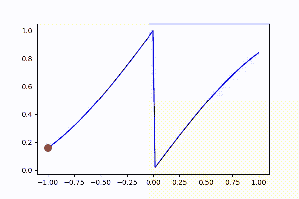
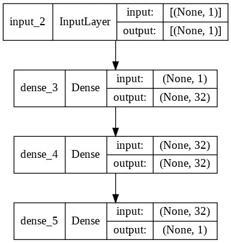
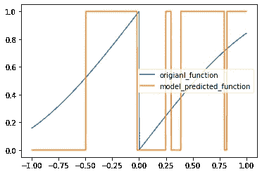
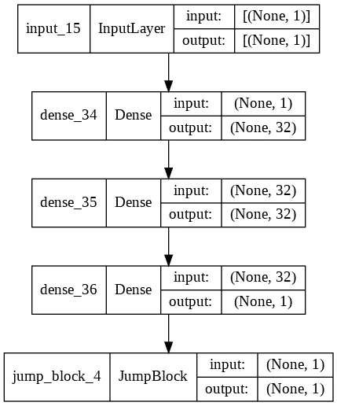
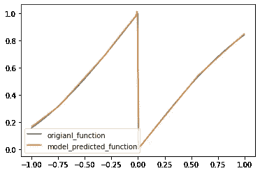
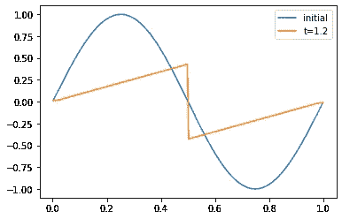

# 用深度学习跳跃

> 原文：<https://towardsdatascience.com/jump-with-deep-learning-4d2fedb4a61>

## 捕捉跳跃不连续性的深度学习模型及其在偏微分方程中的应用实例



作者图片:跳跃中断

当所有单侧极限都存在且有限，但相等或不相等时，就形成了函数中的跳跃不连续性，通常在分段函数中会遇到这种情况，因为分段函数的不同区域由不同的连续函数定义。正如万有逼近定理所说，在人工神经网络的数学理论中，一个单隐层包含有限个神经元的前馈网络，在对激活函数的温和假设下，可以逼近有限维实空间中紧致子集上的连续函数。然而，对于深度神经网络来说，学习具有跳跃不连续性的函数是困难的，因为值跳跃点周围的误差通常很大。

在本文中，我将展示如何构建一个特定的模块来捕获跳跃不连续性，并使用网络来处理偏微分方程(PDE)问题。

# 神经网络不能很好地跳跃

## 经典网络

让我们从一个只有一个跳跃不连续点的简单分段函数开始:当 x 为正时，函数等于 sin(x ),否则等于 sin(x ),如本文开头所示。

我们首先构建一个简单的经典神经网络，它包含三个密集层，这样两个隐藏层都有 32 个单元。输出层具有足够简单的线性激活函数。下图说明了该模型的架构。



作者图片:三层模型

在 20 个训练时期之后，我们观察到当函数接近跳跃不连续点时，模型学习差得多，并且所学习的函数甚至不形成跳跃。


作者图片:原始功能与习得功能

## 具有亥维赛活化的网络

结果并不令人惊讶:所有层的激活函数都是连续的，它们使原始曲线规则化。因此，一个自然的想法是将输出层的激活函数设置为 Heaviside 函数。

[亥维赛函数](https://en.wikipedia.org/wiki/Heaviside_step_function)，也称单位阶跃函数，通常用 H 或θ表示，是一个阶跃函数，其零为负变元，一为正变元。我们可以用下面的方法用 Keras 定义 Heaviside 函数。注意，由于亥维赛函数的导数是[狄拉克分布](https://en.wikipedia.org/wiki/Dirac_delta_function)，它不是在任何地方都定义的，我们简单地将梯度设为 0。

```
@tf.custom_gradientdef heaviside(x):
    ones = tf.ones(tf.shape(x), dtype=x.dtype.base_dtype)
    zeros = tf.zeros(tf.shape(x), dtype=x.dtype.base_dtype)
    def grad(dy):
        return dy*0 
    return keras.backend.switch(x > 0.5, ones, zeros), grad
```

我们现在建立一个与之前结构相同的模型，唯一的变化是输出层的激活函数被设置为我们刚刚定义的亥维赛函数。在 20 个训练时期之后，我们观察到该模型确实捕获了跳跃不连续性，但是根本没有能力预测平滑函数部分。



图片由作者提供:原始功能与具有亥维赛激活的学习功能

这种行为的原因来自于这样一个事实，即损失函数的极小值是通过计算梯度来搜索的，而 Heaviside 函数的导数是狄拉克分布，其值不能在实轴上的任何地方定义。由于基于梯度的方法未能达到期望的最小值，学习的函数停留在小平台上。

# 建立“良好的跳跃模型”

为了获得具有良好梯度的最小值并同时捕捉跳跃不连续性，我们现在试图构建一个“井跳跃模型”,该模型利用了经典方法和具有亥维赛激活的方法。其思想是建立一个输出线性函数和 Heaviside 函数的线性组合的层，如下式:output = w_s * S(input)+w_h * H(input)+b，其中 S 和 H 是线性函数，Heaviside 函数，w _ S，w _ H，b 是可训练参数。

```
import kerasclass Linear(keras.layers.Layer):
      def __init__(self, units=32, input_dim=32):
          super(Linear, self).__init__()
          self.w = self.add_weight(shape=(input_dim, units),         initializer="random_normal", trainable=True)
          self.b = self.add_weight(shape=(units,), initializer="zeros", trainable=True) def call(self, inputs):
          return tf.matmul(inputs, self.w) + self.b class JumpBlock(keras.layers.Layer):
      def __init__(self):
          super(JumpBlock, self).__init__()
          self.linear0 = Linear(1,1)
          self.linear1 = Linear(1,1)
          self.linear2 = Linear(1,1)
          self.linear2.b.trainbale=False

      def call(self,inputs):
          x=self.linear0(inputs)
          h= self.linear1(heaviside(x))
          s=self.linear2(x)
          return h+s
```

我们将跳转块作为输出层添加到网络中。下图显示了“良好跳转模型”的架构:



作者图片

我们以“井跃模型”的好结果来结束这一节，它成功地捕捉到了给定函数的平滑部分和跳跃不连续性。



作者图片:“井跃模型”的结果

关于代码的更多细节，请查看[笔记本](https://colab.research.google.com/drive/1MN3Ou6pQf9FWXXcQknHeZFkA9gQ0IHYf)。

# 双曲偏微分方程的应用

我现在想把“好的跳跃模型”应用到一个双曲型偏微分方程中。为了简化这个故事，让我们考虑一个足够简单但不是试探性的方程:具有简单形式的[无粘伯格斯方程](https://en.wikipedia.org/wiki/Burgers%27_equation):u _ t+u * u _ x = 0。我们总是对初始问题感兴趣:对于给定的函数，找到一个满足方程并且初始等于函数的解。一般来说，即使一个足够光滑的初始条件也能形成激波解，作为跳跃间断处理。

这里，让我们考虑一个时间序列作为 Burgers 方程的解，该解是通过从时间 0 到时间 1 的 [Glimm 方案](https://www.cambridge.org/core/books/abs/systems-of-conservation-laws-1/glimm-scheme/C6641E20714641A3A1FB226FFC2586E7)离散化成 500 个时间步长而获得的，并且我们想使用该时间序列来预测时间经过 1 时的解。为此，我们使用一个结合了[时间卷积网络](https://github.com/philipperemy/keras-tcn) (TCN)和我们的“良好跳跃模型”的网络。这个想法是让 TCN 捕捉解的时间演化，让“好的跳跃模型”强制冲击波的形成。

模型的输入是 20 个时间步内的解，输出是下一个时间步的解。这里的简短说明是，我们使用的损失函数是均方误差，因为 Burgers 方程通常在弱意义上满足，即不是在所有地方都满足，因此我们必须使用 L2 范数。我们对模型进行了 100 个时期的训练，并获得了 e-4 的验证损失。

```
from tcn import TCN
from tensorflow.keras.layers import Densefrom tensorflow.keras.models import Sequentialtcn_layer = TCN(input_shape=(time_step,space_size))m=Sequential()
m.add(tcn_layer)
m.add(Dense(32))
m.add(Dense(32))
m.add(Dense(space_size))
m.add(JumpBlock())
m.compile(optimizer='adam', loss='mse')x_train=x[:400]
y_train=y[:400]
x_val=x[400:]
y_val=y[400:]m.fit(x_train, y_train, epochs=100, validation_data=(x_val,y_val))
```

瞧，这就是模型在时间=1.2 时预测的伯格斯方程的解。



# 后续步骤

在本文中，我们构建了一个跳转块，它结合了线性函数和 Heaviside 函数来学习具有跳转不连续性的函数。然后，我们使用 Burgers 方程中的块来预测更长时间的解，并得到或多或少令人满意的结果。然而，对于解的预测，仅使用数据作为数值解，而忽略了方程本身的结构。一种想法是将这样的块与[物理通知神经网络](https://en.wikipedia.org/wiki/Physics-informed_neural_networks) (PINN)的逻辑相结合，这是一种深度学习方法，用于解决往往无法单独形成冲击波的 PDEs。