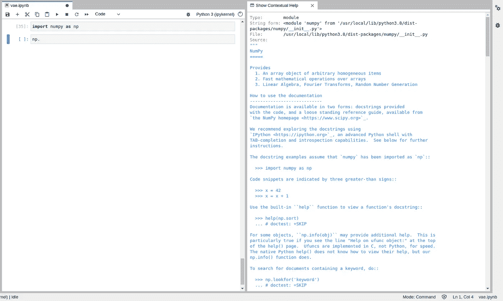

# Jupyter 现在是一个成熟的 IDE:年度回顾

> 原文：<https://towardsdatascience.com/jupyter-is-now-a-full-fledged-ide-annual-review-751675634493>

## 无所不在、让你保持在状态的工具和教育是 2022 年 Jupyter 项目的主题

一个程序员在木星上写代码——稳定扩散生成的图像

Jupyter 笔记本非常适合软件开发和文档。它们被广泛用于数据科学和机器学习(ML)领域，如果您想尝试新算法、分析和熟悉数据集，以及创建新方法的快速草图，它是一个理想的工具。

大约两年前， [JupyterLab](https://jupyter.org/) 推出了可视化调试器，杰瑞米·霍华德宣布了 [nbdev](https://nbdev.fast.ai/) ，这是一个 python 库，可以编写、测试、记录和分发软件包和技术文章，所有这些都在一个地方，你的笔记本上。Jupyter 开始转型，看起来更像一个 IDE，尽管它仍然保持自己的方式，它仍然不像任何其他传统的 IDE。

</jupyter-is-now-a-full-fledged-ide-c99218d33095>  

去年对于 Jupyter 项目来说也是很棒的一年。一个新的主要版本(JupyterLab 3.0)，[扩展](https://medium.com/p/b36f1d1ca8f8)允许你将代码单元转换成 ML 管道，一个新的小部件引擎，以及可视化调试器的集成，这些都是铺平道路的公告。此外，nbdev 继续向前发展，现在受到网飞和 Lyft 等大公司的信任。

</jupyter-is-now-a-full-fledged-ide-in-hindsight-3f0c5f35aa8d>  

今年，这一迹象又是积极的，进展也同样显著。该团队专注于将 JupyterLab 带到任何地方，创建工具让您在编码时保持在该区域，而该项目的一个最被低估的用途是教育。让我们看看今年在朱庇特计划的魔法世界里发生了什么！

> [Learning Rate](https://www.dimpo.me/newsletter?utm_source=medium&utm_medium=article&utm_campaign=jupyter-review) 是为那些对 AI 和 MLOps 的世界感到好奇的人准备的时事通讯。你会在每个月的第一个星期六收到我关于最新人工智能新闻和文章的更新和想法。订阅[这里](https://www.dimpo.me/newsletter?utm_source=medium&utm_medium=article&utm_campaign=jupyter-review)！

# 朱庇特:朱庇特现在无处不在

似乎现在每个人都试图在云虚拟机上运行你最喜欢的 IDE。如果您正在使用 Visual Studio 代码，您可能听说过 GitHub codespaces。然后，Coder 开发了`[code-server](https://github.com/coder/code-server)`，允许您构建自己的 VSCode 服务器，并在任何地方托管它。AWS 还收购了 [Cloud9](https://aws.amazon.com/cloud9/) ，这是一个用于编写、运行和调试代码的云 IDE。

</how-to-create-your-own-vs-code-server-fa7812d308b0>  

朱庇特采取了激进的方法； [**JupyterLite**](https://blog.jupyter.org/jupyterlite-jupyter-%EF%B8%8F-webassembly-%EF%B8%8F-python-f6e2e41ab3fa) **是一个 JupyterLab 发行版，完全在 web 浏览器中运行，由浏览器内语言支持。**这意味着它更便宜、更易于部署、高度可定制，并且可以嵌入到您的网站中。事实上， [NumPy](https://numpy.org/) 已经这样做了。

你可以在这里使用 JupyterLite [的一个公共实例。有一些限制，你可能会发现你最喜欢的扩展没有像预期的那样工作，但我已经迫不及待地想看到它将走向的方向。](https://jupyterlite.github.io/demo/lab/index.html)

# JupyterLab 督察

JupyterLab 有很棒的代码完成工具，它提供了代码高亮、代码完成、具有丰富变量呈现的调试器等等。

**JupyterLab inspector 是另一个旨在让你保持在最佳状态的工具。它提供了一个 UI 面板，可以在您键入时提供上下文帮助。**在 Windows 上按 **Ctrl + I** 可以调出，在Mac 上按 **⌘ + I** 可以调出。

笔记本检查器—按作者分类的图像

使用这个工具，你可以做的一件很酷的事情是，你可以使用 [Sphinx](https://www.sphinx-doc.org/) 将 docstring 呈现为 HTML，并创建一种感觉，就像你总是在床头柜上放一本手册一样。

# 教育

使用 Jupyter 笔记本记录您的工作是向公众传达您想要实现的目标的一种很好的方式。Jupyter 提供的这种文本+现成代码特性也使它成为一个很好的教育工具。

杰瑞米·霍华德是这一领域的先驱。他和他的同事只用笔记本就创造了最受欢迎的 ML [课程之一](https://course.fast.ai/)。他和 [Sylvain Gugger](https://sgugger.github.io/pages/about-me.html) 用笔记本写了课程附带的[书](https://github.com/fastai/fastbook)，甚至 nbdev 的整个[文档](https://nbdev.fast.ai/getting_started.html)都是用笔记本写的。这意味着您可以从 JupyterLab 的文档中打开一页，并使用这些示例。

另一个很好的资源是由[全栈深度学习](https://fullstackdeeplearning.com/course/2022/)团队开发的[实验室](https://github.com/full-stack-deep-learning/fsdl-text-recognizer-2022-labs)。FSDL 团队提供了各种概念的深刻解释、工具的嵌入式视图，如[权重&偏差](https://wandb.ai/site)、[张量板](https://www.tensorflow.org/tensorboard)和[梯度](https://gradio.app/)，甚至是笔记本末尾的练习，为那些想使用工具帮助将模型投入生产的人提供了一个惊人的资源。

自从我们讨论了笔记本上的练习后，几周前,发布了一个新版本。Nbgrader 是一个工具，它允许教育者在 Jupyter 笔记本上创建并自动评分作业。如果你是一名教育工作者，还没有看到这个，看看下面的视频。

最后但同样重要的是，一个名为 [Blockly](https://developers.google.com/blockly) 的令人敬畏的扩展旨在通过基于块的可视化编程接口，让孩子们更容易、更容易地编写代码。Blockly 是 Google 设计的一个开源库，它使用互锁的图形块，很像乐高积木，来表示 if 语句、循环或函数等编码概念。

# 结论

Jupyter 笔记本非常适合软件开发和文档。大约两年前，JupyterLab 开始转型，看起来更像一个 IDE，尽管它仍然保持自己的方式。

今年，该项目继续向前推进。该团队专注于将 JupyterLab 带到任何地方，创建工具让您在编码时保持在该区域，而该项目的一个最被低估的用途是教育。

JupyterLab 和 VSCode 是我的 ML 首选工具。我迫不及待地想看看 2023 年会发生什么。

# 关于作者

我叫[迪米特里斯·波罗普洛斯](https://www.dimpo.me/?utm_source=medium&utm_medium=article&utm_campaign=jupyter-review)，我是一名为[阿里克托](https://www.arrikto.com/)工作的机器学习工程师。我曾为欧洲委员会、欧盟统计局、国际货币基金组织、欧洲央行、经合组织和宜家等主要客户设计和实施过人工智能和软件解决方案。

如果你有兴趣阅读更多关于机器学习、深度学习、数据科学和数据运算的帖子，请关注我的 [Medium](https://towardsdatascience.com/medium.com/@dpoulopoulos/follow) 、 [LinkedIn](https://www.linkedin.com/in/dpoulopoulos/) 或 Twitter 上的 [@james2pl](https://twitter.com/james2pl) 。

所表达的观点仅代表我个人，并不代表我的雇主的观点或意见。