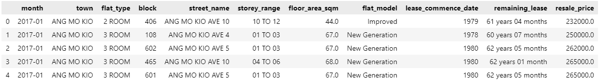
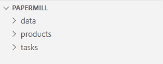
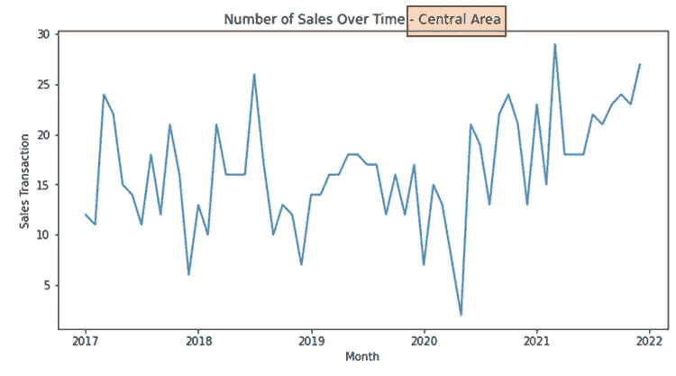
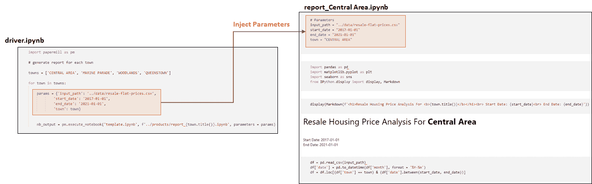
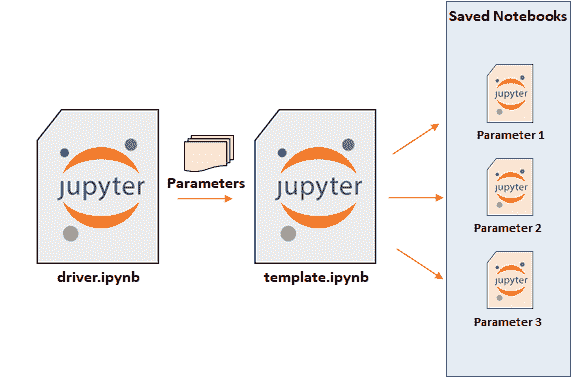
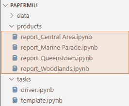

# Jupyter 笔记本的功能:使用 Papermill 创建可重复使用的笔记本

> 原文：<https://towardsdatascience.com/jupyter-notebook-as-a-function-create-reusable-notebooks-with-papermill-8f9bea5b9727>

## *如何使用 Papermill 创建参数化 Jupyter 笔记本*


由 [Christa Dodoo](https://unsplash.com/@krystagrusseck?utm_source=medium&utm_medium=referral) 在 [Unsplash](https://unsplash.com?utm_source=medium&utm_medium=referral) 上拍摄的照片

# 介绍

在编程中，函数是将代码模块化为独立的、有组织的、可重用的块的方法，用于执行特定的任务。函数通常接受输入数据，处理数据，并输出结果。将代码编写为函数的一些优点是:

*   提高代码可重用性
*   把问题分解成更小的可解决的部分
*   保持更清晰的变量名称空间
*   能够孤立地测试代码的一小部分

在本文中，我们将研究如何参数化我们的 Jupyter 笔记本，使它像一个函数一样工作。

等等，但是为什么？

# 动机

假设我们从事房地产业务，用户在过去几年中有一些与房地产销售相关的问题。我们将使用新加坡住房转售价格数据集[1]，该数据集包含 HDB 住房发展局的转售房屋交易记录。这是数据集的一个样本。



作者图片

商业用户有兴趣回答 2017 年 1 月`month`至 2021 年 12 月`town`中心区的以下问题:

1.  `month`全国销售数量
2.  `resale_price`横跨`month`
3.  不同`flat_type`的`resale_price`分布

我们导入必要的包，读取数据，并将数据过滤到由`town`和`date`指定的正确子集。有了正确的数据子集，我们现在可以绘制相关的图表来回答这些问题。

作者笔记本

全部完成！业务用户要求的`town`“中心区”报告准备就绪。

*如果业务用户为不同的* `*town*` *请求相同的信息怎么办？*

很简单，让我们找到并替换它！我们只需找到`town`的所有旧值并用新值替换它们，运行笔记本，并保存笔记本的副本。

*如果业务用户对每个可用的* `*town*` *请求相同的信息，该怎么办？*

共有 29 个镇；用 29 次手动“查找和替换”的方法可能不是个好主意！这就是造纸厂派上用场的地方。

# 造纸厂

> *Papermill 是一个开源的 python 包，参数化并执行 Jupyter 笔记本。*

参数化是通过从代码中获取值并将其作为该函数的参数来概括代码块以使其可重用的过程。我们将参数化整个 Jupyter 笔记本，而不是参数化一小块代码。这使得我们可以使用不同的参数轻松运行同一台笔记本电脑。让我们来看一个例子。

## 1.设置环境

```
pip install papermill
```

这是项目文件结构:



作者图片

*   `data`:包含输入数据
*   `product`:存储已执行的 Jupyter 笔记本的副本
*   `tasks`:包含 Jupyter 笔记本`template.ipynb`和`driver.ipynb`
*   `template.ipynb`:这是数据处理和可视化代码的位置。它类似于我们之前看到的代码
*   `driver.ipynb`:这是包含实际参数集的笔记本，Papermill 将从该笔记本中将参数单元注入`template.ipynb`，运行并保存一份副本。

## 2.将笔记本参数化

让我们检查一下代码中哪些值可以参数化。我们将参数化笔记本命名为`template.ipynb`。一般来说，如果我们预计到未来的变化，我们可以参数化任何值。一种简单的开始方式是检查哪些列是被过滤的数据帧，哪些值是硬编码的。

```
df = pd.read_csv(**'data/resale-flat-prices.csv'**)
df['date'] = pd.to_datetime(df['month'], format = '%Y-%m')
df = df.loc[(**df['town'] == 'CENTRAL AREA'**) & (**df['date'].between('2017-01-01', '2021-12-01')**)]
```

数据帧正被`town`和`date`过滤，因此我们可以用变量代替`town`和`date`值，而不是硬编码。如果我们预计数据的文件路径会发生变化，我们也可以选择将其参数化。

这是另一部分可以参数化的代码。我们已经将`town`值硬编码到图表的标题中，我们可以用一个变量来替换它。

```
sales_over_time = df.groupby('date', as_index = False).agg({'resale_price':'count'}).rename(columns = {'resale_price':'resale_count'})fig, ax = plt.subplots(figsize = (10, 5)) ax = sns.lineplot(data = sales_over_time, x = 'date', y = 'resale_count') ax.set_xlabel('Month')
ax.set_ylabel('Sales Transaction')
ax.set_title('Number of Sales Over Time - **Central Area**')
plt.show()
```



作者图片

这是参数化前后代码的样子。用变量替换`town`和`date`的硬编码值。

```
**# before**
df = pd.read_csv('**data/resale-flat-prices.csv**')
df['date'] = pd.to_datetime(df['month'], format = '%Y-%m')
df = df.loc[(df['town'] == '**CENTRAL AREA**') & (df['date'].between('**2017-01-01**', '**2021-12-01**'))]**# after**
df = pd.read_csv(**input_path**)
df['date'] = pd.to_datetime(df['month'], format = '%Y-%m')
df = df.loc[(df['town'] == **town**) & (df['date'].between(**start_date**, **end_date**))]
```

图标题也使用 f 字符串参数化。

```
**# before**
..
ax.set_title('Number of Sales Over Time - **Central Area**')**# after**
..
ax.set_title(f'Number of Sales Over Time - {**town.title()**}')
```

为笔记本创建了以下参数:`input_path`、`town`、`start_date`、`end_date`，这就是现在`template.ipynb`的样子。

作者代码

没有给任何变量`input_path`、`town`、`start_date`、`end_date`赋值。如果此笔记本电脑是一次性或一次性使用，则应包括以下单元格。

```
# notebook cell
# Parameters
input_path = "../data/resale-flat-prices.csv"
start_date = "2017-01-01"
end_date = "2021-01-01"
town = "CENTRAL AREA"
```

在每次运行之前，我们会手动更改参数值，以适应业务用户的请求。

然而，这种方法不适用于具有大量参数集的情况。在我们的例子中，有 29 个城镇，手动改变`town`值 29 次是不可行的。我们需要一种方法来以自动化的方式将不同的参数集传递给`template.ipynb`，这由`driver.ipynb`负责。

## 3.创建`driver.ipynb`

这就是奇迹发生的地方。为了便于说明，我们只为 4 个不同的城镇生成报告，为每个城镇创建一个参数字典，并将其传递给 Papermill 的`.execute_notebook()`方法。

```
# driver.ipynb
import papermill as pm# generate report for each towntowns = ['CENTRAL AREA', 'MARINE PARADE', 'WOODLANDS', 'QUEENSTOWN']for town in towns: params = {'input_path': '../data/resale-flat-prices.csv',
            'start_date': '2017-01-01',
            'end_date': '2021-01-01',
            'town': town} nb_output = pm.execute_notebook('template.ipynb', f'../products/report_{town.title()}.ipynb', parameters = params)
```

`.execute_notebook()`的参数为:

*   `input_path`:(字符串或路径)我们打算执行的输入 Jupyter 记事本的路径，在我们的例子中是`template.ipynb`。
*   `output_path` : (str 或 path)保存已执行 Jupyter 笔记本的路径。我们保存已执行的笔记本，并连接城镇名称。
*   `parameters`:`input_path`中传递给 Jupyter 笔记本的(dict)参数

`.execute_notebook()`执行以下操作:

1.  查找输入笔记本，即`template.ipynb`

2.在运行时将参数注入`template.ipynb`



作者图片

3.使用注入的参数运行`template.ipynb`

4.在`output_path`中保存已执行笔记本的副本以及单元输出

## 4.运行`driver.ipynb`

执行时，`driver.ipynb`笔记本将不同组的参数传递给`template.ipynb`，执行`template.ipynb`，并在`.execute_notebook()`中定义的`output_path`保存不同组参数的已执行笔记本的副本。



作者图片

下图显示了保存的输出笔记本。



作者图片

让我们来看看其中一个保存的笔记本。在`report_Central Area.ipynb`中，我们看到 Papermill 向第一个单元格注入了一组参数。

作者笔记本

# 结论

在本文中，我们给出了参数化 Jupyter 笔记本的动机，并展示了如何通过 Python API 执行 Papermill 的数据分析用例。Papermill 的使用案例不限于报告生成。其他开源包如 [Ploomber](https://medium.com/@edwin.tan/machine-learning-pipeline-with-ploomber-pycaret-and-mlflow-db6e76ee8a10) 使用 Papermill 将参数注入到单元格中，以创建可重用的机器学习管道。Papermill 还提供通过命令行界面执行，并允许使用`.yaml`文件存储参数。查看 [Papermill github](https://github.com/nteract/papermill) 了解更多信息。

*   [加入 Medium](https://medium.com/@edwin.tan/membership) 阅读更多这样的故事
*   [关注我](https://medium.com/@edwin.tan)获取更多类似的帖子

# 参考

[1] *包含 2022 年 3 月 17 日从*[【https://data.gov.sg/dataset/resale-flat-prices](https://data.gov.sg/dataset/resale-flat-prices)*获得的转售单位价格信息，该信息根据新加坡开放数据许可证版本 1.0*【https://data.gov.sg/open-data-licence】T21*的条款提供。*允许公共使用(商业&非商业)。

[2] [造纸厂](https://papermill.readthedocs.io/en/latest/)